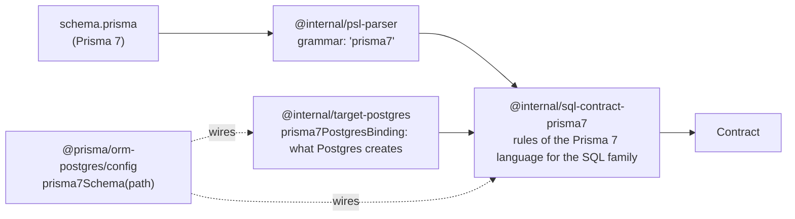

# ADR 252 — An earlier Prisma version's schema is a contract source

Status: **Accepted**

## Decision

Prisma 8 reads the schema file of an earlier Prisma version directly as a contract source. A project that still runs Prisma 7 points Prisma 8 at the `schema.prisma` it already has, and `prisma contract emit` produces the contract from it. The file is not converted, and nothing is inferred from the database.

Prisma 8 describes a database with a contract, and every command reads that contract. Prisma 7 describes a database with `schema.prisma`, and its migrations keep that file current. A project moving from Prisma 7 to Prisma 8 runs both for a while: Prisma 7 still owns the database and its migrations, and Prisma 8 adopts the database as it is. During that time the Prisma 7 schema is the only description of the database that stays correct, so it is the one Prisma 8 reads.

## The decision in a config file

```ts
// prisma.config.ts
import { definePrismaConfig } from 'prisma/config';
import { defineConfig as ormConfig, prisma7Schema } from '@prisma/orm-postgres/config';

export default definePrismaConfig({
  orm: ormConfig({
    contract: prisma7Schema('prisma/schema.prisma'),
    db: { connection: process.env['DATABASE_URL']! },
  }),
});
```

With that file in place the ordinary commands work unchanged:

```bash
prisma contract emit   # reads schema.prisma, writes contract.json and contract.d.ts
prisma db sign         # verifies against the database Prisma 7 built: zero findings
```

After each Prisma 7 migration the project runs `contract emit` and `db sign` again. There is no second schema file and nothing is edited by hand.

A schema Prisma 8 cannot describe is refused with the file, the line, and the edit to make:

```prisma
model User {
  id Int @id
}

view ActiveUsers {
  id Int
}
```

```text
[PSL.PRISMA7_VIEW_UNSUPPORTED] ./schema.prisma:5:1 View "ActiveUsers" is not supported; Prisma 8 has no views. Remove the view or replace it with a model over the underlying table.
```

## Why read the schema directly

The Prisma 7 schema is the one description of the database that Prisma 7's own migrations keep current. Reading it on every `contract emit` gives the project a single source of truth for as long as it keeps Prisma 7, and the Prisma 8 contract can never be out of date. Any other route creates a second artifact that has to be kept in step by hand (see Alternatives considered).

## Every construct is described exactly, or it is an error

There is no third outcome. Each construct in the schema is either lowered to a contract that describes the database exactly, or refused with a diagnostic that names the construct, gives its position, and states an edit that is valid in Prisma 7. The reader never guesses, never approximates, and never drops anything silently. A contract that quietly describes something other than the live database is worse than a refusal: it passes `db sign` and fails later, in production.

Two rules follow, and they are what separate this reader from a compatibility layer:

- **Prisma 8's own checks are not loosened to admit a construct.** Where Prisma 8's schema language cannot express a shape, for example a generated value on an optional field, the reader reports an error rather than relaxing the parser or interpreter that refuses it.
- **A construct Prisma 8 cannot express is a reason to build the feature.** Each refusal records a gap in Prisma 8's own authoring surface, to be designed on its own terms. It is not a defect of the reader.

The set of refusals is therefore a standing list of Prisma 8 features to build, each with a real user behind it.

## "Exactly" means what `db verify` compares

Fidelity is defined by the comparison `db verify` makes against the database the earlier version built, not by how closely the contract resembles the schema text.

| `db verify` compares | `db verify` ignores |
|---|---|
| column native type and nullability | primary key name |
| column default, structurally | foreign key name |
| primary key columns | unique constraint name |
| foreign key referential actions | |
| unique constraints, by columns | |
| indexes, by name, uniqueness, type, and columns | |
| check constraints, by name | |
| native enums, by type name and ordered member list | |

That table decides several lowering rules on its own. Index names are reproduced exactly, because they are compared. Primary key and foreign key names are left to Prisma 8, because they are not. Referential actions are always written out, and enum member order is preserved. The measure of the reader is a real database, built by the earlier version's own migrations, that verifies with zero findings.

Every lowering rule is checked against SQL that the earlier version's own toolchain generated, not against its documentation. The proof schemas in the repository carry that SQL beside them.

## How the pieces fit



**The parser is shared, and the earlier grammar is opt-in.** `@internal/psl-parser` reads both languages. The two additions the earlier language needs, attributes on enum members and field lines inside a `view` block, are read only under the `grammar: 'prisma7'` parse option. The default grammar is unchanged, so a Prisma 8 schema keeps rejecting exactly what it rejected before, and nothing here reaches a user who never adopts the reader.

**Rules of the language live in the family authoring package.** `@internal/sql-contract-prisma7` holds everything that is true of the Prisma 7 language for the SQL family: blocks and attributes, relation pairing, junction tables, defaults, and the diagnostics. It knows nothing about a particular database and depends on no Prisma 7 package.

**Facts about the database come from the target through one binding.** `Prisma7TargetBinding` is the complete list of what a target must answer: the target pack and namespace factory, the datasource providers it accepts, the type map of what the earlier version creates for each scalar and native-type attribute, the native enum entity kind, the index types, the identifier byte limit, the junction relation field names, the "now" generator for each column codec, and how a literal default is read for a column whose codec does not take the written value. The Postgres target exports one instance.

**The facade publishes one function** that wires the two together:

```ts
export function prisma7Schema(schemaPath: string): ContractConfig {
  return prisma7Contract(schemaPath, { binding: prisma7PostgresBinding });
}
```

A second family or target adds a package and a binding. Neither adds a branch to the CLI, the control plane, or the framework. The mechanism that lets the CLI ignore where a contract comes from is [ADR 163](<./ADR 163 - Provider-invoked source interpretation packages.md>): a contract source is an authoring package whose `load` returns a contract or diagnostics.

## Names

Each facade publishes one function, named after the Prisma version whose schema it reads, and no aliases:

- `prisma7Schema(path)` on `@prisma/orm-postgres/config` reads a Prisma 7 PostgreSQL schema.
- A MongoDB reader will be `prisma6Schema(path)` on `@prisma/orm-mongo/config`, because Prisma 6 is the last version with a MongoDB connector.
- `prisma7Contract(path, { binding })` is the family-level factory the facades wrap. The facade name says `Schema` because the user points it at a schema file; the family name says `Contract` because it returns a `ContractConfig`.

The version in the name tells the user which schema language is accepted, which differs by family. A second name for the same function would put two spellings into guides and examples for one thing.

## Diagnostic codes

The reader's codes are `PSL.PRISMA7_*`, in the `PSL` namespace of [ADR 239](<./ADR 239 - Errors are structural envelopes with dotted namespace codes.md>), declared as a typed union by the package that raises them. `PSL` has three owning modules, the parser, the Prisma 8 schema interpreter, and this reader, each with its own local union; ADR 239's namespace table lists all three. A source diagnostic whose code carries a namespace is reported under that code. A source diagnostic whose code carries none is reported under `CONTRACT.SOURCE_DIAGNOSTIC` with the original code in `meta.code`; [ADR 245](<./ADR 245 - Errors are structured at origin; results carry one ok discriminator.md>) governs the codes themselves.

## How long the reader lives

For as long as the Prisma version it reads is supported. The repository's [README](../../../README.md) states that period: Prisma 7 receives bug fixes and security updates for eighteen months after `8.0.0` final. The reader is for a project in transition, not a permanent second authoring language: a project is expected to convert its schema to Prisma 8's language when it stops running Prisma 7, and drop the reader. Retiring a reader is a separate decision, taken when that version's support ends.

## Consequences

- A project in transition keeps one schema file. After each migration by the earlier version, `contract emit` and `db sign` bring Prisma 8 back in step.
- Prisma 8 ships no dependency on any earlier Prisma package. The reader is built on the shared parser.
- The refusals are a list of Prisma 8 features to build, recorded with the project that owns them.
- A new family or target needs a new binding and a new family package, and nothing else.

## Alternatives considered

**Convert the schema once, then author in Prisma 8's language.** This is the right step when a project stops running Prisma 7. As the way to run both versions it fails: the converted file drifts the next time Prisma 7 migrates, and every shape Prisma 8 cannot express becomes a lossy conversion rule instead of a visible refusal.

**Infer the contract from the database, then edit by hand.** `contract infer` cannot recover relation field names, ORM-side defaults, or `@updatedAt`, because they exist only in the schema. The edits must be repeated after every migration.

**Read the schema through Prisma 7's own parser.** Prisma 7's WebAssembly parser drops `@ignore` fields and `@@ignore` models, presents views as ordinary models, and can omit implicit referential actions, which are exactly the details fidelity depends on. It is also a multi-megabyte synchronous load on the emit path and a dependency on an earlier Prisma package.

**Relax the Prisma 8 checks that refuse the shapes Prisma 8 cannot express.** This would make the reader the reason Prisma 8's own language accepts something it was designed to refuse, and would hide the missing feature instead of recording it.

**Build the missing Prisma 8 features as part of the reader.** Views, opaque column types, and generated values on optional fields are each their own piece of work with their own design. Bundling them into the reader would tie a transition tool to features it does not need.
