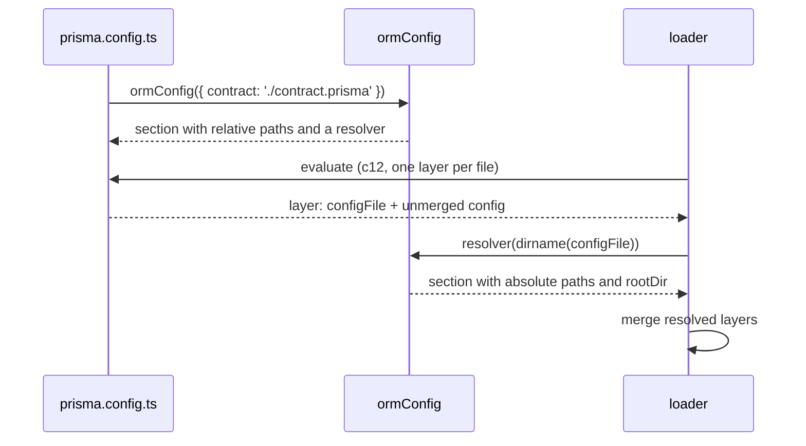

# ADR 253 — Config paths resolve against the file that wrote them

## Decision

A relative path written in a `prisma.config.ts` is relative to that file. The loader resolves it against the file's directory as part of loading, one file at a time, before any files are merged and before any command sees the config. Nothing changes in how a config is written:

```ts
// /home/me/app/prisma.config.ts
import { definePrismaConfig } from '@prisma/cli-engine';
import { defineConfig as ormConfig } from '@prisma/orm-postgres/config';

export default definePrismaConfig({
  orm: ormConfig({
    contract: './contract.prisma',
    migrations: { dir: './migrations' },
  }),
});
```

Loading this file yields the same object from any working directory. Every path is absolute, and the section records the directory it was resolved against as `rootDir`, for anything that needs the project's location rather than one of its files:

```ts
{
  orm: {
    rootDir: '/home/me/app',
    contract: { /* source read from /home/me/app/contract.prisma */ output: '/home/me/app/contract.json' },
    migrations: { dir: '/home/me/app/migrations' },
  },
  $prismaConfig: 1,
}
```

## Why the file is the anchor

Consider a config that does not sit in the directory a command runs from:

```
exp/
  sub/
    prisma.config.ts   # contract: './contract.prisma'
    contract.prisma
```

`prisma contract emit --config ./sub/prisma.config.ts`, run from `exp`, must read `exp/sub/contract.prisma`. The author wrote `./contract.prisma` next to the file, and that is the only reading of it that does not change with the caller's shell. Every documented rule agrees: the ORM's `migrations.dir` is documented as relative to the config file, and Prisma Composer and `prisma dev` read paths the same way.

## Why resolution happens per file, before merging

Configs can be layered: a file in a child directory extends a file in a parent, and the loader merges the two. A merged section holds paths written in different files. In the example below the merged `orm` section has `contract` from the child and `migrations.dir` from the parent, both still relative, with no record of which file wrote which:

```
repo/
  prisma.config.ts          # orm: { migrations: { dir: './migrations' } }
  apps/shop/
    prisma.config.ts        # extends: '../../prisma.config.ts'
                            # orm: { contract: './contract.prisma' }
```

Once merged, no single directory can anchor that section: `./migrations` belongs to `repo/` and `./contract.prisma` to `repo/apps/shop/`. The anchor belongs to each path, and it is lost the moment the sections are merged. So resolution must happen while the loader still holds each file separately, and merging must operate on absolute paths only.

The loader has what it needs for this. Both loaders that read `prisma.config.ts`, the CLI engine's and the ORM's, evaluate the file through c12, and c12 reports one layer per file: the file's own path and that file's unmerged config. Each layer is resolved against its own file, then the layers are merged.

## How the loader resolves a section

The loader does not know which fields of a section are paths. Only the family that defines the section knows that, so resolution is a small protocol between the family's config helper and the loader.



- A family's config helper returns its section with relative paths untouched and a resolver function stored under the key `Symbol.for('prisma.config.resolve')`. The resolver takes a directory and returns the section with absolute paths and `rootDir` set.
- After c12 evaluates the file, the loader resolves each layer against `dirname(configFile)` and then merges the resolved layers. The engine's loader, which does not know what any section contains, does this through `resolveConfigSections`, a function it exports that calls the resolver on every section that has one, removes the key, and leaves other sections untouched. A loader that belongs to the family, such as the ORM's own, resolves its section directly with the same function the resolver wraps.
- The key is created with `Symbol.for` rather than exported from the engine, so it is the same symbol across two engine copies in one dependency tree, and a family declares it without importing the engine. Symbol-keyed properties survive c12's evaluation and appear on each layer's config.
- `definePrismaConfig` is unchanged: it stamps the `$prismaConfig` marker and nothing else.

## An unresolved section is refused

A section that still carries the resolver key has not been resolved. The family's validator refuses it and names what is missing. This is what makes the design safe: a program that evaluates a config without running the resolution step, whether an older engine, a test that imports the file directly, or a new loading route, gets a loud failure, never a path silently resolved against the working directory.

## Responsibilities

**The engine** owns `resolveConfigSections`: finding resolvers on a config object, calling them with a directory, and removing the key. It never knows which fields are paths. The key itself is created with `Symbol.for`, so it belongs to no package.

**A family** owns its config helper, its resolver, and its validator's refusal of an unresolved section: which fields are paths, how each resolves, and `rootDir`. The ORM's resolver covers the contract source, `contract.output`, and `migrations.dir`.

**Loaders** evaluate the file through c12, resolve each layer against its own file, and merge. Whichever loader runs, the sections it hands over are resolved.

**Commands** read absolute paths and `rootDir` from the config. A command that needs the project's location, for instance to find the project's `package.json`, starts from `rootDir`. No command reconstructs the config file's path, and no command resolves a config value against the working directory. The one kind of path that is relative to the working directory is a path typed on the command line, such as `--output-path` on `contract emit`, because the shell is where the user wrote it.

## Layered configs

Whatever mechanism layering uses to find the files, the loader ends up with one config per file and each file's path. It resolves each against its own file and then merges. `rootDir` follows the family's merge rule for its section; by default the nearest file wins.

## Mismatched versions

A dependency tree can pair an engine and a family from different releases. An engine whose loader does not run `resolveConfigSections` hands the family a section with the resolver key still on it; the family's validator refuses it and names the engine version it needs. A family whose helper attaches no resolver hands the loader a section with nothing to resolve, which passes through unchanged. Neither pairing resolves a path against the wrong directory.

## Consequences

- Config files are written as before. No argument is added and no path is written differently.
- A config object holds absolute paths and a `rootDir` per section that has paths. Nothing resolves a config path after loading.
- Family config helpers attach a resolver rather than being identity functions over an object literal. The resolver is the one place a family's path fields are enumerated.
- Loading a config means loading it through a loader. Importing the file directly yields unresolved sections, which the family's validator refuses; a test that wants a resolved config resolves what it imported against the directory it stands for.
- The ORM's resolved section carries `rootDir`; the migrations directory defaults to `migrations` under it, supplied after merging so a layer's default never shadows a directory another layer authored.
- `resolveConfigSections` and the loader's per-layer resolution are engine changes, so the engine's version moves and every family's exact engine peer moves with it.

## Alternatives considered

**Resolve against the working directory and document it.** Only the unified CLI would follow that rule; every other reader of the file anchors on the file. Authors who run commands from a monorepo root would write `import.meta.dirname` into every path by hand.

**The engine tells each command which file it loaded.** Correct for a single file: the command resolves against that file's directory. It needs a field on the command context and post-load resolution code in every family, and it fails under layering, where a merged section holds paths from several files and one path cannot anchor them.

**The engine resolves paths itself.** The engine hands sections over opaquely and cannot know which fields are paths. That knowledge belongs to each family.

**Resolve inside the file: `definePrismaConfig(import.meta, {...})`.** The file resolves its own sections before any loader sees them, which is fully independent of how the file is loaded. It costs every config file an argument that the loader already knows the value of, since c12 reports the file it evaluated. The loader-side design keeps the same resolver protocol and the same per-file guarantee without the argument.

**The family helper takes the location: `ormConfig(import.meta, {...})`.** The same as the previous option with the argument repeated on every helper in every file.

**Hand each family its per-file sections and let the family merge.** Correct under layering, but it moves merging into every family and turns the loader's output into a list. Resolving per layer inside the loader and merging there needs none of it.

**The engine sets a global before evaluating each file, so a helper can read the current file.** No visible surface, but hidden state that breaks whenever a config is imported outside the engine's loader. The loader-side design has the same independence from the file's contents without the global.
