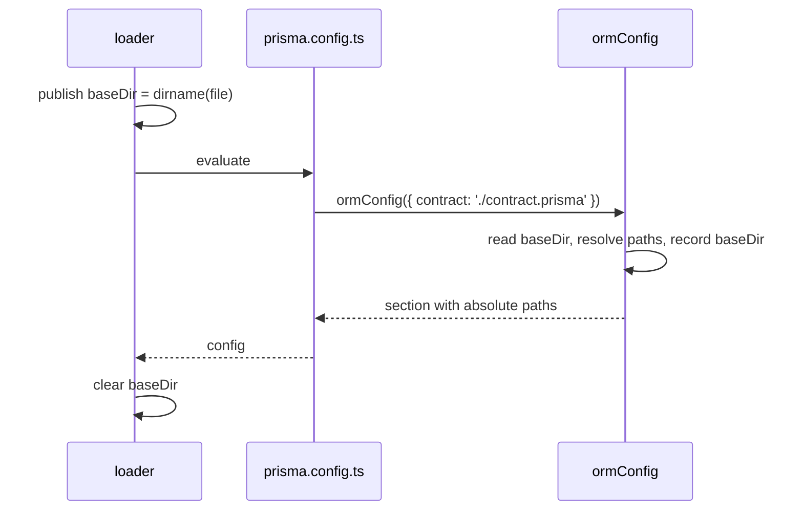

# ADR 253 — Config paths resolve against the file that wrote them

## Decision

A relative path written in a `prisma.config.ts` is relative to that file. The file resolves the path itself while it is being evaluated: the loader tells the file where it is, and the config helper the file calls resolves its paths on the spot. Nothing changes in how a config is written:

```ts
// /home/me/app/prisma.config.ts
import { definePrismaConfig } from '@prisma/cli-engine';
import { defineConfig as ormConfig } from '@prisma/orm-postgres/config';

export default definePrismaConfig({
  orm: ormConfig({
    contract: './contract.prisma',
    migrations: { dir: './migrations' },
  }),
});
```

Loading this file yields the same object from any working directory. Every path is absolute, and the section records the directory it was resolved against as `baseDir`, for anything that needs the project's location rather than one of its files:

```ts
{
  orm: {
    baseDir: '/home/me/app',
    contract: { /* source read from /home/me/app/contract.prisma */ output: '/home/me/app/contract.json' },
    migrations: { dir: '/home/me/app/migrations' },
  },
  $prismaConfig: 1,
}
```

## Why the file is the anchor

Consider a config that does not sit in the directory a command runs from:

```
exp/
  sub/
    prisma.config.ts   # contract: './contract.prisma'
    contract.prisma
```

`prisma contract emit --config ./sub/prisma.config.ts`, run from `exp`, must read `exp/sub/contract.prisma`. The author wrote `./contract.prisma` next to the file, and that is the only reading of it that does not change with the caller's shell. Every documented rule agrees: the ORM's `migrations.dir` is documented as relative to the config file, and Prisma Composer and `prisma dev` read paths the same way.

## How the file learns where it is

The loader is the one party that knows which file it is evaluating. Before it evaluates the file it publishes that file's directory in a slot on `globalThis` under `Symbol.for('prisma.config.baseDir')`, and clears it after. While the file runs, `ormConfig` reads the slot and resolves every path in its section against it, recording it as `baseDir`.



Three properties follow.

- **No party needs to know more than it does.** The loader never learns which fields are paths; the helper never learns which file it is in beyond the one value it needs. There is no protocol between them, only the slot.
- **The user writes nothing.** The file already runs inside a loader; the loader already knows the file. Asking the config author to pass `import.meta` would ask them for a value the system already has.
- **Merging sees absolute paths.** Each file resolves its own paths while it runs, so whatever merges files later never sees a relative path and never needs to know which file wrote which value.

The slot is `Symbol.for`, so every loader and every helper in a dependency tree shares it, and a family package declares it without importing the engine.

## A section without a base directory is refused

A file evaluated outside a loader, for instance a test that imports it directly, finds the slot empty. `ormConfig` then leaves the paths as written and records no `baseDir`. The ORM's section validator refuses any section without `baseDir`, naming the two ways that happens: the section was written as a plain object rather than with `defineConfig`, or the loader that evaluated the file predates the base directory. There is no fallback to the working directory: a path silently resolved against the wrong directory is exactly the failure this decision removes, so the only acceptable failure is a loud one.

## Responsibilities

**Loaders** publish the base directory around each file they evaluate and clear it after. The CLI engine's loader does this through `withBaseDir`, which it exports for any other loader; the ORM's loader does the same around its own evaluation.

**A family's config helper** reads the base directory and resolves its own path fields, recording `baseDir`. The ORM's `defineConfig` covers the contract source, `contract.output`, and `migrations.dir`. Defaults that are themselves paths, such as the migrations directory, are supplied by the reader from `baseDir` rather than written into the section, so a layer that omits a value never shadows a layer that authored one.

**Commands** read absolute paths and `baseDir` from the config. A command that needs the project's location, for instance to find the project's `package.json`, starts from `baseDir`. No command reconstructs the config file's path, and no command resolves a config value against the working directory. The one kind of path that is relative to the working directory is a path typed on the command line, such as `--output-path` on `contract emit`, because the shell is where the user wrote it.

**The validator** refuses a section without `baseDir`.

## Layered configs

Layering holds as long as the loader publishes each file's own directory while that file runs. A loader that evaluates the files itself, one at a time, gets this for free. A loader that delegates the whole chain to c12's `extends` does not: c12 evaluates a base file inside the same call as the file that extends it, so the slot still names the extending file. Whichever mechanism layering adopts, it evaluates each file with its own base directory published; that is the constraint this decision places on it.

## Concurrency

The slot is process-global, so two config evaluations interleaving in one process would read each other's directory. Nothing loads configs concurrently today, and the loader sets and restores the slot around an awaited evaluation. If concurrent loads ever arrive, the slot moves to an `AsyncLocalStorage` behind the same two functions and nothing else changes.

## Consequences

- Config files are written as before. No argument is added and no path is written differently.
- A config object holds absolute paths and a `baseDir` per section that has paths. Nothing resolves a config path after loading.
- Importing a config file directly yields a section without `baseDir`, which the validator refuses; a test that wants a resolved config evaluates it under `withBaseDir`.
- The engine's loader publishes the base directory, which is an engine change, so the engine's version moves and every family's exact engine peer moves with it.

## Alternatives considered

**Resolve against the working directory and document it.** Only the unified CLI would follow that rule; every other reader of the file anchors on the file. Authors who run commands from a monorepo root would write `import.meta.dirname` into every path by hand.

**The engine tells each command which file it loaded.** Correct for a single file: the command resolves against that file's directory after loading. It needs a field on the command context and post-load resolution code in every family, and it fails under layering, where a merged section holds paths from several files and one path cannot anchor them.

**The engine resolves paths itself.** The engine hands sections over opaquely and cannot know which fields are paths. That knowledge belongs to each family.

**Pass the file's location in: `definePrismaConfig(import.meta, {...})`.** Fully explicit, and independent of how the file is loaded. It asks every config author for a value the loader already knows, and because the inner helper runs before the outer call, it still needs a deferred-resolution protocol between them to work at all.

**A resolver on the section, called by the loader after evaluation.** The helper attaches a function under a shared key, the loader calls it per file with the file's directory and strips the key. Achieves the same result with no user-visible change, but through a protocol two parties must both implement, plus per-layer resolution and merging inside every loader. Publishing the directory to the file removes all of that machinery for the same guarantee.

**Per-layer sections with provenance.** The engine hands each family its section from each file, tagged with the file, and the family resolves each layer and merges. Correct under layering, but it moves merging and provenance tracking into every family and turns the loader's output into a list.
