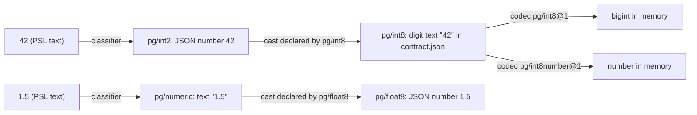

# ADR 254 — Data types and casts

Status: **Proposed**

Built so far: data types with their casts, a codec naming the type it represents, the PSL entries that read and write a type's values, and strict assembly across packs. A follow-up project owns the rest of this decision: a data type's DDL name and aliases, its parameters and their rendering, deriving `nativeType` rather than storing it, type constructors naming a type and a codec, and function parameters typed by a data type. Examples below show the whole decision, so some of them name fields that do not exist yet.

## Decision

A **data type** is a database type made first-class: `pg/int8`, `pg/jsonb`, `pg/numeric`, `sqlite/integer`, `postgis/geometry`. Each target and extension registers its own. A data type owns what was always its own: its name in DDL, its parameters, the rendering of its parameterised name, and its **casts**, which say which other types' values it takes and how. A **codec** is one representation of a data type. Every value written in PSL has a data type, every column has one, and a written value is admitted when its type is the column's or the column's type casts from it.

```prisma
model Account {
  id      Int     @id
  balance BigInt  @default(42)
  ratio   Float   @default(1.5)
  meta    Jsonb   @default(json`{ "plan": "free" }`)
}
```

On Postgres, the written `42` is a value of `pg/int2`, the narrowest Postgres integer type that holds it, and its form is a JSON number. The `balance` column's type is `pg/int8`, which stores digit text; `pg/int8` declares a cast from `pg/int2`, and the cast turns `42` into `"42"`. The written `1.5` is `pg/numeric`, stored as decimal text; `pg/float8` declares a cast from `pg/numeric` that turns the text into a number. The `json` tag returns a value of `pg/json`; `pg/jsonb` declares a cast from `pg/json` that returns the document unchanged, because jsonb takes what json takes.



`pg/int4` declares no cast from `pg/int8`, so `100000000000000099` on an `Int` column is refused before anything is decoded, with a message that says which types `pg/int4` casts from.

## Why

Three problems share one cause: a written value had no type of its own, and the database type had no home of its own.

- A written number was read through a JavaScript number, so `100000000000000099` on a `BigInt` column silently became `100000000000000100`, and `1.50` on a `Decimal` column lost its trailing zero.
- A JSON default could only be written as a quoted string, `Jsonb @default("{}")`, which is a string and not a document, and `contract infer` could not print one back.
- The `8` in `nanoid(8)` and the `8` in `@default(8)` were checked by unrelated code, though they are the same thing: a written value handed to something that expects a particular type.
- The facts about a database type, its DDL name, its parameters, how `numeric(10,2)` is rendered, were spread across codec descriptors and rendering hooks, because a codec stood in for the type it represents. Two codecs of the same database type, `pg/int8@1` and `pg/int8number@1`, could not say so, and stored the same value in two different contract forms.

Giving written values and columns data types, and letting each type declare what it casts from, answers all of these with one entity.

## Data types

A data type is registered by the target or extension that owns the database type:

```ts
const pgInt8 = dataType('pg/int8', {
  ddl: { name: 'int8', aliases: ['bigint'] },
  casts: {
    [pgInt2.id]: (n) => String(n),
    [pgInt4.id]: (n) => String(n),
  },
});

const pgNumeric = dataType('pg/numeric', {
  ddl: { name: 'numeric', aliases: ['decimal'], render: ({ precision, scale }) => ... },
  params: numericParamsSchema,           // precision, scale
  casts: { ... },
});
```

- **Id.** `owner/name`, with no version: `pg/int8`, `sqlite/integer`, `postgis/geometry`. A type's identity does not change; what changes over time is a representation of it, which is a codec, and codecs are versioned (`pg/int8@1`). The two forms differ visibly so that one string never names both.
- **DDL name and aliases.** The name the migration planner renders and the names introspection may report for the same type: `numeric` and `decimal`, `character varying` and `varchar`. `json` and `jsonb` are two database types and therefore two data types.
- **Parameters and rendering.** A parameterised type declares its parameter schema and how its DDL name is rendered with them: `numeric(10,2)`, `vector(1536)`, `timestamp(3)`. Parameters do not make a new type; `numeric(10,2)` holds values of `pg/numeric` under a constraint.
- **Canonical form.** The one JSON shape `contract.json` stores for a value of the type. `pg/int8` stores digit text; `pg/int4` a JSON number; `pg/jsonb` the document. Every codec of the type stores and reads exactly this form.
- **Casts.** For each other type whose values this type takes, a pure function from that type's canonical form to this one's. A cast may convert (`pg/int2` to `pg/int8` turns a number into digit text; `pg/numeric` to `pg/float8` turns decimal text into a number and keeps the words `NaN`, `Infinity`, `-Infinity` as the text the floating-point types store) or may return the value unchanged (`pg/json` to `pg/jsonb`); either way the declaration is the point: this type takes those values. A cast may also refuse: the cast into the floating-point types refuses a magnitude no double holds rather than rounding it to `Infinity`, because the database refuses it too and storing `Infinity` would make a written number indistinguishable from a written `Infinity`.

Casts are declared by the type that receives, never by the source, so there is at most one cast for any pair and the owner of a type is the only one who decides what it takes. That ownership rule is the one PostgreSQL uses for its own cast table, and the rule is all we borrow: these casts are between our data types, applied in the framework before a value is stored or sent, and they model nothing about what the database can convert. Nothing central computes convertibility, because only a type's owner knows what its database or extension can take.

There is no list data type. A list literal is several values, each cast on its own; a list column is a column of one type with `many` set, checked element by element. A type whose single value holds several elements, such as a vector, declares a cast whose source is a list of other types, and each element is checked against that set.

Where a database's storage classes are shared by several logical types, the target declares the types it distinguishes rather than one per storage class: on SQLite, `sqlite/integer` and `sqlite/bigint` are distinct although both store as INTEGER, and `sqlite/text`, `sqlite/datetime` and `sqlite/json` are distinct although all store as TEXT.

No type spans targets, and no family registers types. The SQL family exports implementations targets share, such as the digit classifier and the JSON parse and print, and each target declares its own types with them.

## Codecs

A codec transforms between representations of one data type: the canonical form in the contract, the wire form the driver exchanges, and the in-memory JS value. Its descriptor names the type and nothing about the database type itself:

```ts
class PgInt8NumberDescriptor extends PostgresCodecDescriptor<void> {
  override readonly codecId = 'pg/int8number@1';
  override readonly dataType = pgInt8.id;
}
```

Several codecs may represent one type. `pg/int8@1` and `pg/int8number@1` both represent `pg/int8`, differing in the in-memory value they produce, a `bigint` and a `number`; both store digit text, and `pg/int8number@1` refuses text past 2^53 as a limit of its own representation. `decodeJson` takes the canonical form and nothing else; `encodeJson` produces it. A codec has no method for PSL and never sees PSL text.

Checks that depend on a column's parameters run in the codec instance built with those parameters, on the canonical form: `vector(3)` refuses four elements, `numeric(10,2)` refuses a third decimal place, an enum codec refuses a member it was not declared with. A limit of the stored representation is also the codec's to refuse: `sqlite/real@1` refuses `NaN`, because SQLite cannot store it, with its own message. Whether a SQLite boolean is stored as the integer `1` is likewise the boolean type's codec's business.

## Columns and type constructors

A column names a data type, its parameters, and the codec that represents it; its DDL name is rendered from the type and the parameters, so the contract stores no separate native-type string.

A **type constructor** is how PSL names a column's type: `Int`, `Numeric(10, 2)`, `pgvector.Vector(1536)`, `pg.enum(Status)`. It names a data type, maps its arguments onto the type's parameters, and picks the codec that represents the type for this column. `BigInt` is `pg/int8` with `pg/int8@1`; a number-valued variant is the same type with `pg/int8number@1`. A `types { X = ... }` alias is a type constructor call given a name.

## How PSL writes a value

The pack that owns a data type contributes PSL support for it, keyed by the type's id, in its authoring contribution:

```ts
authoring: {
  dataTypes: {
    [pgJson.id]: {
      // `parse` turns the tag body into the canonical form and refuses what it cannot read.
      written: { kind: 'tag', tag: 'json', parse: parseJsonBody },
      print: printJsonBody,
      documentation: 'Reads the body as a JSON document and stores it as the default value.',
    },
    [pgText.id]: {
      written: { kind: 'plain', syntax: 'string', parse: (text) => text },
      print: (value) => String(value),
      documentation: 'Text.',
    },
    [pgBool.id]: {
      written: { kind: 'plain', syntax: 'boolean', parse: readBoolean },
      print: (value) => String(value),
      documentation: 'A boolean, written true or false.',
    },
    [pgNumeric.id]: {
      written: {
        kind: 'plain',
        syntax: 'number',
        types: [pgInt2.id, pgInt4.id, pgInt8.id, pgNumeric.id],
        classify: classifyPostgresNumber,
      },
      print: printNumber,
      documentation: 'A number, whose type comes from its own size and precision.',
    },
  },
}
```

There are two ways a value is written.

**With a tag.** A tag is a qualified name followed by a string in any of PSL's quote styles, whose body is canonicalised as [ADR 129](ADR%20129%20-%20Template-Tagged%20Literals%20for%20Extensions.md) describes. The entry's `parse` turns the body into the type's canonical form and `print` does the reverse. A target may register an unprefixed tag; every other pack prefixes: `json` is registered by each SQL target for its JSON type, `postgis.geometry` by the postgis extension.

**Plainly.** Three pieces of syntax the interpreter reads without a tag: a quoted string, `true`/`false`, and a number. Each target says which of its types they are. A number is the one plain kind that yields several types, so the target's number entry carries a **classifier** that picks the type from the digits and returns the canonical form with it, in place of `parse`. Beside the classifier the entry lists `types`, every data type the classifier can return; that list is how assembly knows those types can be written, even though each is keyed under no entry of its own. The Postgres target's rule is its own, not PostgreSQL's: a whole number takes the narrowest of `pg/int2`, `pg/int4`, `pg/int8` that holds it; anything else — a larger whole number, a number with a fraction, or `NaN`, `Infinity`, `-Infinity` — is `pg/numeric`. It diverges from PostgreSQL, which types a whole integer literal as `integer` and never as `smallint`. Starting narrower costs nothing here, because a column takes the value only through a cast its type declares, and every wider integer type casts from `pg/int2`. SQLite's rule: a whole number a double holds exactly is `sqlite/integer`, a wider one up to 64 bits is `sqlite/bigint`, a number with a fraction is `sqlite/real`, and anything else — a whole number past 64 bits, or one of the three words — has no SQLite type and is refused. Digit text has no leading zeros and no negative zero, and keeps trailing zeros: `007` is `7`, `-007.50` is `-7.50`. A type may be writable both ways; a target that registered an `int2` tag would make `` int2`8` `` and `8` the same value.

Some tags name no data type. `sql` takes an expression in the database's language, which nothing in the framework reads, and stores it in the contract's expression form on any column. Such a tag is registered in the same map as the others, as a **lowering** entry under a reserved key that no data type id can collide with; Postgres registers `sql` and `pg.sql` this way, SQLite `sql` and `sqlite.sql`.

The language server takes tag completion and documentation from the same entries. So does `contract infer`, and so does the reader for the earlier Prisma schema language, which maps its own syntax onto the same plain kinds and, for quoted JSON on a JSON column, the `json` entry's `parse`.

## Three kinds of expression

PSL has three kinds of expression, and each has one rule.

- **A literal** is written plainly or with a tag. The interpreter finds the entry, calls `parse`, and has a value of a known type. The receiving type must be that type or cast from it: for a column, the column's type; for a function argument, the parameter's declared type; inside a list, per element. No cast is `PSL_DEFAULT_TYPE_INCOMPATIBLE`: `Field "Account.count": pg/int4 has no cast from pg/int8; it casts from pg/int2`. Text the entry cannot parse is `PSL_INVALID_DEFAULT_LITERAL`; a JSON body that does not parse is `PSL_INVALID_JSON_LITERAL`; a tag nobody registered is `PSL_UNKNOWN_DEFAULT_LITERAL_TAG`. Every one points at the written value.
- **A reference** is an identifier. It resolves through the symbol table to a declaration, and its value is that declaration's, of the declaration's type. An enum member resolves to the member declared in its `enum` block, and the only check is scope: the member must belong to this column's enum. No parsing and no cast.
- **A call** names a registered function. Each argument is an expression delivered to a parameter, and a parameter names a data type, so an argument is admitted by the same rule as a default. Function registries are per target, so `nanoid`'s size parameter is `pg/int4` on Postgres and `sqlite/integer` on SQLite, with one shared implementation. The call produces what the function registry defines, a storage default or a client-side generator.

Value positions, in attributes and in function signatures, are typed through the attribute specification with one combinator that names a data type; the syntax that is not a value (field references, entity references, identifiers, lists, records, calls) keeps its own combinators. One binder parses, validates and drives the editor for both attributes and calls.

Reading a default is then:

1. The parser yields a literal, a reference, or a call, with source spans.
2. A reference resolves; a call dispatches; a `sql` tag lowers. Any other literal is parsed to a value of a known type.
3. If the value's type is not the column's, the column's type is looked up for a cast from it. None is a diagnostic at the value.
4. The canonical form, cast or not, is validated by the codec instance for the column's parameters; a refusal is a diagnostic at the value with the codec's message.
5. The canonical form is stored. The contract's two default forms, a value and an expression, are unchanged.

The TypeScript builder is not a text surface: `.default(value)` hands the codec a JS value that TypeScript has typed, and `encodeJson` produces the canonical form.

## Assembly

The control stack assembles every pack's data types, codec descriptors, type constructors and authoring entries into one stack and checks them against each other. It fails with a structured error, naming the contributor and the dangling id, when:

1. a codec or a type constructor names a data type that is not registered;
2. an authoring entry, a type in a number entry's `types`, or a source in some type's casts, names a data type that is not registered;
3. two entries claim one tag, or one plain kind; and, for the same reason, two components register one type id, or two entries sit under one key;
4. a type that appears as a source in some cast cannot be written, because a cast from a type nobody can write can never be exercised. A type can be written when it has an authoring entry of its own or when a number entry's `types` names it.

The reverse of the last is not required: a type may be reachable only through casts. Assembly is the right level for these checks because they span packs: `pgvector/vector` casting from `pg/numeric` is valid only when the Postgres target that owns `pg/numeric` is in the stack. Within a pack, references are by constant rather than by string, so a misspelt id fails to compile and an unregistered one fails assembly.

## Printing

`contract infer` inverts the mapping. For an introspected column it matches the reported type name against the registered types' DDL names and aliases. For a stored value, the printer classifies the canonical form with the same rules a written value uses: digit text or a number through the target's classifier, a document as the JSON type, text as the text type, a boolean, an array element by element. It confirms the column's type is that type or casts from it, prints with the entry's `print`, and runs the text back through parse and cast to prove it returns the stored value. Anything that fails takes the raw-expression fallback, so infer never prints a schema that emit cannot read.

## Extending the set of types

A pack that owns a database type registers it once: the data type with its DDL name, parameters, rendering and casts; the codecs that represent it; the type constructor that names it in PSL; and, if values of it are written in PSL, the authoring entry with the tag, `parse`, `print` and documentation. Nothing in the interpreter, the planner, the printer, the language server or the readers changes. A geometry type with a WKT tag is the model case:

```prisma
model Place {
  id       Int      @id
  location Geometry @default(postgis.geometry`POINT(1 2)`)
}
```

## Consequences

- A written value is never rounded before its receiving type sees it, and a value the receiving type cannot hold is refused rather than rounded into one it can.
- A JSON default is a document, written and printed as one.
- Defaults and function arguments are admitted by one rule.
- The facts about a database type live in one declaration. Codecs of one type share its contract form; where they did not, contracts change form once and are re-emitted.
- A column's DDL name is derived from its type and parameters rather than stored, so the contract loses a redundant field.
- Registering a codec or a type constructor without a data type, or a data type that values can be cast from without PSL support for it, is an assembly error, not a runtime surprise.

## Alternatives considered

- **Codec methods that receive PSL text** (`encodePsl`/`decodePsl`, the sketch in [ADR 184](ADR%20184%20-%20Codec-owned%20value%20serialization.md)). Every codec becomes coupled to PSL's tokenizer and escaping, and there is no check before a decode fails.
- **A central rule for which types convert into which.** Databases and extensions define their own types and their own conversions; the framework cannot know them. A type's own casts are the only honest declaration.
- **Conversion inside the codec**, the codec listing what it takes and converting in `decodeJson`. Two codecs of one type repeat the same fact and the same conversion, and `decodeJson` ends up accepting shapes the codec never writes.
- **A family-level vocabulary of written types** (`sql/i8`, `sql/json`, …) that every target's types cast from. It invents types no database has, and most of its casts would return the value unchanged.
- **A data type as the set of values a group of codecs share**, so that `json` and `jsonb` are one type. It invents a layer between the database's types and the codecs that the database does not have, and a cast that returns the document unchanged says the same thing without it.
- **Separate `json` and `jsonb` literals.** An author would have to know a column's storage to pick a tag for the same text, and infer would print a different tag per column.
- **One `number` type converted per receiver.** Big numbers round, and every numeric receiver carries the same conversion.
- **The column decides a written number's type.** One syntax would not name one type, and a size error would surface inside a codec instead of as a missing cast.
- **A closed set of types in the framework.** An extension cannot add one, and the framework owns a vocabulary that belongs to targets.
- **A list data type.** A list is several values of one type; the shape belongs to the column or to the receiving type's cast.
- **Enum members as string values.** A member name is a reference to a declaration, resolved in scope like a field name.
- **Casts declared by the source type, or by both sides.** Two declarations for one pair, with no rule for which wins.
- **A vector type casting from the JSON type.** It matches on storage shape; a vector is several numbers.

## Not decided here

Whether temporal, bytes and interval types get tags of their own and stop casting from the text type; whether a codec will one day convert the `sql` representation (the DDL half of ADR 184); the Mongo target's types.

## Related

- [ADR 184 — Codec-owned value serialization](ADR%20184%20-%20Codec-owned%20value%20serialization.md): the canonical form now belongs to the data type; the PSL half is replaced by this decision.
- [ADR 129 — Tagged literals](ADR%20129%20-%20Template-Tagged%20Literals%20for%20Extensions.md): the tag syntax and canonical body; a tag is how PSL writes a data type, and `sql` is the one lowering tag.
- [ADR 208 — Higher-order codecs for parameterized types](ADR%20208%20-%20Higher-order%20codecs%20for%20parameterized%20types.md): parameters now belong to the data type; codec instances still check them.
- [ADR 252 — An earlier Prisma version's schema is a contract source](ADR%20252%20-%20An%20earlier%20Prisma%20version's%20schema%20is%20a%20contract%20source.md): a second text source mapped onto the same types.
