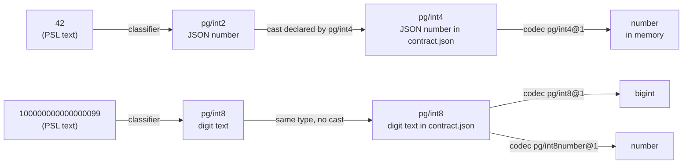

# ADR 254 — Data types and casts

Status: **Proposed**

## Decision

Every value written in PSL has a **data type**, every column has a data type through its codec, and a written value is admitted to a column when its type is the column's type or the column's type declares a **cast** from it.

```prisma
model Account {
  id      Int     @id
  balance BigInt  @default(100000000000000099)
  count   Int     @default(42)
  meta    Jsonb   @default(json`{ "plan": "free" }`)
}
```

On Postgres, the written number `100000000000000099` is a value of `pg/int8`, decided by its digits: it is the narrowest Postgres integer type that holds it. The `balance` column's type is also `pg/int8`, so the value is stored as it is, the digit text `"100000000000000099"`, every digit intact. The written `42` is `pg/int2`, the narrowest type that holds it; the `count` column is `pg/int4`, which declares a cast from `pg/int2`, so the value is admitted. The `json` tag returns a value of `pg/json`, the type both `json` and `jsonb` columns store, so `meta` takes it directly.



`pg/int4` declares no cast from `pg/int8`, so `100000000000000099` on an `Int` column is refused before anything is decoded, with a message that says which types `pg/int4` casts from.

## Why

Three problems share one cause: PSL had no notion of what type a written value has.

- A number was read through a JavaScript number, so `100000000000000099` on a `BigInt` column silently became `100000000000000100`, and `1.50` on a `Decimal` column lost its trailing zero.
- A JSON default could only be written as a quoted string, `Jsonb @default("{}")`, which is a string and not a document, and `contract infer` could not print one back.
- The `8` in `nanoid(8)` and the `8` in `@default(8)` were checked by unrelated code, though they are the same thing: a written value handed to something that expects a particular type.

Giving written values data types, and letting each receiving type say what it casts from, answers all three with one rule.

## Data types

A data type is a named kind of value that a target or an extension registers. Its id is `owner/name`: `pg/int8`, `pg/json`, `sqlite/integer`, `postgis/geometry`. The id has no version, because a type's identity does not change; what changes over time is a representation of it, which is a codec, and codecs are versioned (`pg/int8@1`). The two forms differ visibly so that one string never names both.

A data type has a **canonical form**: the one JSON shape `contract.json` stores for a value of the type. `pg/int8` stores digit text; `pg/int4` stores a JSON number; `pg/json` stores the document.

A data type declares its **casts**: for each other type whose values it takes, a pure function from that type's canonical form to its own.

```ts
const pgInt8 = dataType('pg/int8', {
  casts: {
    [pgInt2.id]: (n) => String(n),
    [pgInt4.id]: (n) => String(n),
  },
});
```

A cast exists only where a conversion exists. Where two kinds of column hold the same kind of value they share one type, and where a written value already has the column's type nothing is cast.

Casts are declared by the type that receives, never by the source, so there is at most one cast for any pair and the owner of a type is the only one who decides what it takes. That ownership rule is the one PostgreSQL uses for its own cast table, and the rule is all we borrow: these casts are between our data types, applied in the framework before a value is stored or sent, and they model nothing about what the database can convert. Nothing central computes convertibility, because only a type's owner knows what its database or extension can take.

There is no list data type. A list literal is several values, each cast on its own; a list column is a column of one type with `many` set, checked element by element. A type whose single value holds several elements, such as a vector, declares a cast whose source is a list of other types, and each element is checked against that set.

**Types are the target's.** No type spans targets. Postgres registers `pg/int2`, `pg/int4`, `pg/int8`, `pg/numeric`, `pg/float4`, `pg/float8`, `pg/text`, `pg/bool`, `pg/json` and the rest; SQLite registers `sqlite/integer`, `sqlite/real`, `sqlite/text`, `sqlite/json` and the rest. The SQL family registers no types. It exports implementations targets share, such as the digit classifier and the JSON parse and print, and each target declares its own types with those.

## Codecs

A codec transforms between representations of one data type: the canonical form in the contract, the wire form the driver exchanges, and the in-memory JS value. Its descriptor names the type:

```ts
class PgInt8NumberDescriptor extends PostgresCodecDescriptor<void> {
  override readonly codecId = 'pg/int8number@1';
  override readonly dataType = pgInt8.id;
}
```

Several codecs may serve one type. `pg/int8@1` and `pg/int8number@1` both transform `pg/int8`, differing in the in-memory value they produce, a `bigint` and a `number`; both store digit text, and `pg/int8number@1` refuses text past 2^53 as a limit of its own representation. `pg/json@1` and `pg/jsonb@1` both transform `pg/json`, differing in the database type they bind to. `decodeJson` takes the canonical form and nothing else; `encodeJson` produces it. A codec has no method for PSL and never sees PSL text.

Checks that depend on a column's parameters run in the codec instance built with those parameters, on the canonical form: `vector(3)` refuses four elements, `numeric(10,2)` refuses a third decimal place, an enum codec refuses a member it was not declared with. A limit of the stored representation is also the codec's to refuse: `sqlite/real@1` refuses `NaN`, because SQLite cannot store it, with its own message. Whether a SQLite boolean is stored as the integer `1` is likewise the boolean type's codec's business, not the written value's.

## How PSL writes a value

The pack that owns a data type contributes PSL support for it, keyed by the type's id, in its authoring contribution:

```ts
authoring: {
  dataTypes: {
    [pgJson.id]: {
      written: { tag: 'json' },
      parse: (body) => JSON.parse(body),     // tag body → canonical form; refuses what it cannot read
      print: (value) => JSON.stringify(value),
      documentation: 'A JSON document.',
    },
    [pgText.id]: { written: { plain: 'string' },  parse, print },
    [pgBool.id]: { written: { plain: 'boolean' }, parse, print },
    ...postgresNumberEntries,                  // written: { plain: 'number' }, one classifier, several types
  },
}
```

There are two ways a value is written.

**With a tag.** A tag is a qualified name followed by a string in any of PSL's quote styles, whose body is canonicalised as [ADR 129](ADR%20129%20-%20Template-Tagged%20Literals%20for%20Extensions.md) describes. The entry's `parse` turns the body into the type's canonical form and `print` does the reverse. A target may register an unprefixed tag; every other pack prefixes: `json` is registered by each SQL target for its own JSON type, `postgis.geometry` by the postgis extension.

**Plainly.** Three pieces of syntax the interpreter reads without a tag: a quoted string, `true`/`false`, and a number. Each target says which of its types they are. A number is the one plain kind that yields several types, so the target's number entry carries a **classifier** that picks the type from the digits. Postgres's rule is PostgreSQL's own rule for literals: a whole number takes the narrowest of `pg/int2`, `pg/int4`, `pg/int8` that holds it; anything else, a larger whole number, a number with a fraction, or `NaN`, `Infinity`, `-Infinity`, is `pg/numeric`. SQLite's rule: a whole number within 64 bits is `sqlite/integer`, a number with a fraction is `sqlite/real`, a larger number has no SQLite type and is refused. Digit text has no leading zeros and no negative zero, and keeps trailing zeros: `007` is `7`, `-007.50` is `-7.50`. A type may be writable both ways; `` int2`8` `` and `8` would be the same value if a target registered such a tag.

The float types cast from the numeric one: `pg/float8` casts from `pg/int2`, `pg/int4`, `pg/int8` and `pg/numeric`, and the cast from `pg/numeric` turns the three words into non-finite numbers. That is why `Float @default(1.5)` and `Float @default(NaN)` both work without a float literal of their own.

One tag names no data type. `sql` takes an expression in the database's language, which nothing in the framework reads, and stores it in the contract's expression form on any column. It is registered in the same place as the others, as the one **lowering** entry.

The language server takes tag completion and documentation from the same entries. So does `contract infer`, and so does the reader for the earlier Prisma schema language, which maps its own syntax onto the same plain kinds and, for quoted JSON on a JSON column, the `json` entry's `parse`.

## Three kinds of expression

PSL has three kinds of expression, and each has one rule.

- **A literal** is written plainly or with a tag. The interpreter finds the entry, calls `parse`, and has a value of a known type. The receiving type must be that type or cast from it: for a column, the codec's type; for a function argument, the parameter's declared type; inside a list, per element. No cast is `PSL_DEFAULT_TYPE_INCOMPATIBLE`: `Field "Account.count": pg/int4 has no cast from pg/int8; it casts from pg/int2`. Text the entry cannot parse is `PSL_INVALID_DEFAULT_LITERAL`; a JSON body that does not parse is `PSL_INVALID_JSON_LITERAL`; a tag nobody registered is `PSL_UNKNOWN_DEFAULT_LITERAL_TAG`. Every one points at the written value.
- **A reference** is an identifier. It resolves through the symbol table to a declaration, and its value is that declaration's, of the declaration's type. An enum member resolves to the member declared in its `enum` block, and the only check is scope: the member must belong to this column's enum. No parsing and no cast.
- **A call** names a registered function. Each argument is an expression delivered to a parameter, and a parameter names a data type, so an argument is admitted by the same rule as a default. Function registries are per target, so `nanoid`'s size parameter is `pg/int4` on Postgres and `sqlite/integer` on SQLite, with one shared implementation. The call produces what the function registry defines, a storage default or a client-side generator.

Reading a default is then:

1. The parser yields a literal, a reference, or a call, with source spans.
2. A reference resolves; a call dispatches; a `sql` tag lowers. Any other literal is parsed to a value of a known type.
3. If the value's type is not the column's, the column's type is looked up for a cast from it. None is a diagnostic at the value.
4. The canonical form, cast or not, is validated by the codec instance for the column's parameters; a refusal is a diagnostic at the value with the codec's message.
5. The canonical form is stored. The contract's two default forms, a value and an expression, are the same as before this decision.

The TypeScript builder is not a text surface: `.default(value)` hands the codec a JS value that TypeScript has typed, and `encodeJson` produces the canonical form.

## Assembly

The control stack assembles every pack's data types, codec descriptors and authoring entries into one stack and checks them against each other. It fails with a structured error, naming the contributor and the dangling id, when:

1. a codec names a data type that is not registered;
2. an authoring entry, or a source in some type's casts, names a data type that is not registered;
3. two entries claim one tag, or one plain kind;
4. a type that appears as a source in some cast has no authoring entry, because a cast from a type nobody can write can never be exercised.

The reverse of the last is not required: a stored type such as `pg/int8` need not be writable directly if values reach it through casts, although on Postgres it is. Assembly is the right level for these checks because they span packs: `pgvector/vector` casting from `pg/numeric` is valid only when the Postgres target that owns `pg/numeric` is in the stack. Within a pack, references are by constant rather than by string, so a misspelt id fails to compile and an unregistered one fails assembly.

## Printing

`contract infer` inverts the mapping. For a stored value, the printer classifies the canonical form with the same rules a written value uses: digit text or a number through the target's classifier, a document as the JSON type, text as the text type, a boolean, an array element by element. It confirms the column's type is that type or casts from it, prints with the entry's `print`, and runs the text back through parse and cast to prove it returns the stored value. Anything that fails takes the raw-expression fallback, so infer never prints a schema that emit cannot read.

## Extending the set of types

A pack that owns a type it wants writable in PSL registers three things together, referencing one constant: the data type with its casts, its codec naming the type, and its authoring entry with the tag, `parse`, `print` and documentation. Nothing in the interpreter, the printer, the language server or the readers changes. A geometry type with a WKT tag is the model case:

```prisma
model Place {
  id       Int      @id
  location Geometry @default(postgis.geometry`POINT(1 2)`)
}
```

## Consequences

- A written value is never rounded before its receiving type sees it.
- A JSON default is a document, written and printed as one.
- Defaults and function arguments are admitted by one rule.
- Two codecs of one type share the contract form. Where they did not before, contracts change form once and are re-emitted.
- Registering a data type without PSL support for it, or a codec without a data type, is an assembly error, not a runtime surprise.

## Alternatives considered

- **Codec methods that receive PSL text** (`encodePsl`/`decodePsl`, the sketch in [ADR 184](ADR%20184%20-%20Codec-owned%20value%20serialization.md)). Every codec becomes coupled to PSL's tokenizer and escaping, and there is no check before a decode fails.
- **A central rule for which types convert into which.** Databases and extensions define their own types and their own conversions; the framework cannot know them. A type's own casts are the only honest declaration.
- **Conversion inside the codec**, the codec listing what it takes and converting in `decodeJson`. Two codecs of one type repeat the same fact and the same conversion, and `decodeJson` ends up accepting shapes the codec never writes.
- **A family-level vocabulary of written types** (`sql/i8`, `sql/json`, …) that every target's types cast from. It invents types no database has, and most of its casts would be identities between a value and itself.
- **One `number` type converted per receiver.** Big numbers round, and every numeric receiver carries the same conversion.
- **The column decides a written number's type.** One syntax would not name one type, and a size error would surface inside a codec instead of as a missing cast.
- **A closed set of types in the framework.** An extension cannot add one, and the framework owns a vocabulary that belongs to targets.
- **A list data type.** A list is several values of one type; the shape belongs to the column or to the receiving type's cast.
- **Enum members as string values.** A member name is a reference to a declaration, resolved in scope like a field name.
- **Casts declared by the source type, or by both sides.** Two declarations for one pair, with no rule for which wins.
- **A vector type casting from the JSON type.** It matches on storage shape; a vector is several numbers.

## Not decided here

Whether temporal, bytes and interval types get tags of their own and stop casting from the text type; whether a codec will one day convert the `sql` representation (the DDL half of ADR 184); the Mongo target's number vocabulary.

## Related

- [ADR 184 — Codec-owned value serialization](ADR%20184%20-%20Codec-owned%20value%20serialization.md): the canonical form now belongs to the data type; the PSL half is replaced by this decision.
- [ADR 129 — Tagged literals](ADR%20129%20-%20Template-Tagged%20Literals%20for%20Extensions.md): the tag syntax and canonical body; a tag is how PSL writes a data type, and `sql` is the one lowering tag.
- [ADR 252 — An earlier Prisma version's schema is a contract source](ADR%20252%20-%20An%20earlier%20Prisma%20version's%20schema%20is%20a%20contract%20source.md): a second text source mapped onto the same types.
