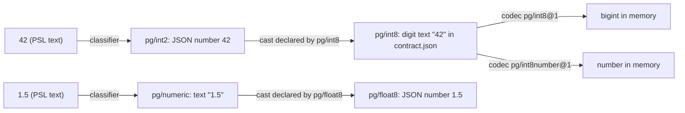

# ADR 254 — Data types and casts

Status: **Accepted**

Built: data types with their casts, a codec naming the type it represents, the PSL entries that read and write a type's values, and strict assembly across packs. Lowering entries are gone: every authoring entry names a data type, and `sql` is the tag of `sql/expression`. Each SQL data type declares its DDL names, its parameters with their bounds, and how its parameterised name is written; the planners and the runtime's parameter casts write a column's type from it, and a codec's parameter schema is its data type's. A type that is never a column's type, such as `sql/expression`, declares no names. The contract stores each column's data type in `dataType`, and SQLite declares the types it stores. Not built yet: recognising a reported database type through the declared names (introspection, `db verify` and `contract infer`), and function parameters typed by a data type. The "Printing" section and the function calls under "Three kinds of expression" describe those parts.

## Decision

A **data type** is the type of a value Prisma stores or passes to the database. Most are database types made first-class: `pg/int8`, `pg/jsonb`, `pg/numeric`, `sqlite/integer`, `postgis/geometry`. Each target and extension registers its own. A data type owns what was always its own: its name in DDL, its parameters, the rendering of its parameterised name, and its **casts**, which say which other types' values it takes and how. A **codec** is one representation of a data type. Every value written in PSL has a data type, every column has one, and a written value is admitted when its type is the column's or the column's type casts from it.

```prisma
model Account {
  id      Int     @id
  balance BigInt  @default(42)
  ratio   Float   @default(1.5)
  meta    Jsonb   @default(json`{ "plan": "free" }`)
}
```

On Postgres, the written `42` is a value of `pg/int2`, the narrowest Postgres integer type that holds it, and its form is a JSON number. The `balance` column's type is `pg/int8`, which stores digit text; `pg/int8` declares a cast from `pg/int2`, and the cast turns `42` into `"42"`. The written `1.5` is `pg/numeric`, stored as decimal text; `pg/float8` declares a cast from `pg/numeric` that turns the text into a number. The `json` tag returns a value of `pg/json`; `pg/jsonb` declares a cast from `pg/json` that returns the document unchanged, because jsonb takes what json takes.


```mermaid
flowchart LR
  A["42 (PSL text)"] -->|classifier| B["pg/int2: JSON number 42"]
  B -->|cast declared by pg/int8| C["pg/int8: digit text &quot;42&quot; in contract.json"]
  C -->|codec pg/int8@1| D["bigint in memory"]
  C -->|codec pg/int8number@1| E["number in memory"]
  F["1.5 (PSL text)"] -->|classifier| G["pg/numeric: text &quot;1.5&quot;"]
  G -->|cast declared by pg/float8| H["pg/float8: JSON number 1.5"]
```

`pg/int4` declares no cast from `pg/int8`, so `100000000000000099` on an `Int` column is refused before anything is decoded, with a message that says what to write instead.

## Why

Three problems share one cause: a written value had no type of its own, and the database type had no home of its own.

- A written number was read through a JavaScript number, so `100000000000000099` on a `BigInt` column silently became `100000000000000100`, and `1.50` on a `Decimal` column lost its trailing zero.
- A JSON default could only be written as a quoted string, `Jsonb @default("{}")`, which is a string and not a document, and `contract infer` could not print one back.
- The `8` in `@default(8)` and the `8` in a database function's argument, such as a `sql` default calling `gen_random_bytes(8)`, were checked by unrelated code, though they are the same thing: a written value handed to something that expects a particular type. (The `8` in `nanoid(8)` is not: it sizes a generator that runs in the client, so it is grammar, typed by shape; [ADR 231](ADR%20231%20-%20Declarative%20attribute%20specifications.md) draws the line.)
- The facts about a database type, its DDL name, its parameters, how `numeric(10,2)` is rendered, were spread across codec descriptors and rendering hooks, because a codec stood in for the type it represents. Two codecs of the same database type, `pg/int8@1` and `pg/int8number@1`, could not say so, and stored the same value in two different contract forms.

Giving written values and columns data types, and letting each type declare what it casts from, answers all of these with one entity.

## Data types

A data type is registered by the target or extension that owns the database type. A SQL data type is declared with `sqlDataType` from `@internal/sql-contract/data-type`; these are two of the Postgres target's:

```ts
import { sqlDataType } from '@internal/sql-contract/data-type';
import { type as arktype } from 'arktype';

export const pgInt8 = sqlDataType('pg/int8', {
  texts: [
    { text: 'int8', written: true },
    { text: 'bigint', catalog: true },
  ],
  casts: { [pgInt2.id]: asNumeralText, [pgInt4.id]: asNumeralText },
});

export const pgNumericParams = arktype({
  'precision?': 'number.integer >= 1 & number.integer <= 1000',
  'scale?': 'number.integer >= -1000 & number.integer <= 1000',
}).narrow(
  (params, ctx) =>
    params.scale === undefined ||
    params.precision !== undefined ||
    ctx.reject({ path: ['scale'], message: 'scale requires a precision' }),
);

export const pgNumeric = sqlDataType('pg/numeric', {
  params: pgNumericParams,
  texts: [
    { text: 'numeric', written: true, catalog: true },
    { text: 'numeric({precision})', written: true },
    { text: 'numeric({precision},{scale})', written: true, catalog: true },
    { text: 'decimal' },
    { text: 'decimal({precision})' },
    { text: 'decimal({precision},{scale})' },
  ],
  normalize: (params) =>
    params.precision !== undefined && params.scale === undefined ? { ...params, scale: 0 } : params,
  casts: { [pgInt2.id]: asNumeralText, [pgInt4.id]: asNumeralText, [pgInt8.id]: unchanged },
});
```

- **Id.** `owner/name`, with no version: `pg/int8`, `sqlite/integer`, `postgis/geometry`. A type's identity does not change; what changes over time is a representation of it, which is a codec, and codecs are versioned (`pg/int8@1`). The two forms differ visibly so that one string never names both.
- **Texts.** Every name the database has for the type, in lower case, with `{name}` standing for the parameter `name`. A text marked `written` is the one a migration writes; a text marked `catalog` is the one the database catalog prints; a text with neither mark is another name the database accepts, such as `decimal`. Among texts with the same placeholders at most one is written and at most one is catalog. `display` gives the exact characters when they differ in letter case only: PostGIS writes `geometry(Geometry,{srid})`. `json` and `jsonb` are two database types and therefore two data types. A type the catalog reports by kind rather than by text, a Postgres enum, declares `claimsKind: 'enum'` with `render` and `fromReported` in place of texts.
- **Parameters.** `params` is an arktype object schema, and it is the only place a parameter's bound is written: a codec's `paramsSchema` is its data type's `params`, extended by any keys of the codec's own. `normalize` gives the normal form, so `numeric(10)` and `numeric(10,0)` have equal parameters. Parameters do not make a new type; `numeric(10,2)` holds values of `pg/numeric` under a constraint.
- **Writing a name.** `renderSqlTypeName(type, params)` picks the written text whose placeholders are exactly the given parameters and fills them in: `numeric(10,2)`, `vector(1536)`, `timestamptz(3)`. A parameter outside its bound, or a set of parameters no written text takes, is `CONTRACT.TYPE_PARAMS_INVALID`. `sqlBaseName(type, params)` is the name without parameters, which the runtime's parameter casts use (`$1::numeric`), because a cast to `varchar(n)` truncates and to `numeric(p,s)` rounds.
- **Canonical form.** The one JSON shape `contract.json` stores for a value of the type. `pg/int8` stores digit text; `pg/int4` a JSON number; `pg/jsonb` the document. Every codec of the type stores and reads this form. A type whose values have several written forms, such as a date, also declares a `toCanonicalForm` function that turns each of them into the one stored form. Schema verification runs a database default and the contract's default through that function before comparing them, so a Postgres type whose printed text differs from its stored form reads that text too. `pg/bytea` stores base64 and also reads the hex PostgreSQL prints (`\x68656c6c6f`); its cast from text is the same function, so a PSL default may be written in either form: `"aGVsbG8="`, or `"\\x68656c6c6f"` with the backslash doubled, because a PSL string reads `\x68` as `h`. A raw SQL default on a `bytea` column is PostgreSQL bytea input, hex or the escape format, so the Postgres target reads it as the bytes PostgreSQL stores, never as base64. `pgvector/vector` stores an array of numbers and also reads the text PostgreSQL prints (`[1,2,3]`); it declares no cast from text. A codec may declare a finer form for its own values, as `sqlite/datetime@1` does (see Date and time types) and as `sqlite/json@1` does with the document's JSON text. Whatever reads, compares or writes a stored value takes the column's canonical form from `canonicalFormOf`: the codec's when it declares one, else its data type's.
- **Casts.** For each other type whose values this type takes, a pure function from that type's canonical form to this one's. A cast may convert (`pg/int2` to `pg/int8` turns a number into digit text; `pg/numeric` to `pg/float8` turns decimal text into a number and keeps the words `NaN`, `Infinity`, `-Infinity` as the text the floating-point types store) or may return the value unchanged (`pg/json` to `pg/jsonb`); either way the declaration is the point: this type takes those values. A cast may also refuse: the cast into the floating-point types refuses a magnitude no double holds rather than rounding it to `Infinity`, because the database refuses it too and storing `Infinity` would make a written number indistinguishable from a written `Infinity`.

Casts are declared by the type that receives, never by the source, so there is at most one cast for any pair and the owner of a type is the only one who decides what it takes. That ownership rule is the one PostgreSQL uses for its own cast table, and the rule is all we borrow: these casts are between our data types, applied in the framework before a value is stored or sent, and they model nothing about what the database can convert. Nothing central computes convertibility, because only a type's owner knows what its database or extension can take.

There is no list data type. A list literal is several values, each cast on its own; a list column is a column of one type with `many` set, checked element by element. A type whose single value holds several elements, such as a vector, declares a cast whose source is a list of other types, and each element is checked against that set.

A column's data type is what the database stores; in SQL it is a `SqlDataType`, and `sql/expression` is the one data type no column has. Codecs that store the same thing represent one data type, however they present it in memory. SQLite stores text, integers, reals and blobs, so its target declares `sqlite/text`, `sqlite/integer`, `sqlite/real` and `sqlite/blob`, and the two types a column may be declared with, `sqlite/character` and `sqlite/character-varying`; nothing else. `sqlite/json@1` and `sqlite/datetime@1` represent `sqlite/text`, and `sqlite/bigint@1`, `sqlite/bigintnumber@1` and `sql/int@1` represent `sqlite/integer`. What makes a SQLite column a JSON column is its codec, not its data type.

No database type spans targets. The SQL family exports implementations targets share, such as the digit classifier and the JSON parse and print, and each target declares its own types with them. A family registers only a data type that is the same on every target and that nothing casts from. `sql/expression` is the only one: a SQL expression in the target database's language, whose canonical form is its text. The SQL family registers it and its authoring entry itself, so no target has to remember to. It has no codec and no DDL name, no column has it, it declares no casts, and no type casts from it. The SQL family refuses a stack in which a type casts from it, with `CONTRACT.DATA_TYPE_CASTS_FROM_SQL_EXPRESSION`.

### Date and time types

A date or time value can be written many ways, so each date and time type declares a `toCanonicalForm` function in its `dataType(id, spec)` declaration. The function turns any text the type takes into the one text `contract.json` stores for that value, and refuses text the type does not hold. The type's cast from its target's text type is the same function. `2024-01-01T00:00:00Z`, `2024-01-01T00:00:00.000Z` and `2024-01-01T01:00:00+01:00` on a `timestamptz` column are one instant, stored once as `2024-01-01T00:00:00Z`.

SQLite stores a date and time as text, so `sqlite/datetime@1` represents `sqlite/text`, which declares no canonical form. The codec declares the function instead, as `toCanonicalForm` on its descriptor, and `canonicalFormOf` takes the codec's before the data type's. The table names it by the codec id.

| Data type | Canonical form | Earliest | Latest |
|---|---|---|---|
| `pg/timestamptz` | the instant in UTC: `2024-01-01T00:00:00Z` | `-004713-11-24T00:00:00Z` | `+275760-09-13T00:00:00Z` |
| `sqlite/datetime@1` | the instant in UTC: `2024-01-01T00:00:00Z` | `-271821-04-20T00:00:00Z` | `+275760-09-13T00:00:00Z` |
| `pg/timestamp` | `2024-01-01T12:34:56` | `-004713-11-24T00:00:00` | `+275760-09-13T23:59:59.999999` |
| `pg/date` | `2024-01-01` | `-004713-11-24` | `+275760-09-13` |
| `pg/time` | `12:34:56` | | |
| `pg/timetz` | the time and its offset, `12:34:56+02:00`; `Z` for a zero offset | | |
| `pg/interval` | an ISO 8601 duration: `P1Y2M3DT4H5M6.5S` | | |

- Seconds are always written. A fraction of a second has no trailing zeros. It has at most six digits, because the Postgres types hold microseconds, and at most three on `sqlite/datetime@1`, because the codec holds a JavaScript `Date`, which holds milliseconds.
- A year from 0000 to 9999 has four digits. Any other year is a sign and six digits: `-000043-03-15`, `+012026-01-02`. Years count as ISO 8601 counts them, with year 0000 as 1 BC.
- An offset is `+HH:MM`, or `+HH:MM:SS` when it has seconds. `pg/timetz` holds offsets up to 15:59 either way.
- `infinity` and `-infinity` are values of `pg/date`, `pg/timestamp` and `pg/timestamptz`.
- An interval balances months into years and minutes and seconds into hours, and keeps days as days: `P14MT90M` is `P1Y2MT1H30M`. It leaves out a part that is zero, and a zero interval is `PT0S`. Years, months and days each carry their own sign; hours, minutes and seconds carry the sign of the time as a whole: `-1 days -04:05:00` is `P-1DT-4H-5M`.

The earliest value of each Postgres type is the earliest PostgreSQL holds, 4714-11-24 BC. It is year `-004713` because PostgreSQL has no year 0: its 1 BC is ISO year 0000. The latest value of every type, and the earliest of `sqlite/datetime@1`, is the limit of the `Temporal` and `Date` values its codecs produce. A type refuses a value outside its range rather than storing one that some codec of the type cannot read.

Each type reads ISO 8601 with a four-digit or signed six-digit year and a `T` or a space between date and time. A Postgres type also reads the text PostgreSQL prints: a ` BC` suffix, a year of five or six digits, `infinity` and `-infinity`, and for `pg/interval` the text PostgreSQL prints under `IntervalStyle = postgres`. The function uses no `Temporal` and no JavaScript `Date`, so a default reads the same on every runtime. It refuses an offset on a type that holds none, a missing offset on a type that needs one, a date on a time type, a time on `pg/date`, more fraction digits than the type holds, a date or time that does not exist, and a value outside the type's range. Each refusal names what is wrong and shows text the type takes.

Whatever stores, compares, writes or prints a date or time value from the contract uses the canonical form `canonicalFormOf` gives the column: its codec's, or else that of the data type the codec names, so a codec from an extension that represents one of these types is treated the same way. Every codec's `encodeJson` produces the canonical form, and a codec whose value holds nanoseconds refuses digits below one microsecond. PostgreSQL reads no signed year, so Postgres DDL writes a year after 9999 without its sign and leading zeros (`10000-01-01`) and a year at or before 0000 with a ` BC` suffix (`0044-03-15 BC`). SQLite compares datetime text byte by byte, so SQLite DDL writes a `sqlite/datetime@1` default as the text the codec writes for every row, `2024-01-01T00:00:00.000Z`: a default then equals the text an application writes for the same instant. `db verify` and the SQLite planner compare a reported default of such a column through the same canonical form, so that text and the canonical form are one value.

## Codecs

A codec transforms between representations of one data type: the canonical form in the contract, the wire form the driver exchanges, and the in-memory JS value. Its descriptor names the type and nothing about the database type itself:

```ts
export class PgInt8NumberDescriptor extends PostgresCodecDescriptor<void> {
  override readonly dataType = pgInt8.id;
  override readonly codecId = PG_INT8_NUMBER_CODEC_ID;
  // traits, the JSON projection and the factory follow
}
```

Several codecs may represent one type. `pg/int8@1` and `pg/int8number@1` both represent `pg/int8`, differing in the in-memory value they produce, a `bigint` and a `number`; both store digit text, and `pg/int8number@1` refuses text past 2^53 as a limit of its own representation. `encodeJson` produces the canonical form, and `decodeJson` takes a stored form of the type and nothing else, as [`Codec.decodeJson`](../../../packages/1-framework/1-core/framework-components/src/shared/codec.ts) states. A codec has no method for PSL and never sees PSL text.

Checks that depend on a column's parameters run in the codec instance built with those parameters, on the canonical form: `vector(3)` refuses four elements, `numeric(10,2)` refuses a third decimal place, an enum codec refuses a member it was not declared with. A limit of the stored representation is also the codec's to refuse, and a target adds it where it adapts a family codec: SQLite cannot store `NaN`, so `sqlite/real@1`, and `sql/float@1` as SQLite adapts it, refuse `NaN` in `encode`, `encodeJson` and `decodeJson`. The SQLite driver refuses a `NaN` parameter no codec encoded, such as one in raw SQL. Whether a SQLite boolean is stored as the integer `1` is likewise the boolean type's codec's business.

`decodeJson` refuses a value the target's column would not store unchanged. A family codec checks only what every target of the family stores, and each target adds its own column's rule where it adapts the family codec. `sql/int@1` refuses an integer past 2^53 on every SQL target; on PostgreSQL, whose column is an `int4`, it also refuses one outside the `int4` range. `sql/char@1` has no length rule in the family; on PostgreSQL it refuses text longer than the column's length, which is 1 when the column declares none, because a bare `character` is `character(1)`.

## Columns and type constructors

A column stores the codec that represents its value, the data type that codec represents, and the type's parameters. `contract.json` stores no type name:

```json
"createdAt": {
  "codecId": "pg/timestamp-temporal@1",
  "dataType": "pg/timestamp",
  "nullable": false,
  "typeParams": { "precision": 3 }
}
```

The column's DDL name is rendered from `dataType` and the parameters the data type declares (`timestamp(3)`); keys a codec keeps for itself, such as `arktype/json@1`'s `expression`, never reach the name. A `storage.types` entry stores the same three fields under `kind: "codec-instance"`, and a column that names it with `typeRef` is written as a column of that entry's type and parameters. A Postgres enum column stores `dataType: "pg/enum"` with the enum's name in `typeParams.typeName`. A value-object column uses the codec of the type constructor the adapter names in `valueObjectStorageType`: `Jsonb` (`pg/jsonb@1`) on Postgres, `Json` (`sqlite/json@1`, data type `sqlite/text`) on SQLite.

The contract stores `dataType`, although the stack can derive it from the codec, for two reasons. The storage hash then covers the type the database stores, so moving a codec to another data type changes the hash of every contract that uses it. And code that has no stack can read the type: the contract validator, which checks that the columns of a many-to-many join table have the same type as the columns they join, and `ContractView` ([ADR 233](ADR%20233%20-%20ContractView%20is%20a%20typed%20by-name%20accessor%20over%20a%20contract.md)).

`dataType` is written by the contract build from the codec, never by the author. When the CLI loads a contract, the SQL family's `deserializeContract` checks every column and `storage.types` entry against the stack: a codec the stack knows must represent the stored `dataType` (`<path>: codec pg/int4@1 represents pg/int4, not pg/text`), and a value-object column must use the codec of the stack's `valueObjectStorageType`. The runtime does not run these two checks. A contract that still stores `nativeType` is refused with `CONTRACT.VALIDATION_FAILED` by the CLI and the runtime alike; the upgrade script rewrites it.

A **type constructor** is how PSL names a column's type: `Int`, `Numeric(10, 2)`, `pgvector.Vector(1536)`, `pg.enum(Status)`. It names the codec that represents the column's type and maps its arguments onto parameters; the data type follows from the codec. `BigInt` is `pg/int8` with `pg/int8@1`; a number-valued variant is the same type with `pg/int8number@1`. A `types { X = ... }` alias is a type constructor call given a name.

## How PSL writes a value

The component that registers a data type contributes PSL support for it, keyed by the type's id, in its authoring contribution:

```ts
authoring: {
  dataTypes: {
    [pgJson.id]: {
      // `parse` turns the literal's text into the canonical form and refuses what it cannot read.
      written: { kind: 'tag', tag: 'json', parse: parseJsonText },
      print: printJsonText,
      documentation: 'Reads the text as a JSON document and stores it as the default value.',
    },
    [pgText.id]: {
      written: { kind: 'plain', syntax: 'string', parse: (text) => text },
      print: (value) => String(value),
      documentation: 'Text.',
    },
    [pgBool.id]: {
      written: { kind: 'plain', syntax: 'boolean', parse: readBoolean },
      print: (value) => String(value),
      documentation: 'A boolean, written true or false.',
    },
    [pgNumeric.id]: {
      written: {
        kind: 'plain',
        syntax: 'number',
        types: [pgInt2.id, pgInt4.id, pgInt8.id, pgNumeric.id],
        classify: classifyPostgresNumber,
      },
      print: printNumber,
      documentation: 'A number, whose type comes from its own size and precision.',
    },
  },
}
```

There are two ways a value is written.

**With a tag.** A tag is a qualified name followed by a string in any of PSL's quote styles. The body written between the quotes is canonicalised into the text, as [ADR 129](ADR%20129%20-%20Template-Tagged%20Literals%20for%20Extensions.md) describes. The entry's `parse` turns the text into the type's canonical form and `print` does the reverse. A tag is unprefixed when the owner of its data type is the family or a target; every other owner prefixes its tags with its own namespace. So `json` is unprefixed because each SQL target registers it for the type it stores JSON documents in, `sql` is unprefixed because the SQL family owns `sql/expression`, and `postgis.geometry` is prefixed because the postgis extension owns its type.

**Plainly.** Three pieces of syntax the interpreter reads without a tag: a quoted string, `true`/`false`, and a number. Each target says which of its types they are. A number is the one plain kind that yields several types, so the target's number entry carries a **classifier** that picks the type from the digits and returns the canonical form with it, in place of `parse`. Beside the classifier the entry lists `types`, every data type the classifier can return; that list is how assembly knows those types can be written, even though each is keyed under no entry of its own. The Postgres target's rule is its own, not PostgreSQL's: a whole number takes the narrowest of `pg/int2`, `pg/int4`, `pg/int8` that holds it; anything else — a larger whole number, a number with a fraction, or `NaN`, `Infinity`, `-Infinity` — is `pg/numeric`. It diverges from PostgreSQL, which types a whole integer literal as `integer` and never as `smallint`. Starting narrower costs nothing here, because a column takes the value only through a cast its type declares, and every wider integer type casts from `pg/int2`. SQLite's rule: a whole number of up to 64 bits is `sqlite/integer`, stored as digit text; a number with a fraction is `sqlite/real`, stored as a JSON number; anything else — a whole number past 64 bits, or one of the three words — has no SQLite type and is refused. `sqlite/real` casts from `sqlite/integer`, so a `Float` column takes `42`. Digit text has no leading zeros and no negative zero, and keeps trailing zeros: `007` is `7`, `-007.50` is `-7.50`. A type may be writable both ways; a target that registered an `int2` tag would make `` int2`8` `` and `8` the same value.

SQLite stores a JSON document as text, so its `json` tag yields a value of `sqlite/text`: the document's canonical JSON text, with sorted keys and no added whitespace. The plain string entry already sits under the key `sqlite/text`, so the tag's entry sits under a key of its own, `tagEntryKey('json')`, and names the type it yields:

```ts
[tagEntryKey('json')]: {
  written: {
    kind: 'tag',
    tag: 'json',
    type: sqliteText.id,
    parse: (text) => canonicalizeJson(parseJsonText(text)),
  },
  print: (value) => String(value),
  documentation: 'Reads the text as a JSON document and stores its JSON text as the default value.',
},
```

An entry that names a type must sit under its tag's key, and an entry under a data type's id must name none; anything else fails assembly with `CONTRACT.DATA_TYPE_ENTRY_KEY_INVALID`. These two kinds of key are temporary: once every entry names the type or types it yields, its key is a free name, and `tagEntryKey` and this check go away. On SQLite a `Json` column given a plain string is refused by its codec, `sqlite/json@1`, with `PSL_INVALID_DEFAULT_LITERAL`, because a string is not the text of a document; a `String` column takes a `json` literal, because both are `sqlite/text`.

Every tag names a data type. `sql` names `sql/expression`: its `parse` returns the text unchanged, because nothing in the framework reads SQL. Because `sql/expression` declares no casts and no type casts from it, a `sql` literal is admitted only where the receiving position is of that type, and no other literal is admitted there. `@default` is the one position that takes it beside the column's own type: it stores the text in the contract's expression form on any column.

The language server takes tag completion and documentation from the same entries. So does `contract infer`, and so does the reader for the earlier Prisma schema language, which maps its own syntax onto the same plain kinds and, for quoted JSON on a JSON column, the `json` entry's `parse`.

## Three kinds of expression

PSL has three kinds of expression, and each has one rule.

- **A literal** is written plainly or with a tag. The interpreter finds the entry, calls `parse`, and has a value of a known type. The receiving type must be that type or cast from it: for a column, the column's type; for a function argument, the parameter's declared type; inside a list, per element. No cast is `PSL_VALUE_TYPE_INCOMPATIBLE`: `Field "Account.count": Expected a number that pg/int4 can hold; got pg/int8`. Text the entry cannot parse, the text of a `json` literal included, is `PSL_INVALID_LITERAL`; a tag nobody registered is `PSL_UNKNOWN_LITERAL_TAG`. Two codes are about defaults only: a single value on a list column is `PSL_DEFAULT_LIST_EXPECTED`, and a value the column's codec refuses is `PSL_INVALID_DEFAULT_LITERAL`. `@default` reports `PSL_UNKNOWN_LITERAL_TAG`, `PSL_VALUE_TYPE_INCOMPATIBLE` and `PSL_INVALID_LITERAL` at the written value, or at the element of a written list they are about, as every other value position does; it reports its two default-only codes at the `@default` attribute.
- **A reference** is an identifier. It resolves through the symbol table to a declaration, and its value is that declaration's, of the declaration's type. An enum member resolves to the member declared in its `enum` block, and the only check is scope: the member must belong to this column's enum. No parsing and no cast.
- **A call** names a registered function. Each argument is an expression delivered to a parameter. A parameter whose value the database receives names a data type, so its argument is admitted by the same rule as a default; a parameter of a client-side generator, such as `nanoid`'s size, is grammar and keeps its shape check ([ADR 231](ADR%20231%20-%20Declarative%20attribute%20specifications.md)). The call produces what the function registry defines, a storage default or a client-side generator.

A value position with a fixed receiving type is typed through the attribute specification with one combinator that names that data type, `dataTypeValue` ([ADR 231](ADR%20231%20-%20Declarative%20attribute%20specifications.md)); the syntax that is not a value (field references, entity references, identifiers, lists, records, calls) keeps its own combinators. The combinator runs the cast rule for one written value, which the framework holds as `readWrittenValue` and `castTypedValue`, and words a refusal with the framework's `describeRefusal`. `@default` casts in lowering instead, because its receiving type comes from the column, and words its refusals with the same function, adding only the field it is about. The framework holds the scalar cast rule. A data type declares its list cast on the framework's `DataType`; reading a written list through it is the job of the family's default reader. Typed function arguments and editor completion for these positions arrive with the projects that first use them.

Reading a default is then:

1. The parser yields a literal, a reference, or a call, with source spans.
2. A reference resolves; a call dispatches. A literal is parsed to a value of a known type, and a value of `sql/expression` is stored as the column's default expression.
3. If the value's type is not the column's, the column's type is looked up for a cast from it. None is a diagnostic at the value.
4. The value, cast or not, is validated by the codec instance for the column's parameters; a refusal is a diagnostic at the value with the codec's message.
5. The value is stored in the column's canonical form. The contract's two default forms, a value and an expression, are unchanged.

The TypeScript builder is not a text surface: `.default(value)` hands the codec a JS value that TypeScript has typed, and `encodeJson` produces the canonical form. `sql/expression` has no codec, so it has a TypeScript value of its own: `SqlExpression`, made by the `sql` template tag, whose `text` is the canonical form. `.default()` stores it as the column's default expression, and every builder field that takes raw SQL takes only that value ([ADR 129](ADR%20129%20-%20Template-Tagged%20Literals%20for%20Extensions.md)).

## Assembly

The control stack assembles every pack's data types, codec descriptors, type constructors and authoring entries into one stack and checks them against each other. It fails with a structured error, naming the contributor and the dangling id, when:

1. a codec or a type constructor names a data type that is not registered;
2. an authoring entry, a type in a number entry's `types`, or a source in some type's casts, names a data type that is not registered;
3. two entries claim one tag, or one plain kind; and, for the same reason, two components register one type id, or two entries sit under one key;
4. a type that appears as a source in some cast cannot be written, because a cast from a type nobody can write can never be exercised. A type can be written when it has an authoring entry of its own or when a number entry's `types` names it;
5. an authoring entry that names the type it yields does not sit under its tag's key, or an entry under a data type's id names a type (`CONTRACT.DATA_TYPE_ENTRY_KEY_INVALID`).

Assembly also refuses declarations that no user input can produce, as an `InternalError` naming the contributor and the id, because each is a bug in a pack:

6. a type constructor or field preset names a codec that no component registers;
7. a type constructor maps an argument onto a parameter that neither its codec's data type nor the codec declares;
8. two type constructors of one data type are both marked `inferred`.

The reverse of item 4 is not required: a type may be reachable only through casts. Assembly is the right level for these checks because they span packs: `pgvector/vector` casting from `pg/numeric` is valid only when the Postgres target that owns `pg/numeric` is in the stack. Within a pack, references are by constant rather than by string, so a misspelt id fails to compile and an unregistered one fails assembly.

A family may add checks for its own data types. The SQL family runs three when it creates its control instance, not during assembly, so the CLI reports them and the language server does not. Like the assembly checks, each names the contributor:

9. two SQL data types would both recognise one reported type: their claiming texts collide, or they claim the same kind. Two texts collide when either text's pattern matches the other with each placeholder replaced by `1`. This is an `InternalError`;
10. a type casts from `sql/expression` (`CONTRACT.DATA_TYPE_CASTS_FROM_SQL_EXPRESSION`);
11. a codec represents a data type that is not a `SqlDataType`, because a codec represents a column's type and `sql/expression` is the one data type no column has. This is an `InternalError`.

## Printing

`contract infer` inverts the mapping. For an introspected column it matches the reported type name against the registered types' DDL names and aliases. For a stored value, the printer classifies the canonical form with the same rules a written value uses: digit text or a number through the target's classifier, a document as the JSON type, text as the text type, a boolean, an array element by element. It confirms the column's type is that type or casts from it, prints with the entry's `print`, and runs the text back through parse and cast to prove it returns the stored value. Anything that fails takes the raw-expression fallback, so infer never prints a schema that emit cannot read.

## Extending the set of types

A pack that owns a database type registers it once: the data type with its DDL name, parameters, rendering and casts; the codecs that represent it; the type constructor that names it in PSL; and, if values of it are written in PSL, the authoring entry with the tag, `parse`, `print` and documentation. For a SQL target's types, the target and its adapter are the owner together. The target registers the data types and the authoring entries, contributes the type constructors that are also TypeScript `type.*` helpers (`BigIntNumber`, `UnboundedInt`, `pg.enum`), and defines its PSL-only constructors. The adapter registers the codecs and contributes the PSL-only constructors, so that they do not become `type.*` helpers of the TypeScript builder ([ADR 241](ADR%20241%20-%20Scalar%20types%20use%20the%20authoring%20type-constructor%20channel.md)). Nothing in the interpreter, the planner, the printer, the language server or the readers changes. A geometry type with a WKT tag is the model case:

```prisma
model Place {
  id       Int      @id
  location Geometry @default(postgis.geometry`POINT(1 2)`)
}
```

## Consequences

- A written value is never rounded before its receiving type sees it, and a value the receiving type cannot hold is refused rather than rounded into one it can.
- A JSON default is a document, written and printed as one.
- Defaults and function arguments are admitted by one rule.
- The facts about a database type live in one declaration. Codecs of one type share its contract form; where they did not, contracts change form once and are re-emitted.
- A column's DDL name is derived from its data type and parameters rather than stored; the contract stores the data type instead of a copy of its name.
- Registering a codec or a type constructor without a data type, or a data type that values can be cast from without PSL support for it, is an assembly error, not a runtime surprise.

## Alternatives considered

- **Codec methods that receive PSL text** (`encodePsl`/`decodePsl`, the sketch in [ADR 184](ADR%20184%20-%20Codec-owned%20value%20serialization.md)). Every codec becomes coupled to PSL's tokenizer and escaping, and there is no check before a decode fails.
- **A central rule for which types convert into which.** Databases and extensions define their own types and their own conversions; the framework cannot know them. A type's own casts are the only honest declaration.
- **Conversion inside the codec**, the codec listing what it takes and converting in `decodeJson`. Two codecs of one type repeat the same fact and the same conversion, and `decodeJson` ends up accepting shapes the codec never writes.
- **A family-level vocabulary of written types** (`sql/i8`, `sql/json`, …) that every target's types cast from. It invents types no database has, and most of its casts would return the value unchanged. `sql/expression` is not such a type: no column has it and nothing casts from it.
- **A data type as the set of values a group of codecs share**, so that `json` and `jsonb` are one type. It invents a layer between the database's types and the codecs that the database does not have, and a cast that returns the document unchanged says the same thing without it.
- **Separate `json` and `jsonb` literals.** An author would have to know a column's storage to pick a tag for the same text, and infer would print a different tag per column.
- **One `number` type converted per receiver.** Big numbers round, and every numeric receiver carries the same conversion.
- **The column decides a written number's type.** One syntax would not name one type, and a size error would surface inside a codec instead of as a missing cast.
- **A closed set of types in the framework.** An extension cannot add one, and the framework owns a vocabulary that belongs to targets.
- **A list data type.** A list is several values of one type; the shape belongs to the column or to the receiving type's cast.
- **Enum members as string values.** A member name is a reference to a declaration, resolved in scope like a field name.
- **Casts declared by the source type, or by both sides.** Two declarations for one pair, with no rule for which wins.
- **A vector type casting from the JSON type.** It matches on storage shape; a vector is several numbers.

## Amendment (October 7, 2026) — a stored value decodes to the value a query returns

**The rule.** The value a codec's `decodeJson` reads from a contract's stored form equals the value a query returns for it, and `db.enums` compares with that value. The stored form is not always the text the database prints: `pg/bytea@1` stores base64 where PostgreSQL prints hex, and timestamps are stored in ISO 8601 where PostgreSQL prints `2024-01-02 03:04:05+00`. Where the database normalises a spelling, the canonical form is the normalised spelling: `pg/uuid@1` writes lower case, the integer codecs drop leading zeros and the minus sign on zero, and `pg/inet@1` writes an address as PostgreSQL prints it. Normalisation belongs to the data type's `toCanonicalForm`; strictness, refusing any other spelling, belongs to `decodeJson`.

**`pg/inet` and `pg/numeric`.** `pg/inet` declares its canonical form on the data type, as the rule says. `pg/numeric` is the exception: its codec's `encodeJson` writes the numeral as PostgreSQL prints it and its `decodeJson` refuses other spellings, and the data type declares no canonical form. The reason is `resolvedDefaultsEqual`, which compares a numeric default with the database's by the column's scale and returns early when the type has a canonical form, so a canonical form would skip the scale comparison. [TML-3479](https://linear.app/prisma-company/issue/TML-3479) removes the exception, by applying the scale rule after the canonical form and declaring one for `pg/numeric`.

**Enum eligibility.** An enum compares values with its members, so every enum authoring surface, in TypeScript and PSL and in both families, refuses a codec whose descriptor does not declare the `equality` trait. A codec that declares it but whose values read back never equal a member as the contract stores it sets `enumRefusal` on its descriptor, naming the reason and what to use instead: on Postgres, the string timestamp codecs and `pg/bytea@1`. A codec without the trait may set `enumRefusal` too, to replace the generic reason with a specific one: `pg/json@1` says its type has no equality operator and names `pg/jsonb@1`, and `pg/tsquery@1` says PostgreSQL normalises query text. `pg/tsquery@1` declares no `equality` although PostgreSQL has `tsquery = tsquery`, because comparing queries means nothing to an application and no contract can author a `tsquery` column. `enumRefusalOf` reads both rules, and every surface refuses through it.

## Not decided here

Whether temporal, bytes and interval types get tags of their own and stop casting from the text type; whether a codec will one day convert the `sql` representation (the DDL half of ADR 184); the Mongo target's types.

## Related

- [ADR 184 — Codec-owned value serialization](ADR%20184%20-%20Codec-owned%20value%20serialization.md): the canonical form now belongs to the data type; the PSL half is replaced by this decision.
- [ADR 129 — Tagged literals](ADR%20129%20-%20Template-Tagged%20Literals%20for%20Extensions.md): the tag syntax and the canonical text; a tag is how PSL writes a data type, and `sql` is the tag of `sql/expression`.
- [ADR 268 — Raw SQL is a value of the data type `sql/expression`](ADR%20268%20-%20Raw%20SQL%20is%20a%20value%20of%20the%20data%20type%20sql-expression.md): every place that holds raw SQL receives `sql/expression` through `dataTypeValue`.
- [ADR 208 — Higher-order codecs for parameterized types](ADR%20208%20-%20Higher-order%20codecs%20for%20parameterized%20types.md): parameters now belong to the data type; codec instances still check them.
- [ADR 252 — An earlier Prisma version's schema is a contract source](ADR%20252%20-%20An%20earlier%20Prisma%20version's%20schema%20is%20a%20contract%20source.md): a second text source mapped onto the same types.
