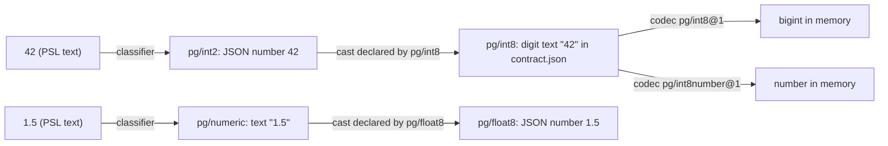

# ADR 254 — Data types and casts

Status: **Accepted**

Built: data types with their casts, a codec naming the type it represents, the PSL entries that read and write a type's values, and strict assembly across packs. Lowering entries are gone: every authoring entry names a data type, and `sql` is the tag of `sql/expression`. Each SQL data type declares its DDL names, its parameters with their bounds, and how its parameterised name is written; the planners and the runtime's parameter casts write a column's type from it, and a codec's parameter schema is its data type's. A type that is never a column's type, such as `sql/expression`, declares no names. The contract stores each column's data type in `dataType`, and SQLite declares the types it stores. Not built yet: recognising a reported database type through the declared names (introspection, `db verify` and `contract infer`), and function parameters typed by a data type. The "Printing" section and the function calls under "Three kinds of expression" describe those parts.

Amended 2026-10-07, not built yet: a data type owns its values, and a codec only converts them. A value passes from one to the other as a `DataTypeValue` that only its type constructs. Data types gain `fromContract` and `toContract`. The codec's four methods become `fromDataTypeValue`, `toDataTypeValue`, `fromWire` and `toWire`. Date, time, interval and bytes types have tags, and no type casts from the text type by parsing it. SQLite declares `sqlite/datetime` and `sqlite/json`, each stored as `text`. Schema verification and DDL read and write a default's value through the column's codec. `toCanonicalForm` and `canonicalFormOf` are deleted. The sections "Data types", "Date and time types", "Codecs", "How PSL writes a value", "Reading and writing a stored value" and "Assembly" describe the amended design.

## Decision

A **data type** is the type of a value Prisma stores or passes to the database. Most are database types made first-class: `pg/int8`, `pg/jsonb`, `pg/numeric`, `sqlite/integer`, `postgis/geometry`. Each target and extension registers its own. A data type owns what was always its own: its name in DDL, its parameters, the rendering of its parameterised name, its **values**, and its **casts**, which say which other types' values it takes and how. A **codec** is one runtime representation of a data type: it converts the type's values to and from the value an application holds, and that value to and from the wire. A codec defines no value of its own. Every value written in PSL has a data type, every column has one, and a written value is admitted when its type is the column's or the column's type casts from it.

```prisma
model Account {
  id      Int     @id
  balance BigInt  @default(42)
  ratio   Float   @default(1.5)
  meta    Jsonb   @default(json`{ "plan": "free" }`)
}
```

On Postgres, the written `42` is a value of `pg/int2`, the narrowest Postgres integer type that holds it, and its form is a JSON number. The `balance` column's type is `pg/int8`, which stores digit text; `pg/int8` declares a cast from `pg/int2`, and the cast turns `42` into `"42"`. The written `1.5` is `pg/numeric`, stored as decimal text; `pg/float8` declares a cast from `pg/numeric` that turns the text into a number. The `json` tag returns a value of `pg/json`; `pg/jsonb` declares a cast from `pg/json` that returns the document unchanged, because jsonb takes what json takes.


```mermaid
flowchart LR
  A["42 (PSL text)"] -->|classifier| B["pg/int2: JSON number 42"]
  B -->|cast declared by pg/int8| C["pg/int8: digit text &quot;42&quot; in contract.json"]
  C -->|codec pg/int8@1| D["bigint in memory"]
  C -->|codec pg/int8number@1| E["number in memory"]
  F["1.5 (PSL text)"] -->|classifier| G["pg/numeric: text &quot;1.5&quot;"]
  G -->|cast declared by pg/float8| H["pg/float8: JSON number 1.5"]
```

`pg/int4` declares no cast from `pg/int8`, so `100000000000000099` on an `Int` column is refused before anything is decoded, with a message that says what to write instead.

## Why

Three problems share one cause: a written value had no type of its own, and the database type had no home of its own.

- A written number was read through a JavaScript number, so `100000000000000099` on a `BigInt` column silently became `100000000000000100`, and `1.50` on a `Decimal` column lost its trailing zero.
- A JSON default could only be written as a quoted string, `Jsonb @default("{}")`, which is a string and not a document, and `contract infer` could not print one back.
- The `8` in `@default(8)` and the `8` in a database function's argument, such as a `sql` default calling `gen_random_bytes(8)`, were checked by unrelated code, though they are the same thing: a written value handed to something that expects a particular type. (The `8` in `nanoid(8)` is not: it sizes a generator that runs in the client, so it is grammar, typed by shape; [ADR 231](ADR%20231%20-%20Declarative%20attribute%20specifications.md) draws the line.)
- The facts about a database type, its DDL name, its parameters, how `numeric(10,2)` is rendered, were spread across codec descriptors and rendering hooks, because a codec stood in for the type it represents. Two codecs of the same database type, `pg/int8@1` and `pg/int8number@1`, could not say so, and stored the same value in two different contract forms.

Giving written values and columns data types, and letting each type declare what it casts from, answers all of these with one entity.

## Data types

A data type is registered by the target or extension that owns the database type. A SQL data type is declared with `sqlDataType` from `@internal/sql-contract/data-type`; these are two of the Postgres target's:

```ts
import { sqlDataType } from '@internal/sql-contract/data-type';
import { type as arktype } from 'arktype';

export const pgInt8 = sqlDataType('pg/int8', {
  texts: [
    { text: 'int8', written: true },
    { text: 'bigint', catalog: true },
  ],
  casts: { [pgInt2.id]: asNumeralText, [pgInt4.id]: asNumeralText },
});

export const pgNumericParams = arktype({
  'precision?': 'number.integer >= 1 & number.integer <= 1000',
  'scale?': 'number.integer >= -1000 & number.integer <= 1000',
}).narrow(
  (params, ctx) =>
    params.scale === undefined ||
    params.precision !== undefined ||
    ctx.reject({ path: ['scale'], message: 'scale requires a precision' }),
);

export const pgNumeric = sqlDataType('pg/numeric', {
  params: pgNumericParams,
  texts: [
    { text: 'numeric', written: true, catalog: true },
    { text: 'numeric({precision})', written: true },
    { text: 'numeric({precision},{scale})', written: true, catalog: true },
    { text: 'decimal' },
    { text: 'decimal({precision})' },
    { text: 'decimal({precision},{scale})' },
  ],
  normalize: (params) =>
    params.precision !== undefined && params.scale === undefined ? { ...params, scale: 0 } : params,
  casts: { [pgInt2.id]: asNumeralText, [pgInt4.id]: asNumeralText, [pgInt8.id]: unchanged },
});
```

- **Id.** `owner/name`, with no version: `pg/int8`, `sqlite/integer`, `postgis/geometry`. A type's identity does not change; what changes over time is a representation of it, which is a codec, and codecs are versioned (`pg/int8@1`). The two forms differ visibly so that one string never names both.
- **Texts.** Every name the database has for the type, in lower case, with `{name}` standing for the parameter `name`. A text marked `written` is the one a migration writes; a text marked `catalog` is the one the database catalog prints; a text with neither mark is another name the database accepts, such as `decimal`. Among texts with the same placeholders at most one is written and at most one is catalog. `display` gives the exact characters when they differ in letter case only: PostGIS writes `geometry(Geometry,{srid})`. `json` and `jsonb` are two database types and therefore two data types. A type the catalog reports by kind rather than by text, a Postgres enum, declares `claimsKind: 'enum'` with `render` and `fromReported` in place of texts.
- **Parameters.** `params` is an arktype object schema, and it is the only place a parameter's bound is written: a codec's `paramsSchema` is its data type's `params`, extended by any keys of the codec's own. `normalize` gives the normal form, so `numeric(10)` and `numeric(10,0)` have equal parameters. Parameters do not make a new type; `numeric(10,2)` holds values of `pg/numeric` under a constraint.
- **Writing a name.** `renderSqlTypeName(type, params)` picks the written text whose placeholders are exactly the given parameters and fills them in: `numeric(10,2)`, `vector(1536)`, `timestamptz(3)`. A parameter outside its bound, or a set of parameters no written text takes, is `CONTRACT.TYPE_PARAMS_INVALID`. `sqlBaseName(type, params)` is the name without parameters, which the runtime's parameter casts use (`$1::numeric`), because a cast to `varchar(n)` truncates and to `numeric(p,s)` rounds.
- **Values.** A value of the type is a `DataTypeValue`, `{ type, params, value }`, where `value` is the one JSON form `contract.json` stores for it. `pg/int8` stores digit text, `pg/int4` a JSON number, `pg/jsonb` the document, `pg/timestamptz` ISO text in UTC, `pg/bytea` base64, `pgvector/vector` an array of numbers. Only the type constructs one, through `fromContract(json, params)`, which refuses JSON the type does not store in that form, and a value the parameters exclude: `numeric(10,2)` refuses `"1.234"` and `vector(3)` refuses four numbers. `toContract(value)` returns the JSON to store. Two values are equal when their types are equal and their JSON is equal as canonical JSON. Nothing else reads or normalises a stored form: a tag's `parse` reads PSL text into a value, a cast turns a value of one type into a value of another, and a codec converts a value to and from what the application holds (see Codecs). A parameter a codec keeps for itself, such as the schema of `arktype/json@1`, is not the type's, and the codec checks it.
- **Stored as.** The database type a value is stored in, with the same parameters. A type is stored as itself unless it says otherwise. `sqlite/datetime` and `sqlite/json` are stored as `sqlite/text`, because SQLite keeps both as text. A type stored as another declares no texts of its own: its DDL name is its storage type's, so no two types claim one reported text. `db verify` compares the type a column is stored as with the type the database reports, so it never has to recover the data type from the catalog, which on SQLite cannot record it.
- **Casts.** For each other type whose values this type takes, a pure function from a value of that type to a value of this one. A cast may convert (`pg/int2` to `pg/int8` turns a number into digit text; `pg/numeric` to `pg/float8` turns decimal text into a number and keeps the words `NaN`, `Infinity`, `-Infinity` as the text the floating-point types store) or may return the value unchanged (`pg/json` to `pg/jsonb`); either way the declaration is the point: this type takes those values. A cast may also refuse: the cast into the floating-point types refuses a magnitude no double holds rather than rounding it to `Infinity`, because the database refuses it too and storing `Infinity` would make a written number indistinguishable from a written `Infinity`. A cast never parses text into a value of another kind. A date, a time, an interval, bytes and a JSON document each have their own grammar, so each is written with its type's tag, and a quoted string on such a column is refused with a message that shows the tag. Types whose values are text, such as `pg/varchar`, `pg/char`, `pg/inet` and `pg/uuid`, keep their casts from the text type.

Casts are declared by the type that receives, never by the source, so there is at most one cast for any pair and the owner of a type is the only one who decides what it takes. That ownership rule is the one PostgreSQL uses for its own cast table, and the rule is all we borrow: these casts are between our data types, applied in the framework before a value is stored or sent, and they model nothing about what the database can convert. Nothing central computes convertibility, because only a type's owner knows what its database or extension can take.

There is no list data type. A list literal is several values, each cast on its own; a list column is a column of one type with `many` set, checked element by element. A type whose single value holds several elements, such as a vector, declares a cast whose source is a list of other types, and each element is checked against that set.

A column's data type is the type of the values it holds, and the database stores them as the type it is stored as; in SQL it is a `SqlDataType`, and `sql/expression` is the one data type no column has. Codecs that hold the same values represent one data type, however they present them in memory. SQLite stores text, integers, reals and blobs, so its target declares `sqlite/text`, `sqlite/integer`, `sqlite/real` and `sqlite/blob`, and the two types a column may be declared with, `sqlite/character` and `sqlite/character-varying`. It also declares `sqlite/datetime` and `sqlite/json`, which SQLite stores as text but whose values are an instant and a document: their tags read them, their values have their own form, and `sqlite/text` casts from neither. `sqlite/datetime@1` represents `sqlite/datetime` and `sqlite/json@1` represents `sqlite/json`. `sqlite/bigint@1`, `sqlite/bigintnumber@1` and `sql/int@1` represent `sqlite/integer`: SQLite enforces no narrower integer range, so whether an application holds a `bigint` or a `number` is a codec's business, not a type's.

No database type spans targets. The SQL family exports implementations targets share, such as the digit classifier and the JSON parse and print, and each target declares its own types with them. A family registers only a data type that is the same on every target and that nothing casts from. `sql/expression` is the only one: a SQL expression in the target database's language, whose stored value is its text. The SQL family registers it and its authoring entry itself, so no target has to remember to. It has no codec and no DDL name, no column has it, it declares no casts, and no type casts from it. The SQL family refuses a stack in which a type casts from it, with `CONTRACT.DATA_TYPE_CASTS_FROM_SQL_EXPRESSION`.

### Date and time types

A date or time value has its own grammar, so each date and time type has a tag, named after the type and unprefixed because the target owns the type: `date`, `time`, `timetz`, `timestamp`, `timestamptz` and `interval` on Postgres, `datetime` on SQLite. The tag's `parse` reads the body into the type's value and refuses text the type does not hold. `` timestamptz`2024-01-01T00:00:00Z` ``, `` timestamptz`2024-01-01T00:00:00.000Z` `` and `` timestamptz`2024-01-01T01:00:00+01:00` `` are one instant, stored once as `2024-01-01T00:00:00Z`. A quoted string on a date or time column is refused: `pg/timestamptz` declares no cast from `pg/text`, and the message shows the tag to write.

| Data type | Stored value | Earliest | Latest |
|---|---|---|---|
| `pg/timestamptz` | the instant in UTC: `2024-01-01T00:00:00Z` | `-004713-11-24T00:00:00Z` | `+275760-09-13T00:00:00Z` |
| `sqlite/datetime` | the instant in UTC, always with three fraction digits: `2024-01-01T00:00:00.000Z` | `-271821-04-20T00:00:00.000Z` | `+275760-09-13T00:00:00.000Z` |
| `pg/timestamp` | `2024-01-01T12:34:56` | `-004713-11-24T00:00:00` | `+275760-09-13T23:59:59.999999` |
| `pg/date` | `2024-01-01` | `-004713-11-24` | `+275760-09-13` |
| `pg/time` | `12:34:56` | | |
| `pg/timetz` | the time and its offset, `12:34:56+02:00`; `Z` for a zero offset | | |
| `pg/interval` | an ISO 8601 duration: `P1Y2M3DT4H5M6.5S` | | |

- Seconds are always written. On the Postgres types a fraction of a second has no trailing zeros and at most six digits, because the Postgres types hold microseconds. On `sqlite/datetime` the fraction is always three digits, because that is the text `toISOString()` writes for every row, and SQLite compares the text byte by byte: a default and a row the application wrote for the same instant are then one text.
- A year from 0000 to 9999 has four digits. Any other year is a sign and six digits: `-000043-03-15`, `+012026-01-02`. Years count as ISO 8601 counts them, with year 0000 as 1 BC.
- An offset is `+HH:MM`, or `+HH:MM:SS` when it has seconds. `pg/timetz` holds offsets up to 15:59 either way.
- `infinity` and `-infinity` are values of `pg/date`, `pg/timestamp` and `pg/timestamptz`.
- An interval balances months into years and minutes and seconds into hours, and keeps days as days: `P14MT90M` is `P1Y2MT1H30M`. It leaves out a part that is zero, and a zero interval is `PT0S`. Years, months and days each carry their own sign; hours, minutes and seconds carry the sign of the time as a whole: `-1 days -04:05:00` is `P-1DT-4H-5M`.

The earliest value of each Postgres type is the earliest PostgreSQL holds, 4714-11-24 BC. It is year `-004713` because PostgreSQL has no year 0: its 1 BC is ISO year 0000. The latest value of every type, and the earliest of `sqlite/datetime`, is the limit of the `Temporal` and `Date` values its codecs produce. A type refuses a value outside its range rather than storing one that some codec of the type cannot read.

Each tag reads ISO 8601 with a four-digit or signed six-digit year and a `T` or a space between date and time. A Postgres tag also reads the text PostgreSQL prints: a ` BC` suffix, a year of five or six digits, `infinity` and `-infinity`, and for `interval` the text PostgreSQL prints under `IntervalStyle = postgres`. `parse` uses no `Temporal` and no JavaScript `Date`, so a default reads the same on every runtime. It refuses an offset on a type that holds none, a missing offset on a type that needs one, a date on a time type, a time on `pg/date`, more fraction digits than the type holds, a date or time that does not exist, and a value outside the type's range. Each refusal names what is wrong and shows text the type takes.

A codec of one of these types converts the type's value to and from its own runtime value (`Temporal.Instant`, `Date`, or text) and that runtime value to and from PostgreSQL's or SQLite's text on the wire. A codec whose runtime value cannot hold a value of the type refuses it in `fromDataTypeValue`: the `Temporal` and `Date` codecs refuse `infinity`, which only the text codecs hold, and a codec whose value holds nanoseconds refuses digits below one microsecond. PostgreSQL reads no signed year, so the Postgres codecs' `toWire` writes a year after 9999 without its sign and leading zeros (`10000-01-01`) and a year at or before 0000 with a ` BC` suffix (`0044-03-15 BC`), and their `fromWire` reads both. The Postgres target has one pair of functions that reads and writes PostgreSQL's year text, and the codecs and its tags use it.

## Codecs

A codec converts a value of one data type to and from the value an application holds, and that runtime value to and from the wire. It defines no value of its own and never reads `contract.json`. Its descriptor names the type and nothing about the database type itself:

```ts
export class PgInt8NumberDescriptor extends PostgresCodecDescriptor<void> {
  override readonly dataType = pgInt8.id;
  override readonly codecId = PG_INT8_NUMBER_CODEC_ID;
  // traits, the JSON projection and the factory follow
}
```

A codec has four methods:

| Method | From | To | When it runs |
| --- | --- | --- | --- |
| `fromDataTypeValue` | `DataTypeValue` | runtime value | building a contract, planning, verifying; synchronous |
| `toDataTypeValue` | runtime value | `DataTypeValue` | the same; synchronous |
| `fromWire` | wire value | runtime value | reading a row or a reported default; asynchronous |
| `toWire` | runtime value | wire value | writing a parameter or a DDL default; asynchronous |

`fromWire` and `toWire` are the former `decode` and `encode`, and keep their call context ([ADR 207](ADR%20207%20-%20Codec%20call%20context%20per-query%20AbortSignal%20and%20column%20metadata.md)) and their asynchrony ([ADR 204](ADR%20204%20-%20Single-Path%20Async%20Codec%20Runtime.md)). `fromDataTypeValue` and `toDataTypeValue` replace `decodeJson` and `encodeJson`. `toDataTypeValue` constructs its result through the type, so a codec cannot hand over a value the type would not store. The wire value is what the driver exchanges with the database, which is not always text: a Postgres `bytea` codec writes a `Uint8Array`, a SQLite integer codec reads a number, and a Mongo codec writes a BSON value. A codec has no method for PSL and never sees PSL text.

Several codecs may represent one type, and they differ only in their runtime value. `pg/int8@1` and `pg/int8number@1` both represent `pg/int8`, holding a `bigint` and a `number`; `pg/timestamptz@1`, `pg/timestamptz-temporal@1` and `pg/timestamptz-string@1` all represent `pg/timestamptz`, holding a `Date`, a `Temporal.Instant` and text. All of them read and write one stored value, so an application that moves from `Date` to `Temporal` keeps its contract. A codec refuses in `fromDataTypeValue` a value its runtime value cannot hold exactly: `pg/int8number@1` refuses digit text past 2^53, and the `Temporal` codecs refuse `infinity`. A limit of the stored representation that one target has is that target's codec's to refuse, where it adapts a family codec: SQLite cannot store `NaN`, so `sqlite/real@1`, and `sql/float@1` as SQLite adapts it, refuse it in `toWire` and in both value methods. The SQLite driver refuses a `NaN` parameter no codec encoded, such as one in raw SQL.

Every limit of the type itself belongs to the type. `pg/int4` refuses an integer outside its range whichever codec represents it, `pg/char` with no length refuses text longer than one character, because a bare `character` is `character(1)`, and `numeric(10,2)` refuses a third decimal place. A codec checks only the parameters it keeps for itself, such as the schema of `arktype/json@1`, which it applies to the document in `fromDataTypeValue` and `fromWire`.

The codec conformance test kits assert, for every codec and every case, that `toDataTypeValue(fromDataTypeValue(v))` equals `v`, and that `toDataTypeValue(fromWire(toWire(fromDataTypeValue(v))))` equals `v` against a real database.

### Values the database returns as JSON

An `include` or an aggregated child row set comes back from the database as JSON. Each column enters that JSON through its codec's JSON projection ([codec authoring guide](../../reference/codec-authoring-guide.md#the-canonical-json-guarantee)), and the runtime reads it with `fromWire`, not with `fromDataTypeValue`. A projection's job is to put into the JSON a value `fromWire` reads exactly: on Postgres, the text PostgreSQL prints for the column (`CAST(x AS text)`), which is what the driver hands `fromWire` for an ordinary row; for a type whose JSON value is already what `fromWire` reads, such as `jsonb` or a vector of numbers, the projection is the identity. So the runtime has one way to read what the database returns, and the contract's form never has to match the database's spelling. Reading an `include` is then asynchronous, as reading a row already is.

## Columns and type constructors

A column stores the codec that represents its value, the data type that codec represents, and the type's parameters. `contract.json` stores no type name:

```json
"createdAt": {
  "codecId": "pg/timestamp-temporal@1",
  "dataType": "pg/timestamp",
  "nullable": false,
  "typeParams": { "precision": 3 }
}
```

The column's DDL name is rendered from `dataType` and the parameters the data type declares (`timestamp(3)`); keys a codec keeps for itself, such as `arktype/json@1`'s `expression`, never reach the name. A `storage.types` entry stores the same three fields under `kind: "codec-instance"`, and a column that names it with `typeRef` is written as a column of that entry's type and parameters. A Postgres enum column stores `dataType: "pg/enum"` with the enum's name in `typeParams.typeName`. A value-object column uses the codec of the type constructor the adapter names in `valueObjectStorageType`: `Jsonb` (`pg/jsonb@1`) on Postgres, `Json` (`sqlite/json@1`, data type `sqlite/json`) on SQLite.

The contract stores `dataType`, although the stack can derive it from the codec, for two reasons. The storage hash then covers the type the database stores, so moving a codec to another data type changes the hash of every contract that uses it. And code that has no stack can read the type: the contract validator, which checks that the columns of a many-to-many join table have the same type as the columns they join, and `ContractView` ([ADR 233](ADR%20233%20-%20ContractView%20is%20a%20typed%20by-name%20accessor%20over%20a%20contract.md)).

`dataType` is written by the contract build from the codec, never by the author. When the CLI loads a contract, the SQL family's `deserializeContract` checks every column and `storage.types` entry against the stack: a codec the stack knows must represent the stored `dataType` (`<path>: codec pg/int4@1 represents pg/int4, not pg/text`), and a value-object column must use the codec of the stack's `valueObjectStorageType`. The runtime does not run these two checks. A contract that still stores `nativeType` is refused with `CONTRACT.VALIDATION_FAILED` by the CLI and the runtime alike; the upgrade script rewrites it.

A **type constructor** is how PSL names a column's type: `Int`, `Numeric(10, 2)`, `pgvector.Vector(1536)`, `pg.enum(Status)`. It names the codec that represents the column's type and maps its arguments onto parameters; the data type follows from the codec. `BigInt` is `pg/int8` with `pg/int8@1`; a number-valued variant is the same type with `pg/int8number@1`. A `types { X = ... }` alias is a type constructor call given a name.

## How PSL writes a value

The component that registers a data type contributes PSL support for it, keyed by the type's id, in its authoring contribution:

```ts
authoring: {
  dataTypes: {
    [pgJson.id]: {
      // `parse` turns the literal's text into a value of the type and refuses what it cannot read.
      written: { kind: 'tag', tag: 'json', parse: parseJsonText },
      print: printJsonText,
      documentation: 'Reads the text as a JSON document and stores it as the default value.',
    },
    [pgText.id]: {
      written: { kind: 'plain', syntax: 'string', parse: (text) => text },
      print: (value) => String(value),
      documentation: 'Text.',
    },
    [pgBool.id]: {
      written: { kind: 'plain', syntax: 'boolean', parse: readBoolean },
      print: (value) => String(value),
      documentation: 'A boolean, written true or false.',
    },
    [pgNumeric.id]: {
      written: {
        kind: 'plain',
        syntax: 'number',
        types: [pgInt2.id, pgInt4.id, pgInt8.id, pgNumeric.id],
        classify: classifyPostgresNumber,
      },
      print: printNumber,
      documentation: 'A number, whose type comes from its own size and precision.',
    },
  },
}
```

There are two ways a value is written.

**With a tag.** A tag is a qualified name followed by a string in any of PSL's quote styles. The body written between the quotes is canonicalised into the text, as [ADR 129](ADR%20129%20-%20Template-Tagged%20Literals%20for%20Extensions.md) describes. The entry's `parse` turns the text into a value of the type and `print` does the reverse. A tag is for a value whose text has its own grammar: a JSON document, a date or time, an interval, bytes, a geometry. A tag is unprefixed when the owner of its data type is the family or a target; every other owner prefixes its tags with its own namespace. So `json` is unprefixed because each SQL target registers it for the type it stores JSON documents in, `sql` is unprefixed because the SQL family owns `sql/expression`, and `postgis.geometry` is prefixed because the postgis extension owns its type. The Postgres target registers `json`, the date and time tags listed under "Date and time types", and `bytea`, whose body is the hex text PostgreSQL prints for bytes, `` bytea`\x68656c6c6f` ``; the value it stores is base64. The SQLite target registers `json` and `datetime`.

**Plainly.** Three pieces of syntax the interpreter reads without a tag: a quoted string, `true`/`false`, and a number. Each target says which of its types they are. A number is the one plain kind that yields several types, so the target's number entry carries a **classifier** that picks the type from the digits and returns a value of that type, in place of `parse`. Beside the classifier the entry lists `types`, every data type the classifier can return; that list is how assembly knows those types can be written, even though each is keyed under no entry of its own. The Postgres target's rule is its own, not PostgreSQL's: a whole number takes the narrowest of `pg/int2`, `pg/int4`, `pg/int8` that holds it; anything else — a larger whole number, a number with a fraction, or `NaN`, `Infinity`, `-Infinity` — is `pg/numeric`. It diverges from PostgreSQL, which types a whole integer literal as `integer` and never as `smallint`. Starting narrower costs nothing here, because a column takes the value only through a cast its type declares, and every wider integer type casts from `pg/int2`. SQLite's rule: a whole number of up to 64 bits is `sqlite/integer`, stored as digit text; a number with a fraction is `sqlite/real`, stored as a JSON number; anything else — a whole number past 64 bits, or one of the three words — has no SQLite type and is refused. `sqlite/real` casts from `sqlite/integer`, so a `Float` column takes `42`. Digit text has no leading zeros and no negative zero, and keeps trailing zeros: `007` is `7`, `-007.50` is `-7.50`. A type may be writable both ways; a target that registered an `int2` tag would make `` int2`8` `` and `8` the same value.

SQLite's `json` tag yields a value of `sqlite/json`, keyed under that type's id like every other entry. The value is the document's JSON text with sorted keys and no added whitespace, so a document whose keys are written in another order is the same value. A `Json` column given a quoted string is refused, because `sqlite/json` declares no cast from `sqlite/text`, and a `String` column given a `json` literal is refused, because `sqlite/text` declares no cast from `sqlite/json`.

Every tag names a data type. `sql` names `sql/expression`: its `parse` returns the text unchanged, because nothing in the framework reads SQL. Because `sql/expression` declares no casts and no type casts from it, a `sql` literal is admitted only where the receiving position is of that type, and no other literal is admitted there. `@default` is the one position that takes it beside the column's own type: it stores the text in the contract's expression form on any column.

The language server takes tag completion and documentation from the same entries, and at a value position it offers only the tags whose type the receiving type is or casts from, so a date column offers its date tag and not `json`. `contract infer` takes the same entries, and so does the reader for the earlier Prisma schema language, which maps its own syntax onto the same plain kinds and, where the earlier language writes a JSON document, a date or bytes as a quoted string, onto a value of that type: a document through the `json` tag's `parse`, a date through its date tag's `parse` after the reader applies Prisma 7's meaning (a `DateTime` on a `date` column keeps only the date), and bytes, which Prisma 7 writes in base64, as the stored value itself. A Prisma 7 `DateTime @default("…")` therefore needs no edit, and stores the value a Prisma 8 schema stores for the same default.

## Three kinds of expression

PSL has three kinds of expression, and each has one rule.

- **A literal** is written plainly or with a tag. The interpreter finds the entry, calls `parse`, and has a value of a known type. The receiving type must be that type or cast from it: for a column, the column's type; for a function argument, the parameter's declared type; inside a list, per element. No cast is `PSL_VALUE_TYPE_INCOMPATIBLE`: `Field "Account.count": Expected a number that pg/int4 can hold; got pg/int8`. Text the entry cannot parse, the text of a `json` literal included, is `PSL_INVALID_LITERAL`; a tag nobody registered is `PSL_UNKNOWN_LITERAL_TAG`. Two codes are about defaults only: a single value on a list column is `PSL_DEFAULT_LIST_EXPECTED`, and a value the column's type or codec refuses for the column's parameters is `PSL_INVALID_DEFAULT_LITERAL`. `@default` reports `PSL_UNKNOWN_LITERAL_TAG`, `PSL_VALUE_TYPE_INCOMPATIBLE` and `PSL_INVALID_LITERAL` at the written value, or at the element of a written list they are about, as every other value position does; it reports its two default-only codes at the `@default` attribute.
- **A reference** is an identifier. It resolves through the symbol table to a declaration, and its value is that declaration's, of the declaration's type. An enum member resolves to the member declared in its `enum` block, and the only check is scope: the member must belong to this column's enum. No parsing and no cast.
- **A call** names a registered function. Each argument is an expression delivered to a parameter. A parameter whose value the database receives names a data type, so its argument is admitted by the same rule as a default; a parameter of a client-side generator, such as `nanoid`'s size, is grammar and keeps its shape check ([ADR 231](ADR%20231%20-%20Declarative%20attribute%20specifications.md)). The call produces what the function registry defines, a storage default or a client-side generator.

A value position with a fixed receiving type is typed through the attribute specification with one combinator that names that data type, `dataTypeValue` ([ADR 231](ADR%20231%20-%20Declarative%20attribute%20specifications.md)); the syntax that is not a value (field references, entity references, identifiers, lists, records, calls) keeps its own combinators. The combinator runs the cast rule for one written value, which the framework holds as `readWrittenValue` and `castTypedValue`, and words a refusal with the framework's `describeRefusal`. `@default` casts in lowering instead, because its receiving type comes from the column, and words its refusals with the same function, adding only the field it is about. The framework holds the scalar cast rule. A data type declares its list cast on the framework's `DataType`; reading a written list through it is the job of the family's default reader. Typed function arguments and editor completion for these positions arrive with the projects that first use them.

Reading a default is then:

1. The parser yields a literal, a reference, or a call, with source spans.
2. A reference resolves; a call dispatches. A literal is parsed to a value of a known type, and a value of `sql/expression` is stored as the column's default expression.
3. If the value's type is not the column's, the column's type is looked up for a cast from it. None is a diagnostic at the value.
4. The value, cast or not, is checked against the column's parameters by the column's type, then handed to the column's codec, whose `fromDataTypeValue` refuses a value its runtime value cannot hold or a parameter of its own excludes. A refusal is a diagnostic at the value with the type's or the codec's message. An enum member is checked against the column's enum declaration.
5. The value's `toContract` is stored. The contract's two default forms, a value and an expression, are unchanged.

The TypeScript builder is not a text surface: `.default(value)` hands the codec a runtime value that TypeScript has typed, and `toDataTypeValue` gives the value the contract stores. A PSL schema and a TypeScript contract that write the same default therefore store the same value, whichever codec the column uses.

## Reading and writing a stored value

Every consumer of a stored default reads it through the column's data type and codec, and no consumer normalises text of its own.

- **Loading a contract.** When the CLI loads a contract, the SQL family's `deserializeContract` reads every literal default through its column's type, `fromContract`, and refuses a contract that stores a value the type does not hold, with `CONTRACT.VALIDATION_FAILED` naming the column. Nothing downstream meets such a value, so the planner and `db verify` have no refusal of their own for it.
- **Writing a default into DDL.** The planner hands the column's value to its codec: `fromDataTypeValue`, then `toWire`, and the adapter writes the wire value as a SQL literal of the column's type. This is the text the codec writes for every row, so on SQLite a default and a row written for the same instant are one text, and on Postgres a year before 1 is written with ` BC`. The step is asynchronous, so it runs where DDL is lowered, which is already asynchronous; the planner keeps no default text of its own and no branch on a codec or data type id.
- **Reading a default the database reports.** Postgres reports a default as a literal with a cast, `'2024-01-01 00:00:00+00'::timestamp with time zone`, and SQLite as the literal its `DEFAULT` clause holds. The target takes the literal's body out of that text, which is the value its driver would hand `fromWire` for a row of the column, and introspection reads it with the column's codec: `fromWire`, then `toDataTypeValue`. Introspection is asynchronous and receives the contract, so this runs there, and the schema tree it builds holds the value ([ADR 235](ADR%20235%20-%20The%20schema%20differ%20walks%20two%20derived%20schema%20IRs.md): each derivation populates its nodes in their compared form). A default the database holds as an expression, such as `now()`, stays an expression and is compared as expression text, as before. A default the codec cannot read, such as a value written outside Prisma that its runtime value cannot hold, is reported as a difference that names the column and the codec's message.
- **Comparing defaults.** `db verify` and the planner compare two values of a column's type for equality. Without a database in reach, both sides come from contracts and the comparison needs no codec.
- **Inferring a contract.** `contract infer` has no contract, so it reads a reported default with the codec of the type constructor marked `inferred` for the reported type, and prints the value with its type's entry: a tag for a tagged type, plainly for a number, text or boolean.

## Assembly

The control stack assembles every pack's data types, codec descriptors, type constructors and authoring entries into one stack and checks them against each other. It fails with a structured error, naming the contributor and the dangling id, when:

1. a codec or a type constructor names a data type that is not registered;
2. an authoring entry, a type in a number entry's `types`, or a source in some type's casts, names a data type that is not registered;
3. two entries claim one tag, or one plain kind; and, for the same reason, two components register one type id, or two entries sit under one key;
4. a type that appears as a source in some cast cannot be written, because a cast from a type nobody can write can never be exercised. A type can be written when it has an authoring entry of its own or when a number entry's `types` names it;
5. a type is stored as a data type that is not registered.

Assembly also refuses declarations that no user input can produce, as an `InternalError` naming the contributor and the id, because each is a bug in a pack:

6. a type constructor or field preset names a codec that no component registers;
7. a type constructor maps an argument onto a parameter that neither its codec's data type nor the codec declares;
8. two type constructors of one data type are both marked `inferred`.

The reverse of item 4 is not required: a type may be reachable only through casts. Assembly is the right level for these checks because they span packs: `pgvector/vector` casting from `pg/numeric` is valid only when the Postgres target that owns `pg/numeric` is in the stack. Within a pack, references are by constant rather than by string, so a misspelt id fails to compile and an unregistered one fails assembly.

A family may add checks for its own data types. The SQL family runs three when it creates its control instance, not during assembly, so the CLI reports them and the language server does not. Like the assembly checks, each names the contributor:

9. two SQL data types would both recognise one reported type: their claiming texts collide, or they claim the same kind. Two texts collide when either text's pattern matches the other with each placeholder replaced by `1`. This is an `InternalError`;
10. a type casts from `sql/expression` (`CONTRACT.DATA_TYPE_CASTS_FROM_SQL_EXPRESSION`);
11. a codec represents a data type that is not a `SqlDataType`, because a codec represents a column's type and `sql/expression` is the one data type no column has. This is an `InternalError`.

## Printing

`contract infer` inverts the mapping. For an introspected column it matches the reported type name against the registered types' DDL names and aliases. A stored value is printed with the entry of its own type when the type has one: a date with its date tag, bytes with `bytea`, a document with `json`. A value of a type with no entry of its own is classified with the same rules a written value uses: digit text or a number through the target's classifier, text as the text type, a boolean, an array element by element; the printer confirms the column's type is that type or casts from it. Either way it prints with the entry's `print` and runs the text back through parse and cast to prove it returns the stored value. Anything that fails takes the raw-expression fallback, so infer never prints a schema that emit cannot read.

## Extending the set of types

A pack that owns a database type registers it once: the data type with its DDL name, parameters, rendering and casts; the codecs that represent it; the type constructor that names it in PSL; and, if values of it are written in PSL, the authoring entry with the tag, `parse`, `print` and documentation. For a SQL target's types, the target and its adapter are the owner together. The target registers the data types and the authoring entries, contributes the type constructors that are also TypeScript `type.*` helpers (`BigIntNumber`, `UnboundedInt`, `pg.enum`), and defines its PSL-only constructors. The adapter registers the codecs and contributes the PSL-only constructors, so that they do not become `type.*` helpers of the TypeScript builder ([ADR 241](ADR%20241%20-%20Scalar%20types%20use%20the%20authoring%20type-constructor%20channel.md)). Nothing in the interpreter, the planner, the printer, the language server or the readers changes. A geometry type with a WKT tag is the model case:

```prisma
model Place {
  id       Int      @id
  location Geometry @default(postgis.geometry`POINT(1 2)`)
}
```

## Consequences

- A written value is never rounded before its receiving type sees it, and a value the receiving type cannot hold is refused rather than rounded into one it can.
- A JSON default is a document, written and printed as one.
- Defaults and function arguments are admitted by one rule.
- The facts about a database type live in one declaration. Codecs of one type share its contract form; where they did not, contracts change form once and are re-emitted.
- Each value has one owner. The data type defines it, reads it from PSL and stores it; a codec converts it; nothing else normalises it. A SQLite datetime default is one text in the contract, in its `DEFAULT` clause and in every row.
- A date, time, interval or bytes default is written with its tag. A Prisma 8 schema that wrote one as a quoted string stops compiling, with a message that shows the tag; a Prisma 7 schema is read unchanged.
- Codecs from outside the repository cannot store a value differently from the built-in codecs of their type, because only the type constructs a value.
- The SQLite contract form of datetime and JSON defaults changes, and the columns' data types change from `sqlite/text`, so SQLite contracts are re-emitted and their databases re-signed.
- A column's DDL name is derived from its data type and parameters rather than stored; the contract stores the data type instead of a copy of its name.
- Registering a codec or a type constructor without a data type, or a data type that values can be cast from without PSL support for it, is an assembly error, not a runtime surprise.

## Alternatives considered

- **Codec methods that receive PSL text** (`encodePsl`/`decodePsl`, the sketch in [ADR 184](ADR%20184%20-%20Codec-owned%20value%20serialization.md)). Every codec becomes coupled to PSL's tokenizer and escaping, and there is no check before a decode fails.
- **A central rule for which types convert into which.** Databases and extensions define their own types and their own conversions; the framework cannot know them. A type's own casts are the only honest declaration.
- **Conversion inside the codec**, the codec listing what it takes and converting in `decodeJson`. Two codecs of one type repeat the same fact and the same conversion, and `decodeJson` ends up accepting shapes the codec never writes.
- **A family-level vocabulary of written types** (`sql/i8`, `sql/json`, …) that every target's types cast from. It invents types no database has, and most of its casts would return the value unchanged. `sql/expression` is not such a type: no column has it and nothing casts from it.
- **A data type as the set of values a group of codecs share**, so that `json` and `jsonb` are one type. It invents a layer between the database's types and the codecs that the database does not have, and a cast that returns the document unchanged says the same thing without it.
- **Separate `json` and `jsonb` literals.** An author would have to know a column's storage to pick a tag for the same text, and infer would print a different tag per column.
- **One `number` type converted per receiver.** Big numbers round, and every numeric receiver carries the same conversion.
- **The column decides a written number's type.** One syntax would not name one type, and a size error would surface inside a codec instead of as a missing cast.
- **A closed set of types in the framework.** An extension cannot add one, and the framework owns a vocabulary that belongs to targets.
- **A list data type.** A list is several values of one type; the shape belongs to the column or to the receiving type's cast.
- **Enum members as string values.** A member name is a reference to a declaration, resolved in scope like a field name.
- **Casts declared by the source type, or by both sides.** Two declarations for one pair, with no rule for which wins.
- **A vector type casting from the JSON type.** It matches on storage shape; a vector is several numbers.
- **The codec defines the contract form.** Several codecs represent one type, so the form would depend on the codec an application chose, and moving from `Date` to `Temporal` would change the contract.
- **A canonical-form function per type, which codecs and verify call** (`toCanonicalForm`, what this ADR first decided). It is a second definition of a value beside the tag's `parse`, and on SQLite, where a date and a document share `sqlite/text`, it had to live on the codec, which gave the value two owners and a helper to choose between them.
- **Dates as quoted strings, read through a cast from the text type.** A cast from text that parses is a parser in a cast's clothing: it exists for no other reason, and it makes every date column take any string until the cast refuses it. A tag says what the value is.
- **`sqlite/datetime` stored as its own database type, `DATETIME`.** Introspection could then tell the types apart, but every existing column would need its table rebuilt, and the same move for JSON corrupts data: a column declared `JSON` has numeric affinity and stores the document `"42"` as the integer 42.
- **Reading database-produced JSON with `fromDataTypeValue`.** The projections would have to produce the contract form in SQL, which for dates means formatting text in UTC in every query, and the runtime would read a value through a method meant for the contract. `fromWire` already reads the database's own text.
- **A data type that reads the database's text for defaults.** A data type would then parse SQL value literals, which this ADR leaves to codecs: the database's text is wire text, and the codec already reads it for every row.

## Not decided here

Whether a codec will one day convert the `sql` representation (the DDL half of ADR 184). Mongo codecs take the four method names and Mongo data types the same values, mechanically; Mongo casts and written values are not decided here, and Mongo's verification, which runs through the collection validator, does not change. Enum CHECK constraints, Mongo validator enums and discriminator values use a stored value as a database value without a codec; they are decided with enum member values.

## Related

- [ADR 184 — Codec-owned value serialization](ADR%20184%20-%20Codec-owned%20value%20serialization.md): replaced by this decision. A value and its contract form belong to the data type; a codec converts a value to and from a runtime value and the wire, and never reads `contract.json`.
- [ADR 235 — The schema differ walks two derived schema IRs](ADR%20235%20-%20The%20schema%20differ%20walks%20two%20derived%20schema%20IRs.md): introspection reads a reported default through the column's codec while it derives the database's tree.
- [ADR 129 — Tagged literals](ADR%20129%20-%20Template-Tagged%20Literals%20for%20Extensions.md): the tag syntax and the canonical text; a tag is how PSL writes a data type, and `sql` is the tag of `sql/expression`.
- [ADR 208 — Higher-order codecs for parameterized types](ADR%20208%20-%20Higher-order%20codecs%20for%20parameterized%20types.md): parameters now belong to the data type, which checks them; a codec instance checks only the parameters it keeps for itself.
- [ADR 252 — An earlier Prisma version's schema is a contract source](ADR%20252%20-%20An%20earlier%20Prisma%20version's%20schema%20is%20a%20contract%20source.md): a second text source mapped onto the same types.
