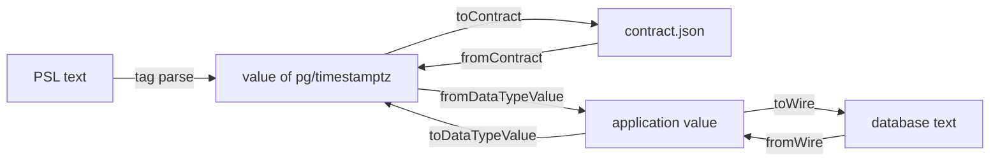

# ADR 254 — Data types and casts

Status: **Accepted**

## At a glance

A Postgres model with two defaults:

```prisma
model Event {
  id        Int      @id
  attendees BigInt   @default(42)
  startsAt  DateTime @default(timestamptz`2024-01-01T01:00:00+01:00`)
}
```

Follow the `startsAt` default from the schema to the database:

| Where | The value | Who owns this form |
| --- | --- | --- |
| PSL | `` timestamptz`2024-01-01T01:00:00+01:00` `` | the data type `pg/timestamptz`, through its tag |
| In the framework | `{ type: 'pg/timestamptz', value: '2024-01-01T00:00:00Z' }` | the data type |
| `contract.json` | `"2024-01-01T00:00:00Z"` | the data type |
| In the application | a `Temporal.Instant` with codec `pg/timestamptz-temporal@1`, a `Date` with `pg/timestamptz@1` | the column's codec |
| On the wire and in the `DEFAULT` clause | `2024-01-01 00:00:00+00` | the column's codec |


```mermaid
flowchart LR
  PSL["PSL text"] -- "tag parse" --> V["value of pg/timestamptz"]
  V -- toContract --> J["contract.json"]
  J -- fromContract --> V
  V -- fromDataTypeValue --> R["application value"]
  R -- toDataTypeValue --> V
  R -- toWire --> W["database text"]
  W -- fromWire --> R
```

The data type owns the value: it reads it from PSL, decides its one stored form, and is the only thing that constructs it. The codec converts that value into what the application holds and into what the database exchanges. Three codecs of `pg/timestamptz` give three different application values from one stored value, so choosing a codec never changes the contract.

The `attendees` default shows the other half of the decision. The written `42` is a value of `pg/int2`, the narrowest Postgres integer type that holds it. The column's type is `pg/int8`, which declares that it takes `pg/int2` values, and its cast turns the number `42` into the digit text `"42"` that `pg/int8` stores. `pg/int4` declares no cast from `pg/int8`, so `100000000000000099` on an `Int` column is refused before any codec sees it, with a message that says what to write instead.

## Decision

1. **A data type is the type of a value Prisma stores or passes to the database.** Most are database types made first-class: `pg/int8`, `pg/jsonb`, `sqlite/integer`, `postgis/geometry`. The target or extension that owns the database type registers it. A data type owns its name in DDL, its parameters, its values and its casts.
2. **A data type owns its values.** It reads them from PSL, defines the one form `contract.json` stores, and is the only thing that constructs one. Nothing else reads or normalises a stored value.
3. **A codec converts a value of one data type** to and from the value an application holds, and that value to and from the wire. Several codecs may represent one type, and they differ only in the value the application holds. A codec defines no value of its own.
4. **A written value is admitted where its type is the receiving type, or where the receiving type casts from it.** A cast is declared by the type that receives the value.

## Why

Each of these problems comes from a value that has no type of its own, or from a fact about a type that lives somewhere other than the type.

- A written number read through a JavaScript number is rounded before anything can check it: `100000000000000099` becomes `100000000000000100`, and `1.50` loses its trailing zero.
- A JSON default written as a quoted string, `Jsonb @default("{}")`, is a string, not a document, and `contract infer` cannot print one back.
- The `8` in `@default(8)` and the `8` in a database function's argument, such as `gen_random_bytes(8)` in a `sql` default, are the same thing: a written value handed to a position that expects a particular type. Without types they are checked by unrelated code. (The `8` in `nanoid(8)` is different: it sizes a generator that runs in the client, so it is grammar; [ADR 231](ADR%20231%20-%20Declarative%20attribute%20specifications.md) draws the line.)
- When a codec stands in for the database type, the facts about that type, such as its DDL name, its parameters and how `numeric(10,2)` is written, are spread across codecs and rendering hooks. Two codecs of one database type, `pg/int8@1` and `pg/int8number@1`, cannot say they are the same type, and each can store the same value in a different form.
- When both a codec and its type can define how a value is stored, one value gets two texts. On SQLite a datetime default would be `2024-01-01T00:00:00Z` in the contract and `2024-01-01T00:00:00.000Z` in every row, and every tool that compares them needs code to make them equal.

One entity, the data type, owning its values and declaring what it takes, answers all of these.

## Values

A value of a data type is a `DataTypeValue`, `{ type, params, value }`. `value` is the JSON form `contract.json` stores:

| Data type | Stored form |
| --- | --- |
| `pg/int4` | a JSON number |
| `pg/int8`, `pg/numeric` | digit text, so no digit is lost |
| `pg/jsonb`, `pg/json` | the document |
| `pg/timestamptz` | ISO text in UTC |
| `pg/bytea` | base64 |
| `pgvector/vector` | an array of numbers |

Only the type constructs a value, through `fromContract(json, params)`. It refuses JSON the type does not store in that form, and a value its parameters exclude: `numeric(10,2)` refuses `"1.234"`, `vector(3)` refuses four numbers, `pg/int4` refuses an integer outside its range, and `pg/char` with no length refuses a second character, because a bare `character` is `character(1)`. `toContract(value)` gives the JSON to store. Two values are equal when their types are equal and their JSON is equal as canonical JSON.

A value has one spelling. Where the database normalises how a value is written, the stored form is the database's spelling: `pg/uuid` stores lower case, the integer types store digit text without leading zeros or a minus sign on zero, `pg/inet` stores an address as PostgreSQL prints it, and a `numeric(10,2)` value stores two fraction digits, `"1.50"`. The step that creates a value writes that spelling, and `fromContract` refuses any other. A value written for a column takes the column's parameters through `withParams(value, params)`, which refuses a value they exclude and writes the spelling they give it: `1.5` on a `numeric(10,2)` column becomes `"1.50"`, and `1.234` is refused rather than rounded. Where the stored form differs from the database's text for another reason, `pg/bytea` storing base64 where PostgreSQL prints hex and timestamps stored as ISO 8601 text, the codec reads both to the same application value.

Every path into a value goes through its type. A tag's `parse` reads PSL text into a value; a cast turns a value of one type into a value of another; a codec's `toDataTypeValue` hands over an application value, and constructs the result through the type. So a codec, including one from outside the repository, cannot store a value differently from the other codecs of its type.

## Codecs

A codec's descriptor names the data type it represents and nothing about the database type itself:

```ts
export class PgInt8NumberDescriptor extends PostgresCodecDescriptor<void> {
  override readonly dataType = pgInt8.id;
  override readonly codecId = PG_INT8_NUMBER_CODEC_ID;
  // traits, the JSON projection and the factory follow
}
```

A codec has four methods:

| Method | From | To | Used when | Runs |
| --- | --- | --- | --- | --- |
| `fromDataTypeValue` | value | application value | building a contract, planning, verifying | synchronously |
| `toDataTypeValue` | application value | value | the same | synchronously |
| `fromWire` | wire value | application value | reading a row, or a default the database reports | asynchronously |
| `toWire` | application value | wire value | writing a parameter, or a default into DDL | asynchronously |

The wire value is what the driver exchanges with the database, and it is not always text: a Postgres `bytea` codec writes a `Uint8Array`, a SQLite integer codec reads a number, a Mongo codec writes a BSON value. `fromWire` and `toWire` take the per-call context of [ADR 207](ADR%20207%20-%20Codec%20call%20context%20per-query%20AbortSignal%20and%20column%20metadata.md) and are asynchronous as [ADR 204](ADR%20204%20-%20Single-Path%20Async%20Codec%20Runtime.md) describes. A codec never reads `contract.json` and never sees PSL text.

Codecs of one type differ only in the application value. `pg/int8@1` holds a `bigint` and `pg/int8number@1` a `number`; `pg/timestamptz@1`, `pg/timestamptz-temporal@1` and `pg/timestamptz-string@1` hold a `Date`, a `Temporal.Instant` and text. A codec refuses in `fromDataTypeValue` a value its application value cannot hold exactly: `pg/int8number@1` refuses digit text past 2^53, and the `Temporal` and `Date` codecs refuse `infinity`, which only the text codecs hold. A limit one target's storage has belongs to that target's codec: SQLite cannot store `NaN`, so `sqlite/real@1`, and `sql/float@1` as SQLite adapts it, refuse it in `toWire` and in both value methods, and the SQLite driver refuses a `NaN` parameter no codec encoded, such as one in raw SQL.

A limit of the type itself is the type's, as "Values" describes. A codec checks only parameters it keeps for itself: `arktype/json@1` validates the document against its schema in `fromDataTypeValue` and `fromWire`.

An enum compares values with its members: `db.enums` holds each member as `fromDataTypeValue` gives it, which equals what a query returns for it. So every enum authoring surface, in TypeScript and PSL and in both families, refuses a codec whose descriptor does not declare the `equality` trait. A codec that declares it but whose values cannot be compared as members sets `enumRefusal` on its descriptor, naming the reason and what to use instead: on Postgres, the text timestamp codecs and `pg/bytea@1`. A codec without the trait may set `enumRefusal` to replace the generic reason with a specific one: `pg/json@1` says its type has no equality operator and names `pg/jsonb@1`, and `pg/tsquery@1` says PostgreSQL normalises query text. `pg/tsquery@1` declares no `equality` although PostgreSQL has `tsquery = tsquery`, because comparing queries means nothing to an application and no contract can write a `tsquery` column. Every surface refuses through `enumRefusalOf`, which reads both rules.

The codec conformance test kits assert, for every codec and every case, that `toDataTypeValue(fromDataTypeValue(v))` equals `v`, and that `toDataTypeValue(fromWire(toWire(fromDataTypeValue(v))))` equals `v` against a real database.

## Casts

For each other type whose values a type takes, it declares a cast: a pure function from a value of that type to a value of this one.

- A cast may convert. `pg/int2` to `pg/int8` turns a number into digit text; `pg/numeric` to `pg/float8` turns decimal text into a number, and keeps the words `NaN`, `Infinity` and `-Infinity` as the text the floating-point types store.
- A cast may return the value unchanged. `pg/json` to `pg/jsonb` does, because `jsonb` takes what `json` takes. The declaration is the point: this type takes those values.
- A cast may refuse. The cast into the floating-point types refuses a magnitude no double holds rather than rounding it to `Infinity`, because the database refuses it too and a stored `Infinity` would make a written number look like a written `Infinity`.
- A cast never parses text into a value of another kind. A date, a time, an interval, bytes and a JSON document each have their own grammar, so each is written with its type's tag, and a quoted string on such a column is refused with a message that shows the tag. Types whose values are text, such as `pg/varchar`, `pg/char`, `pg/inet` and `pg/uuid`, cast from the text type.

Casts are declared by the type that receives, never by the source, so there is at most one cast for any pair, and the owner of a type is the only one who decides what it takes. That ownership rule is PostgreSQL's for its own cast table, and the rule is all that is borrowed: these casts are between data types, applied in the framework before a value is stored or sent, and they say nothing about what the database can convert. Nothing central computes convertibility, because only a type's owner knows what its database or extension takes.

There is no list data type. A written list is several values, each cast on its own, and a list column is a column of one type with `many` set, checked element by element. A type whose single value holds several elements, such as a vector, declares a cast whose source is a list of other types, and each element is checked against that set.

## How PSL writes a value

The component that registers a data type contributes its PSL support, keyed by the type's id:

```ts
authoring: {
  dataTypes: {
    [pgJson.id]: {
      written: { kind: 'tag', tag: 'json', parse: parseJsonText },
      print: printJsonText,
      documentation: 'Reads the text as a JSON document and stores it as the default value.',
    },
    [pgText.id]: {
      written: { kind: 'plain', syntax: 'string', parse: (text) => text },
      print: (value) => String(value),
      documentation: 'Text.',
    },
    [pgNumeric.id]: {
      written: {
        kind: 'plain',
        syntax: 'number',
        types: [pgInt2.id, pgInt4.id, pgInt8.id, pgNumeric.id],
        classify: classifyPostgresNumber,
      },
      print: printNumber,
      documentation: 'A number, whose type comes from its own size and precision.',
    },
  },
}
```

`parse` turns the written text into a value of the type and refuses text it cannot read; `print` writes a value back. A value is written in one of two ways.

**With a tag**, for a value whose text has its own grammar: a JSON document, a date or time, an interval, bytes, a geometry. A tag is a qualified name followed by a string in any of PSL's quote styles; the body between the quotes is canonicalised into text as [ADR 129](ADR%20129%20-%20Template-Tagged%20Literals%20for%20Extensions.md) describes. A tag is unprefixed when its data type is owned by the family or a target, and every other owner prefixes its tags with its own namespace:

| Tag | Data type | Registered by |
| --- | --- | --- |
| `sql` | `sql/expression` | the SQL family |
| `json` | `pg/json`; `sqlite/json` | each SQL target |
| `date`, `time`, `timetz`, `timestamp`, `timestamptz`, `interval` | the Postgres type of the same name | the Postgres target |
| `bytea` | `pg/bytea`; the body is the hex text PostgreSQL prints, `` bytea`\x68656c6c6f` `` | the Postgres target |
| `datetime` | `sqlite/datetime` | the SQLite target |
| `postgis.geometry` | `postgis/geometry` | the postgis extension |

**Plainly**, for the three pieces of syntax the interpreter reads without a tag: a quoted string, `true` or `false`, and a number. Each target says which of its types they are. A number is the one plain kind that yields several types, so the target's number entry carries a **classifier** in place of `parse`: it picks the type from the digits and returns a value of that type. Beside it, `types` lists every type the classifier can return, which is how assembly knows those types can be written.

- **Postgres:** a whole number takes the narrowest of `pg/int2`, `pg/int4` and `pg/int8` that holds it; anything else, a larger whole number, a number with a fraction, or `NaN`, `Infinity` or `-Infinity`, is `pg/numeric`. PostgreSQL itself types a whole literal as `integer`, never `smallint`; starting narrower costs nothing here, because a column takes a value only through a cast its type declares, and every wider integer type casts from `pg/int2`.
- **SQLite:** a whole number of up to 64 bits is `sqlite/integer`, stored as digit text; a number with a fraction is `sqlite/real`, stored as a JSON number; anything else has no SQLite type and is refused. `sqlite/real` casts from `sqlite/integer`, so a `Float` column takes `42`.

Digit text has no leading zeros and no negative zero, and keeps trailing zeros: `007` is `7`, `-007.50` is `-7.50`. A type may be writable both ways; a target that registered an `int2` tag would make `` int2`8` `` and `8` the same value.

`sql` yields a value of `sql/expression`, whose `parse` returns the text unchanged, because nothing in the framework reads SQL. `sql/expression` declares no casts and no type casts from it, so a `sql` literal is admitted only where the position asks for that type. `@default` is the one position that takes it beside the column's own type, and stores it in the contract's expression form on any column.

The language server takes tag completion and documentation from the same entries, and offers at a value position only the tags whose type the receiving type is or casts from. `contract infer` prints from them. The reader for an earlier Prisma version's schema language ([ADR 252](ADR%20252%20-%20An%20earlier%20Prisma%20version's%20schema%20is%20a%20contract%20source.md)) maps that language's quoted defaults onto the same entries: a JSON document through the `json` tag's `parse`, a date through its date tag's `parse` after applying the earlier language's meaning (a `DateTime` default on a `date` column keeps only the date), and bytes, written there in base64, as the stored value. A default written in that language and the same default written in Prisma 8's store the same value.

## Reading a written default

PSL has three kinds of expression, and each has one rule.

- **A literal** is written plainly or with a tag. The interpreter finds its entry, calls `parse`, and has a value of a known type.
- **A reference** is an identifier that resolves through the symbol table to a declaration. An enum member resolves to the member declared in its `enum` block, and the only check is that it belongs to this column's enum. No parsing and no cast.
- **A call** names a registered function. A parameter whose value the database receives names a data type, so its argument is admitted by the same rule as a default. A parameter of a client-side generator, such as `nanoid`'s size, is grammar and keeps its shape check ([ADR 231](ADR%20231%20-%20Declarative%20attribute%20specifications.md)).

Reading a default is then:

1. The parser yields a literal, a reference or a call, with source spans.
2. A reference resolves and a call dispatches. A literal is parsed to a value of a known type; a value of `sql/expression` is stored as the column's default expression.
3. If the value's type is not the column's, the column's type is looked up for a cast from it. Having none is `PSL_VALUE_TYPE_INCOMPATIBLE`, reported at the value: `Field "Account.count": Expected a number that pg/int4 can hold; got pg/int8`.
4. The column's type gives the value the column's parameters with `withParams`, then the column's codec's `fromDataTypeValue` checks it against the codec's own limits. A refusal is `PSL_INVALID_DEFAULT_LITERAL`, with the type's or the codec's message.
5. The value's `toContract` is stored.

Text an entry cannot parse is `PSL_INVALID_LITERAL`, and a tag no component registered is `PSL_UNKNOWN_LITERAL_TAG`. A single value on a list column is `PSL_DEFAULT_LIST_EXPECTED`. The two default-only codes are reported at the `@default` attribute and the others at the written value, or at the element of a written list they are about.

A value position whose receiving type is fixed, such as a function's parameter, is typed in its attribute specification with the combinator `dataTypeValue`, which runs the same rule for one written value ([ADR 231](ADR%20231%20-%20Declarative%20attribute%20specifications.md)). `@default` runs the rule in lowering instead, because its receiving type comes from the column.

The TypeScript builder is not a text surface: `.default(value)` hands the column's codec an application value that TypeScript has typed, and `toDataTypeValue` gives the value to store. A PSL schema and a TypeScript contract that write the same default store the same value, whichever codec the column uses.

## Reading and writing a stored value

Every consumer of a stored default reads it through the column's data type and codec, and none normalises text of its own.

- **Loading a contract.** When the CLI loads a contract, the SQL family's `deserializeContract` reads every literal default through its column's type and refuses a value the type does not hold, with `CONTRACT.VALIDATION_FAILED` naming the column. No later step meets an invalid stored value.
- **Writing a default into DDL.** The planner hands the column's value to its codec, `fromDataTypeValue` then `toWire`, and the adapter writes the wire value as a SQL literal of the column's type. The `DEFAULT` clause therefore holds the text the codec writes for every row: on SQLite a default and a row the application wrote for the same instant are one text, and on Postgres a year before 1 is written with ` BC`. The codec's methods are asynchronous, so this runs where DDL is lowered, which is asynchronous too.
- **Reading a default the database reports.** Postgres reports a default as a literal with a cast, `'2024-01-01 00:00:00+00'::timestamp with time zone`; SQLite reports the literal its `DEFAULT` clause holds. The target takes the literal's body out of that text, which is what its driver would hand `fromWire` for a row of the column, and introspection reads it with the column's codec, `fromWire` then `toDataTypeValue`. Introspection is asynchronous and receives the contract, so this runs there, and the tree it builds holds the value ([ADR 235](ADR%20235%20-%20The%20schema%20differ%20walks%20two%20derived%20schema%20IRs.md): each side of a diff is built in the form it is compared in). A default the database holds as an expression, such as `now()`, is compared as expression text. A literal the codec cannot read, such as a value written outside Prisma that the application value cannot hold, is reported as a difference naming the column and the codec's message.
- **Comparing defaults.** `db verify` and the planner compare two values of the column's type for equality. When no database is in reach, both sides come from contracts and no codec is needed.
- **Rows the database returns as JSON.** An `include` or an aggregated child row set comes back as JSON. Each column enters it through its codec's JSON projection ([codec authoring guide](../../reference/codec-authoring-guide.md#the-canonical-json-guarantee)), and the runtime reads it with `fromWire`, the same method that reads an ordinary row. A projection puts into the JSON a value `fromWire` reads exactly, giving the same application value as an ordinary row. On Postgres that is the text PostgreSQL prints for the column, `CAST(x AS text)`, for every type whose row arrives as text, including `json`, `jsonb` and vectors: a document embedded as JSON would come back already parsed, so `fromWire` would parse the string document `"42"` a second time, and a vector widened to double precision would read `0.10000000149011612` where a row reads `0.1`. A type whose JSON value is what the driver hands `fromWire` for a row, such as a number or a boolean, enters as the column itself. The runtime has one way to read what the database returns, and the stored form never has to match the database's spelling.
- **Inferring a contract.** `contract infer` has no contract, so it reads a reported default with the codec of the type constructor marked `inferred` for the reported type, and prints the value as "Printing" describes.

## How a data type names its database type

A SQL data type is declared with `sqlDataType` from `@internal/sql-contract/data-type`. Two of the Postgres target's:

```ts
import { sqlDataType } from '@internal/sql-contract/data-type';
import { type as arktype } from 'arktype';

export const pgInt8 = sqlDataType('pg/int8', {
  texts: [
    { text: 'int8', written: true },
    { text: 'bigint', catalog: true },
  ],
  casts: { [pgInt2.id]: asNumeralText, [pgInt4.id]: asNumeralText },
});

export const pgNumericParams = arktype({
  'precision?': 'number.integer >= 1 & number.integer <= 1000',
  'scale?': 'number.integer >= -1000 & number.integer <= 1000',
}).narrow(
  (params, ctx) =>
    params.scale === undefined ||
    params.precision !== undefined ||
    ctx.reject({ path: ['scale'], message: 'scale requires a precision' }),
);

export const pgNumeric = sqlDataType('pg/numeric', {
  params: pgNumericParams,
  texts: [
    { text: 'numeric', written: true, catalog: true },
    { text: 'numeric({precision})', written: true },
    { text: 'numeric({precision},{scale})', written: true, catalog: true },
    { text: 'decimal' },
    { text: 'decimal({precision})' },
    { text: 'decimal({precision},{scale})' },
  ],
  normalize: (params) =>
    params.precision !== undefined && params.scale === undefined ? { ...params, scale: 0 } : params,
  casts: { [pgInt2.id]: asNumeralText, [pgInt4.id]: asNumeralText, [pgInt8.id]: unchanged },
});
```

- **Id.** `owner/name`, with no version: `pg/int8`, `sqlite/integer`, `postgis/geometry`. A type's identity does not change; what changes over time is a representation of it, which is a codec, and codecs are versioned (`pg/int8@1`). The two forms look different so that one string never names both.
- **Texts.** Every name the database has for the type, in lower case, with `{name}` standing for the parameter `name`. The text marked `written` is the one a migration writes, the text marked `catalog` is the one the database catalog prints, and a text with neither mark is another name the database accepts, such as `decimal`. Among texts with the same placeholders, at most one is written and at most one is catalog. `display` gives the exact characters when they differ in letter case only: PostGIS writes `geometry(Geometry,{srid})`. A type the catalog reports by kind rather than by name, a Postgres enum, declares `claimsKind: 'enum'` with `render` and `fromReported` in place of texts.
- **Parameters.** `params` is an arktype object schema and the only place a parameter's bound is written; a codec's `paramsSchema` is its type's `params`, extended by any keys the codec keeps for itself. `normalize` gives the normal form, so `numeric(10)` and `numeric(10,0)` have equal parameters. Parameters do not make a new type: `numeric(10,2)` holds values of `pg/numeric` under a constraint.
- **Writing the name.** The written text whose placeholders are exactly the column's parameters is filled in: `numeric(10,2)`, `vector(1536)`, `timestamptz(3)`. A parameter outside its bound, or a set of parameters no written text takes, is `CONTRACT.TYPE_PARAMS_INVALID`. The runtime's parameter casts use the name without parameters (`$1::numeric`), because a cast to `varchar(n)` truncates and a cast to `numeric(p,s)` rounds.
- **Stored as.** The database type a value is stored in, with the same parameters. A type is stored as itself unless it says otherwise. A type stored as another declares no texts of its own: its DDL name is its storage type's, so no two types claim one reported name. `db verify` compares the type each column is stored as with the type the database reports, so it never has to recover a data type from the catalog.

`json` and `jsonb` are two database types, and so two data types. No database type spans targets: the SQL family exports implementations the targets share, such as the digit classifier and the JSON parse and print, and each target declares its own types with them.

A family registers only a data type that is the same on every target and that nothing casts from. `sql/expression` is the only one: a SQL expression in the target database's language, whose value is its text. It has no codec and no DDL name, no column has it, it declares no casts, and no type casts from it. The SQL family registers it and its tag itself, so no target has to, and refuses a stack in which a type casts from it, with `CONTRACT.DATA_TYPE_CASTS_FROM_SQL_EXPRESSION`.

### SQLite's types

SQLite stores text, integers, reals and blobs, so its target declares `sqlite/text`, `sqlite/integer`, `sqlite/real` and `sqlite/blob`, and the two types a column may be declared with, `sqlite/character` and `sqlite/character-varying`. It also declares `sqlite/datetime` and `sqlite/json`, both stored as `sqlite/text`. Their values are an instant and a document, read by their tags and stored in forms of their own, and `sqlite/text` casts from neither: a `String` column refuses a `json` literal, and a `Json` column refuses a quoted string. The `json` value is the document's JSON text with sorted keys and no added whitespace, so the same document written with its keys in another order is the same value.

`sqlite/datetime@1` represents `sqlite/datetime` and `sqlite/json@1` represents `sqlite/json`. `sqlite/bigint@1`, `sqlite/bigintnumber@1` and `sql/int@1` all represent `sqlite/integer`: SQLite enforces no narrower integer range, so whether the application holds a `bigint` or a `number` is a codec's choice.

A type is stored as its own database type only when the database can record it. Declaring a SQLite column `DATETIME` or `JSON` would let introspection tell the types apart, but `JSON` gives the column numeric affinity, and SQLite would then store the document `"42"` as the integer 42.

## Columns and type constructors

A column stores the codec that represents its value, the data type that codec represents, and the type's parameters. `contract.json` stores no type name:

```json
"createdAt": {
  "codecId": "pg/timestamp-temporal@1",
  "dataType": "pg/timestamp",
  "nullable": false,
  "typeParams": { "precision": 3 }
}
```

The column's DDL name is written from `dataType` and the parameters the type declares (`timestamp(3)`); keys a codec keeps for itself, such as the `expression` of `arktype/json@1`, never reach the name. A `storage.types` entry stores the same three fields under `kind: "codec-instance"`, and a column that names it with `typeRef` is written as a column of that entry's type and parameters. A Postgres enum column stores `dataType: "pg/enum"` with the enum's name in `typeParams.typeName`. A value-object column uses the codec of the type constructor the adapter names in `valueObjectStorageType`: `Jsonb` (`pg/jsonb@1`) on Postgres, `Json` (`sqlite/json@1`) on SQLite.

The contract stores `dataType`, although the stack could derive it from the codec, for two reasons. The storage hash then covers the type the database stores. And code with no stack can read the type: the contract validator, which checks that a many-to-many join table's columns have the type of the columns they join, and `ContractView` ([ADR 233](ADR%20233%20-%20ContractView%20is%20a%20typed%20by-name%20accessor%20over%20a%20contract.md)).

`dataType` is written by the contract build from the codec, never by the author. When the CLI loads a contract, `deserializeContract` checks every column and `storage.types` entry against the stack: a codec the stack knows must represent the stored `dataType` (`<path>: codec pg/int4@1 represents pg/int4, not pg/text`), and a value-object column must use the codec of the stack's `valueObjectStorageType`.

A **type constructor** is how PSL names a column's type: `Int`, `Numeric(10, 2)`, `pgvector.Vector(1536)`, `pg.enum(Status)`. It names the codec and maps its arguments onto parameters; the data type follows from the codec. `BigInt` is `pg/int8` with `pg/int8@1`, and a number-valued variant is the same type with `pg/int8number@1`. A `types { X = ... }` alias is a type constructor call given a name.

## Date and time types

Each date and time type has a tag named after it, listed under "How PSL writes a value". `` timestamptz`2024-01-01T00:00:00Z` ``, `` timestamptz`2024-01-01T00:00:00.000Z` `` and `` timestamptz`2024-01-01T01:00:00+01:00` `` are one instant, stored once as `2024-01-01T00:00:00Z`.

| Data type | Stored value | Earliest | Latest |
|---|---|---|---|
| `pg/timestamptz` | the instant in UTC: `2024-01-01T00:00:00Z` | `-004713-11-24T00:00:00Z` | `+275760-09-13T00:00:00Z` |
| `pg/timestamp` | `2024-01-01T12:34:56` | `-004713-11-24T00:00:00` | `+275760-09-13T23:59:59.999999` |
| `pg/date` | `2024-01-01` | `-004713-11-24` | `+275760-09-13` |
| `pg/time` | `12:34:56` | | |
| `pg/timetz` | the time and its offset, `12:34:56+02:00`; `Z` for a zero offset | | |
| `pg/interval` | an ISO 8601 duration: `P1Y2M3DT4H5M6.5S` | | |
| `sqlite/datetime` | the instant in UTC with three fraction digits: `2024-01-01T00:00:00.000Z` | `-271821-04-20T00:00:00.000Z` | `+275760-09-13T00:00:00.000Z` |

- Seconds are always written. On the Postgres types a fraction of a second has no trailing zeros and at most six digits, because those types hold microseconds. On `sqlite/datetime` the fraction always has three digits, because that is what `toISOString()` writes for every row, and SQLite compares the text byte by byte.
- A year from 0000 to 9999 has four digits. Any other year is a sign and six digits: `-000043-03-15`, `+012026-01-02`. Years count as ISO 8601 counts them, with year 0000 as 1 BC.
- An offset is `+HH:MM`, or `+HH:MM:SS` when it has seconds. `pg/timetz` holds offsets up to 15:59 either way.
- `infinity` and `-infinity` are values of `pg/date`, `pg/timestamp` and `pg/timestamptz`.
- An interval balances months into years and minutes and seconds into hours, and keeps days as days: `P14MT90M` is `P1Y2MT1H30M`. It leaves out a part that is zero, and a zero interval is `PT0S`. Years, months and days each carry their own sign; hours, minutes and seconds carry the sign of the time as a whole: `-1 days -04:05:00` is `P-1DT-4H-5M`.

The earliest value of each Postgres type is the earliest PostgreSQL holds, 4714-11-24 BC, which is year `-004713` because PostgreSQL has no year 0: its 1 BC is ISO year 0000. The latest value of every type, and the earliest of `sqlite/datetime`, is the limit of the `Temporal` and `Date` values the type's codecs produce. A type refuses a value outside its range rather than store one some codec of the type cannot read.

Each tag reads ISO 8601 with a four-digit or signed six-digit year and a `T` or a space between date and time. A Postgres tag also reads the text PostgreSQL prints: a ` BC` suffix, a year of five or six digits, `infinity` and `-infinity`, and for `interval` the text PostgreSQL prints under `IntervalStyle = postgres`. `parse` uses no `Temporal` and no JavaScript `Date`, so a default reads the same on every runtime. It refuses an offset on a type that holds none, a missing offset on a type that needs one, a date on a time type, a time on `pg/date`, more fraction digits than the type holds, a date or time that does not exist, and a value outside the type's range, and each refusal names what is wrong and shows text the type takes.

PostgreSQL reads no signed year, so the Postgres codecs' `toWire` writes a year after 9999 without its sign and leading zeros (`10000-01-01`) and a year at or before 0000 with a ` BC` suffix (`0044-03-15 BC`), and `fromWire` reads both. One pair of functions in the Postgres target reads and writes PostgreSQL's year text, and the codecs and the tags share it.

## Assembly

The control stack assembles every pack's data types, codec descriptors, type constructors and authoring entries and checks them against each other. It fails with a structured error naming the contributor and the dangling id when:

1. a codec or a type constructor names a data type that is not registered;
2. an authoring entry, a type in a number entry's `types`, or the source of some type's cast names a data type that is not registered;
3. two entries claim one tag or one plain kind; for the same reason, two components register one type id, or two entries sit under one key;
4. a type that is the source of some cast cannot be written, because a cast from a type nobody can write can never be exercised; a type can be written when it has an authoring entry of its own or a number entry's `types` names it;
5. a type is stored as a data type that is not registered.

It refuses, as an `InternalError` naming the contributor and the id, declarations no user input can produce, because each is a bug in a pack:

6. a type constructor or field preset names a codec no component registers;
7. a type constructor maps an argument onto a parameter that neither its codec's data type nor the codec declares;
8. two type constructors of one data type are both marked `inferred`.

The reverse of item 4 is not required: a type may be reachable only through casts. These checks run at assembly because they span packs: `pgvector/vector` taking `pg/numeric` values is valid only when the Postgres target that owns `pg/numeric` is in the stack. Within a pack, types are referred to by constant, so a misspelt id fails to compile and an unregistered one fails assembly.

A family may add checks for its own data types. The SQL family runs three when it creates its control instance, so the CLI reports them and the language server does not:

9. two SQL data types would both recognise one reported type: their claiming texts collide, or they claim the same kind. Two texts collide when either text's pattern matches the other with each placeholder replaced by `1`. This is an `InternalError`;
10. a type casts from `sql/expression` (`CONTRACT.DATA_TYPE_CASTS_FROM_SQL_EXPRESSION`);
11. a codec represents a data type that is not a `SqlDataType`, because a codec represents a column's type and `sql/expression` is the one data type no column has. This is an `InternalError`.

## Printing

`contract infer` inverts the mapping. For an introspected column, it matches the reported type name against the registered types' names. A stored value is printed with the entry of its own type when the type has one: a date with its date tag, bytes with `bytea`, a document with `json`. A value of a type with no entry of its own is classified by the rules a written value uses, digit text or a number through the target's classifier, text as the text type, a boolean, an array element by element, and the printer confirms the column's type is that type or casts from it. Either way it prints with the entry's `print`, then runs the text back through `parse` and the cast to prove it returns the stored value. Anything that fails is printed as a `sql` expression, so infer never prints a schema that emit cannot read.

## Adding a type

A pack that owns a database type registers it once: the data type, with its names, parameters and casts; the codecs that represent it; the type constructor that names it in PSL; and, if its values are written in PSL, the authoring entry with its tag, `parse`, `print` and documentation. For a SQL target's types, the target and its adapter are the owner together: the target registers the data types and the authoring entries, contributes the type constructors that are also TypeScript `type.*` helpers (`BigIntNumber`, `UnboundedInt`, `pg.enum`) and defines its PSL-only constructors; the adapter registers the codecs and contributes the PSL-only constructors, so they do not become `type.*` helpers of the TypeScript builder ([ADR 241](ADR%20241%20-%20Scalar%20types%20use%20the%20authoring%20type-constructor%20channel.md)). Nothing in the interpreter, the planner, the printer, the language server or the readers changes. A geometry type with a WKT tag is the model case:

```prisma
model Place {
  id       Int      @id
  location Geometry @default(postgis.geometry`POINT(1 2)`)
}
```

## Consequences

- Each value has one owner. The data type defines it, reads it from PSL and stores it; a codec converts it; nothing else normalises it. A SQLite datetime default is one text in the contract, in its `DEFAULT` clause and in every row.
- Choosing a codec never changes a contract: every codec of a type, including one from outside the repository, reads and writes the same stored value.
- A written value is never rounded before its receiving type sees it, and a value the receiving type cannot hold is refused rather than rounded into one it can.
- A JSON document, a date, a time, an interval and bytes are each written with a tag and printed with one. A quoted string on such a column is refused with a message that shows the tag.
- Defaults and function arguments are admitted by one rule.
- The facts about a database type live in one declaration, and a column's DDL name is written from it rather than stored.
- `db verify`, the planner and the runtime read what the database reports through the column's codec, the same way they read a row.
- Registering a codec or a type constructor without a data type, or a type that values are cast from without PSL support for it, is an assembly error, not a runtime surprise.

## Alternatives considered

- **The codec defines the stored form.** Several codecs represent one type, so the form would depend on the codec an application chose, and moving from `Date` to `Temporal` would change the contract.
- **A canonical-form function per type that codecs and verification call.** It is a second definition of a value beside the tag's `parse`. Where two kinds of value share one type, as a date and a document would share `sqlite/text`, it has to live on the codec, which gives the value two owners and a helper that chooses between them.
- **Codec methods that receive PSL text** (`encodePsl` and `decodePsl`, sketched in [ADR 184](ADR%20184%20-%20Codec-owned%20value%20serialization.md)). Every codec becomes coupled to PSL's tokenizer and escaping, and nothing checks a value before a codec fails on it.
- **Conversion inside the codec**, each codec listing the types it takes and converting them itself. Two codecs of one type repeat the same fact and the same conversion, and each ends up accepting shapes it never writes.
- **Dates as quoted strings, read through a cast from the text type.** A cast from text that parses is a parser in a cast's clothing: it exists for no other reason, and it makes every date column take any string until the cast refuses it. A tag says what the value is.
- **A data type that reads the database's text for defaults.** A data type would then parse SQL value literals. The database's text is wire text, and the codec already reads it for every row.
- **Reading rows the database returns as JSON with `fromDataTypeValue`.** Every projection would have to produce the stored form in SQL, which for a date means formatting UTC text in every query, and the runtime would read database values through a method meant for stored ones.
- **`sqlite/datetime` and `sqlite/json` stored as their own database types.** Introspection could tell them apart, but a column declared `JSON` has numeric affinity and corrupts documents such as `"42"`, and every existing column would need its table rebuilt.
- **A central rule for which types convert into which.** Databases and extensions define their own types and conversions, which the framework cannot know. A type's own casts are the only honest declaration.
- **Casts declared by the source type, or by both sides.** Two declarations for one pair, and no rule for which wins.
- **A family-level vocabulary of written types** (`sql/i8`, `sql/json`, …) that every target's types cast from. It invents types no database has, and most of its casts would return the value unchanged. `sql/expression` is not such a type: no column has it and nothing casts from it.
- **A data type as the set of values a group of codecs share**, so that `json` and `jsonb` are one type. It invents a layer the database does not have, and a cast that returns the document unchanged says the same thing without it.
- **Separate `json` and `jsonb` tags.** An author would have to know a column's storage to pick a tag for the same text, and infer would print a different tag per column.
- **One `number` type converted per receiver.** Big numbers round, and every numeric receiver carries the same conversion.
- **The column decides a written number's type.** One piece of syntax would not name one type, and a size error would surface inside a codec instead of as a missing cast.
- **A closed set of types in the framework.** An extension could not add one, and the framework would own a vocabulary that belongs to targets.
- **A list data type.** A list is several values of one type; its shape belongs to the column or to the receiving type's cast.
- **Enum members as string values.** A member name is a reference to a declaration, resolved in scope like a field name.
- **A vector type casting from the JSON type.** It matches on storage shape; a vector is several numbers.

## Not decided here

- Whether a codec writes the `sql` representation of a value (the DDL half of ADR 184).
- Mongo casts and written values. Mongo codecs have the same four methods and Mongo data types the same values; Mongo's verification runs through the collection validator.
- Enum CHECK constraints, Mongo validator enums and discriminator values, which use a stored value as a database value without a codec.

## Related

- [ADR 184 — Codec-owned value serialization](ADR%20184%20-%20Codec-owned%20value%20serialization.md): superseded. A value and its stored form belong to the data type, and a codec converts the value to and from the application and the wire.
- [ADR 129 — Tagged literals](ADR%20129%20-%20Template-Tagged%20Literals%20for%20Extensions.md): the tag syntax and its canonical text; a tag is how PSL writes a value of a data type.
- [ADR 208 — Higher-order codecs for parameterized types](ADR%20208%20-%20Higher-order%20codecs%20for%20parameterized%20types.md): a data type declares and checks its parameters; a codec instance checks only the parameters it keeps for itself.
- [ADR 231 — Declarative attribute specifications](ADR%20231%20-%20Declarative%20attribute%20specifications.md): `dataTypeValue`, and the line between values and grammar.
- [ADR 235 — The schema differ walks two derived schema IRs](ADR%20235%20-%20The%20schema%20differ%20walks%20two%20derived%20schema%20IRs.md): introspection reads a reported default through the column's codec while it builds the database's side of the diff.
- [ADR 252 — An earlier Prisma version's schema is a contract source](ADR%20252%20-%20An%20earlier%20Prisma%20version's%20schema%20is%20a%20contract%20source.md): a second text source mapped onto the same types.
