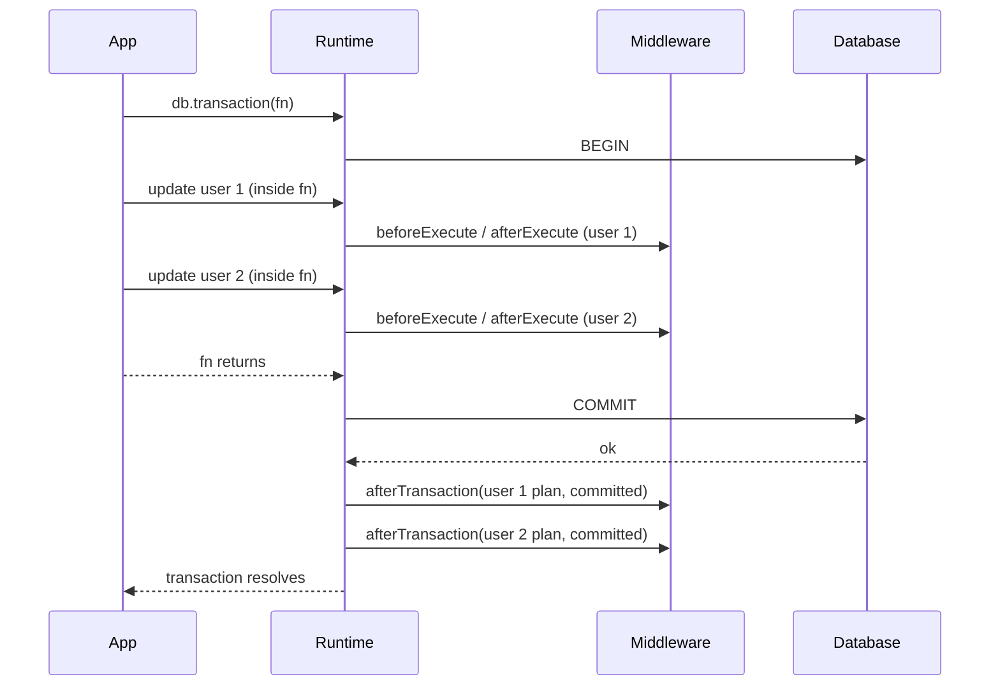

# ADR 260 — Every query has an afterTransaction stage that fires when its enclosing transaction ends

Status: **Accepted**

## Decision

```ts
import type { CrossFamilyMiddleware } from '@internal/framework-components/runtime';

// A middleware that acts only once a write's effects are final.
export const auditLog: CrossFamilyMiddleware = {
  name: 'audit-log',
  async afterTransaction(plan, result, ctx) {
    if (result.outcome === 'rolled-back') return;
    await audit.record(plan, ctx.planExecutionId);
  },
};
```



The middleware lifecycle gains one more stage per query. Today a middleware sees a query from `beforeQuery` or `beforeExecute` through `afterQuery` or `afterExecute`, and the last of those fires when the statement completes. Inside a transaction that is before the commit, so a middleware that must act only once the query's effects are final has nowhere to do it. `afterTransaction(plan, result, ctx)` is that place. It is the query's last hook, and it fires exactly once for every query whose encoded plan exists. It receives the same plan object `afterQuery` or `afterExecute` received and the same context as the query's other hooks, and `result.outcome` says how the query's transaction ended: `committed`, `rolled-back`, or `unknown`.

The stage is part of the query's lifecycle, not an event about transactions. A middleware author reasons about one query from start to final and never has to match a transaction event to the queries that ran in it. There is no transaction identity on the context, no hook that speaks about a transaction without a query, and no way to attach data to a transaction.

## Why

A write that runs inside a transaction has not happened, as far as other connections can see, until the transaction commits. A middleware that reacts to the write at `afterExecute` reacts too early. The concrete case is a cache: it must remove entries for the rows a write changed, but if it removes them before the commit, another request can read the old rows from the database in between and put them back. Removing them after the commit closes that window.

This matters on the default path, not only for applications that open transactions themselves. The ORM wraps several of its own mutations in a transaction: single-row `update()` and `delete()`, nested creates and updates, `create()` on a multi-table-inheritance variant, and `delete()` with includes.

Giving the middleware a stage per query, rather than a hook per transaction, keeps the mental model it already has. Every hook a middleware implements is about the query in its hands. The runtime, which already knows which queries ran on a transaction, does the bookkeeping and delivers the stage to each of them.

## How it works

### Which queries get the stage

Every query whose encoded plan exists gets exactly one `afterTransaction`, and it is the query's last hook. That holds inside and outside a transaction, whether the query completes, fails, or the caller stops reading its rows. A query that fails before its encoded plan exists, for example in a before-hook or while encoding its parameters, has no plan to deliver and gets no stage. Every runtime, `RuntimeCore`, SQL and Mongo, runs the before-hooks before it arms the stage.

One known limit: when a transaction ends while one of its queries is still running, that query's stage fires at the end, before its after-hook.

### Outside a transaction

A query in `'runtime'` or `'connection'` scope commits on its own, as a statement. The runtime fires `afterTransaction` when the query ends:

- `committed` when the query completed, right after `afterQuery` or `afterExecute`.
- `unknown` when it did not complete: the driver or a hook failed, the signal aborted between rows, a row failed to decode, or the caller stopped reading the rows. A statement that fails on the response path may already have applied, which is the same reason a rejected commit is `unknown` below.

The framework's base runtime, `RuntimeCore`, delivers the stage this way from its own `query` and `execute`, with the helpers `queryWithAfterTransaction` and `executeWithAfterTransaction`. The SQL and Mongo runtimes override those methods and call the same helpers. Every Mongo query is outside a transaction, so the lifecycle is the same on both families.

### Inside a transaction

Every transaction the SQL runtime hands out goes through one wrapper, `wrapTransaction`: transactions from `db.transaction(fn)`, from a manual `connection().transaction()`, from the ORM's own mutations, and from a Supabase role session. Every query run on the wrapper has `scope: 'transaction'`. While the transaction is open, the runtime remembers each query's plan, with its context, once its encoded plan exists and before it runs. When the transaction ends it fires `afterTransaction` once for each remembered plan, in execution order:

- `committed` when the driver's `commit()` resolves and none of the transaction's queries failed.
- `rolled-back` when `rollback()` settles, resolved or rejected, and no commit was attempted. No `COMMIT` was sent, so none of the transaction's writes can have landed.
- `unknown` when `commit()` rejects, whether or not a rollback is then attempted and succeeds. A `COMMIT` that errors may already have landed on the server, and a cleanup `ROLLBACK` that succeeds is a no-op in that case and proves nothing. A `rollback()` that settles while a `commit()` is still pending also fires `unknown`. A consumer that must not miss a committed write treats `unknown` like `committed`.
- `unknown` also when `commit()` resolves after one of the transaction's queries failed: the driver or a hook threw, a row failed to decode, or the signal aborted. Postgres answers `COMMIT` on a transaction that a failed statement aborted with a rollback, and the driver's `commit()` still resolves; other databases keep the transaction. `unknown` is the answer that is true on every database. A row stream the caller stops reading early does not count: it does not abort the transaction, so a commit after it reports `committed`. The transaction learns whether each query failed from the same helpers that deliver the stage outside a transaction; they tell a failure apart from a caller that stopped reading.

A `rollback()` that follows a rejected `commit()` fires nothing more. Each remembered plan gets exactly one `afterTransaction`. `commit()` and `rollback()` resolve only after the hooks have run, so by the time `db.transaction(fn)` returns, every middleware has seen the final stage of every query in it.

Remembering the plan before the query runs means a query whose row stream the caller stops reading early still gets its stage when the transaction ends, with the transaction's outcome. Stopping early does not abort the transaction, so a commit reports `committed`, as above.

The transaction stops remembering when it ends. A query run on a `RuntimeTransaction` after its `commit()` or `rollback()` runs outside any transaction on Postgres (in autocommit), so it gets its stage as a query outside a transaction does, although its `ctx.scope` still says `'transaction'`. Whether the runtime remembers a query is decided by the open transaction it runs on, not by `ctx.scope`, which only describes how the caller reached the query.

### Per-query state in a middleware

`beforeQuery` and `beforeExecute` receive the draft plan. The later hooks, from `interceptQuery` or `interceptExecute` through `afterTransaction`, receive the encoded plan, which may be a different object. A middleware that carries data from a before-hook to a later hook keys it by `ctx.planExecutionId`. A middleware whose state starts in `interceptQuery` or later may key it by the plan object. Either way it clears the entry in `afterTransaction`, which is the query's last hook and fires for every query whose encoded plan exists. A query that fails in a before-hook or while encoding never reaches `afterTransaction`, so state written in a before-hook can outlive it; a middleware that writes state there keeps it in a `WeakMap` keyed by an object the query owns, or bounds it. The runtime adds no slot for middleware data on the query.

### Hook errors

An error thrown by an `afterTransaction` hook is passed to `ctx.log.error` and swallowed, and later middleware still run. The commit has already happened when the hook runs. Rejecting the caller would report a failure for work that succeeded and invite a retry of a write that is not idempotent. ActiveRecord raises here instead; that is a deliberate difference, chosen because a middleware's failure to react should not masquerade as a database failure.

### Ordering and the connection

The stage fires after the driver's commit or rollback has settled and before the connection returns to the pool. The hook receives no queryable and must not use the connection.

### Runtimes without an afterTransaction middleware

The runtime checks once, when it is created, whether any of its middleware declares `afterTransaction`. `RuntimeCore` makes the check, so every family runtime shares it. When none does, the runtime remembers no plans on transactions and fires nothing, outside a transaction or when one ends. A user without such a middleware pays one check per query.

## Prior art

ActiveRecord's `after_commit` is declared on the record being saved, not on the transaction. It runs on each saved record once the outermost transaction commits, and runs immediately when the save happened outside an explicit transaction. Nested `transaction` blocks join the outer one and never fire it at a savepoint. The stage here is the same model applied to queries: the hook belongs to the thing written, and the runtime delivers it when that thing's transaction is final. Rails later added transaction-level callbacks (`transaction.after_commit`, `ActiveRecord.after_all_transactions_commit`) for code that is not tied to a record; the equivalent here is a later, separate addition.

## Consequences

- Middleware that reacts to writes moves that reaction from `afterExecute` or `afterQuery` to `afterTransaction`, and is then correct inside transactions without any transaction-specific code.
- A middleware that needs state across a query's hooks keys it as described under [Per-query state in a middleware](#per-query-state-in-a-middleware).
- The runtime holds, per open transaction, the plans and contexts of the queries run on it, and drops them when the transaction ends. A transaction that never commits or rolls back keeps them until the application drops its reference to the transaction.
- A runtime whose middleware do not declare `afterTransaction` holds no plans and runs no stage, so the stage costs nothing to applications that do not use it.
- Transaction-oriented hooks, if a consumer ever needs them (a span per transaction, a per-transaction audit record, session setup before the first statement), stay apart from the query hooks, so that the query model keeps its rule: every query hook is about the query in hand. Their shape is a later decision; a separate object on the middleware with its own begin and end hooks is the expected direction.

## Alternatives considered

- **A hook per transaction, with a transaction identity on every query's context.** The hook fires once when a transaction ends, and a middleware that wants to act per query remembers the queries by that identity and replays them. Rejected: it makes every middleware author reason about transaction lifecycle and correlation, and it needs a map in each middleware that leaks when a transaction never ends.
- **Letting middleware attach data to the transaction, delivered to the end hook.** Rejected: it hands middleware a transaction object to decorate, which is not theirs, and it still frames the work as a transaction event.
- **Letting middleware attach data to the query, delivered with the transaction's end.** Closer, but once the runtime delivers something per query at transaction end, the simplest thing to deliver is the query's own stage, with its plan and context, and no attachment API is needed.
- **Two hooks, `afterCommit` and `afterRollback`.** Rejected: neither can express `unknown`, and a cache that skips invalidation on a failed commit that actually landed is stale until expiry.
- **Propagating hook errors to the caller.** Rejected for the reason under Hook errors; ActiveRecord's choice is noted.
- **A `beforeTransaction` hook.** Nothing needs it; the runtime remembers each query's plan before the query runs.
