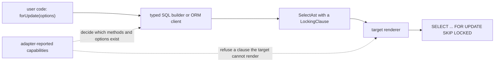

# ADR 261 — Row locks are a select clause named after the SQL, with one capability per strength or option

Status: **Accepted**

Related: [ADR 065 — Adapter capability schema & discovery](<./ADR 065 - Adapter capability schema & negotiation v1.md>) defines the adapter-reported capabilities this ADR adds seven of. [ADR 239 — Errors are structural envelopes with dotted namespace codes](<./ADR 239 - Errors are structural envelopes with dotted namespace codes.md>) defines the error codes used for refusals.

## At a glance

A transaction that reads a row, decides from what it read, and then writes must lock the row when it reads it. Both query surfaces do that with the same method:

```ts
await db.transaction(async (tx) => {
  const product = await tx.orm.public.Product.where({ id: productId }).forUpdate().first();
  if (product !== null && product.stock > 0) {
    await tx.orm.public.Product.where({ id: productId }).update({ stock: product.stock - 1 });
  }
});
```

```sql
SELECT ... FROM "public"."product" WHERE "product"."id" = $1 LIMIT 1 FOR UPDATE OF "product"
```

A work queue uses the same method with an option, here on the typed SQL builder. Each worker claims the oldest queued job that no other worker holds:

```ts
await db.transaction(async (tx) => {
  const [job] = await tx.query(
    tx.sql.public.job
      .select('id')
      .where((f, fns) => fns.eq(f.state, 'queued'))
      .orderBy('createdAt')
      .limit(1)
      .forUpdate({ skipLocked: true })
      .build(),
  );
});
```

```sql
SELECT "id" AS "id" FROM "public"."job" WHERE "state" = $1 ORDER BY "createdAt" ASC LIMIT 1 FOR UPDATE SKIP LOCKED
```

## Decision

1. **Four methods, named after the SQL they render.** A select on the typed SQL builder and a collection on the ORM client both have `forUpdate()`, `forNoKeyUpdate()`, `forShare()` and `forKeyShare()`. Each takes an optional object: `nowait` or `skipLocked` on both clients, and `of` on the builder only.
2. **One capability per lock strength or option.** Seven boolean capabilities say which methods and options a target can render. A method or option exists only when the target's adapter reports the capability it needs. The Postgres adapter reports all seven; the SQLite adapter reports none.
3. **One target-neutral clause in the shared select tree.** The lock is a `LockingClause` on `SelectAst`. It records what is locked and how to wait, in words that are not any one dialect's syntax. Each target's renderer writes its own syntax, or refuses the clause. It never drops it.
4. **The ORM locks only the model's own rows.** It always renders `OF` the model's table, so joins the ORM adds itself are never locked.
5. **Combinations Postgres cannot execute are refused before a statement is sent.** Both clients refuse them with one code, `ORM.LOCK_INCOMPATIBLE`, whose `meta.conflict` names what the lock was combined with. The tree node itself holds no such rule.

The rest of this ADR follows a call from the user's code to the SQL it renders:



## Why a read needs a lock

Take the product example without `forUpdate()`. Two requests arrive together, and each wants the last unit in stock. Postgres's default isolation level is read committed. Both transactions read `stock = 1`, both decide there is stock, and both write `stock = 0`. Two units are sold and one existed. The database did nothing wrong, because nothing told it that the two reads had to happen one after the other.

A lock tells it. The first transaction's read locks the row. The second transaction's read waits until the first commits, and then sees `stock = 0`.

The only other way to get this behaviour is to write the statement as raw SQL. That gives up the typed columns, the typed filter and the table names the contract knows. Locking is a normal part of reading a row, so it belongs on the same methods that read rows.

## What a row lock is

This section describes Postgres. Other dialects are covered under "Capabilities".

A locking clause ends a SELECT. The rows the SELECT returns stay locked until the enclosing transaction commits or rolls back. Another transaction that tries to update, delete or lock one of those rows waits until then. Postgres has four strengths:

| Clause | What it blocks |
|---|---|
| `FOR UPDATE` | every write to the row and every other lock on it |
| `FOR NO KEY UPDATE` | writes, but not `FOR KEY SHARE` |
| `FOR SHARE` | writes only; other readers may share-lock the row at the same time |
| `FOR KEY SHARE` | only deletes and changes to the row's key columns |

The difference between `FOR UPDATE` and `FOR NO KEY UPDATE` matters in practice. When a transaction inserts or updates a row that references the product through a foreign key, Postgres takes `FOR KEY SHARE` on the product row to check that the key still exists. `FOR UPDATE` conflicts with that lock, and `FOR NO KEY UPDATE` does not. Suppose two transactions each lock one parent row and then write a child that references the other parent. Under `FOR UPDATE` they deadlock; under `FOR NO KEY UPDATE` both proceed.

Two wait policies change what happens when a row is already locked. `NOWAIT` fails the statement at once with SQLSTATE `55P03` (`lock_not_available`). `SKIP LOCKED` leaves locked rows out of the result, which is what a work queue wants: each worker takes the next row that nobody holds. Without either, the statement waits.

`OF` limits the lock to the rows of named tables when the select joins several. Each name is a table or alias as written in `FROM`, without a schema, because Postgres refuses a schema-qualified name there.

Outside a transaction, the lock is released as soon as the statement ends. A lock is therefore only useful inside `db.transaction(...)`.

## The typed SQL builder

A select gains the four methods. Each returns a select, so `where`, `orderBy`, `limit`, `offset`, `as` and `build` can still follow in any order. The `of` option names tables or aliases in the query's scope:

```ts
tx.sql.public.users
  .as('u')
  .innerJoin(tx.sql.public.posts, (f, fns) => fns.eq(f.u.id, f.posts.user_id))
  .select('name', 'title')
  .where((f, fns) => fns.eq(f.u.id, userId))
  .forUpdate({ of: ['u'] })
  .build();
```

```sql
SELECT "name" AS "name", "title" AS "title" FROM "public"."users" AS "u" INNER JOIN "public"."posts" ON "u"."id" = "posts"."user_id" WHERE "u"."id" = $1 FOR UPDATE OF "u"
```

The types do most of the checking:

- **`of`** accepts only names in scope. After `.as('u')` that is `u`, not `users`, which matches what Postgres accepts. A schema-qualified name is a type error.
- **`nowait` and `skipLocked`** form a union, so passing both is a type error. The run time refuses the pair as well, with `ORM.ARGUMENT_INVALID`.
- **Each method and each option key** exists in the types only when the contract's capabilities include its flag. This uses the same conditional method type as `distinctOn`. On a SQLite contract the four methods do not exist.
- **`groupBy()`** returns a grouped query, which has no locking methods. A lock together with `GROUP BY` therefore cannot be written.

At run time each method checks its capability again, then adds a `LockingClause` to the query. A second call adds a second clause, so `forUpdate({ of: ['a'] }).forShare({ of: ['b'] })` renders two clauses, which Postgres allows.

The remaining combinations that Postgres refuses are refused when the query is built, listed below under "What is refused, and where". A locked select used as a subquery, through `.as(...)` or as an `exists`, `in` or lateral source, is refused at the point where it becomes a subquery. That point is closer to the mistake than the outer `build()`.

## The ORM client

A collection gains the same four methods, with `nowait` and `skipLocked`:

```ts
const job = await tx.orm.public.Job.where({ state: 'queued' })
  .orderBy((j) => j.createdAt.asc())
  .forUpdate({ skipLocked: true })
  .first();
```

```sql
SELECT ... FROM "public"."job" WHERE "job"."state" = $1 ORDER BY "job"."createdAt" ASC LIMIT 1 FOR UPDATE OF "job" SKIP LOCKED
```

The methods follow the `distinctOn` pattern. Without the capability, the parameter list is `never`, so even `forUpdate()` with no arguments is a type error. At run time, a missing capability throws `ORM.CAPABILITY_MISSING`, naming the missing capability.

The ORM has no `of` option. It always renders `OF` the model's own table, which is the name its lowering writes in `FROM`. The ORM adds joins of its own that the caller never wrote. A polymorphic model, for example, outer-joins its variant tables. Without `OF`, Postgres would try to lock every table in `FROM`, and it refuses to lock the nullable side of an outer join at all. Naming the model's table locks exactly the rows the caller asked for, whatever the lowering adds.

The lock applies to reads through `all()` and `first()`. A lock is refused together with anything that would drop it or that Postgres refuses:

- **Shaping the read**: `include()`, `distinct()` or `distinctOn()`. The include lowering wraps the base select in JSON aggregation, and Postgres refuses a lock at a level with aggregates or `DISTINCT`.
- **Inside an include refinement**: a lock method called on the nested collection inside an `include()` callback. The ORM refuses it at the call, with its own conflict value, `includeRefinement`, because the caller wrote the lock on a related collection, not on the one being read.
- **Grouping and aggregation**: `groupBy()` and `aggregate()`, at the call.
- **Mutations**: any mutation method on a locked collection, before the first statement runs. A mutation already locks the rows it changes, and silently dropping the lock written before it would hide a mistake.

The ORM does not refuse a lock outside a transaction. Releasing the lock when the statement ends is legal Postgres, and `nowait` outside a transaction is a way to ask whether a row is free right now.

## Capabilities

Each lock strength and each option has its own boolean capability:

| Capability | What the target can render |
|---|---|
| `sql.forUpdate` | `FOR UPDATE` |
| `sql.forShare` | `FOR SHARE` or its equivalent |
| `sql.lockOf` | a table list on a locking clause |
| `sql.lockNowait` | `NOWAIT` or its equivalent |
| `sql.lockSkipLocked` | `SKIP LOCKED` or its equivalent |
| `postgres.forNoKeyUpdate` | `FOR NO KEY UPDATE` |
| `postgres.forKeyShare` | `FOR KEY SHARE` |

This follows the rule the existing capabilities use. There is one capability per method or option. A capability goes in the `sql` group when more than one dialect has the feature, and in a dialect group such as `postgres` when only one does. `insertOnConflictSkip` and `insertOnConflictWithoutTarget` are an earlier example of an option and its sub-option as two capabilities.

The adapter reports its capabilities, and the emitted contract records them. The builder and ORM types read them from the contract. The Postgres adapter declares its list once, in [`postgres/src/core/capabilities.ts`](../../../packages/3-targets/6-adapters/postgres/src/core/capabilities.ts). Its runtime profile and its descriptor both use that list.

Which capability each strength and option needs is declared once, in [`relational-core/src/ast/locking.ts`](../../../packages/2-sql/4-lanes/relational-core/src/ast/locking.ts). The builder, the ORM and the Postgres renderer all read that file, so the three can never disagree:

```ts
export const lockStrengthCapabilities = {
  forUpdate: { sql: { forUpdate: true } },
  forNoKeyUpdate: { postgres: { forNoKeyUpdate: true } },
  forShare: { sql: { forShare: true } },
  forKeyShare: { postgres: { forKeyShare: true } },
} as const satisfies Record<LockStrength, CapabilityRequirement>;

export const lockOptionCapabilities = {
  of: { sql: { lockOf: true } },
  nowait: { sql: { lockNowait: true } },
  skipLocked: { sql: { lockSkipLocked: true } },
} as const satisfies Record<'of' | LockWaitPolicy, CapabilityRequirement>;
```

### Why seven capabilities and not one

The capabilities must still fit when Prisma gains adapters for other databases. The survey below is the reason for the split. Each column varies independently of the others, so any coarser set of capabilities would have to be split as soon as one of these databases gained an adapter.

| Database | FOR UPDATE | FOR SHARE | NO KEY UPDATE, KEY SHARE | OF table | NOWAIT | SKIP LOCKED |
|---|---|---|---|---|---|---|
| Postgres and hosted Postgres | yes | yes | yes | yes | yes | yes |
| CockroachDB, YugabyteDB | yes | accepted, with weaker semantics | accepted | yes | yes | yes |
| MySQL 8 | yes | yes | no | yes | yes | yes |
| MariaDB | yes | as `LOCK IN SHARE MODE` | no | no | yes | yes |
| Vitess (PlanetScale for MySQL) | yes | yes | no | no | yes | yes |
| Oracle | yes | no | no | by column | yes | yes |
| SQL Server | as the table hint `UPDLOCK, ROWLOCK` | as `HOLDLOCK` | no | per table, through hints | `NOWAIT` hint | `READPAST` hint |
| SQLite, Cloudflare D1 | no | no | no | no | no | no |

SQLite and D1 have no row locks, because a writer locks the whole database. `BEGIN IMMEDIATE` is the nearest equivalent. With these capabilities, an adapter for each database would report:

| Adapter | Capabilities |
|---|---|
| MySQL | the five `sql` capabilities |
| Vitess, MariaDB | `sql.forUpdate`, `sql.forShare`, `sql.lockNowait`, `sql.lockSkipLocked` |
| Oracle | `sql.forUpdate`, `sql.lockNowait`, `sql.lockSkipLocked` |
| SQL Server | the five `sql` capabilities, rendered as hints |
| CockroachDB, YugabyteDB | all seven |

Two differences in the survey are about meaning, not syntax, and capabilities do not model them:

- **Sharded databases.** On a sharded database, such as Vitess with more than one shard, a row lock holds only inside the shard where the row lives. `SKIP LOCKED` with `LIMIT` runs on every shard, so it can lock up to `LIMIT` rows on each shard.
- **CockroachDB `FOR SHARE`.** CockroachDB accepts `FOR SHARE` but treats it more weakly than Postgres does, unless a session setting is on.

In both cases the SQL is written the same way, so the adapter reports the same capabilities. Each such adapter's documentation must state the difference.

## The syntax tree

`SelectAst` is shared by every SQL target. Its lock records what is locked and how to wait. It never records how one dialect writes that:

```ts
export type LockStrength = 'forUpdate' | 'forNoKeyUpdate' | 'forShare' | 'forKeyShare';
export type LockWaitPolicy = 'nowait' | 'skipLocked';

export class LockingClause extends AstNode {
  readonly kind = 'locking-clause' as const;
  readonly strength: LockStrength;
  readonly of: ReadonlyArray<string> | undefined;
  readonly waitPolicy: LockWaitPolicy | undefined;
}
```

- **The value names are the method names.** One name serves the tree, the builder and the ORM, and it reads as SQL without being one dialect's syntax.
- **`of`** holds table names or aliases exactly as they appear in `FROM`. An empty list is stored as `undefined`.
- **`waitPolicy`** is one field rather than two booleans, so the tree cannot hold `nowait` and `skipLocked` at once. "Wait policy" is Postgres's own term for the choice between waiting, `NOWAIT` and `SKIP LOCKED`.
- **`SelectAst.locking` is a list**, because Postgres allows several clauses on one select, each naming different tables. `withLocking(clauses)` replaces it. `rewrite()` leaves it unchanged, because a clause holds names, not expressions.
- **`LockingClause` is a frozen node** with a static `of(strength, { of, waitPolicy })` factory, like its neighbours.

The node holds no rule about which combinations are valid. Postgres refuses a lock together with `DISTINCT`, `GROUP BY`, `HAVING`, an aggregate or a window function. MySQL accepts some of those, and the tree belongs to every target, so the rule cannot live there. The builders enforce it instead. They know what the user wrote, and they refuse before any statement is sent. A hand-built tree that breaks the rule reaches Postgres, which rejects the statement. That failure is safe: it is an error, never a lock silently dropped.

## Rendering

The Postgres renderer writes one clause per entry after `OFFSET`, in order. Each clause is the strength keyword, then `OF "a", "b"` when `of` is set, then `NOWAIT` or `SKIP LOCKED` when `waitPolicy` is set. Names in `of` are quoted like any other identifier.

The renderer receives the adapter's capabilities as a required argument. Before writing a clause, it checks the clause's strength and options against them. A clause the adapter does not report is refused with `RUNTIME.AST_UNSUPPORTED`, and the error's `meta` names the target, the feature `locking-clause` and the missing capability. The builders never produce such a clause for their own contract. The check covers a tree built by hand, and any future adapter that reuses this renderer while reporting fewer capabilities.

The SQLite renderer refuses any lock with `RUNTIME.AST_UNSUPPORTED`, with the feature `locking-clause`. A renderer that dropped the clause would turn a lock into no lock, which is the worst possible result.

The node carries enough for other dialects:

- **MariaDB** writes `LOCK IN SHARE MODE` for `forShare`.
- **SQL Server** turns each clause into the hint `WITH (UPDLOCK, ROWLOCK)` or `WITH (HOLDLOCK)`. It places the hint on the `FROM` items named in `of`, or on every `FROM` item when `of` is unset. It turns `waitPolicy` into the `NOWAIT` or `READPAST` hint.

## What is refused, and where

| Situation | Where | Error |
|---|---|---|
| A method or option without its capability | the method, in both clients | `ORM.CAPABILITY_MISSING`, naming the capability |
| `nowait` and `skipLocked` together | the method, in both clients | `ORM.ARGUMENT_INVALID` |
| A lock with `distinct`, `distinctOn`, `groupBy` or `having`, or with an aggregate or window function in the projection | builder, when the query is built | `ORM.LOCK_INCOMPATIBLE` |
| A locked select used as a subquery | builder, where it becomes a subquery | `ORM.LOCK_INCOMPATIBLE`, conflict `subquery` |
| A locked collection read with `include()`, `distinct()` or `distinctOn()` | ORM, when the read is compiled | `ORM.LOCK_INCOMPATIBLE` |
| A lock on the nested collection inside an `include()` refinement, scalar or `combine` branch | ORM, at the call; again when the parent is compiled | `ORM.LOCK_INCOMPATIBLE`, conflict `includeRefinement` |
| `groupBy()` or `aggregate()` on a locked collection | ORM, at the call | `ORM.LOCK_INCOMPATIBLE` |
| A mutation method on a locked collection | ORM, before the first statement | `ORM.LOCK_INCOMPATIBLE`, conflict `mutation` |
| A clause the adapter's capabilities do not include | Postgres renderer | `RUNTIME.AST_UNSUPPORTED`, feature `locking-clause` |
| Any lock | SQLite renderer | `RUNTIME.AST_UNSUPPORTED`, feature `locking-clause` |
| A locked row under `nowait` | the database | SQLSTATE `55P03`, surfaced as the driver's error |

Unless the table names a conflict value, `meta.conflict` is the clause that clashed: `distinct`, `distinctOn`, `groupBy`, `having`, `aggregate` or `include`. The builder and the ORM both raise errors in the `ORM` namespace, so one code serves both. The possible conflict values form one union, `LockConflict`, declared in `relational-core/src/ast/locking.ts`.

## Consequences

**For application authors**

- A lock lasts until the transaction ends, so use it inside `db.transaction(...)`.
- Prefer `forNoKeyUpdate()` when other transactions insert or update rows that reference the locked row, for the foreign-key reason given above.
- `skipLocked` with `limit` is the work-queue pattern. On a sharded database it can lock up to `limit` rows on each shard.
- A contract emitted before these capabilities existed does not record them. The methods appear once the contract is emitted again.

**For adapter authors**

- An adapter reports exactly the locking capabilities its target can render.
- Its renderer must either render every `LockingClause` it receives or refuse it with `RUNTIME.AST_UNSUPPORTED`. Dropping the clause is never correct.

**For extension authors**

- `SelectAstOptions` has a required `locking` key, and the ORM's `CollectionState` has one too. Code that rebuilds an existing select or collection state must carry the existing value through. Writing `locking: undefined` there removes the caller's lock without an error.
- The Postgres `renderLoweredSql` takes the capabilities to check locks against as a fourth, required argument.

## Not covered by this decision

- Table locks (`LOCK TABLE`) and advisory locks (`pg_advisory_xact_lock`).
- Locking clauses on `UPDATE` or `DELETE`. Those statements already lock the rows they change.
- Isolation levels and `SET TRANSACTION`.
- A lock together with `include()` on the ORM. See the alternatives.
- A structured error code for SQLSTATE `55P03`. The driver's error surfaces as it is.

## Alternatives considered

**One method, `lock(strength, options)`.** The builder uses SQL words for every other clause: `distinctOn`, `groupBy`, `orderBy`, `limit`. With four methods, each strength has its own capability in the types. One method that takes the strength as a string argument cannot express that.

**One capability, `postgres.rowLocking`, or two, `rowLocking` and `keyLocking`.** Vitess and MariaDB have `FOR UPDATE` with `NOWAIT` and `SKIP LOCKED`, but no `OF`. Oracle has no `FOR SHARE`. MySQL has neither Postgres-only strength. Any coarser set would have to be split as soon as one of these databases gained an adapter, because the options vary independently of the strengths.

**A `wait: 'nowait' | 'skipLocked'` option.** `forUpdate({ skipLocked: true })` reads like the SQL it renders, and the union type makes the two options exclusive just as well. The tree still keeps a single `waitPolicy` field.

**Postgres keywords in the tree, such as `strength: 'FOR NO KEY UPDATE'`.** The tree belongs to every target. A SQL Server renderer would have to parse Postgres keywords before it could place its hints.

**Strength values without the `for` prefix, such as `'update'`.** `JoinAst.joinType` stores `'inner'` for `innerJoin()`, so dropping the prefix would match it. But the strengths read as SQL only with the prefix, and one name across the tree, the builder and the ORM is worth more than matching `joinType`.

**Refusing invalid combinations in the `SelectAst` constructor.** The rule is Postgres's, and the tree belongs to every target. A constructor check would refuse combinations that MySQL accepts.

**Refusing a lock outside a transaction.** Releasing a lock when the statement ends is legal Postgres. `nowait` outside a transaction is a real way to ask whether a row is free right now.

**An `of` option on the ORM, or no `OF` at all.** Either way, the caller would need to know which tables the lowering joins. Polymorphic models outer-join their variant tables, and Postgres refuses to lock the nullable side of an outer join. Always naming the model's table gives the same result whatever the lowering adds.

**Locking together with `include()`.** The ORM could put the lock on the inner base-table select of the include lowering, with `OF` that table. That is the only arrangement Postgres accepts, because the outer levels carry JSON aggregation. The `OF` name would then come from the lowering rather than from the method call, because the base table gets an alias inside the include shape. The read-then-write and work-queue patterns need no `include()`, so a lock together with `include()` is refused. Adding it later fits this design without changing the node.

**Allowing a locked select as a subquery.** Postgres accepts it, but it is rare, and refusing it keeps every lock on the statement that returns the rows to the caller. Allowing it later only means removing the refusal.
