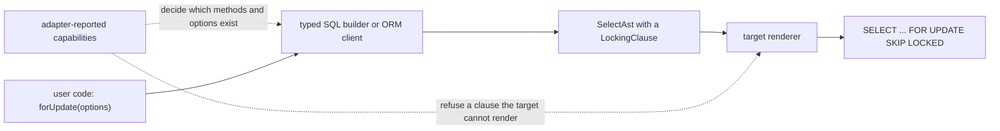

# ADR 261 — Row locks are a select clause named after the SQL, with one capability per strength or option

Status: **Accepted**

Related: [ADR 065 — Adapter capability schema & discovery](<./ADR 065 - Adapter capability schema & negotiation v1.md>) describes the adapter-reported capabilities. This ADR adds seven of them. [ADR 239 — Errors are structural envelopes with dotted namespace codes](<./ADR 239 - Errors are structural envelopes with dotted namespace codes.md>) describes the error codes used below.

## At a glance

A transaction that reads a row, decides from it, and then writes it back can lock the row as it reads it. On the ORM client:

```ts
await db.transaction(async (tx) => {
  const product = await tx.orm.public.Product.where({ id: productId }).forUpdate().first();
  if (product !== null && product.stock > 0) {
    await tx.orm.public.Product.where({ id: productId }).update({ stock: product.stock - 1 });
  }
});
```

```sql
SELECT ... FROM "public"."product" WHERE "product"."id" = $1 LIMIT 1 FOR UPDATE OF "product"
```

On the typed SQL builder, the same method with an option makes a work queue. Each worker claims the oldest queued job that no other worker holds:

```ts
await db.transaction(async (tx) => {
  const [job] = await tx.query(
    tx.sql.public.job
      .select('id')
      .where((f, fns) => fns.eq(f.state, 'queued'))
      .orderBy('createdAt')
      .limit(1)
      .forUpdate({ skipLocked: true })
      .build(),
  );
});
```

```sql
SELECT "id" AS "id" FROM "public"."job" WHERE "state" = $1 ORDER BY "createdAt" ASC LIMIT 1 FOR UPDATE SKIP LOCKED
```

## Decision

1. **Four methods, named after the SQL they render.** A select on the typed SQL builder and a collection on the ORM client both have `forUpdate()`, `forNoKeyUpdate()`, `forShare()` and `forKeyShare()`. Each takes an optional object: `nowait` or `skipLocked` on both, and `of` on the typed SQL builder only.
2. **One capability per lock strength or option.** Seven adapter-reported capabilities say which strengths and options a target can render. A method or option exists only when the adapter reports the capabilities it needs. The Postgres adapter reports all seven, and the SQLite adapter reports none.
3. **One target-neutral clause in the shared select tree.** The lock is a `LockingClause` on `SelectAst`. It records what is locked and how to wait, in words that are not any one dialect's SQL. Each target's renderer writes its own SQL for it or refuses it. A renderer never drops it.
4. **The ORM client locks only the model's own rows.** It always renders `OF` the model's table. Tables the ORM joins on the caller's behalf, such as the variant tables of a polymorphic model, are never locked. Because it always renders `OF`, the ORM client's methods also need the `OF` capability.
5. **Shapes that Postgres refuses to lock are refused before a statement is sent.** The typed SQL builder and the ORM client refuse a lock together with `DISTINCT`, grouping, aggregation, or use as a subquery. The ORM client also refuses it together with `include()` or a mutation. Both use one code, `ORM.LOCK_INCOMPATIBLE`. The tree node holds no such rule, because other dialects accept some of these shapes.

## Why a read needs a lock

Take the product example without `forUpdate()`. Two requests arrive together, and each wants the last unit in stock. Under Postgres's default isolation level, read committed, both transactions read `stock = 1`. Both decide there is stock, and both write `stock = 0`. Two units are sold, and only one existed. Nothing told the database that the second read had to wait for the first transaction to finish.

There is more than one way to tell it. A conditional update (`UPDATE ... SET stock = stock - 1 WHERE id = $1 AND stock > 0`) fixes this example. Serializable isolation makes one of the two transactions fail and retry. A row lock is the general tool. It works whatever the decision between the read and the write is, and a work queue cannot be built without it. Without a locking method on the query APIs, the only way to write the statement is raw SQL. That gives up the typed columns, the typed filter and the table names the contract knows.

## What a row lock is

This section describes Postgres. Other databases are compared under "Capabilities".

A locking clause ends a SELECT. The rows the SELECT returns stay locked until the enclosing transaction commits or rolls back. A transaction that wants a conflicting lock on one of those rows waits until then. Updates and deletes take row locks themselves, so they wait too. Postgres has four strengths:

| Clause | Conflicts with these locks | So it blocks |
|---|---|---|
| `FOR UPDATE` | all four | every update and delete |
| `FOR NO KEY UPDATE` | `FOR UPDATE`, `FOR NO KEY UPDATE`, `FOR SHARE` | every update and delete |
| `FOR SHARE` | `FOR UPDATE`, `FOR NO KEY UPDATE` | every update and delete; other readers can still take `FOR SHARE` |
| `FOR KEY SHARE` | `FOR UPDATE` | deletes, and updates that change a key column |

The difference between `FOR UPDATE` and `FOR NO KEY UPDATE` matters in practice. When a transaction inserts or updates a row that references the product through a foreign key, Postgres takes `FOR KEY SHARE` on the product row. It does that to check that the key still exists. `FOR UPDATE` conflicts with that lock, and `FOR NO KEY UPDATE` does not. Suppose two transactions each lock one parent row and then write a child that references the other parent. Under `FOR UPDATE` they deadlock; under `FOR NO KEY UPDATE` both proceed. Prefer `forNoKeyUpdate()` when other transactions write rows that reference the locked row.

Two wait policies change what happens when a row is already locked:

- **`NOWAIT`** fails the statement at once, with SQLSTATE `55P03` (`lock_not_available`).
- **`SKIP LOCKED`** leaves locked rows out of the result. That is what a work queue wants: each worker takes the next row nobody holds.

Without either, the statement waits.

**`OF` limits the lock** to the rows of named tables when the select joins several. Each name is a table or alias as written in `FROM`, without a schema; Postgres refuses a schema-qualified name there. Postgres also refuses to lock the nullable side of an outer join, so a select with an outer join must use `OF` to name only the other side.

**The lock lasts until the transaction ends.** Outside `db.transaction(...)`, that is the end of the statement itself. A read-then-write therefore needs both statements inside one transaction.

## From a call to SQL

The rest of this ADR follows a call through these steps:



It starts with the capabilities, because they decide what the user can call. Then come the typed SQL builder, the ORM client, the tree node and rendering, and finally every refusal in one table.

## Capabilities

Each lock strength and each option has its own boolean capability:

| Capability | What the target can render |
|---|---|
| `sql.forUpdate` | `FOR UPDATE` |
| `sql.forShare` | `FOR SHARE` or its equivalent |
| `sql.lockOf` | a table list on a locking clause (`OF`) |
| `sql.lockNowait` | `NOWAIT` or its equivalent |
| `sql.lockSkipLocked` | `SKIP LOCKED` or its equivalent |
| `postgres.forNoKeyUpdate` | `FOR NO KEY UPDATE` |
| `postgres.forKeyShare` | `FOR KEY SHARE` |

A capability is in the `sql` group when databases outside the Postgres family have the feature. It is in the `postgres` group when only Postgres and databases that speak its dialect have it.

The adapter reports its capabilities, and the emitted contract records them. The typed SQL builder and the ORM client read them from the contract to decide which methods and options exist. The Postgres adapter declares its list once, in [`postgres/src/core/capabilities.ts`](../../../packages/3-targets/6-adapters/postgres/src/core/capabilities.ts), and both its runtime profile and its descriptor use that list.

Which capabilities each strength and option needs is declared once, in [`relational-core/src/ast/locking.ts`](../../../packages/2-sql/4-lanes/relational-core/src/ast/locking.ts). The typed SQL builder, the ORM client and the Postgres renderer all read it:

```ts
export const lockStrengthCapabilities = {
  forUpdate: { sql: { forUpdate: true } },
  forNoKeyUpdate: { postgres: { forNoKeyUpdate: true } },
  forShare: { sql: { forShare: true } },
  forKeyShare: { postgres: { forKeyShare: true } },
} as const satisfies Record<LockStrength, CapabilityRequirement>;

export const lockOptionCapabilities = {
  of: { sql: { lockOf: true } },
  nowait: { sql: { lockNowait: true } },
  skipLocked: { sql: { lockSkipLocked: true } },
} as const satisfies Record<'of' | LockWaitPolicy, CapabilityRequirement>;
```

### Why seven capabilities

The capabilities must still fit when Prisma gains adapters for other databases. This survey is the reason for the split:

| Database | FOR UPDATE | FOR SHARE | FOR NO KEY UPDATE, FOR KEY SHARE | OF table | NOWAIT | SKIP LOCKED |
|---|---|---|---|---|---|---|
| Postgres, including managed services that run it | yes | yes | yes | yes | yes | yes |
| CockroachDB | yes | accepted, but weaker unless a session setting is on | accepted | yes | yes | yes |
| MySQL 8 | yes | yes | no | yes | yes | yes |
| MariaDB | yes | as `LOCK IN SHARE MODE` | no | no | yes | yes |
| Vitess (PlanetScale for MySQL) | yes | yes | no | no | yes | yes |
| Oracle | yes | no | no | by column | yes | yes |
| SQL Server | as the table hint `UPDLOCK, ROWLOCK` | as `HOLDLOCK` | no | per table, through hints | `NOWAIT` hint | `READPAST` hint |
| SQLite, Cloudflare D1 | no | no | no | no | no | no |

`FOR UPDATE`, `FOR SHARE`, `OF`, `NOWAIT` and `SKIP LOCKED` each vary independently across these databases. Any coarser set of capabilities would have to be split as soon as one of them gained an adapter. `FOR NO KEY UPDATE` and `FOR KEY SHARE` always appear together, but they are two capabilities because each is needed by its own method. SQLite and D1 have no row locks, because a writer locks the whole database.

With these capabilities, an adapter for each database would report:

| Adapter | Capabilities |
|---|---|
| MySQL | the five `sql` capabilities |
| Vitess, MariaDB | `sql.forUpdate`, `sql.forShare`, `sql.lockNowait`, `sql.lockSkipLocked` |
| Oracle | `sql.forUpdate`, `sql.lockNowait`, `sql.lockSkipLocked` |
| SQL Server | the five `sql` capabilities |
| CockroachDB | all seven |

Two differences in the survey are about meaning, not syntax, and capabilities do not record them. On a sharded database, such as Vitess with more than one shard, a row lock holds only inside the shard where the row lives, and `SKIP LOCKED` with `LIMIT` can lock up to `LIMIT` rows on each shard. CockroachDB treats `FOR SHARE` more weakly than Postgres does. In both cases the SQL is the same, so the adapter reports the same capabilities, and its documentation must state the difference.

## The typed SQL builder

A select gains the four methods. `where`, `orderBy`, `limit`, `offset` and `build` can follow them in any order. The `of` option names tables or aliases in the query's scope:

```ts
tx.sql.public.users
  .as('u')
  .innerJoin(tx.sql.public.posts, (f, fns) => fns.eq(f.u.id, f.posts.user_id))
  .select('name', 'title')
  .where((f, fns) => fns.eq(f.u.id, userId))
  .forUpdate({ of: ['u'] })
  .build();
```

```sql
SELECT "name" AS "name", "title" AS "title" FROM "public"."users" AS "u" INNER JOIN "public"."posts" ON "u"."id" = "posts"."user_id" WHERE "u"."id" = $1 FOR UPDATE OF "u"
```

The types check most of what the user writes:

- **Capabilities.** Each method, and each option key, exists in the types only when the contract's capabilities include what it needs. This is the conditional method type in `sql-builder/src/scope.ts` that `distinctOn` also uses. On a SQLite contract the four methods do not exist. At run time each method checks its capabilities again, and throws `ORM.CAPABILITY_MISSING` if one is missing.
- **`of`** accepts only names in scope. After `.as('u')` that is `u`, not `users`, which is what Postgres accepts. A schema-qualified name is a type error.
- **`nowait` and `skipLocked`** form a union, so passing both is a type error. The run time refuses the pair as well.
- **`groupBy()`** returns a grouped query, which has no locking methods, so nothing can lock after `groupBy()`. A lock called before `groupBy()` is refused when the query is built.

Each method adds one `LockingClause` to the query, so `forUpdate({ of: ['a'] }).forShare({ of: ['b'] })` renders two clauses. Postgres allows that.

The typed SQL builder does not refuse a lock on a select with an outer join. The author can use `of` to name the side that is not nullable, which Postgres accepts. If the author locks the nullable side, Postgres rejects the statement and returns its own error.

## The ORM client

A collection gains the same four methods, with `nowait` and `skipLocked`:

```ts
const job = await tx.orm.public.Job.where({ state: 'queued' })
  .orderBy((j) => j.createdAt.asc())
  .forUpdate({ skipLocked: true })
  .first();
```

```sql
SELECT ... FROM "public"."job" WHERE "job"."state" = $1 ORDER BY "job"."createdAt" ASC LIMIT 1 FOR UPDATE OF "job" SKIP LOCKED
```

The ORM client has no `of` option. Its lowering is the step that turns a collection into a `SelectAst`, and that step adds joins the caller never wrote. A polymorphic model, for example, outer-joins its variant tables. If the lock had no `OF`, Postgres would try to lock every table in `FROM`, and it refuses to lock the nullable side of an outer join. So the ORM client always renders `OF` the model's own table, under the name the lowering writes in `FROM`. That locks exactly the rows the caller asked for, whatever the lowering adds.

Because it always renders `OF`, each ORM method needs `sql.lockOf` as well as its strength's capability. The method follows the `distinctOn` pattern. Without its capabilities, its parameter list is `never`, so even `forUpdate()` with no arguments is a type error. At run time it checks again and throws `ORM.CAPABILITY_MISSING`.

The lock applies to reads through `all()` and `first()`. A lock together with `include()`, `distinct()`, `distinctOn()`, `groupBy()`, `aggregate()` or a mutation is refused; the reasons are in the table below.

One refusal needs the terms of `include()` explained. `include()` reads related rows. It can take a refinement: a callback that receives the related collection and narrows it. That callback can return the related collection, a scalar such as a count of it, or a `combine` of several of those, called branches. A lock method called on the related collection inside the callback is refused at the call. The caller wrote the lock on a related collection, not on the collection being read. A refinement can also return a collection that was locked outside the callback. The ORM finds that when it compiles the parent read, by checking every included collection, scalar and branch for a lock.

## The syntax tree

`SelectAst` is shared by every SQL target. Its lock records what is locked and how to wait, and never how one dialect writes that:

```ts
export type LockStrength = 'forUpdate' | 'forNoKeyUpdate' | 'forShare' | 'forKeyShare';
export type LockWaitPolicy = 'nowait' | 'skipLocked';

export class LockingClause extends AstNode {
  readonly kind = 'locking-clause' as const;
  readonly strength: LockStrength;
  readonly of: ReadonlyArray<string> | undefined;
  readonly waitPolicy: LockWaitPolicy | undefined;
}
```

- **The value names are the method names.** One name serves the tree, the typed SQL builder and the ORM client. It reads as SQL, without being one dialect's syntax.
- **`of`** holds table names or aliases exactly as they appear in `FROM`. An empty list is stored as `undefined`.
- **`waitPolicy`** is one field rather than two booleans, so the tree cannot hold `nowait` and `skipLocked` at once. Postgres's own source code uses the same name for this choice.
- **`SelectAst.locking` is a list**, because Postgres allows several clauses on one select, each naming different tables. `withLocking(clauses)` replaces it.
- **`LockingClause` is a frozen node** with a static `of(strength, { of, waitPolicy })` factory, following the [frozen-class AST pattern](<../patterns/frozen-class-ast.md>).

`rewrite()` leaves the clause unchanged, because a clause holds names, not expressions. A rewriter that renamed a table source would therefore leave an `of` entry naming the old table. No rewriter that renames tables runs on a select that can carry a lock.

The node holds no rule about which shapes can be locked. Postgres refuses a lock together with `DISTINCT`, `GROUP BY`, `HAVING`, an aggregate or a window function. MySQL accepts some of those, and the tree belongs to every target, so the rule cannot live in the tree. The typed SQL builder and the ORM client enforce it, because they know what the user wrote and can refuse before a statement is sent. A tree that breaks the rule anyway reaches Postgres, which rejects the statement. That failure is safe: the caller gets an error, and a lock is never silently dropped.

A target-neutral node also lets each target write its own syntax. SQL Server, for example, would not write a trailing clause at all. It would write a table hint on each `FROM` item named in `of`.

## Rendering

The Postgres renderer writes one clause per entry after `OFFSET`, in order. Each clause is the strength keyword, then `OF "a", "b"` when `of` is set, then `NOWAIT` or `SKIP LOCKED` when `waitPolicy` is set. Names in `of` are quoted like any other identifier.

The renderer receives the adapter's capabilities as a required argument, and checks each clause against them before writing it. A clause they do not include is refused with `RUNTIME.AST_UNSUPPORTED`. The Postgres adapter passes its own list, which includes all seven capabilities, so through that adapter the check never fails. It exists for an adapter that reuses this renderer while reporting fewer capabilities.

The SQLite renderer refuses any lock with `RUNTIME.AST_UNSUPPORTED`. A renderer that dropped the clause would turn a lock into no lock, which is the worst possible result.

## What is refused, and where

| What the caller wrote | Refused by | Code and `meta.conflict` | Why |
|---|---|---|---|
| a method or option without its capabilities | both APIs, in the types and at the call | `ORM.CAPABILITY_MISSING` | the target cannot render it |
| `nowait` together with `skipLocked` | both APIs, in the types and at the call | `ORM.ARGUMENT_INVALID` | Postgres refuses both together |
| a lock with `distinct()`, `distinctOn()`, `groupBy()` or `having()`, or an aggregate or window function in the projection | typed SQL builder, when the query is built | `ORM.LOCK_INCOMPATIBLE`, `distinct`, `distinctOn`, `groupBy`, `having` or `aggregate` | Postgres refuses to lock those shapes |
| a locked select used as a subquery, through `.as(...)` or as an `exists`, `in` or lateral source | typed SQL builder, where it becomes a subquery | `ORM.LOCK_INCOMPATIBLE`, `subquery` | rare; refusing it keeps every lock on the statement that returns rows to the caller |
| a locked collection read with `include()` | ORM client, when the read is compiled | `ORM.LOCK_INCOMPATIBLE`, `include` | the lowering wraps the select in JSON aggregation |
| a locked collection read with `distinct()` or `distinctOn()` | ORM client, when the read is compiled | `ORM.LOCK_INCOMPATIBLE`, `distinct` or `distinctOn` | the lowering wraps the select in a `ROW_NUMBER()` window, or uses `DISTINCT ON` |
| a lock inside an `include()` refinement | ORM client, at the call, and again when the parent read is compiled | `ORM.LOCK_INCOMPATIBLE`, `includeRefinement` | the lock is on a related collection, not on the one being read |
| `groupBy()` or `aggregate()` on a locked collection | ORM client, at the call | `ORM.LOCK_INCOMPATIBLE`, `groupBy` or `aggregate` | Postgres refuses to lock grouped or aggregated rows |
| a mutation method on a locked collection | ORM client, before the first statement | `ORM.LOCK_INCOMPATIBLE`, `mutation` | a mutation already locks the rows it changes; silently dropping the lock would hide a mistake |
| a clause the given capabilities do not include | Postgres renderer | `RUNTIME.AST_UNSUPPORTED`, feature `locking-clause` | see "Rendering" |
| any lock | SQLite renderer | `RUNTIME.AST_UNSUPPORTED`, feature `locking-clause` | SQLite has no row locks |
| a lock on the nullable side of an outer join | the database | Postgres's own error | the typed SQL builder leaves `of` to the author |
| a locked row under `nowait` | the database | SQLSTATE `55P03` | the row is held by another transaction |

The `meta.conflict` values form one union, `LockConflict`, declared in `relational-core/src/ast/locking.ts`.

## Consequences

**For adapter authors**

- An adapter reports exactly the locking capabilities its target can render.
- Its renderer must either render every `LockingClause` it receives or refuse it with `RUNTIME.AST_UNSUPPORTED`. Dropping the clause is never correct.

**For code that builds or rewrites a `SelectAst` or an ORM `CollectionState`**

- Both carry a `locking` list. Code that derives one from another must carry the existing value through. Setting it to `undefined` there removes the caller's lock without an error.
- A rewriter that renames tables must not run on a locked select, or must rename the `of` entries too.

## Not covered by this decision

- Table locks (`LOCK TABLE`) and advisory locks (`pg_advisory_xact_lock`).
- Isolation levels and `SET TRANSACTION`.
- A structured error code for SQLSTATE `55P03`. The driver's error reaches the caller unchanged.

## Alternatives considered

**One method, `lock(strength, options)`.** Every other clause on the typed SQL builder uses a SQL word: `distinctOn`, `groupBy`, `orderBy`, `limit`. With four methods, each strength has its own capability in the types. A single method that takes the strength as a string cannot express that.

**One capability, `postgres.rowLocking`, or two, `rowLocking` and `keyLocking`.** The survey shows the options vary independently of the strengths. A coarser set would have to be split for the first non-Postgres adapter.

**A `wait: 'nowait' | 'skipLocked'` option.** `forUpdate({ skipLocked: true })` reads like the SQL it renders, and the union type makes the two options exclusive just as well. The tree still keeps a single `waitPolicy` field.

**Postgres keywords in the tree, such as `strength: 'FOR NO KEY UPDATE'`.** The tree belongs to every target. A SQL Server renderer would have to parse Postgres keywords before it could place its hints.

**Strength values without the `for` prefix, such as `'update'`.** That would match `JoinAst.joinType`, which stores `'inner'` for `innerJoin()`. But the strengths read as SQL only with the prefix, and one name across the tree and both APIs is worth more than matching `joinType`.

**The shape rules in the `SelectAst` constructor.** They are Postgres's rules, and the tree belongs to every target. A constructor check would refuse shapes that MySQL accepts.

**Refusing a lock outside a transaction.** Releasing the lock at the end of the statement is legal Postgres. `nowait` outside a transaction is a real way to ask whether a row is free right now.

**An `of` option on the ORM client, or no `OF` at all.** Either way, the caller would need to know which tables the lowering joins.

**Rendering the ORM client's lock without `OF` on a target that lacks `sql.lockOf`.** That would lock every table the lowering joins, which is exactly what `OF` prevents. The ORM client's methods need `sql.lockOf` instead.

**Locking together with `include()`.** The lock would have to go on the inner base-table select of the include lowering, with `OF` that table. That is the only arrangement Postgres accepts, because the outer levels carry JSON aggregation. The `OF` name would then come from the lowering rather than from the method call, because the base table gets an alias inside the include shape. The read-then-write and work-queue patterns do not use `include()`, so the combination is refused. This design allows it without changing the node.

**Refusing a lock on the nullable side of an outer join in the typed SQL builder.** The typed SQL builder knows each join's type, so it could. But the author chooses `of` there, and Postgres's own error already names the problem. Refusing it twice adds code without making any statement safer.
