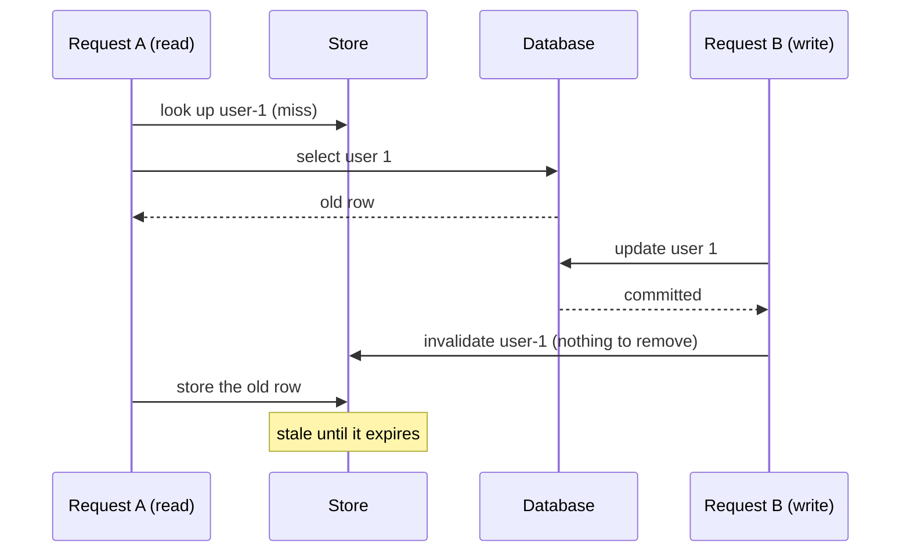

# ADR 266 — The cache middleware passes data to its store, and the store decides how to cache

Status: **Accepted**

## Decision

```ts
import postgres from '@internal/postgres/runtime';
import {
  cacheAnnotation,
  createCacheMiddleware,
  createInMemoryCacheStore,
} from '@internal/middleware-cache';
import type { Contract } from './contract.d';
import contractJson from './contract.json' with { type: 'json' };

// How long entries live is an option of the store, not of the middleware.
const store = createInMemoryCacheStore({ maxEntries: 1000, ttlMs: 60_000 });
const cache = createCacheMiddleware({ store });
const db = postgres<Contract>({
  contractJson,
  url: process.env['DATABASE_URL']!,
  middleware: [cache],
});

// A cached read, stored under the key the application chose.
const alice = await db.orm.public.User.first({ id: 1 }, (m) =>
  m.annotate(cacheAnnotation({ key: 'user-1' })),
);

// After a write has returned, the application removes the entry.
await db.orm.public.User.where({ id: 1 }).update({ name: 'Alicia' });
await cache.invalidate({ keys: ['user-1'] });
```

The cache middleware in [`@internal/middleware-cache`](../../../packages/3-extensions/middleware-cache/README.md) caches the rows of annotated reads in a store, and lets the application remove entries when the data behind them changes. It decides only which reads it serves from the store ([Reads the cache does not serve](#reads-the-cache-does-not-serve)), the key each read is stored under, and that a read's rows are stored only when the read completed. It passes data from annotations and `invalidate` calls to the store and never interprets that data. Decisions about how to cache, such as how entries are grouped, how long they live and what a write should remove, belong to the store or to an extension built on top.

| Concern | Owned by | Through |
| --- | --- | --- |
| The string a read is stored under | Middleware | The annotation's `key`, else a key derived from the query ([Keys](#keys)) |
| Data that groups entries, such as tags or table names | Application | `meta` on the annotation and on `invalidate`, passed to the store unread ([Grouping entries](#grouping-entries-with-meta)) |
| Finding entries by `meta`, how long they live, and whether a read that overlapped an invalidation may store its rows | Store | The three store methods ([The store contract](#the-store-contract)) |
| When to remove entries | Application or extension | `cache.invalidate({ keys, meta })` |

An operation belongs in the middleware only if it cannot be built outside it.

## Why

A cache has to let the application remove an entry when the data behind it changes. Otherwise every read after a write returns stale rows until the entry expires. Removing an entry is simple. The hard question is how much of the policy around removal the middleware should own.

Applications want many policies: tags, namespaces, invalidating by table, versioned keys, and sharing one database read among identical concurrent requests. Each makes choices that suit some applications and not others, such as how to group entries, how to index those groups in a given backend, and what waiting requests do when the read they share fails. If the middleware built any of them in, every user would get its choices, and its edge cases would live in a package that cannot also serve the other schemes. All of them can be built from outside with the operations this ADR defines, so the middleware ships the operations and leaves each policy to a package that owns its choices.

One thing cannot be built outside: stopping a read that overlaps an invalidation from storing rows that predate it. That check needs a number that every process sharing the store agrees on, so the store keeps it.

[@paulwer](https://github.com/paulwer) proposed this design.

## How it works

### Keys

Every entry is stored under one string. When the annotation names one, as in `cacheAnnotation({ key: 'user-1' })`, the middleware uses it as written. Otherwise it calls the `deriveKey(exec, ctx)` option. The default, `deriveKeyFromContentHash`, returns a hash of the statement and its parameters (for Mongo, the command) together with the contract's storage hash. Two callers running the same statement with the same parameters therefore share one entry, and a contract change that alters storage changes every derived key.

`deriveKey` receives the query plan, so an application or extension can shape the keys, for example with a prefix:

```ts
const cache = createCacheMiddleware({
  deriveKey: async (exec, ctx) => `users:${await deriveKeyFromContentHash(exec, ctx)}`,
});
```

A key the annotation names never passes through `deriveKey`, so `invalidate({ keys })` always matches the literal string the application wrote.

### Removing entries

`cache.invalidate({ keys })` passes the keys to the store, which removes them. This is how an application removes entries from the default store: by the keys it named. A derived key is a hash the application never sees, so entries stored under derived keys are removed by `meta`, described next, or left to expire.

The application calls `invalidate` after its write has returned. Outside a transaction, the write has committed by the time it returns. Inside one, the application calls `invalidate` after `db.transaction()` returns. Calling it before the commit is unsafe: a concurrent read could fetch the old, still-committed row and store it after the invalidation ran.

### Grouping entries with `meta`

```ts
// A store that indexes meta.tags, defined in "Example: a tagging store" below.
const cache = createCacheMiddleware({ store: createTagStore() });

await db.orm.public.User.first({ id: 1 }, (m) =>
  m.annotate(cacheAnnotation<TagMeta>({ meta: { tags: ['users'] } })),
);
await cache.invalidate({ meta: { tags: ['users'] } }); // removes every entry tagged 'users'
```

`meta` is any value the application attaches to a read. The middleware passes it to the store when the read starts and again when the read's rows are stored, and passes the `meta` given to `invalidate` to the store's removal. It never reads it. A store that wants to group entries indexes `meta` when it stores an entry and uses that index when it removes them. The [tagging store](#example-a-tagging-store) below does exactly that.

The default store does not index `meta`. When `invalidate` hands it one, it throws `RUNTIME.CACHE_STORE_META_UNSUPPORTED` rather than ignoring it, because an invalidation that silently does nothing is worse than an error.

`meta` is typed by the store. `createCacheMiddleware` infers the `meta` type from the store it is given, so `invalidate({ meta })` is checked against it. `cacheAnnotation<TMeta>(...)` takes the same type parameter, but the compiler does not check that an annotation's `meta` matches the store's type. A store package should therefore export an annotation helper typed with its own `meta`.

### A read that overlaps an invalidation

Without a further check, an invalidation can be undone by a read that was already running, even when the application invalidates correctly after its write commits:



The invalidation came too early to remove anything, and the read then stored what it fetched before the write. Every later read gets the old row until the entry expires.

To prevent this, the store keeps a version number for every key, including keys that hold no value. A key the store has never seen has version 0. The store's `get` returns the current version with the entry. An invalidation increases the version of every key it removes. The store's `set` receives the entry `get` returned, and stores the rows only if the key's version still equals the version on that entry:

```ts
const store = createInMemoryCacheStore();
const cache = createCacheMiddleware({ store });

const entry = await store.get({ key: 'user-1', meta: undefined }); // version 0, no value
await cache.invalidate({ keys: ['user-1'] });                      // the store moves user-1 to version 1
await store.set(entry, rows);                                      // false: version 0 is no longer current
```

For each read in flight, the middleware keeps the entry `get` returned. When the read completes from the database, the middleware calls `set` with that entry and the rows. If the store refuses, the middleware logs the debug event `middleware.cache.store-skipped` and moves on. The middleware keeps no counters of its own. Because the version lives in the store, the check works across every process that shares the store: an invalidation in one process stops a read already running in another process from storing its rows.

### Versions and `meta`

Invalidating by `meta` needs one more step. Suppose a read tagged `users` misses on a key the store has never stored, and while it runs another request invalidates the `users` tag. No entry under that tag has this key, so no key version increases, and the read would store stale rows.

A store that indexes `meta` therefore keeps a version for each group as well, such as one per tag, and an invalidation by `meta` increases it. `get` returns the key's version plus the versions of every group the read's `meta` names, and `set` compares the same sum. This is why `get` receives the read's `meta`: the version it hands out has to cover the groups the read belongs to. The default store does not index `meta` and uses the key's version alone.

### Lifetime

How long an entry lives is the store's decision. The middleware and the annotation have no lifetime option. The default store takes one in its own options, `createInMemoryCacheStore({ maxEntries, ttlMs, clock })`, with defaults of 1000 entries and 60 000 ms, and `ttlMs: Infinity` to never expire. A store that wants a lifetime per entry reads it from `meta` when it stores the entry.

A store must also keep a version it has increased for at least as long as a read can take. If it forgets one sooner, the version reads as 0 again, can equal the version a slow read took before the invalidation, and that read's stale rows are stored. The default store keeps an increased version for `ttlMs`, so a read that takes longer than `ttlMs` and overlaps an invalidation can still store stale rows. With `ttlMs: Infinity` versions are never forgotten, and their number grows with the number of distinct keys invalidated.

### Reads the cache does not serve

`cacheAnnotation({ bypass: true })` makes a read neither use nor fill the cache. Reads without the annotation never touch it either. Neither do reads inside a transaction or on a dedicated connection. Inside a transaction a read must see its own uncommitted writes. A dedicated connection can carry session state, such as a database role, that changes which rows a read returns.

## The store contract

```ts
// packages/3-extensions/middleware-cache/src/cache-store.ts
export type CachedRows = readonly Record<string, unknown>[];

export interface CacheEntry<TMeta = unknown, TValue = CachedRows> {
  readonly key: string;
  readonly meta: TMeta | undefined;
  readonly version: number;
  readonly data: { readonly empty: true } | { readonly empty: false; readonly value: TValue };
}

export interface CacheStore<TMeta = unknown, TValue = CachedRows> {
  get(target: {
    readonly key: string;
    readonly meta: TMeta | undefined;
  }): Promise<CacheEntry<TMeta, TValue>>;
  set(entry: CacheEntry<TMeta, TValue>, value: TValue): Promise<boolean>;
  unset(target: {
    readonly keys: readonly string[] | undefined;
    readonly meta: TMeta | undefined;
  }): Promise<void>;
}
```

- **`get({ key, meta })`** always returns an entry. On a miss, `data` is `{ empty: true }`, and the entry still carries the key, the read's `meta` and the current version.
- **`set(entry, value)`** stores `value` if the version on the entry is still current, and returns whether it did. There is no unconditional write. Filling the cache ahead of time is a `get` followed by a `set`.
- **`unset({ keys, meta })`** removes the named keys and every entry matching `meta`, in one call so the store can batch the work.
- A store changes a version only in `unset`. It may forget a version after a while, which then reads as 0.

A store author takes on these obligations:

1. The comparison and the write in `set` happen as one step that no `unset` of the same key can fall between: one synchronous step in memory, or one script on a server such as Redis.
2. `unset` increases the version of every key it removes, including named keys that hold no value. A store that indexes `meta` also increases the version of each group `meta` names, and adds those group versions to the version `get` returns for a read under that `meta`.
3. `unset` removes a key from every `meta` index when it removes the key.
4. An increased version is kept at least as long as a read can take.
5. A store that cannot act on a `meta` it is given throws rather than ignoring it.
6. `unset` does not run queries through the runtime that uses the middleware.

The value type defaults to `CachedRows`, the rows this middleware stores, and `createCacheMiddleware` accepts only a store of rows. The value type is a parameter so the same store type can serve other caches. Every method takes one object, or an entry and a value, so a store written against a different argument shape fails to compile instead of misreading its arguments. `unset` is required, because a store that cannot remove entries brings back the stale reads this design exists to prevent.

## Example: a tagging store

A store that groups entries by `meta.tags`, kept short by never expiring entries or forgetting versions:

```ts
import type { CachedRows, CacheStore } from '@internal/middleware-cache';

interface TagMeta {
  readonly tags: readonly string[];
}

function createTagStore(): CacheStore<TagMeta> {
  const values = new Map<string, CachedRows>();
  const versions = new Map<string, number>();
  const keysByTag = new Map<string, Set<string>>();
  const versionOf = (name: string) => versions.get(name) ?? 0;
  const bump = (name: string) => versions.set(name, versionOf(name) + 1);
  const combinedVersion = (key: string, meta: TagMeta | undefined) =>
    (meta?.tags ?? []).reduce((sum, tag) => sum + versionOf(`tag:${tag}`), versionOf(`key:${key}`));
  const remove = (key: string) => {
    values.delete(key);
    bump(`key:${key}`);
    for (const tagged of keysByTag.values()) {
      tagged.delete(key);
    }
  };

  const index = (key: string, meta: TagMeta | undefined) => {
    for (const tag of meta?.tags ?? []) {
      keysByTag.set(tag, (keysByTag.get(tag) ?? new Set()).add(key));
    }
  };

  return {
    async get({ key, meta }) {
      const value = values.get(key);
      if (value !== undefined) {
        index(key, meta);
      }
      return {
        key,
        meta,
        version: combinedVersion(key, meta),
        data: value === undefined ? { empty: true } : { empty: false, value },
      };
    },
    async set(entry, value) {
      if (entry.version !== combinedVersion(entry.key, entry.meta)) {
        return false;
      }
      values.set(entry.key, value);
      index(entry.key, entry.meta);
      return true;
    },
    async unset({ keys, meta }) {
      for (const key of keys ?? []) {
        remove(key);
      }
      for (const tag of meta?.tags ?? []) {
        for (const key of [...(keysByTag.get(tag) ?? [])]) {
          remove(key);
        }
        keysByTag.delete(tag);
        bump(`tag:${tag}`);
      }
    },
  };
}
```

Invalidating the `users` tag increases the tag's version, so a read tagged `users` that was in flight is refused even if the store had never seen its key. It also increases the version of every key it removes, so a read of one of those keys under different `meta` is refused too. Removing a key takes it out of every tag's index, so a later invalidation of another tag cannot remove an entry stored again under different tags. A hit under tags the entry was not stored with registers the key under those tags too, so invalidating any tag a reader used removes the entry that reader was served.

## Consequences

- An annotated read that completes from the database is always offered to the store, unless it is bypassed or runs inside a transaction or on a dedicated connection. The store decides whether to keep it, and for how long.
- With the default store, the application removes entries by the keys it named. Grouping entries by `meta` requires a store that indexes it.
- Store authors take on the obligations listed under [The store contract](#the-store-contract).
- Removing entries when a write commits, rather than by calling `invalidate` after the write returns, belongs in this package rather than in an extension. It makes no decisions of its own: it names keys or `meta` and reaches the same `invalidate` call. What it adds is waiting until the write's transaction has committed, which is best done once, by the middleware that already holds the store, rather than rebuilt by every extension. That waiting needs a runtime hook that runs after a transaction commits.
- Serving an expired entry while refreshing it cannot be built outside. A store can return the expired rows, but only the middleware can serve them and also let the query run to refresh the entry.

### What stays outside the middleware, and how to build it

- **Tags.** The store indexes `meta.tags` when it stores an entry, and `unset({ meta: { tags } })` removes the tagged keys and increases their versions and the tag's version. The [example](#example-a-tagging-store) above is a complete sketch.
- **Namespaces.** A namespace is one label per entry in `meta`, handled like a tag, or a prefix that `deriveKey` adds to every key.
- **Named stores.** One store that receives every entry and routes it by `meta.store` to the real backend.
- **Invalidating by table.** Each read's `meta` lists the tables it touches, typically through the extension's annotation helper, and the store indexes them. The extension's own middleware reads a write's tables from its query plan and calls `cache.invalidate({ meta: { tables } })`. Inside a transaction it must wait until the transaction commits, which needs the runtime hook named under the consequences above.
- **Versioned keys.** `deriveKey` includes a generation number in every key, and an invalidation increases it. The number lives in the store's backend so that every process reads the same one. Old keys are never looked up again and expire on the store's schedule.
- **Sharing one read among identical concurrent requests.** A separate middleware placed after the cache, built on the runtime's `interceptQuery` and `afterQuery` hooks. Its `interceptQuery` runs only for reads the cache did not answer.

## Alternatives considered

- **Tags built into the middleware and the default store,** with a tag-to-keys index and a `deleteByTag` operation. Rejected: it puts one grouping scheme, with its index and cleanup rules, in a package that should not choose one. Opaque `meta` and a store that indexes it give a tagging extension everything it needs.
- **A function passed to `invalidate`,** run against the store or over its entries. Rejected: a function is not data. It cannot travel in an annotation on a write, it cannot be sent to a shared store, and it makes callers hold a reference to the store.
- **Version counters in the middleware,** one per key in the middleware's memory. Rejected: the check would then protect only reads in the same process, and the middleware would track a number the store already needs to know.
- **A `set` without the version check, or with the version as a separate argument.** Rejected: an unchecked write lets a slow read overwrite an invalidation, and the entry `get` returns already carries the version.
- **A lifetime option on the middleware or the annotation.** Rejected: lifetime is the store's decision. A read that named no lifetime would need its own rule, and the middleware's lifetime and the store's could disagree.
- **Positional arguments, such as `set(key, meta, value)` and `unset(key, meta)`.** Rejected: a store written as `unset(key)` still compiles against that shape and deletes the key `undefined` when it is handed `meta`.
- **Naming `meta` `attributes` or `labels`.** `attributes` suggests a meaning the middleware assigns, and it assigns none. Labels are usually strings, which describes tags rather than an arbitrary value. `meta` says what it is: data that travels with the entry and that only the store interprets.
