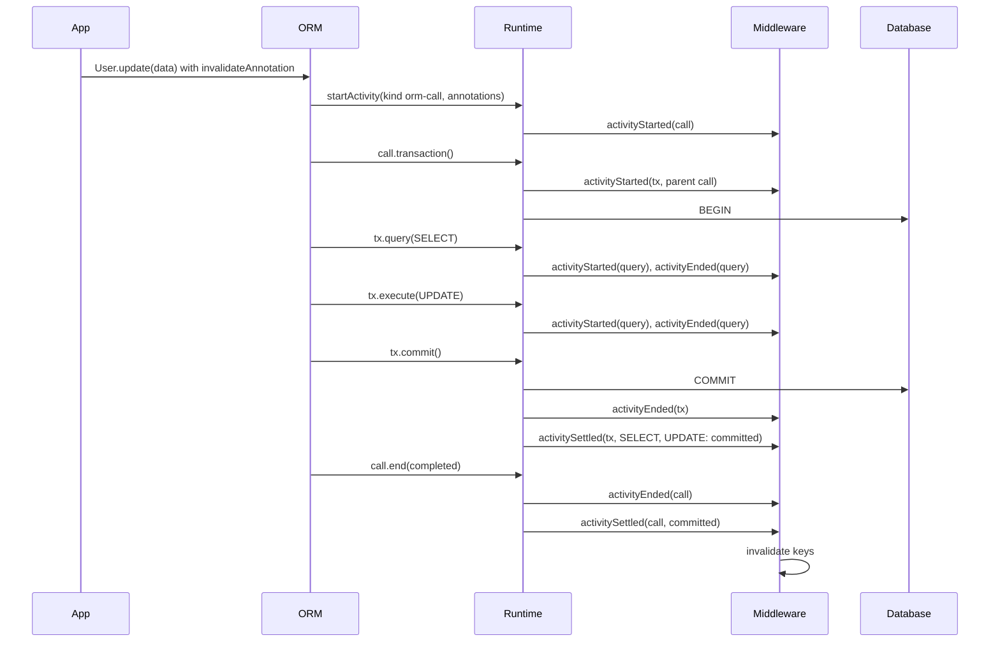

# ADR 267 — The runtime middleware observes a tree of activities, each started, ended and settled

Status: **Proposed**

An **activity** is the name for an activity in this tree. The hooks are `activityStarted`, `activityEnded` and `activitySettled`; a client opens an activity with `startActivity` and receives an `ActivityHandle`.

## Decision

```ts
import type { CrossFamilyMiddleware } from '@internal/framework-components/runtime';

// A cache that invalidates once the thing the user annotated has committed.
// It does not know whether the activity is an ORM call, a builder query or a transaction.
export const cache: CrossFamilyMiddleware = {
  name: 'cache',
  async activitySettled(activity, result, ctx) {
    const target = invalidateAnnotation.read(activity);
    if (target === undefined || result.outcome === 'rolled-back') return;
    await invalidate(target);
  },
};
```



The runtime's middleware sees a tree. An **activity** is one act by an actor: a query a client ran, a transaction a client or the user opened, an ORM call the user made. An activity may have a parent, to any depth. The runtime hosts the tree and fires the hooks; it starts no activity on its own.

Every activity has the same three lifecycle moments, and every middleware hook is one of them:

- **`activityStarted`**: the act begins.
- **`activityEnded`**: the act ends, with the outcome as the actor saw it: `completed` or `failed`.
- **`activitySettled`**: the act's effects are final, with `committed`, `rolled-back` or `unknown`. It fires right after `activityEnded` when no enclosing transaction is open; otherwise when the outermost enclosing transaction ends. An error from an `activitySettled` hook is logged through `ctx.log.error` and swallowed.

An activity carries the annotations the actor attached to it. The user's annotations on an ORM call live on the call activity; the statements the ORM runs beneath it carry none. A middleware reads an activity's annotations through the annotation's handle, as it reads a plan's today.

Clients start activities through the runtime. `query()` and `execute()` start a query activity for the call's duration. `transaction()` starts a transaction activity whose `commit()` and `rollback()` end it. `startActivity({ kind, annotations })` on the runtime's queryables starts an activity for an act the runtime would not otherwise see, and returns an `ActivityHandle` of the same queryable shape with `end({ outcome })`: queries run through the handle are the activity's children, and `handle.transaction()` starts a transaction activity beneath it. The user-facing types (`tx`, the client facades) omit the method, as `tx` omits `transaction` today.

The SQL ORM starts an activity of kind `orm-call` for every terminal, including single-statement terminals and a call served without any query, and runs its statements and its own transaction through the handle. The runtime's kinds are `query` and `transaction`. A kind is a label for tracing; no middleware branches on it.

Each activity has its own middleware context, and every hook of that activity receives the same `ctx`. A hook reaches its activity from `ctx`, not from the plan.

A middleware keeps state on an activity with `ctx.state(key)`, which returns that middleware's state object for the activity, created empty on first use. The key is a `Symbol()` the middleware holds privately, so no other middleware can read or overwrite its state. The state lives as long as the activity's `ctx` and is dropped when the activity settles. A tracer keeps its span this way and finds its parent's through `ctx.parent`:

```ts
const tracing = Symbol('tracing');

activityStarted(activity, ctx) {
  const parentSpan = ctx.parent?.state(tracing).span;
  ctx.state(tracing).span = tracer.startSpan(activity.kind, { parent: parentSpan });
},
activitySettled(activity, result, ctx) {
  ctx.state(tracing).span?.end(result.outcome);
},
```

A child learns its parent because its opener passed the handle; nothing is propagated through ambient context.

### When an activity settles

An activity with no enclosing transaction settles right after it ends: `committed` when it completed, `unknown` when it failed, because a statement that errors on the response path may already have applied. An activity inside a transaction settles when the outermost enclosing transaction ends, with that transaction's outcome. This is the rule Rails `after_commit` and Django `on_commit` follow: a hook registered outside any transaction runs immediately, one registered inside is held until the outermost transaction commits. An activity's own end cannot stand in for its commit, because inside a transaction it ends before the `COMMIT`, and acting then lets a concurrent read store rows the transaction is about to replace.

### How a transaction activity settles, and what its subtree learns

Every activity beneath a transaction settles with the transaction's outcome:

| What happened | Outcome |
|---|---|
| `commit()` resolves and no query in the transaction failed | `committed` |
| `commit()` resolves after a query in the transaction failed | `unknown` |
| `rollback()` settles and no commit was attempted | `rolled-back` |
| `commit()` rejects, whether or not a rollback follows | `unknown` |

`unknown` means the runtime cannot tell whether the writes landed. A rejected `COMMIT` may have landed on the server before the error came back, and the cleanup `ROLLBACK` that follows succeeds either way. A resolved `COMMIT` after a failed statement is answered by Postgres with a silent `ROLLBACK`, while other databases commit; the runtime does not know which happened. A consumer that must not miss a committed write treats `unknown` like `committed`.

`activitySettled` is the shape of Spring's `TransactionSynchronization.afterCompletion(status)` and JTA's `Synchronization`: one completion callback, the statuses committed, rolled back and unknown, and errors from the callback logged rather than propagated. ORMs that offer only two outcomes (Rails `after_commit` and `after_rollback`, Django `on_commit`, Hibernate's `successful` flag) fire nothing in the two cases above, and their documentation warns against relying on the hooks to keep external state consistent.

### What becomes an instance of the tree

| Mechanism | Becomes |
|---|---|
| `groupingKey` on each plan of an ORM call (ADR 160, never built) | the parent activity's identity |
| `planExecutionId` (ADR 220) | a query activity's identity |
| `afterTransaction` (ADR 260) | `activitySettled` on a query activity |
| transaction begin and end hooks (agreed for later, never built) | `activityStarted` and `activityEnded` on a transaction activity |
| the call's annotations copied onto each statement (discussed, never built) | annotations on the call activity |

## Context

The middleware lifecycle is defined per query. Each need to reason about something other than the query was answered by hand: ADR 160 decided a `groupingKey` on each plan of an ORM call (never built); ADR 220 added `planExecutionId` per query; ADR 260 added `afterTransaction`, where the runtime walks from each query to its transaction on the query's behalf; transaction begin and end hooks were agreed for later. A convention copying the call's annotations onto each statement was discussed and rejected.

Most ORM calls run several statements. A single-row `update()` is a `SELECT` then an `UPDATE` in a transaction the ORM opens. The user annotates the call, and the ORM validates and discards the annotation because no statement is the call.

The scenarios this was tested against, and the full reasoning, are in the project folder `projects/activity-tree/` while the project is open.

## Consequences

- `afterTransaction` (ADR 260) becomes `activitySettled` on a query activity. Its outcome rules are the rules for a transaction activity and apply to every activity beneath it. ADR 260 is amended to say so.
- ADR 160's `groupingKey` is superseded by the parent activity's identity. ADR 160 is amended.
- `planExecutionId` (ADR 220) is a query activity's identity. Unchanged.
- The deferred transaction begin and end hooks are `activityStarted` and `activityEnded` on a transaction activity. Nothing further is needed.
- An activity under an open transaction is held, with its children, until that transaction ends. Same cost as `afterTransaction` today. A transaction that never ends holds its subtree, as it holds its queries today.
- Nested transactions, when built, are a transaction activity under a transaction activity. `activitySettled` waits for the outermost. No new hook.
- Mongo has no transactions; every Mongo activity settles right after it ends.
- The cache middleware implements `activitySettled` only, reads its annotation from any activity, and never checks the activity's kind or the transaction.
- Touches: `RuntimeMiddleware` and `RuntimeMiddlewareContext` in `framework-components`; the runners in `run-with-middleware.ts`; the SQL runtime's transaction bookkeeping and queryables; the Mongo runtime; the Supabase role session; `withMutationScope` and every terminal in `sql-orm-client`; the ORM's structural `RuntimeQueryable` type.

## Alternatives considered

- **Copy the call's annotations onto every statement.** Misstates what was annotated and multiplies the payload. Rejected.
- **Attach them to one chosen statement.** The ORM decides which statement represents the call. Rejected.
- **Parent pointers only, no child list.** The runtime already keeps the list for transactions and needs it to fire `activitySettled`. Rejected.
- **Two completion outcomes, as in Rails.** A rejected `COMMIT` and a silently rolled-back `COMMIT` fire nothing, and a cache holds stale rows until expiry. Spring and JTA keep a third status for exactly these cases. Rejected.
- **`startActivity` on the user-facing scope.** Users would see a client-only method on `tx`. Rejected.
- **A shared, string-keyed state bag on `ctx`**, as .NET `Activity.SetCustomProperty` or Koa's `ctx.state`. Middleware could read or overwrite each other's entries. Rejected for `ctx.state(key)` with a private symbol.
- **`AsyncLocalStorage` to find the parent.** Rejected by ADR 160 and ADR 220; still rejected.
