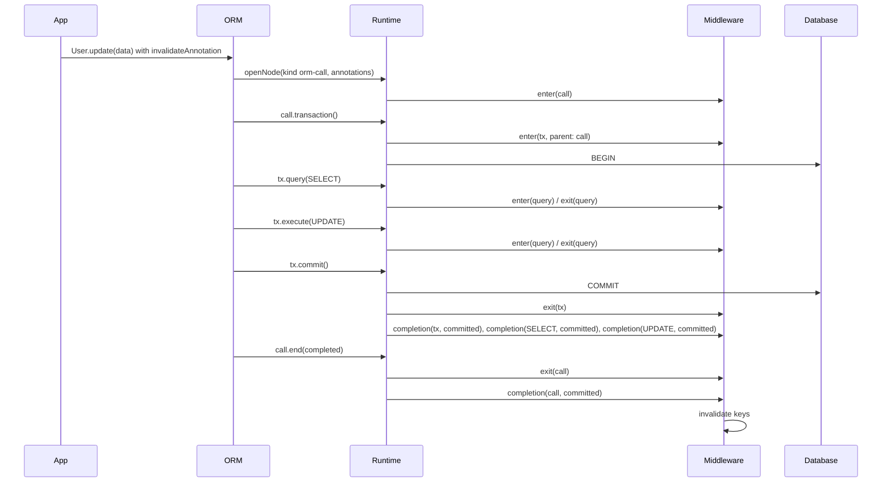

# ADR 267 — The runtime middleware observes a tree of nodes, each with enter, exit and completion

Status: **Proposed**

The identifiers in this ADR (`onCompletion`, `openNode`, `NodeHandle`, the node kinds) are working names, to be settled when the decision is implemented.

## Decision

```ts
import type { CrossFamilyMiddleware } from '@internal/framework-components/runtime';

// A cache that invalidates once the thing the user annotated has committed.
// It does not know whether the node is an ORM call, a builder query or a transaction.
export const cache: CrossFamilyMiddleware = {
  name: 'cache',
  async onCompletion(node, result, ctx) {
    const target = invalidateAnnotation.read(node);
    if (target === undefined || result.outcome === 'rolled-back') return;
    await invalidate(target);
  },
};
```



The runtime's middleware sees a tree. A **node** is one act by an actor: a query a client ran, a transaction a client or the user opened, an ORM call the user made. A node may have a parent, to any depth. The runtime hosts the tree and fires the hooks; it opens no node on its own.

Every node has the same three lifecycle moments, and every middleware hook is one of them:

- **enter**: the act begins.
- **exit**: the act ends, with the outcome as the actor saw it: `completed` or `failed`.
- **completion**: the act's effects are final, with `committed`, `rolled-back` or `unknown`. It fires right after exit when no enclosing transaction is open; otherwise when the outermost enclosing transaction ends. An error from a completion hook is logged through `ctx.log.error` and swallowed.

A node carries the annotations the actor attached to it. The user's annotations on an ORM call live on the call node; the statements the ORM runs beneath it carry none. A middleware reads a node's annotations through the annotation's handle, as it reads a plan's today.

Clients open nodes through the runtime. `query()` and `execute()` open a query node for the call's duration. `transaction()` opens a transaction node whose `commit()` and `rollback()` are its exit. A new method on the runtime's queryables opens a node for an act the runtime would not otherwise see, and returns a handle of the same queryable shape: queries run through the handle are the node's children, and `handle.transaction()` opens a transaction node beneath it. The user-facing types (`tx`, the client facades) omit the method, as `tx` omits `transaction` today.

The SQL ORM opens a node for every terminal, including single-statement terminals and a call served without any query, and runs its statements and its own transaction through the handle.

A hook reaches its node from the middleware context, not from the plan. A child learns its parent because its opener passed the handle; nothing is propagated through ambient context.

### How a transaction node ends, and what its subtree learns

The completion outcome of every node beneath a transaction is the transaction's:

| What happened | Outcome |
|---|---|
| `commit()` resolves and no query in the transaction failed | `committed` |
| `commit()` resolves after a query in the transaction failed | `unknown` |
| `rollback()` settles and no commit was attempted | `rolled-back` |
| `commit()` rejects, whether or not a rollback follows | `unknown` |

`unknown` means the runtime cannot tell whether the writes landed. A rejected `COMMIT` may have landed on the server before the error came back, and the cleanup `ROLLBACK` that follows succeeds either way. A resolved `COMMIT` after a failed statement is answered by Postgres with a silent `ROLLBACK`, while other databases commit; the runtime does not know which happened. A consumer that must not miss a committed write treats `unknown` like `committed`.

This is the shape of Spring's `TransactionSynchronization.afterCompletion(status)` and JTA's `Synchronization`: one completion callback, the statuses committed, rolled back and unknown, and errors from the callback logged rather than propagated. ORMs that offer only two outcomes (Rails `after_commit` and `after_rollback`, Django `on_commit`, Hibernate's `successful` flag) fire nothing in the two cases above, and their documentation warns against relying on the hooks to keep external state consistent.

### What becomes an instance of the tree

| Mechanism | Becomes |
|---|---|
| `groupingKey` on each plan of an ORM call (ADR 160, never built) | the parent node's identity |
| `planExecutionId` (ADR 220) | a query node's identity |
| `afterTransaction` (ADR 260) | completion on a query node |
| transaction begin and end hooks (agreed for later, never built) | enter and exit on a transaction node |
| the call's annotations copied onto each statement (discussed, never built) | annotations on the call node |

## Context

The middleware lifecycle is defined per query. Each need to reason about something other than the query was answered by hand: ADR 160 decided a `groupingKey` on each plan of an ORM call (never built); ADR 220 added `planExecutionId` per query; ADR 260 added `afterTransaction`, where the runtime walks from each query to its transaction on the query's behalf; transaction begin and end hooks were agreed for later. A convention copying the call's annotations onto each statement was discussed and rejected.

Most ORM calls run several statements. A single-row `update()` is a `SELECT` then an `UPDATE` in a transaction the ORM opens. The user annotates the call, and the ORM validates and discards the annotation because no statement is the call.

The scenarios this was tested against, and the full reasoning, are in the project folder `projects/runtime-node-tree/` while the project is open.

## Consequences

- `afterTransaction` (ADR 260) becomes completion on a query node. Its outcome rules are the rules for a transaction node and apply to every node beneath it. ADR 260 is amended to say so.
- ADR 160's `groupingKey` is superseded by the parent node's identity. ADR 160 is amended.
- `planExecutionId` (ADR 220) is a query node's identity. Unchanged.
- The deferred transaction begin and end hooks are enter and exit on a transaction node. Nothing further is needed.
- A node under an open transaction is held, with its children, until that transaction ends. Same cost as `afterTransaction` today. A transaction that never ends holds its subtree, as it holds its queries today.
- Nested transactions, when built, are a transaction node under a transaction node. Completion waits for the outermost. No new hook.
- Mongo has no transactions; every Mongo node completes right after exit.
- The cache middleware implements completion only, reads its annotation from any node, and never checks the node's kind or the transaction.
- Touches: `RuntimeMiddleware` and `RuntimeMiddlewareContext` in `framework-components`; the runners in `run-with-middleware.ts`; the SQL runtime's transaction bookkeeping and queryables; the Mongo runtime; the Supabase role session; `withMutationScope` and every terminal in `sql-orm-client`; the ORM's structural `RuntimeQueryable` type.

## Alternatives considered

- **Copy the call's annotations onto every statement.** Misstates what was annotated and multiplies the payload. Rejected.
- **Attach them to one chosen statement.** The ORM decides which statement represents the call. Rejected.
- **Parent pointers only, no child list.** The runtime already keeps the list for transactions and needs it to fire completion. Rejected.
- **Two completion outcomes, as in Rails.** A rejected `COMMIT` and a silently rolled-back `COMMIT` fire nothing, and a cache holds stale rows until expiry. Spring and JTA keep a third status for exactly these cases. Rejected.
- **The opening method on the user-facing scope.** Users would see a client-only door on `tx`. Rejected.
- **`AsyncLocalStorage` for the parent.** Rejected by ADR 160 and ADR 220; still rejected.
