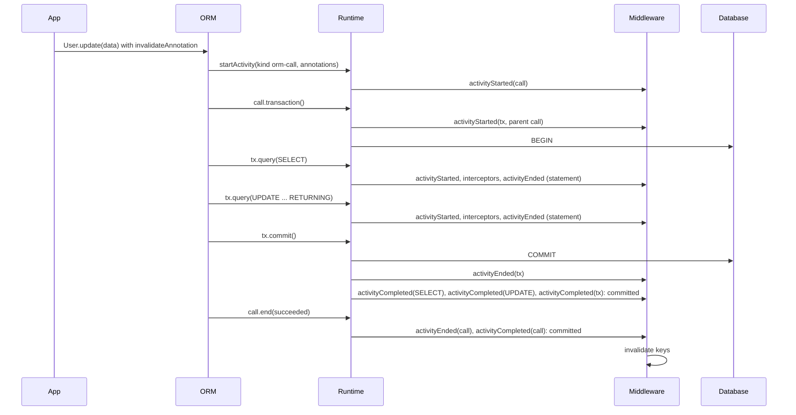

# ADR 271 — The runtime middleware observes a tree of activities, each started, ended and completed

Status: **Proposed**

## Decision

```ts
import type { CrossFamilyMiddleware } from '@internal/framework-components/runtime';

// A cache that invalidates once the thing the user annotated has committed.
// It does not know whether the activity is an ORM call, a statement or a transaction.
export const cache: CrossFamilyMiddleware = {
  name: 'cache',
  async activityCompleted(activity, result, ctx) {
    const target = invalidateAnnotation.read(activity);
    if (target === undefined || result.outcome === 'rolled-back') return;
    await invalidate(target);
  },
};
```



The runtime's middleware sees a tree. An **activity** is one act by an actor: a statement a client sent, a transaction a client or the user opened, an ORM call the user made. An activity may have a parent, to any depth. The runtime hosts the tree and fires the hooks; it starts no activity on its own.

The runtime defines two kinds of activity:

- **`statement`**: one statement sent to the database. `query()` sends it for its rows and `execute()` sends it for its statistics, such as the number of affected rows; the activity's `returns` field is `'rows'` or `'stats'` accordingly. Both have the same lifecycle. A statement is a leaf.
- **`transaction`**: started by `transaction()`, ended by `commit()` or `rollback()`.

Clients add their own kinds. The SQL ORM starts one activity of kind `orm-call` for every terminal method. A kind is a label; the framework names no client vocabulary.

Middleware has two kinds of hook: **lifecycle events**, which observe, and **interceptors**, which can change or stop a statement while the runtime executes it.

### Lifecycle events

Every activity has the same three, and each is one hook whatever the activity's kind:

- **`activityStarted(activity, ctx)`**: the act begins.
- **`activityEnded(activity, result, ctx)`**: the act ends, with the outcome as the actor saw it: `succeeded`, `failed`, or `stopped` when the caller stopped reading a row stream early. A statement's result also carries its latency, where its result came from (`source: 'driver' | 'middleware'`), and its row count or statistics, discriminated by `result.returns`. An error thrown from this hook fails the activity: the actor receives it. A latency budget fails a statement this way.
- **`activityCompleted(activity, result, ctx)`**: the act's effects are final, with `committed`, `rolled-back` or `unknown`. An error thrown from this hook is passed to `ctx.log.error` and swallowed; later middleware still run.

A middleware that only cares about some kinds checks `activity.kind` at the top of the hook.

### When an activity completes

An activity with no enclosing transaction completes right after it ends: `committed` when it succeeded, `unknown` when it failed or was stopped, because a statement that errors on the response path, or whose caller stopped reading, may already have applied.

An activity inside a transaction completes when the outermost enclosing transaction ends, with that transaction's outcome:

| What happened | Outcome |
|---|---|
| `commit()` resolves and no statement in the transaction failed | `committed` |
| `commit()` resolves after a statement in the transaction failed | `unknown` |
| `rollback()` settles and no commit was attempted | `rolled-back` |
| `commit()` rejects, whether or not a rollback follows | `unknown` |

`unknown` means the runtime cannot tell whether the writes landed. A rejected `COMMIT` may have landed on the server before the error came back, and the cleanup `ROLLBACK` that follows succeeds either way. A resolved `COMMIT` after a failed statement is answered by Postgres with a silent `ROLLBACK`, while other databases commit. A consumer that must not miss a committed write treats `unknown` like `committed`.

When a transaction ends, the activities beneath it complete children first: its statements and child activities in the order they started, then the transaction itself, then its parent if the parent has already ended. An activity's own end cannot stand in for its completion: inside a transaction it ends before the `COMMIT`, and acting then lets a concurrent read store rows the transaction is about to replace.

### Interceptors

The runtime executes statements and nothing else, so three of the four interceptors exist only on statement activities. In the order the runtime runs them:

| Interceptor | When it runs | What it can do |
|---|---|---|
| `beforeCompile` | before the query tree becomes SQL (SQL family only) | return a rewritten query tree, for example to add a soft-delete filter |
| `beforeEncode` | after lowering, before parameter values are encoded by codecs | throw to block the statement; change parameter values through the mutator, for example to encrypt them |
| `intercept` | instead of running the activity | supply the result, so the work never runs |
| `onRow` | for each row the database returns | observe the row, or throw to stop the stream |

`intercept` has one handler per result type, so each handler's return type is fixed and checked by the compiler:

```ts
intercept?: {
  onQuery?(activity, ctx): Promise<{ readonly rows: Iterable<Row> | AsyncIterable<Row> } | undefined>;
  onExecute?(activity, ctx): Promise<{ readonly stats: RuntimeStatementStats } | undefined>;
  onActivity?(activity, ctx): Promise<{ readonly result: unknown } | undefined>;
};
```

`onQuery` and `onExecute` run for statements, named after the runtime method that sent them. `onActivity` runs for activities a client started; its result type belongs to the client, so the framework types it `unknown` and the client checks what it receives. Middleware run in registration order and the first handler that returns a result wins. A transaction has no handler: it has no result to supply, and its statements are run by its actor, not the runtime.

### Starting activities

`query()` and `execute()` start a statement activity for the call's duration. `transaction()` starts a transaction activity that `commit()` and `rollback()` end. A statement sent on a transaction's connection while the transaction is open is a child of that transaction, because the database runs it inside the transaction's session.

`startActivity` on the runtime's queryables starts an activity for an act the runtime would not otherwise see:

```ts
startActivity<TResult>(activity: {
  readonly kind: string;
  readonly contentHash: string;
  readonly annotations?: Annotations;
}): Promise<ActivityHandle<TResult>>;

interface ActivityHandle<TResult> extends RuntimeQueryable {
  readonly intercepted: { readonly result: TResult } | undefined;
  end(result: { readonly outcome: 'succeeded' | 'failed' | 'stopped'; readonly result?: TResult }): Promise<void>;
}
```

Statements sent through the handle are the activity's children, and `handle.transaction()` starts a transaction activity beneath it. `intercepted` is set when an `intercept.onActivity` handler supplied a result; the client then returns it without running anything. `end()` hands the runtime the value the client returns to its caller, which the runtime passes to middleware without reading it. Ending an activity while one of its children is still open is a runtime error.

The SQL ORM's terminal methods follow this shape:

```ts
const call = await runtime.startActivity<Row[]>({ kind: 'orm-call', contentHash, annotations });
if (call.intercepted) {
  await call.end({ outcome: 'succeeded' });
  return call.intercepted.result;
}
const rows = await queryPlanRows(call, plan).toArray();
await call.end({ outcome: 'succeeded', result: rows });
return rows;
```

The user-facing types (`tx`, the client facades) omit `startActivity`, as `tx` has no `transaction` method today.

### Annotations

An annotation lives on the activity the user annotated. An annotation on an ORM call lives on the call activity, and the statements the ORM sends beneath it carry none. A SQL builder query the user annotates is itself the statement activity, and carries its annotations as today. A middleware reads an activity's annotations through the annotation's handle, as it reads a plan's today, and acts only on the activity in hand, never on its parent.

### Content hash

Every activity has a content hash: an opaque digest of what it does, used to derive a cache key when the annotation names none, and to name spans. For a statement the runtime computes it from the contract's storage hash, the statement text and its parameters, as `ctx.contentHash` does today. For a client activity, the client supplies it; the SQL ORM hashes the model, the terminal method and the collection's state.

### The middleware context

Each activity has its own `ctx`, and every hook of that activity receives the same one.

- **`ctx.parent`** is the parent activity's context, or `undefined` at the root. A child learns its parent because its opener passed the handle; nothing is propagated through ambient context.
- **`ctx.inTransaction()`** walks up the parents and returns whether any of them is a transaction.
- **`ctx.scope`** stays as today: `'runtime'`, `'connection'` or `'transaction'`, the scope of the queryable the activity was started on.
- **`ctx.state(key)`** returns the state object stored under `key` for this activity, created empty on first use. The key is a string or a symbol, and the runtime places no constraint on it: two middleware that use the same key share the object, and a middleware that wants its state to itself uses a `Symbol()` or an unusual string. The state is dropped when the activity completes.

A tracer keeps its span this way and finds its parent's through `ctx.parent`:

```ts
const tracing = Symbol('tracing');

activityStarted(activity, ctx) {
  const parentSpan = ctx.parent?.state(tracing).span;
  ctx.state(tracing).span = tracer.startSpan(activity.kind, { parent: parentSpan });
},
activityCompleted(activity, result, ctx) {
  ctx.state(tracing).span?.end(result.outcome);
},
```

### Caching

The cache middleware applies one rule to every kind of activity: when the activity carries a cache annotation, serve it from the store through `intercept`, and on a miss store the result it ended with, if it succeeded. The key is the annotation's `key`, or else one derived from the activity's content hash. An annotated ORM call is cached as a whole: on a hit the ORM sends no statements.

The cache neither serves nor stores an activity for which `ctx.inTransaction()` is true, because a transaction must read its own uncommitted writes and the cache cannot know what the transaction changed until it commits. It also skips an activity whose `ctx.scope` is `'connection'`, because a held connection can carry session state, such as a database role, that changes which rows a statement returns.

## Context

The middleware lifecycle is defined per statement. Each need to reason about something other than the statement was answered by hand: ADR 160 decided a `groupingKey` on each plan of an ORM call (never built); ADR 220 added `planExecutionId` per execution; ADR 260 added `afterTransaction`, where the runtime walks from each statement to its transaction on the statement's behalf; transaction begin and end hooks were agreed for later. A convention copying the call's annotations onto each statement was discussed and rejected.

Most ORM calls send several statements. A single-row `update()` sends a `SELECT` then an `UPDATE` in a transaction the ORM opens. The user annotates the call, and the ORM puts the annotation on the `UPDATE` only. For a write with a relation callback, or a create on a model with multi-table inheritance, the annotation reaches no statement. No statement represents the call, so nothing can observe it, cache it, or act once it has committed.

The per-statement hooks also mix two jobs. Some only observe (`afterQuery` for a slow-query warning); some change or stop the statement (`beforeQuery` for lints, `interceptQuery` for the cache). Each was split again by operation, so `query()` and `execute()` had a full set each.

## Prior art

- **.NET `System.Diagnostics.Activity`** has the same shape: `ActivitySource.StartActivity` returns an `Activity` with a parent, and it maps onto OpenTelemetry spans.
- **Spring's `TransactionSynchronization.afterCompletion(status)`** and **JTA's `Synchronization`** are the completion hook: one callback, the statuses committed, rolled back and unknown, errors logged rather than propagated. Rails `after_commit` and Django `on_commit` fire immediately outside a transaction and wait for the outermost commit inside one, which is the rule for when an activity completes.
- **EF Core** separates interceptors, which "allow modification or suppression of the operation", from diagnostic listeners and logging, which observe. Its command interceptors are split by result type (`ReaderExecuting`, `NonQueryExecuting`), as `intercept` is.
- **Rails `transaction_open?`, Django `in_atomic_block`, Ecto `in_transaction?`** expose "inside a transaction?" as one check, as `ctx.inTransaction()` does. Shopify's IdentityCache skips its cache whenever a transaction is open.

## Consequences

- The per-statement hooks map onto the new ones:

  | Before | After |
  |---|---|
  | `beforeQuery`, `beforeExecute` | `beforeEncode` |
  | `interceptQuery`, `interceptExecute` | `intercept.onQuery`, `intercept.onExecute` |
  | `onRow` | `onRow` |
  | `afterQuery`, `afterExecute` | `activityEnded` on a statement |
  | `afterTransaction` (ADR 260) | `activityCompleted` on a statement |
  | `beforeCompile` | unchanged |

  Every middleware is rewritten: the cache, budgets, lints, the demo's slow-query warning, and external middleware. ADR 260 is amended to say so.
- ADR 160's `groupingKey` is superseded by the parent activity. ADR 160 is amended.
- `planExecutionId` (ADR 220) is a statement activity's identity.
- The deferred transaction begin and end hooks are `activityStarted` and `activityEnded` on a transaction activity.
- Middleware state moves from `WeakMap`s keyed by plan to `ctx.state(key)`. This also removes the case ADR 260 documents, where the hook before encoding and the hooks after it receive different plan objects.
- The runtime always holds a transaction's child activities until the transaction ends, whether or not any middleware implements `activityCompleted`. A transaction that never ends holds them, as it holds its statements today.
- Nested transactions, when built, are a transaction activity under a transaction activity, and completion waits for the outermost.
- Mongo has no transactions; every Mongo activity completes right after it ends.
- The direct single-client Postgres driver runs a runtime-scope statement sent while a transaction is open inside that transaction, and the runtime cannot see it. That limit is unchanged.
- Touches: `RuntimeMiddleware` and `RuntimeMiddlewareContext` in `framework-components`; the runners in `run-with-middleware.ts`; the SQL runtime's transaction bookkeeping and queryables; the Mongo runtime; the Supabase role session; the Postgres, SQLite and Supabase client facades; `withMutationScope` and every terminal method in `sql-orm-client`; the ORM's structural `RuntimeQueryable` type, which requires `startActivity`; the cache, budgets and lints middleware.

## Alternatives considered

- **Copy the call's annotations onto every statement.** Misstates what was annotated and multiplies the payload. Rejected.
- **Attach them to one chosen statement.** The ORM decides which statement represents the call. Rejected.
- **The cache reads a statement's annotations, then its parent's.** Would cache the same work twice when both are annotated. The cache acts only on the activity in hand. Rejected.
- **Parent pointers only, no child list.** The runtime needs the child list to complete a transaction's activities. Rejected.
- **One wrapping hook around execution, with a `next()` to call.** ADR 014 rejected it because it is harder to keep compile-time work, run-time work and budgets apart, and it mixes observing with changing. Rejected again.
- **Two statement kinds, one per runtime method.** Both have the same lifecycle; only the result differs, which `returns` records. Rejected.
- **One `intercept` hook for all results, checked at run time.** The compiler could not check that a middleware returned rows to a statement that asked for rows. Rejected for one handler per result type.
- **Lifecycle events split by kind.** They return nothing, so splitting buys no type safety, and kind-agnostic consumers such as the cache and a tracer would implement the same body several times. Kinds are also open, so a catch-all would be needed anyway. Rejected.
- **An `intercept` handler for transactions.** A transaction has no result to supply, and skipping it would run its actor's statements outside any transaction. Rejected.
- **Serve cached reads inside a transaction, and defer storing to commit,** as Spring's `TransactionAwareCacheDecorator` does. A transaction would read rows from before its own writes. Rejected.
- **Name the completion hook `activitySettled`.** In JavaScript a promise "settles" when it resolves or rejects, which is when an activity ends, not when its effects are final. Rejected for Spring and JTA's "completion".
- **Name the leaf activity `execution` or `query`.** "Execution" already means running any plan, and "query" already means both a statement in general and the `query()` method. Rejected.
- **Two completion outcomes, as in Rails.** A rejected `COMMIT` and a silently rolled-back `COMMIT` fire nothing, and a cache holds stale rows until expiry. Rejected.
- **`startActivity` on the user-facing scope.** Users would see a client-only method on `tx`. Rejected.
- **`AsyncLocalStorage` to find the parent.** Rejected by ADR 160 and ADR 220; still rejected.
