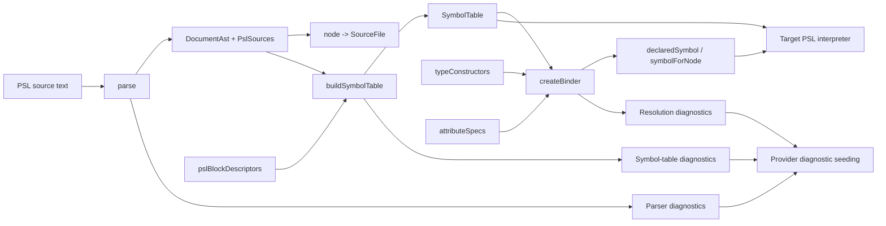

# @internal/psl-parser

Reusable PSL parser for Prisma 8.

## Overview

`@internal/psl-parser` parses Prisma Schema Language (PSL) source into a deterministic CST with source spans and stable machine-readable diagnostics, then offers shared symbol-table resolution for the target-agnostic semantics every PSL interpreter needs. Normalization to contract IR and emit integration stay in downstream target packages. Source provenance is owned by the returned red syntax root; see [ADR 253 — PSL red-root source ownership](../../../../docs/architecture%20docs/adrs/ADR%20253%20-%20PSL%20red-root%20source%20ownership.md).

In the provider-based authoring model, PSL providers call `parse` to obtain the CST and then `buildSymbolTable` to obtain a scope-aware view, before returning `Result<Contract, ContractSourceDiagnostics>` to the framework emit pipeline.

## Responsibilities

- Parse PSL source text with a required explicit filename and deterministic ordering.
- Return AST nodes with source spans for models, fields, enums, and `types { ... }`.
- Preserve raw PSL relation action tokens (for example `Cascade`) without semantic normalization.
- Return PSL-owned parser, symbol, attribute-kit, and SQL/Mongo semantic diagnostics as `{ filename, code, message, range }`, with optional `data`, zero-based file-local ranges, and filenames derived from the owning syntax node through `PslSources`. No source object is retained in emitted diagnostics. `PslDiagnosticCollector.toExternal()` translates them at interpreter output boundaries, preserving order alongside untouched external contribution diagnostics. Existing unlocated public errors retain their envelope through `pushUnlocated`, while still carrying an owned range internally. Provider seeding uses the same `mapPslDiagnostics` conversion.
- Enforce strict error behavior for unsupported syntax (no warning or best-effort mode).
- Parse attributes generically (namespaced or not), including optional argument lists; target semantics live downstream.
- Emit attribute nodes with explicit target (`field` / `model` / `namedType`), attribute name, and parsed argument list with spans.
- Build a scope-aware symbol table from the CST, including duplicate-declaration diagnostics, named-type binding resolution, and descriptor-driven generic-block reconstruction.
- Answer "which declaration does this name denote" for every consumer, once, through the binder — the sole voice of resolution failures.

## Attributes (generic parsing boundary)

`@internal/psl-parser` parses attributes **generically**:

- Attributes may be **non-namespaced** (for example `@id`) or **namespaced** (for example `@vendor.option`).
- Attributes may include an **optional argument list**.
- Arguments are parsed into positional/named entries with preserved raw values and source spans.
- The parser owns **syntax + structure + spans**, not semantics.
- Example: `@default(uuid(7))` is preserved as a positional argument value `uuid(7)`; semantic lowering is handled downstream.

Interpretation/validation (for example `@internal/sql-contract-psl`) is responsible for:

- mapping attributes to existing contract authoring shapes,
- enforcing strictness (unknown/unsupported attributes are errors),
- enforcing pack composition (using `@<ns>.*` without composing the pack fails), and
- ensuring parity with the TS authoring surface.

## Public API

- `parse(source, filename, options?)` in `src/parse.ts` (also at `@internal/psl-parser/syntax`) — the CST parser: returns the `DocumentAst`, a `PslSources` registry for resolving nodes to their named `SourceFile`, and syntactic diagnostics. The recursive-descent / lossless-CST path supersedes the legacy `parsePslDocument`.
- `buildSymbolTable({ documents, sources, pslBlockDescriptors })` in `src/symbol-table.ts` — a pure, fault-tolerant pass over an ordered `readonly DocumentAst[]` that returns `{ symbolTable, diagnostics }`, with a scope-aware `SymbolTable` (top-level namespaces / named types / blocks / models / composite-types as keyed records discriminated by `kind`, namespace members and block fields nested under their owner, declaration symbols carrying their CST AST `node` plus declaration `span`, and namespace symbols retaining every authored node and span in `declarations`) plus its own source-associated diagnostics (the same `ParseDiagnostic` shape as parser errors: `filename`, `code`, `message`, and a file-local `range`). Duplicate names are first-wins across documents and kinds within one scope (`PSL_DUPLICATE_DECLARATION`); repeated namespaces reopen the same scope, retaining distinct members and diagnosing duplicate member names across declarations and documents. Every supplied document root must be registered in the shared `sources`, even for empty documents. An empty collection returns an empty scope. Single-file callers pass `documents: [document]`; no file discovery is performed. `pslBlockDescriptors` is supplied from authoring contributions so generic/extension blocks can be reconstructed once into `BlockSymbol.block`. The pass also **resolves** the field/named-type read set once: each `FieldSymbol` carries the split type (`typeName`/`typeNamespaceId`/`typeContractSpaceId`), `optional`/`list`, `typeConstructor?`, rendered `attributes`, and `malformedType?` (set, with a `PSL_INVALID_QUALIFIED_TYPE` diagnostic, when the type is over-qualified); `NamedTypeSymbol` carries the resolved binding (`baseType`/`typeConstructor`/`isConstructor`). Interpreters consume this resolved shape directly — there is no per-package field/attribute view layer.
- `createBinder({ sources, symbolTable, typeConstructors, attributeSpecs })` in `src/binder.ts` — the name resolver. It returns `{ binder, diagnostics }`, mirroring `buildSymbolTable`: resolution runs eagerly over the symbol table at creation, and the returned diagnostics are complete when the factory returns. Queries are map reads and say nothing about when resolution ran. See [the binder section below](#binder).
- `referencedModel` / `modelAttributeContext` / `fieldAttributeContext` in `src/binder-context.ts` — build the ADR 249 parse-time attribute contexts from a binder. `resolveReferencedModel` becomes one map read (`symbolForNode(typeReferenceNode(field))`, narrowed to a model) instead of a resolver each consumer supplies for itself, and the context carries the binder itself so the reference combinators stop raising their own existence diagnostics. See [attribute contexts and the single voice](#attribute-contexts-and-the-single-voice).
- `readResolvedAttribute(s)` / `readResolvedConstructorCall` + the span maps (`nodePslSpan`, `keywordPslSpan`) in `src/resolve.ts` — the shared CST read helpers `buildSymbolTable` uses and that consumers (e.g. enum-block reconstruction) reuse, with `PslSpan` spans derived from `PslSources`. Pure coordinate conversion lives on `SourceFile`: resolve the file with `sources.sourceFileFor(node.syntax)` and call `sourceFile.rangeToPslSpan(range)`, `sourceFile.offsetToPslPosition(offset)`, or `sourceFile.pslSpanToRange(span)`.
- `reconstructExtensionBlock` / `findBlockDescriptor` /
  `validateExtensionBlockFromSymbol` in `src/extension-block.ts` — reconstruct a
  descriptor-driven `PslExtensionBlock` from a CST `GenericBlockDeclarationAst`
  (a `BlockSymbol`) and run the framework's standalone `validateExtensionBlock`
  over it, building the ref-resolution context from the symbol table.
- `parseQuotedStringLiteral` / `getPositionalArgument` in `src/attribute-helpers.ts`.
- Legacy AST/span types live in `@internal/framework-components/psl-ast` and are re-exported from this package's root entry. The attribute kit's `PslDiagnostic` lives in `src/diagnostic.ts`; framework contribution diagnostics retain their separate external contract.
- Subpath exports:
  - `@internal/psl-parser/syntax`
  - `@internal/psl-parser/tokenizer`

## Binder

The binder is the single authority on which declaration a name denotes. Every consumer asks it rather than scanning the symbol table itself, so one scoping rule and one diagnostic voice serve the SQL and Mongo interpreters, the attribute-spec contexts, and the language server alike.

```ts
const { binder, diagnostics } = createBinder({
  sources,
  symbolTable,
  typeConstructors,
  attributeSpecs,
});

binder.declaredSymbol(modelDeclarationNode); // declaration node -> the symbol it declares
binder.symbolForNode(typeReferenceNode(field)); // reference node -> what it denotes
```

The two questions are kept apart deliberately, as Roslyn separates `GetDeclaredSymbol` from `GetSymbolInfo`: `declaredSymbol` answers for the node that *introduces* a name, `symbolForNode` for a node that *mentions* one.

### Scope chain

An unqualified reference resolves in exactly this order:

1. the **declaring namespace** — the namespace the referring declaration itself sits in;
2. the **top level**;
3. the **contributed types** — the type-position names the configured target and its extensions contribute, built from the injected `typeConstructors` registry.

That third scope holds names nobody declared in a schema: the scalars, type constructors and field presets a target and its composed extension packs bring, in contrast with the models, composite types and named types the documents themselves declare.

**Sibling namespaces are never consulted.** A schema declaration shadowing a contributed type (a `model Uuid` over a contributed `Uuid`) wins **silently** — shadowing is not a diagnostic. A qualified `ns.Name` is looked up in that PSL namespace, then in the type-constructor namespace of the same name (`pgvector.Vector`), and nowhere else.

Qualified references resolve at whole-`QualifiedName` granularity: in `app.Item`, the segments `app` and `Item` do not resolve separately — the one `QualifiedName` node carries the one resolution.

### Resolution kinds

`symbolForNode` returns `undefined` for a node that is not a reference the binder tracks, and otherwise one of:

| Kind | Denotes |
| --- | --- |
| `model` / `compositeType` / `namedType` / `block` | a user declaration; `block` covers `enum` and every other descriptor-driven block, which may be a field's type but never an `@@base` target |
| `contributedType` | a scalar, type constructor or field preset from the injected registry |
| `field` | a field named by an attribute argument (`@@index([a])`, `@relation(fields:, references:)`) |
| `attributeSpec` | the spec an attribute's name denotes |
| `crossSpace` | a reference into another contract space, resolvable only where that space is known — an explicit kind, and deliberately **not** a diagnostic |
| `unresolved` | nothing of that name is in scope; the binder has emitted a diagnostic for it |

A field whose type is malformed (`malformedType`) is skipped entirely: no resolution, no diagnostic, no cascade.

### Diagnostics

The binder owns resolution failures and nothing else. Failures come back under `PSL_UNRESOLVED_REFERENCE` (an unknown type, field, or entity name) and `PSL_UNRESOLVED_ATTRIBUTE` (an unknown attribute name), located by filename and range through `PslSources`. Converted consumers adopt these codes and **never re-emit their own** — the same rule the symbol table set for `PSL_DUPLICATE_DECLARATION`. Shape failures (arity, argument type, malformed literals) remain the spec combinators' voice; they are not resolution. References bind to first-wins symbols, and the binder never restates a duplicate-declaration diagnostic the symbol table already made.

### Attribute contexts and the single voice

`modelAttributeContext` / `fieldAttributeContext` put the whole `Binder` on the parse-time context. `ModelAttributeCtx` **requires** it, so every context that can reach a reference combinator carries one by construction — there is no binder-less path to fall back to and no dual behavior to reason about.

`fieldRef` and `referencedFieldRef` resolve solely through it: they read the argument's resolution out of the binder (`symbolForNode(argumentNode)` — a map read of results already computed at creation, never a second resolution) and

- return the bound field's name when the binder resolved a field;
- return the written name for a `crossSpace` reference, which is deferred by design;
- **fail the argument, carrying no diagnostics of their own**, when the binder bound nothing or bound something that is not a field. The binder has already reported that name as `PSL_UNRESOLVED_REFERENCE`, so a second complaint would be a duplicate. A failed argument fails its attribute rather than quietly yielding a short list or a missing key.

`entityRef` is unchanged: it never checked existence, so it still returns the written name and leaves the verdict to the binder's diagnostics and to downstream lowering.

Shape and arity stay the combinator's voice — "Expected a field name", "Expected a list of field name", wrong argument counts. Only *existence* belongs to the binder. The split is the point: resolution is the binder's, shape is the spec's, and no schema error is ever reported twice.

`AttributeCtx` itself stays binder-free: block attributes are interpreted during `buildSymbolTable`, before a binder can exist, and no block attribute takes a reference argument.

This lookup rests on red-node identity (below): the combinator receives the very `SyntaxNode` the binder keyed its result under.

**Precondition, enforced.** The binder on the context must be built over the *same snapshot* — the same symbol table and `PslSources` — and the same `typeConstructors` / `attributeSpecs` registries as the interpretation consuming it.

The binder records what it examined, including its failures: a reference it could not resolve gets an explicit `unresolved` entry rather than no entry at all. So for a node in reference position, an absent entry cannot mean "the author made a mistake" — it can only mean this binder never saw this tree. The reference combinators therefore **throw an `InternalError`** on a missing entry instead of quietly skipping the check. A mismatched binder fails loudly at the first reference argument rather than silently forgoing existence checking across the whole document.

Fields whose type is malformed are the one deliberate absence: the binder does not examine them, and no combinator reads a type node.

### Snapshot lifetime

The binder is snapshot-scoped: an edit produces a new document, symbol table, and binder, and the old set is dropped whole. There is no invalidation protocol.

The contributed-type scope is the exception — it is configuration-derived, not document-derived, and is shared across snapshots. That sharing is keyed by the **object identity of the `typeConstructors` registry** the caller passes: pass the same registry object and two binders share one scope; rebuild the registry on every parse and sharing silently degrades to a per-snapshot scope. Resolution stays correct either way, but the guarantee is gone, so hold the registry alongside the configuration it came from.

### Node identity

Binder side tables are keyed by red `SyntaxNode` identity, which the red layer guarantees within a snapshot: `SyntaxNode.childAt(index)` caches each child wrapper in its parent's slot on first access, so every traversal reaching the same position — `children()`, `firstChild`, `nextSibling`, `ancestors()`, `tokenAtOffset`, `coveringElement` — returns the identical object (Roslyn's `GetRed` design, single-threaded). Red nodes are therefore sound `WeakMap` keys. Green nodes are not: they are position-free and shareable, so a green-keyed cache would go stale silently. Never key a cache on a green node, and never use a span as a cross-snapshot key.

## Architecture



## Package Boundaries

- This package does not perform file I/O.
- This package does not normalize to contract IR.
- This package does not emit `contract.json` or `contract.d.ts`.

## Related Docs

- `docs/Architecture Overview.md`
- `docs/architecture docs/subsystems/2. Contract Emitter & Types.md`
- `docs/architecture docs/adrs/ADR 163 - Provider-invoked source interpretation packages.md`
