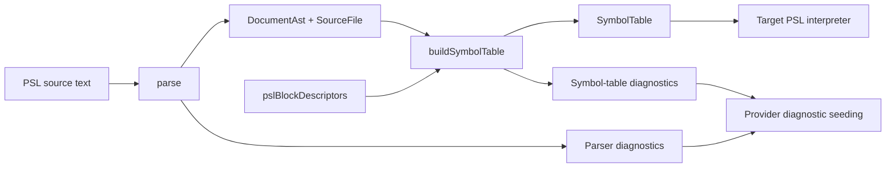

# @internal/psl-parser

Reusable PSL parser for Prisma 8.

## Overview

`@internal/psl-parser` parses Prisma Schema Language (PSL) source into a deterministic CST with source spans and stable machine-readable diagnostics, then offers shared symbol-table resolution for the target-agnostic semantics every PSL interpreter needs. Normalization to contract IR and emit integration stay in downstream target packages.

In the provider-based authoring model, PSL providers call `parse` to obtain the CST and then `buildSymbolTable` to obtain a scope-aware view, before returning `Result<Contract, ContractSourceDiagnostics>` to the framework emit pipeline.

## Responsibilities

- Parse PSL source text (`schema` + `sourceId`) with deterministic ordering.
- Return AST nodes with source spans for models, fields, enums, and `types { ... }`.
- Preserve raw PSL relation action tokens (for example `Cascade`) without semantic normalization.
- Return stable diagnostics (`code`, `message`, `span`, `sourceId`) for invalid and unsupported constructs.
- Enforce strict error behavior for unsupported syntax (no warning or best-effort mode).
- Parse attributes generically (namespaced or not), including optional argument lists; target semantics live downstream.
- Emit attribute nodes with explicit target (`field` / `model` / `namedType`), attribute name, and parsed argument list with spans.
- Build a scope-aware symbol table from the CST, including duplicate-declaration diagnostics, unclassified named-type bindings, and descriptor-driven generic-block reconstruction.

## Attributes (generic parsing boundary)

`@internal/psl-parser` parses attributes **generically**:

- Attributes may be **non-namespaced** (for example `@id`) or **namespaced** (for example `@vendor.option`).
- Attributes may include an **optional argument list**.
- Arguments are parsed into positional/named entries with preserved raw values and source spans.
- The parser owns **syntax + structure + spans**, not semantics.
- Example: `@default(uuid(7))` is preserved as a positional argument value `uuid(7)`; semantic lowering is handled downstream.

Interpretation/validation (for example `@internal/sql-contract-psl`) is responsible for:

- mapping attributes to existing contract authoring shapes,
- enforcing strictness (unknown/unsupported attributes are errors),
- enforcing pack composition (using `@<ns>.*` without composing the pack fails), and
- ensuring parity with the TS authoring surface.

## Public API

- `parse(schema)` in `src/parse.ts` (also at `@internal/psl-parser/syntax`) — the CST parser: returns the `DocumentAst`, its backing `SourceFile`, and syntactic diagnostics. The recursive-descent / lossless-CST path supersedes the legacy `parsePslDocument`.
- `buildSymbolTable({ document, sourceFile, pslBlockDescriptors })` in `src/symbol-table.ts` — a pure, fault-tolerant pass over a parsed `DocumentAst` that returns a scope-aware `SymbolTable` (top-level `namespaces`, `namedTypes`, `blocks`, `models`, and `compositeTypes` dictionaries) plus duplicate-name diagnostics (`PSL_DUPLICATE_DECLARATION`, first-wins across kinds within one scope). Repeated exact-name namespace blocks share member dictionaries. Each contributed declaration retains its authored `node` and `span`; the namespace's representative `node`/`span` identify its first block, not a synthesized combined block. `pslBlockDescriptors` reconstruct generic/extension blocks once into `BlockSymbol.block`. Each `FieldSymbol` carries its split type (`typeName`/`typeNamespaceId`/`typeContractSpaceId`), modifiers, optional constructor, resolved attributes, and malformed-qualification marker. `NamedTypeSymbol` carries the resolved `types { ... }` binding (`baseType`/`typeConstructor`/`isConstructor`); downstream interpreters classify it. Interpreters consume this resolved shape directly.
- `readResolvedAttribute(s)` / `readResolvedConstructorCall` + the span maps
  (`nodePslSpan`, `rangeToPslSpan`, `keywordPslSpan`) in `src/resolve.ts` — the
  shared CST read helpers `buildSymbolTable` uses and that consumers (e.g.
  enum-block reconstruction) reuse, with `PslSpan` spans.
- `reconstructExtensionBlock` / `findBlockDescriptor` /
  `validateExtensionBlockFromSymbol` in `src/extension-block.ts` — reconstruct a
  descriptor-driven `PslExtensionBlock` from a CST `GenericBlockDeclarationAst`
  (a `BlockSymbol`) and run the framework's standalone `validateExtensionBlock`
  over it, building the ref-resolution context from the symbol table.
- `parseQuotedStringLiteral` / `getPositionalArgument` in `src/attribute-helpers.ts`.
- AST/diagnostic/span types live in `@internal/framework-components/psl-ast`
  and are re-exported from this package's root entry for convenience.
- Subpath exports:
  - `@internal/psl-parser/syntax`
  - `@internal/psl-parser/tokenizer`

## Reopening namespaces in one source file

Blocks with exactly the same namespace name contribute distinct, whole declarations to one logical scope:

```prisma
namespace blog {
  model Post {
    id Int @id
    authorId Int
    author User @relation(fields: [authorId], references: [id])
  }
}

namespace blog {
  model User {
    id Int @id
  }
}
```

The symbol scope is equivalent to one block containing both models, in either block order. Collection completes before downstream reference resolution; target restrictions and reference rules still apply. Names are case-sensitive. Members remain unique across models, composite types, and extension blocks; a repeated member is an error at the later name, and the first whole declaration wins. Bodies are never merged or overridden. A namespace name still cannot collide with another top-level declaration. This is single-file organization, not multi-file loading or partial declarations.

## Architecture



## Package Boundaries

- This package does not perform file I/O.
- This package does not normalize to contract IR.
- This package does not emit `contract.json` or `contract.d.ts`.

## Related Docs

- `docs/Architecture Overview.md`
- `docs/architecture docs/subsystems/2. Contract Emitter & Types.md`
- `docs/architecture docs/adrs/ADR 163 - Provider-invoked source interpretation packages.md`
