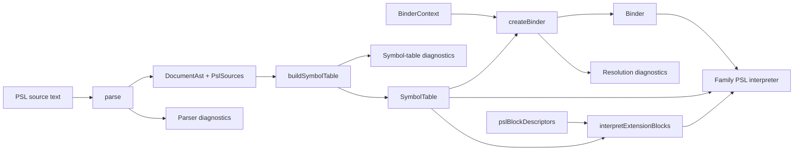

# @internal/psl-parser

Reusable PSL parser for Prisma 8.

## Overview

`@internal/psl-parser` turns Prisma Schema Language (PSL) source text into the structures every PSL consumer needs: a lossless syntax tree, a symbol table of declarations, and a binder that resolves names. It is target-agnostic. Turning a schema into a contract is the job of the family packages (for example `@internal/sql-contract-psl`), which build on what this package returns.

PSL contract sources, the CLI and the language server all use the same pipeline:

1. `parse` reads one file into a syntax tree.
2. `buildSymbolTable` collects the declarations of all files of a schema.
3. `createBinder` resolves every name those files mention.
4. A family interpreter reads the tree, the symbol table and the binder, and produces a contract.

Each step returns its own diagnostics. The caller reports them.

## Responsibilities

- Parse PSL source text into a lossless syntax tree with source positions.
- Collect a schema's declarations into a symbol table and report duplicates.
- Resolve the names a schema mentions and report the ones that do not resolve.
- Provide the combinators that attribute and block specifications are built from, and interpret attributes and blocks against those specifications.
- Format PSL source text.

## Pipeline

```mermaid
flowchart LR
  PSL[PSL source text] --> Parse[parse]
  Parse --> CST[DocumentAst + PslSources]
  Parse --> ParseDiagnostics[Parser diagnostics]
  CST --> Symbols[buildSymbolTable]
  Symbols --> SymbolTable[SymbolTable]
  Symbols --> SymbolDiagnostics[Symbol-table diagnostics]
  SymbolTable --> Binder[createBinder]
  Context[BinderContext] --> Binder
  Binder --> BinderQueries[Binder]
  Binder --> BinderDiagnostics[Resolution diagnostics]
  SymbolTable --> Blocks[interpretExtensionBlocks]
  Descriptors[pslBlockDescriptors] --> Blocks
  Blocks --> Interpreter[Family PSL interpreter]
  SymbolTable --> Interpreter
  BinderQueries --> Interpreter
```

### Parsing

`parse(source, filename, options)` returns a lossless syntax tree, a `PslSources` registry that maps any node back to its file, and syntax diagnostics. The tree keeps every token, including comments and whitespace, so the formatter and the language server work on the same tree as the interpreters. Unsupported syntax is an error; there is no best-effort mode.

The parser reads structure only. Attributes, their arguments and block entries are parsed generically, whether or not anything defines them. Deciding what `@default(uuid(7))` or `@vendor.option` means belongs to later steps.

`options.grammar` selects the grammar a file is written in: `prisma-8` by default, or `prisma-7` for Prisma 7 and Prisma 6 schemas.

Strongly typed AST classes wrap the tree for convenient reading. See [ADR 253](../../../../docs/architecture%20docs/adrs/ADR%20253%20-%20PSL%20red-root%20source%20ownership.md) for how nodes relate to their source files.

### Symbol table

`buildSymbolTable({ documents, sources })` collects the declarations of a schema's files: namespaces, models, composite types, named types, generic blocks and their fields. It reports duplicate declarations. It does not resolve references and does not interpret blocks.

Each symbol carries the members of its declaration. A model or composite type symbol has its fields and attributes; a generic block symbol has its entries and its attributes, both in source order, and a repeated entry key appears once per occurrence. Consumers read a declaration's members from its symbol, not from the symbol's syntax node.

### Binder

`createBinder({ sources, symbolTable, context })` resolves names. It decides which declaration a type reference, a field reference or an entity reference denotes, and it reports the ones it cannot resolve. Every consumer asks the binder instead of searching the symbol table, so the interpreters, the attribute specifications and the language server agree on what a name means, and an unresolved name is reported once.

An unqualified name is looked up in this order:

1. the namespace the referring declaration is in;
2. the top level;
3. the types the configured target and its extensions contribute (scalars, type constructors, field presets).

Sibling namespaces are never searched. A nearer declaration hides an outer one of the same name. For `ns.Name`, `ns` must resolve to a namespace, and `Name` is looked up only inside it. The base of a named type is looked up without the named types in scope, so `Uuid = Uuid` in a `types` block refines the contributed `Uuid`.

The binder also resolves what attribute and block specifications describe: attribute names, argument keys, function names, fixed identifier values, and the references inside argument values. Where a specification offers alternatives, the binder picks the first alternative the written value fits by its syntactic shape. Checking the value itself, such as a number range or an allowed string, is left to interpretation.

A binder belongs to one snapshot of a schema. After an edit, the caller builds a new tree, symbol table and binder.

The binder only resolves names. Whether a resolved name is used correctly is checked by interpretation: a field preset or a type constructor written without a call, or a type the family cannot store. The binder's diagnostics are reported as they are, by whoever built the binder; an interpreter neither repeats nor filters them. Each family supplies the wording for an unsupported attribute and for an unresolved type.

### Attribute and block specifications

Attributes and generic blocks are described declaratively, as specifications built from combinators (`str`, `list`, `oneOf`, `entityRef`, `funcCall`, …). A specification states which arguments exist, what each accepts and what it means, with documentation. The same specification drives interpretation, diagnostics, completion, signature help and hover. See [ADR 231](../../../../docs/architecture%20docs/adrs/ADR%20231%20-%20Declarative%20attribute%20specifications.md), [ADR 249](../../../../docs/architecture%20docs/adrs/ADR%20249%20-%20Central%20attribute-spec%20registry.md) and [ADR 262](../../../../docs/architecture%20docs/adrs/ADR%20262%20-%20Block%20specs%20bind%20top-level%20block%20values.md).

Diagnostics are divided between two owners. The binder reports names that do not resolve. Specifications report values of the wrong shape, wrong argument counts and references to the wrong kind of declaration. A schema error is reported by one of them, never both.

## Entry points

- `@internal/psl-parser` — the symbol table, the binder, the attribute and block specification combinators, and shared diagnostics types.
- `@internal/psl-parser/syntax` — `parse`, the syntax tree and the typed AST classes.
- `@internal/psl-parser/interpret` — the input type of a PSL interpreter and rules shared by the family interpreters.
- `@internal/psl-parser/format` — the PSL formatter.
- `@internal/psl-parser/tokenizer` — the tokenizer.
- `@internal/psl-parser/test` — helpers for tests that need a parsed and bound schema.

## Package boundaries

- This package does not perform file I/O.
- This package does not know any target or family. Targets and families contribute types, data types, attribute specifications and block descriptors through the binder's context.
- This package does not produce contract IR, `contract.json` or `contract.d.ts`.

## Related docs

- `docs/Architecture Overview.md`
- `docs/architecture docs/subsystems/2. Contract Emitter & Types.md`
- `docs/architecture docs/adrs/ADR 163 - Provider-invoked source interpretation packages.md`
- `docs/architecture docs/adrs/ADR 231 - Declarative attribute specifications.md`
- `docs/architecture docs/adrs/ADR 249 - Central attribute-spec registry.md`
- `docs/architecture docs/adrs/ADR 253 - PSL red-root source ownership.md`
- `docs/architecture docs/adrs/ADR 262 - Block specs bind top-level block values.md`
