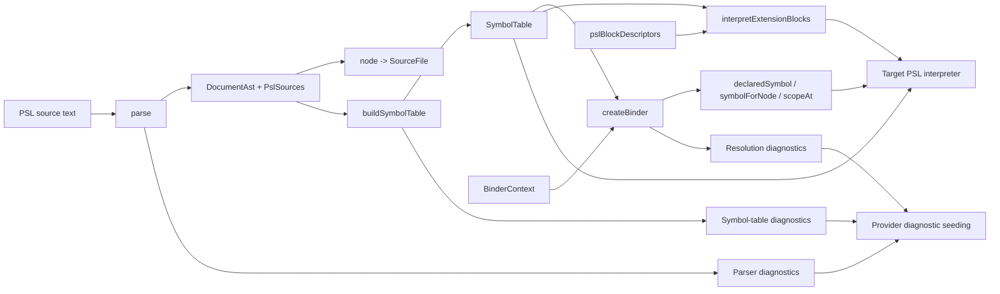

# @internal/psl-parser

Reusable PSL parser for Prisma 8.

## Overview

`@internal/psl-parser` parses Prisma Schema Language (PSL) source into a deterministic CST with source spans and stable machine-readable diagnostics, then offers shared symbol-table resolution for the target-agnostic semantics every PSL interpreter needs. Normalization to contract IR and emit integration stay in downstream target packages. Source provenance is owned by the returned red syntax root; see [ADR 253 — PSL red-root source ownership](../../../../docs/architecture%20docs/adrs/ADR%20253%20-%20PSL%20red-root%20source%20ownership.md).

In the provider-based authoring model, PSL providers call `parse` to obtain the CST and then `buildSymbolTable` to obtain a scope-aware view, before returning `Result<Contract, ContractSourceDiagnostics>` to the framework emit pipeline.

## Responsibilities

- Parse PSL source text with a required explicit filename and deterministic ordering.
- Return AST nodes with source spans for models, fields, enums, and `types { ... }`.
- Preserve raw PSL relation action tokens (for example `Cascade`) without semantic normalization.
- Return PSL-owned parser, symbol, attribute-kit, and SQL/Mongo semantic diagnostics as `{ filename, code, message, range }`, with optional `data`, zero-based file-local ranges, and filenames derived from the owning syntax node through `PslSources`. No source object is retained in emitted diagnostics. `PslDiagnosticCollector.toExternal()` translates them at interpreter output boundaries, preserving order alongside untouched external contribution diagnostics. Existing unlocated public errors retain their envelope through `pushUnlocated`, while still carrying an owned range internally. Provider seeding uses the same `mapPslDiagnostics` conversion.
- Enforce strict error behavior for unsupported syntax (no warning or best-effort mode).
- Parse attributes generically (namespaced or not), including optional argument lists; target semantics live downstream.
- Emit attribute nodes with explicit target (`field` / `model` / `namedType`), attribute name, and parsed argument list with spans.
- Build a scope-aware symbol table from the CST, including duplicate-declaration diagnostics and named-type binding resolution, without interpreting blocks.
- Provide typed block-value and block-attribute interpretation against registered block specs for consumers to run after collection with the snapshot's binder; consumers own diagnostic reporting.
- Answer "which declaration does this name denote" for every consumer, once, through the binder — the sole voice of resolution failures.

## Attributes (generic parsing boundary)

`@internal/psl-parser` parses attributes **generically**:

- Attributes may be **non-namespaced** (for example `@id`) or **namespaced** (for example `@vendor.option`).
- Attributes may include an **optional argument list**.
- Arguments are parsed into positional/named entries with preserved raw values and source spans.
- The parser owns **syntax + structure + spans**, not semantics.
- Example: `@default(uuid(7))` is preserved as a positional argument value `uuid(7)`; semantic lowering is handled downstream.
- A value may be a dotted member path such as `address.city` in `@@index([address.city])`: a `PathExpr` node, read with `PathExprAst.path()`. A dotted callee is the same `PathExpr`, so `address.city` has one shape whether or not it is called (`address.city(sort: Asc)`, read with `FunctionCallAst.memberPath()`); a bare callee (`now()`) is a `QualifiedName`, read with `FunctionCallAst.name()`. `FunctionCallAst.path()` returns every segment either way. The syntax cannot tell a namespace-qualified function (`pg.now()`) from a called field path, so the parser does not try: each reader decides whether it accepts a path, and what it names.

Interpretation/validation (for example `@internal/sql-contract-psl`) is responsible for:

- mapping attributes to existing contract authoring shapes,
- enforcing strictness (unknown/unsupported attributes are errors),
- enforcing pack composition (using `@<ns>.*` without composing the pack fails), and
- ensuring parity with the TS authoring surface.

## Public API

- `parse(source, filename, options)` in `src/parse.ts` (also at `@internal/psl-parser/syntax`) — the CST parser: returns the `DocumentAst`, a `PslSources` registry for resolving nodes to their named `SourceFile`, and syntactic diagnostics. The recursive-descent / lossless-CST path supersedes the legacy `parsePslDocument`. An `enum` member may carry attributes. `options.grammar` names the grammar the file is written in, `prisma-8` by default. In the `prisma-7` grammar a `view` body parses as model fields; in `prisma-8` it parses as `key = value` entries. A PSL contract source declares its grammar in `parserOptions`, and every tool that parses its files passes it on. The Prisma 7 and Prisma 6 sources declare `prisma-7`, since Prisma 6 schemas use the same grammar. `PslParserOptions` and `PslGrammar` live in `@internal/config` beside the source provider that declares them, because a core package cannot import the parser; only the parser reads the grammar value. Each reader decides whether it accepts what was parsed.
- `buildSymbolTable({ documents, sources })` in `src/symbol-table.ts` — a pure, fault-tolerant pass over an ordered `readonly DocumentAst[]` that returns `{ symbolTable, diagnostics }`, with a scope-aware `SymbolTable` (top-level namespaces / named types / blocks / models / composite-types as keyed records discriminated by `kind`, namespace members and block fields nested under their owner, declaration symbols carrying their CST AST `node` plus declaration `span`, and namespace symbols retaining every authored node and span in `declarations`) plus its own source-associated diagnostics (the same `ParseDiagnostic` shape as parser errors: `filename`, `code`, `message`, and a file-local `range`). Duplicate names are first-wins across documents and kinds within one scope (`PSL_DUPLICATE_DECLARATION`); repeated namespaces reopen the same scope, retaining distinct members and diagnosing duplicate member names across declarations and documents. Every supplied document root must be registered in the shared `sources`, even for empty documents. An empty collection returns an empty scope. Single-file callers pass `documents: [document]`; no file discovery is performed. Collection interprets no blocks: every block symbol keeps its syntax `node`, `keyword`, `name`, and `span`, no source text is rendered from the AST, and consumers resolve registered blocks with `interpretExtensionBlocks` over the snapshot's binder. The pass also **resolves** the field/named-type read set once: each `FieldSymbol` carries the split type (`typeName`/`typeNamespaceId`/`typeContractSpaceId`), `optional`/`list`, `typeConstructor?`, rendered `attributes`, and `malformedType?` (set, with a `PSL_INVALID_QUALIFIED_TYPE` diagnostic, when the type is over-qualified); `NamedTypeSymbol` carries the resolved binding (`baseType`/`typeConstructor`/`isConstructor`). Interpreters consume this resolved shape directly — there is no per-package field/attribute view layer.
- `createBinder({ sources, symbolTable, context })` in `src/binder.ts` — the name resolver. It returns `{ binder, diagnostics }`, mirroring `buildSymbolTable`: resolution runs eagerly over the symbol table at creation, and the returned diagnostics are complete when the factory returns. Queries are map reads and say nothing about when resolution ran. See [the binder section below](#binder).
- `typeReferenceNode(symbol)` and `contributedTypeOf(resolution, binder)` in `src/binder.ts`: the first returns the type-reference node of a field or named type, the node `symbolForNode` takes; the second returns the contributed type a resolution ends at, following a named type to the resolution of its base, or `undefined` when the resolution is not a contributed type. Interpreters compare the contributed type's codec id themselves.
- `PslInterpretInput` and `PslInterpretCapable` in `src/interpret.ts` (at `@internal/psl-parser/interpret`): the input a PSL source's `interpret` takes, `{ documents, sources, symbolTable, binder }`. `binder` is required, and `interpret` does not report the binder's diagnostics: the caller that built the binder reports them, the same way it reports parser and symbol-table diagnostics (`withSeedDiagnostics`).
- `readResolvedAttribute(s)` / `readResolvedConstructorCall` + the span maps (`nodePslSpan`, `keywordPslSpan`) in `src/resolve.ts` — the shared CST read helpers `buildSymbolTable` uses and that downstream consumers reuse, with `PslSpan` spans derived from `PslSources`. Pure coordinate conversion lives on `SourceFile`: resolve the file with `sources.sourceFileFor(node.syntax)` and call `sourceFile.rangeToPslSpan(range)`, `sourceFile.offsetToPslPosition(offset)`, or `sourceFile.pslSpanToRange(span)`.
- Block specs in `src/block-spec/` — `structBlock` / `mapBlock` constructors, `InferBlock`, the parser-facing `PslBlockSpecDescriptor` view with `blockSpecFactoryOf`, and `interpretExtensionBlocks({ symbolTable, sources, pslBlockDescriptors, binder })`, the canonical resolution consumers run against a collected table with the snapshot's binder (it returns `{ parsedBlocks, diagnostics }`; the caller owns reporting, and unresolved references speak in the binder's voice); `findBlockDescriptor` in `src/extension-block.ts` looks a keyword up in a descriptor namespace. The shared `jsonValue()` rule reads native JSON-compatible literals from the expression AST.
- `parseQuotedStringLiteral` / `getPositionalArgument` in `src/attribute-helpers.ts`.
- `isPslIdentifier(text)` in `src/tokenizer.ts`: whether the tokenizer reads the text as one identifier. Code that writes PSL checks a name with it before writing the name where PSL reads an identifier.
- `NAME_THE_PSL_SOURCE_LOSES` in `src/name-the-psl-source-loses.ts`: the name `__proto__`, which is lost when a PSL file is read: the parser keeps block members, and the PSL contract sources keep other names, as keys of plain objects. Code that writes PSL refuses this name wherever a PSL source reads a name, `@map` and `@@map` included.
- Rules both PSL readers apply, at `@internal/psl-parser/interpret`: `claimedBlockKeywords` and `unsupportedBlockDiagnostic` (`src/unclaimed-blocks.ts`) report a generic block whose keyword no composed descriptor claims; `enumMemberAttributeDiagnostics` (`src/enum-member-attributes.ts`) reports an attribute on an enum member; `src/relation-backrelations.ts` holds the back-relation pairing rules.
- Legacy AST/span types live in `@internal/framework-components/psl-ast` and are re-exported from this package's root entry. The attribute kit's `PslDiagnostic` lives in `src/diagnostic.ts`; framework contribution diagnostics retain their separate external contract.
- Test helpers at `@internal/psl-parser/test`, for tests in any family. `bindPslSchema(schema, { context, sourceId? })` parses one schema, builds its symbol table and binder, and returns `{ documents, sources, symbolTable, binder, context, seedDiagnostics }`, where `seedDiagnostics` holds the symbol-table and binder diagnostics. `contractSourceContextFromControlStack(stack, overrides?)` builds a `ContractSourceContext` from a `ControlStack` with the same fields the CLI sets, `pslDiagnostics` from `stack.family` included, except `resolvedInputs` (empty) and `reportWarning`. Each family's `./test` subpath adds the mapping from that context to its interpreter's input. `./test` subpaths are excluded from the published shells.
- Subpath exports:
  - `@internal/psl-parser/format`
  - `@internal/psl-parser/interpret`
  - `@internal/psl-parser/syntax`
  - `@internal/psl-parser/test`
  - `@internal/psl-parser/tokenizer`

## Binder

The binder is the single authority on which declaration a name denotes. Every consumer asks it rather than scanning the symbol table itself, so one scoping rule and one diagnostic voice serve the SQL and Mongo interpreters, the attribute-spec contexts, and the language server alike. Given `pslBlockDescriptors`, the same eager pass also binds the reference-kinded rules of every registered generic block's value entries and `@@` attribute arguments, so one binder per snapshot covers attributes and block entries.

```ts
const { binder, diagnostics } = createBinder({ sources, symbolTable, context });

binder.declaredSymbol(modelDeclarationNode);
const reference = typeReferenceNode(field);
if (reference !== undefined) binder.symbolForNode(reference);
binder.scopeAt(modelDeclarationNode).entries();
```

`context` is a `BinderContext`: the `authoringContributions`, `controlMutationDefaults`, `dataTypes` and `pslDiagnostics` fields of a `ContractSourceContext`, so the CLI passes its context as is and the language server builds one from its control stack. `createBinder` derives every binding input from it:

- the contributed types: the `type` and `field` contributions merged into one namespace tree of type constructors and field presets;
- the attribute specs: the contributed `attributeSpecs` plus the specs of the `modelAttributes` descriptors;
- the registered `pslBlockDescriptors`, so block references and block attribute arguments are bound;
- the `@default` registry `controlMutationDefaults.defaultFunctionRegistry`, and `dataTypes` (the stack's data types with their authoring entries), which every attribute-spec context receives;
- the family's `describeUnsupportedAttribute` and `describeUnresolvedType` from `pslDiagnostics`, when present, to report unsupported attributes and unresolved types in the family's own terms.

`pslDiagnostics` comes from the family descriptor (`ControlFamilyDescriptor.pslDiagnostics`). `@internal/config` and `@internal/framework-components` cannot name this package's types, so both fields are typed `unknown` there, and `createBinder` restores their types. Each field is a factory:

- `describeUnsupportedAttribute(sources)` returns a `DescribeUnsupportedAttribute`. The binder calls it for a model or field attribute that no spec claims and reports the diagnostic it returns; when it returns `undefined`, the binder reports nothing for that attribute.
- `describeUnresolvedType(contributions)` returns a `DescribeUnresolvedType`. The binder calls it with the field, its owner, and the type name as written (qualifier included) for a field type it cannot resolve, and reports a `PSL_UNRESOLVED_REFERENCE` with the message it returns. When it returns `undefined`, or when the family contributes no describer, the binder keeps its default message, `Cannot find type "…"`.

`declaredSymbol` answers for the node that *introduces* a name, `symbolForNode` for a node that *mentions* one. `scopeAt(node)` returns the lexical `Scope`, whose `lookup(name)` and `entries()` agree on the nearest visible declaration. Queries require nodes from the binder's snapshot.

### Scope chain

An unqualified reference resolves in exactly this order:

1. the **declaring namespace** — the namespace the referring declaration itself sits in;
2. the **top level**;
3. the **contributed types** — the type-position names the configured target and its extensions contribute, built from the context's `type` and `field` contributions. A `contributedType` resolution's symbol carries the contribution itself as `descriptor`: a type-constructor descriptor or a field-preset descriptor, told apart by `kind`.

That third scope holds names nobody declared in a schema: the scalars, type constructors and field presets a target and its composed extension packs bring, in contrast with the models, composite types and named types the documents themselves declare.

**Sibling namespaces are never consulted.** Lookup is kind-blind: any nearer declaration hides an outer declaration of the same name, including a contributed type, without a shadowing diagnostic. Validate the required kind only after lookup; completion filters `entries()` only after that same shadowing has selected the visible names.

A named type's base (`Uuid = Uuid` in `types { }`) is resolved without the named types in scope.

For `ns.Name`, first resolve `ns` through the lexical scope chain and require a user or contributed namespace. Then look up `Name` only within that selected namespace. A user namespace hides a contributed namespace of the same name without fallthrough; a missing member never falls back to a top-level or contributed type.

Qualified references resolve at whole-`QualifiedName` granularity: in `app.Item`, the segments `app` and `Item` do not resolve separately — the one `QualifiedName` node carries the one resolution.

### Resolution kinds

`symbolForNode` returns `undefined` for a node that is not a reference the binder tracks, and otherwise one of:

| Kind | Denotes |
| --- | --- |
| `model` / `compositeType` / `namedType` / `block` | a user declaration, with its declaring namespace when present; the reference site's selector determines which declaration kinds are accepted |
| `namespace` / `contributedNamespace` | a user or configured namespace; lookup finds it without considering the required reference kind |
| `contributedType` | a scalar, type constructor or field preset from the injected registry |
| `field` | a field named by an attribute argument (`@@index([a])`, `@relation(fields:, references:)`) |
| `attribute` | an `AttributeSymbol` carrying the model/field attribute's name, level, and spec |
| `crossSpace` | a reference into another contract space, resolvable only where that space is known — an explicit kind, and deliberately **not** a diagnostic |
| `unresolved` | a tracked lookup failed; field and entity failures are diagnosed, while named-type base annotation binding deliberately adds no diagnostics |

A field whose type is malformed (`malformedType`) is skipped entirely: no resolution, no diagnostic, no cascade.

### Diagnostics

The binder owns name-resolution failures. Unknown type, field, and entity references use `PSL_UNRESOLVED_REFERENCE`, located by filename and range through `PslSources`. For an unknown model or field attribute, the binder invokes `describeUnsupportedAttribute` and emits the diagnostic it returns, preserving family-specific codes and hints without importing family knowledge; for an unknown type it takes the message from `describeUnresolvedType` (see [the inputs above](#binder)). Consumers report these diagnostics once rather than running another resolver; `interpret` does not report them, its caller does. Shape failures (arity, argument type, malformed literals) and entity-selector mismatches remain the spec combinators' responsibility. References bind to first-wins symbols, and the binder never restates a duplicate-declaration diagnostic the symbol table already made.

For `oneOf`, binding tries alternatives in order and publishes only the first successful binding attempt's references and diagnostics. Earlier attempts are discarded when another succeeds; unresolved-reference diagnostics are reported only when every attempt fails. Binding never calls a spec's `parse` function. Every non-reference leaf, including fixed identifiers, literals, and rejecting specs, succeeds as a binding no-op regardless of the expression's value. For example, `oneOf(entityRef(...), identifier())` leaves an undeclared name unbound without an unresolved-reference diagnostic. Interpretation independently decides whether an alternative accepts the value.

Lists and records require a traversable array or object expression and recursively bind its actual children. Function calls require a matching unqualified callee to select their signature; positional and named arguments use the same parameter matching as attributes. An argument without a matching parameter or expression fails the call's binding attempt. A container succeeds only when all child binding attempts succeed. A non-container expression fails a container attempt without a diagnostic, allowing a later reference alternative to resolve it. The binder does not check scalar constraints, list uniqueness, entity selectors, or required argument counts; those remain interpretation's responsibility.

### Attribute contexts and the single voice

Consumers construct parse-time contexts with the snapshot's `Binder`. Base `AttributeCtx` **requires** it, so block, model, and field contexts all carry one — there is no binder-less reference-resolution path.

`fieldRef` and `referencedFieldRef` resolve solely through it: they read the argument's resolution out of the binder (`symbolForNode(argumentNode)` — a map read of results already computed at creation, never a second resolution) and

- return the bound field's name when the binder resolved a field;
- return the written name for a `crossSpace` reference, which is deferred by design;
- **fail the argument, carrying no diagnostics of their own**, when the binder bound nothing or bound something that is not a field. An unresolved reference has already been reported by the binder; an absent binding can instead mean a non-reference alternative succeeded. A failed argument fails its attribute rather than quietly yielding a short list or a missing key.

`entityRef` reads the committed resolution, fails without diagnostics for absent or unresolved bindings, checks the declaration against its selector, and returns the matching declaration and namespace. Selector checks happen only during interpretation, not binding.

Shape and arity stay the combinator's voice — "Expected a field name", "Expected a list of field name", wrong argument counts. Only *existence* belongs to the binder. The split is the point: resolution is the binder's, shape is the spec's, and no schema error is ever reported twice.

`AttributeCtx` carries the binder for block values and block attributes as well. They use the same alternative-binding behavior as model and field attributes.

This lookup rests on red-node identity (below): the combinator receives the very `SyntaxNode` the binder keyed its result under.

The binder on the context must be built over the same snapshot — the same symbol table and `PslSources` — and registries as interpretation. This requirement is not enforced by reference parsers.

The binder stores one final resolution per syntax node. `symbolForNode(node)` exposes only committed references, not per-kind results from rejected trials. An unsuccessful committed lookup has an explicit `unresolved` result. Raw identifier fallbacks and malformed field types have no binding. Reference parsers treat absent bindings as normal failures (`notOk([])`), allowing interpreter alternatives to proceed; there is no missing-binder invariant exception.

### Snapshot lifetime

The binder is snapshot-scoped: an edit produces a new document, symbol table, and binder, and the old set is dropped whole. There is no invalidation protocol.

Each `createBinder` call builds its contributed-type scope from the context's contributions.

### Node identity

Binder side tables are keyed by red `SyntaxNode` identity, which the red layer guarantees within a snapshot: `SyntaxNode.childAt(index)` caches each child wrapper in its parent's slot on first access, so every traversal reaching the same position — `children()`, `firstChild`, `nextSibling`, `ancestors()`, `tokenAtOffset`, `coveringElement` — returns the identical object (Roslyn's `GetRed` design, single-threaded). Red nodes are therefore sound `WeakMap` keys. Green nodes are not: they are position-free and shareable, so a green-keyed cache would go stale silently. Never key a cache on a green node, and never use a span as a cross-snapshot key.

## Architecture


```mermaid
flowchart LR
  PSL[PSL source text] --> Parse[parse]
  Parse --> CST[DocumentAst + PslSources]
  Parse --> ParseDiagnostics[Parser diagnostics]
  CST --> SourceLookup[node -> SourceFile]
  CST --> Symbols[buildSymbolTable]
  Symbols --> SymbolTable[SymbolTable]
  Symbols --> SymbolDiagnostics[Symbol-table diagnostics]
  SymbolTable --> Binder[createBinder]
  Context[BinderContext] --> Binder
  Binder --> BinderQueries[declaredSymbol / symbolForNode / scopeAt]
  Binder --> BinderDiagnostics[Resolution diagnostics]
  SymbolTable --> Blocks[interpretExtensionBlocks]
  Descriptors[pslBlockDescriptors] --> Blocks
  Blocks --> Interpreter[Target PSL interpreter]
  SymbolTable --> Interpreter
  BinderQueries --> Interpreter
  ParseDiagnostics --> Provider[Provider diagnostic seeding]
  SymbolDiagnostics --> Provider
  BinderDiagnostics --> Provider
```

## Package Boundaries

- This package does not perform file I/O.
- This package does not normalize to contract IR.
- This package does not emit `contract.json` or `contract.d.ts`.

## Related Docs

- `docs/Architecture Overview.md`
- `docs/architecture docs/subsystems/2. Contract Emitter & Types.md`
- `docs/architecture docs/adrs/ADR 163 - Provider-invoked source interpretation packages.md`
