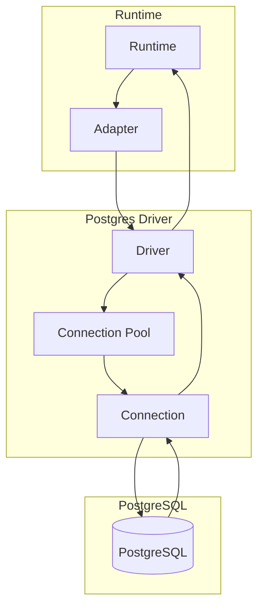

# @internal/driver-postgres

PostgreSQL driver for Prisma 8.

## Package Classification

- **Domain**: targets
- **Layer**: drivers
- **Plane**: multi-plane (migration, runtime)

## Overview

The PostgreSQL driver provides transport and connection management for PostgreSQL databases. It implements the `SqlDriver` interface for executing SQL statements, explaining queries, and managing connections.

In Prisma 8, "driver" refers to the Prisma 8 interface (not the underlying `pg` library). Drivers are transport-agnostic: they own pooling, connection management, and transport protocol (TCP, HTTP, etc.), but contain no dialect-specific logic. All dialect behavior lives in adapters. Instantiation is separate from connection; `create()` returns an unbound driver, `connect(binding)` binds at the boundary ([ADR 159](../../../../docs/architecture%20docs/adrs/ADR%20159%20-%20Driver%20Terminology%20and%20Lifecycle.md)).

This package spans multiple planes:

- **Migration plane** (`src/exports/control.ts`): Control plane entry point for driver descriptors
- **Runtime plane** (`src/exports/runtime.ts`): Runtime entry point for driver implementation

## Purpose

Provide PostgreSQL transport and connection management. Execute SQL statements and manage connections without dialect-specific logic.

## Responsibilities

- **Connection Management**: Acquire and release database connections
- **Statement Execution**: Execute SQL statements with parameters
- **Query Result Parser Policy**: Configure `pg` so runtime query rows expose every column as raw server text, because codecs own decoding; control-plane queries keep `pg` parsing except for array columns
- **Query Explanation**: Execute EXPLAIN queries for query analysis
- **Connection Pooling**: Manage connection pools (when applicable)
- **Transport Protocol**: Handle PostgreSQL protocol (TCP, HTTP, etc.)

**Non-goals:**

- Dialect-specific SQL lowering (adapters)
- Query compilation (sql-query)
- Runtime execution (runtime)

## Architecture



## Components

### Driver (`postgres-driver.ts`)

- Main driver implementation
- Implements `SqlDriver` interface
- Manages connections and executes statements
- Handles PostgreSQL protocol

### Row parser policy

The runtime requires a driver to return every row value as `string | Uint8Array | null`, where the string is the text the server prints for the type ([ADR 155](../../../../docs/architecture%20docs/adrs/ADR%20155%20-%20Driver%20Codec%20Boundary%20and%20Lowering%20Responsibilities.md)). Buffered, cursor, and named cursor `query` paths meet that requirement by passing `serverTextTypes` to `pg`. That policy returns raw server text for every type OID, so `pg` never parses a value. Rows from `query` carry the server's text output for every column, and that text is the wire value (ADR 030) every Postgres codec decodes: `t` for a `bool`, `\x0102` for a `bytea`, `NaN` for a `float8`, `1 day 02:03:04` for an `interval`, `{a,b}` for an array, and the JSON text for a `json` or `jsonb` value. A stored JSON string such as `"standard"` keeps its quotes until codec decoding. Direct driver `query` callers see the same server text strings. A reader that consumes `query` rows without a codec, such as the runtime marker check, must parse the text itself.

`explain` passes no `types` option, so its rows use the default `pg` parsing.

The control driver passes `controlTextTypes` instead. Control-plane queries read catalog rows without codecs, so that policy keeps `pg` parsing for scalar types and returns raw text only for the array OIDs that `pg-types` registers (`PG_TYPES_ARRAY_OIDS`), which the control plane parses itself.

The policies are scoped to each driver query; caller-owned clients and the global `pg` type parsers keep their defaults.

## Related Subsystems

- **[Adapters & Targets](../../docs/architecture%20docs/subsystems/5.%20Adapters%20&%20Targets.md)**: Driver specification

## Related ADRs

- [ADR 159 — Driver Terminology and Lifecycle](../../../../docs/architecture%20docs/adrs/ADR%20159%20-%20Driver%20Terminology%20and%20Lifecycle.md)
- [ADR 005 — Thin Core Fat Targets](../../../../docs/architecture%20docs/adrs/ADR%20005%20-%20Thin%20Core%20Fat%20Targets.md)
- [ADR 016 — Adapter SPI for Lowering](../../../../docs/architecture%20docs/adrs/ADR%20016%20-%20Adapter%20SPI%20for%20Lowering.md)
- [ADR 251 — Target-owned Postgres list framing](../../../../docs/architecture%20docs/adrs/ADR%20251%20-%20Target-owned%20Postgres%20list%20framing.md)

## Usage

Use the descriptor + connect lifecycle:

```typescript
import postgresDriver from '@internal/driver-postgres/runtime';

const driver = postgresDriver.create({ cursor: { batchSize: 100 } });
await driver.connect({ kind: 'url', url: process.env.DATABASE_URL });
// driver is now bound; use acquireConnection, query, execute, etc.
```

Binding variants:

- `{ kind: 'url', url }`: Driver creates a Pool from the connection string
- `{ kind: 'pgPool', pool }`: Use an existing pg Pool
- `{ kind: 'pgClient', client }`: Use an existing pg Client (direct connection)

With `cursor: { disabled: true }` (or buffered cursor fallback), driver-level pool queries return their connection after fetching, before yielding buffered rows for decoding or consumption. Cursor streams retain the connection until completion or iterator cleanup. Queries on caller-owned connections and transactions never release the caller's lease.

## Exports

- `./runtime`: Runtime entry point for driver implementation
  - Default: `postgresRuntimeDriverDescriptor` — use `create()` for unbound driver, then `connect(binding)`
  - Types: `PostgresBinding`, `PostgresDriverCreateOptions`, `QueryResult`
- `./control`: Control plane entry point for driver descriptors
  - Default export: `DriverDescriptor` for use in `prisma.config.ts`
