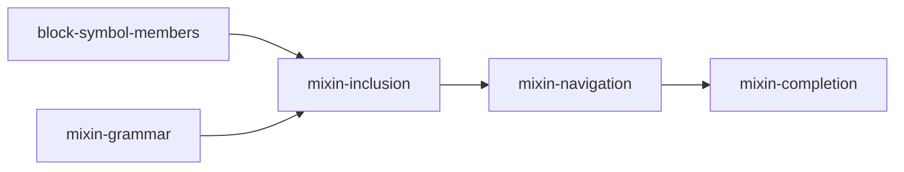

# psl-mixins — Plan

**Spec:** `projects/psl-mixins/spec.md`
**Linear Project:** none (skipped by operator)

## At a glance

Five slices; the editor work planned as one slice, `mixin-editor-support`, was split in two after the language server was investigated, because navigation and completion change different files and each is a full review on its own. Two start in parallel: one moves block-member reads from syntax nodes to symbols, the other adds the grammar. The third builds on both and makes inclusions take effect. The fourth adds language-server support and the ADR.

## Composition

### Parallel group A (independent of group B)

- **Slice `block-symbol-members`**. Linear: none. Folder: `projects/psl-mixins/slices/block-symbol-members/`
  - **Outcome:** Every consumer reads a block's members from its symbol. `BlockSymbol` carries entry and attribute records, as `ModelSymbol` already carries `fields` and `attributes`. No behaviour changes and no fixture changes.
  - **Builds on:** None.
  - **Hands to:** One place, `buildSymbolTable`, that decides which members a block has. A member added to a symbol there is seen by the binder, the block-spec interpreter and every family interpreter with no further change.
  - **Focus:**
    - the member records on `BlockSymbol`, including enum members with their `@` attributes;
    - the 19 production call sites that read `.node.entries()`, `.node.attributes()` or `.node.fields()` today: `psl-parser` (`binder.ts` 3, `block-spec/interpret.ts` 3, `enum-member-attributes.ts` 1), `contract-psl` (`interpreter.ts` 2, `sql-attribute-specs.ts` 1), `contract-prisma7` (5), `contract-prisma6` (4);
    - a grep gate for the spec's Definition of Done item: no production read of block members from a syntax node outside the symbol table;
    - the `psl-parser` README, where it describes `BlockSymbol`.

    Tests that read `.node` to locate a syntax node for an assertion are not in scope; the rule is about production consumers.

### Parallel group B (independent of group A)

- **Slice `mixin-grammar`**. Linear: none. Folder: `projects/psl-mixins/slices/mixin-grammar/`
  - **Outcome:** The parser reads `<keyword> mixin <Name> { … }` and `+<QualifiedName>` for every block keyword, keeps them in the lossless syntax tree, exposes them through typed AST classes, and the formatter prints them. A schema that uses either form gets a diagnostic saying mixins are not supported yet, and nothing else about it changes.
  - **Builds on:** None.
  - **Hands to:** Typed AST nodes for a mixin declaration and for an inclusion member, present in every body grammar (fields, `key = value` entries, enum members). Mixin declarations are kept out of the symbol table's models, composite types and blocks, so no interpreter sees one.
  - **Focus:**
    - the `Plus` token;
    - the declaration form in `parseModel`, `parseCompositeType` and `parseGenericBlock`, selecting the member grammar from the leading keyword as today;
    - the inclusion member in all three member parsers, with a `QualifiedName` operand;
    - `mixin` reserved as a block keyword and as a block name, with the two targeted diagnostics from spec decision 2;
    - `namespace` and `types` rejected as mixin keywords;
    - the `prisma-7` grammar option left as it is (spec decision 14);
    - formatter output and idempotence for both forms;
    - the "not supported yet" diagnostic required by the spec's transitional constraint, raised in the symbol table for every mixin declaration and every inclusion;
    - an upgrade-instructions entry if any example or extension schema uses a block named `mixin`.

### Stack (deliver in order, after both groups)

1. **Slice `mixin-inclusion`**. Linear: none. Folder: `projects/psl-mixins/slices/mixin-inclusion/`
   - **Outcome:** An inclusion places the mixin's members in the enclosing block, for models, composite types, enums and extension blocks, at the top level and in namespaces. The emitted contract equals the contract of the same schema written inline. The "not supported yet" diagnostic is gone.
   - **Builds on:** `block-symbol-members`' single place that decides a block's members, and `mixin-grammar`'s AST nodes.
   - **Hands to:** Mixin symbols in the kind-blind name scope, and a binder that resolves an inclusion's operand to its mixin and binds each mixin body once. The language server reads both.
   - **Focus:**
     - mixin symbols, and `PSL_DUPLICATE_DECLARATION` against other declarations in the same namespace;
     - the second pass in `buildSymbolTable` that replaces inclusions with members at their position;
     - the four diagnostics located at the inclusion: unresolved mixin, keyword mismatch, member provided twice, inclusion inside a mixin body;
     - binding a mixin body in its own namespace against its own members (spec decision 10), including the unresolved-reference diagnostic for a field the mixin does not declare;
     - mixed-in members as shared symbols (spec decision 12);
     - one contract-equivalence test per block kind, and a field-order test;
     - a row-level security fixture using the `policy_select` example from the spec;
     - the `psl-parser` README sections on the scope chain and resolution kinds.

2. **Slice `mixin-navigation`**. Linear: none. Folder: `projects/psl-mixins/slices/mixin-navigation/`
   - **Outcome:** In the language server, go-to-definition, find references, hover and rename work on a mixin's name, at its declaration and at every inclusion; renaming a field declared in a `model` mixin keeps its column name as it does for a model's field; mixin bodies and inclusions get semantic tokens.
   - **Builds on:** `mixin-inclusion`'s mixin symbols and binder resolutions.
   - **Hands to:** A language server in which a mixin is a navigable symbol.
   - **Focus:** `cursor-resolution.ts`, `hover.ts`, `rename.ts` with `attribute-spec-resolution.ts`, `semantic-tokens.ts`, and their tests.

3. **Slice `mixin-completion`**. Linear: none. Folder: `projects/psl-mixins/slices/mixin-completion/`
   - **Outcome:** Completion after `+` offers the mixins whose keyword matches the enclosing block and no others; completion and signature help inside a mixin body behave as inside a block of the mixin's keyword; a block that includes a mixin is not offered the keys the mixin provides. The ADR for mixin syntax and resolution is written and `projects/prisma-8-rc1/feature-surface.md` item 6 shows the agreed spelling.
   - **Builds on:** `mixin-navigation`.
   - **Hands to:** Project close-out. Every item in the spec's Definition of Done is met.
   - **Focus:** `completion-context.ts`, `completion-provider.ts`, `completion-scope.ts`, `completion-symbols.ts`, `signature-context.ts`, the owner types in `attribute-spec-resolution.ts`; the ADR; the manual QA script and run for all editor behaviour.

## Dependencies (external)

- [ ] **Other in-flight work on the binder and the language server.** `mixin-inclusion` and `mixin-editor-support` change `binder.ts`, the `Resolution` kinds and the completion provider. Check open PRs on those files when each slice is picked up.
- [x] **Tagged literals (ADR 129).** The RC plan asks for the two grammar changes to be coordinated. `TaggedLiteral` is already a syntax kind in `psl-parser`, so there is nothing left to coordinate.

## Known gaps, not planned

- **A `+name` at the start of a line inside a multi-line argument list that is already invalid** (for example `@@index([` / `a,` / `+b` / `])`) is read as an inclusion of `name`, followed by an "invalid member" diagnostic for the stray `]`. The input is invalid either way, and on `main` the same input already produces member-level diagnostics for the leftover lines. Found in review of `mixin-grammar`.
- **An argument list left open at the end of a line reports no diagnostic.** This is behaviour on `main`, unrelated to mixins.

## Sequencing rationale

- **`block-symbol-members` ships on its own** although it only prepares for `mixin-inclusion`. The spec requires it to land first with no behaviour change. It touches four interpreters; reviewed together with inclusion, a reviewer could not tell a mechanical move from a semantic change.
- **`mixin-grammar` is separate from `mixin-inclusion`** so that the syntax tree, the reserved word and the formatter are reviewed as a parser change, and the symbol table and binder as a semantics change. The "not supported yet" diagnostic keeps `main` honest in between: a schema using the new forms is rejected, never silently accepted.
- **The two groups overlap in `symbol-table.ts`.** `mixin-grammar` adds only the exclusion of mixin declarations and the interim diagnostic there; whichever merges second rebases over a small change.
