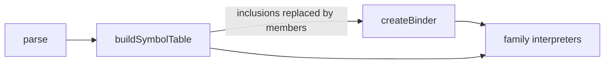

# psl-mixins — reusable member sets for PSL blocks

## Purpose

Let a schema author write a set of block members once and reuse it in many blocks of the same kind, for models, composite types, enums and extension-defined blocks alike. A block that uses a mixin behaves exactly as if the mixin's members had been written in it, so nothing downstream of the PSL front end needs to know mixins exist.

## At a glance

```prisma
namespace auth {
  model mixin Timestamps {
    createdAt DateTime @default(now())
    updatedAt DateTime @default(now())
    @@index([createdAt])
  }
}

enum mixin BaseRoles {
  ADMIN
  USER
}

model User {
  id Int @id
  email String
  +auth.Timestamps
}

enum Role {
  +BaseRoles
  GUEST
}
```

`User` has the fields `id`, `createdAt`, `updatedAt`, `email`, in that order, and the index on `createdAt`. `Role` has `ADMIN`, `USER`, `GUEST`. The emitted contract is the same as if the members had been written inline.

The same two forms work for a block kind an extension defines. Row-level security policies, as written in `examples/supabase/src/contract.prisma`, repeat their roles and predicate for every table they protect. A mixin holds the repeated entries:

```prisma
namespace public {
  policy_select mixin OwnerRead {
    roles = [authenticated]
    using = "\"userId\"::uuid = auth.uid()"
  }

  policy_select profile_owner_read {
    target = Profile
    +OwnerRead
  }

  policy_select document_owner_read {
    target = Document
    +OwnerRead
  }
}
```

Each policy has `target`, `roles` and `using`, as if all three entries were written in it. `OwnerRead` can be included only in `policy_select` blocks; a `policy_update` block needs its own mixin, because a mixin has one keyword.

Two new syntactic forms:

| Form | Syntax | Meaning |
|---|---|---|
| Declaration | `<block keyword> mixin <Name> { … }` | A named member set for blocks with that keyword. The body uses the keyword's own member grammar. |
| Inclusion | `+<QualifiedName>` as a body member | Places the mixin's members at this position in the enclosing block. |

How it reaches the rest of the system:



Inclusions are replaced by members while the symbol table is built. The binder and the family interpreters read ordinary blocks.

## Decisions

1. **The declaration starts with the target's block keyword: `<keyword> mixin <Name> { … }`.** The parser chooses a body's member grammar from the block keyword at parse time (`genericBlockMemberParser` in `psl-parser/src/parse.ts`) and knows nothing about extension block descriptors. With the keyword first, a mixin body is read exactly as a block of that kind is read today. A mixin that named its target anywhere after the opening brace would need a body grammar that is the union of fields, `key = value` entries and bare enum keys, in which a bare enum key and a field with a missing type cannot be told apart.
2. **`mixin` is reserved as a block keyword and as a block name.** `mixin X { … }` is an error that says a mixin needs a block keyword, and `model mixin { … }` is an error that says a mixin name is expected. These are the two likely mistakes, the first being the July 20 spelling. No extension can define a block kind named `mixin`. Field names and attribute arguments are unaffected. Reserving the word before the syntax freezes breaks nothing; reserving it afterwards would be a breaking change.
3. **Inclusion is a dedicated member, `+<Name>`, not an attribute.** Mixins are a core language construct, independent of any interpreter; attribute meaning comes from specs contributed by families and extensions. `@@include(Name)` would be the one `@@` name that core resolves before any spec sees the block. A keyword member (`include Timestamps`) was rejected because that text is already a valid field named `include` of type `Timestamps`.
4. **`+` is a new token.** The tokenizer has no token for it today, and no body member can start with it, so the form is unambiguous in all three member grammars and no existing schema changes meaning.
5. **Position decides placement.** The mixin's members are placed where the inclusion is written. Field order, and with it column order, follows the source.
6. **The inclusion's operand is a `QualifiedName`**, the node type references already use, so `+auth.Timestamps` and cross-namespace lookup need no new reference form.
7. **Mixins are namespace members** and share the kind-blind name scope with models, composite types and blocks. A mixin and a model with the same name in one namespace are a `PSL_DUPLICATE_DECLARATION`. An unqualified inclusion resolves in the declaring namespace, then the top level.
8. **The included mixin's keyword must equal the enclosing block's keyword.** Anything else is a diagnostic at the inclusion.
9. **A member provided twice is an error.** This covers a block and an included mixin providing the same member, and two included mixins providing the same member. There is no precedence and no override.
10. **Names inside a mixin are resolved where the mixin is written.** The body is bound once, in the mixin's own namespace, against the mixin's own members. The binder stores one resolution per syntax node; resolving at each inclusion would give one node several meanings and leave hover and go-to-definition inside the mixin body without a single answer. Consequence: a mixin's attributes can name only fields the mixin declares. `@@unique([tenantId, id])` where `id` belongs to the including model is written in the model.
11. **Inclusions are replaced by members in `buildSymbolTable`,** in a second pass after all declarations are collected. Mixin lookup needs only user declarations, since no target or extension contributes mixins. The existing duplicate detection there covers decision 9.
12. **Mixed-in members are shared symbols.** A mixin's field is one symbol and one node however many blocks include it. A reference to it from an including block (`@@unique([tenantId, id])`) resolves to the mixin's field, so rename and go-to-definition work across including blocks.
13. **Diagnostic locations.** Errors raised while inclusions are replaced (unresolved mixin, keyword mismatch, duplicate member, inclusion inside a mixin) point at the inclusion. Errors raised by family interpreters keep the location they compute today, which for a mixed-in member is inside the mixin. Moving those to the inclusion would require either every interpreter diagnostic site (about 260 across the SQL and Mongo interpreters) to know about mixins, or per-block member copies that would also move errors that are the mixin's own fault.
14. **Under the `prisma-7` grammar option nothing changes.** Neither new form is recognised, and `model mixin { … }` stays a model named `mixin`. Prisma 7 has no custom blocks, so `mixin X { … }` is already an unsupported block there.

Restrictions:

- The keyword may be any block keyword except `namespace` and `types`.
- A mixin has one keyword and always has a name; the declaration form allows nothing else.
- An inclusion inside a mixin body is a diagnostic.

Forms considered and not chosen: `mixin <Name> for <keyword> { … }` with `...<Name>`, and the attribute spelling `mixin <Name> { @@for(<keyword>) … }` with `@@include(<Name>)`. The comparison is in [`team-brief.md`](./team-brief.md).

## Non-goals

- **Mixins that include other mixins.** Diagnosed, not supported.
- **One mixin for several block kinds** (a field set usable in both `model` and `type`).
- **Override or precedence between a block's members and a mixin's.**
- **Parameterised mixins.**
- **De-duplicating repeated diagnostics.** An interpreter error on a mixed-in member is reported once per including block.
- **Running family interpreters over a mixin that no block includes.** Such a mixin is checked by the parser, the symbol table and the binder only, and it gets no unused-mixin warning.
- **Mixins in the contract.** The contract records the resulting blocks; `contract infer` and the PSL printer do not produce mixins.
- **Retiring field presets and type aliases.** The July 20 decision ties their retirement to mixins. It is not part of this project; it is later work under TML-3055 that depends on it.

## Place in the larger world

- **`@internal/psl-parser`** carries the whole feature: tokenizer, parser, typed AST, symbol table, binder, formatter.
- **Family interpreters** (`contract-psl` for SQL and Mongo, `contract-prisma7`, `contract-prisma6`) are consumers. They change only in the prerequisite described under cross-cutting requirements, and never branch on whether a member came from a mixin.
- **Language server.** It reads the same binder. The inclusion's operand is a bound reference and the mixin name is a declared symbol, so the existing go-to-definition, rename and hover providers apply to them. Completion after `+` is new work in the completion provider: it offers the mixins whose target matches the enclosing block.
- **Team decision of July 20** (`projects/prisma-8-rc1/feature-surface.md`, item 6) recorded `mixin WithTimestamps { … }` with `@@include(WithTimestamps)`. Decisions 1 and 3 supersede both spellings; that document is updated when this spec is accepted.
- **Linear:** [TML-3055](https://linear.app/prisma-company/issue/TML-3055/psl-mixins-named-field-set-reuse-retire-field-presets-type-aliases-and).
- **ADR 104** (PSL extension namespacing and syntax) and **ADR 129** (tagged literals) are the neighbouring PSL syntax decisions. This project adds an ADR for mixin syntax and resolution at close-out.

### Contract impact

None. No contract entity, kind or field is added or changed. A schema that uses mixins emits the same `contract.json` and `contract.d.ts` as the same schema with the members written inline.

### Adapter impact

None. No target adapter changes.

## Cross-cutting requirements

- **Consumers read block members from symbols, not from syntax nodes.** `BlockSymbol` holds only `name`, `keyword` and `node` today, and about fifteen call sites in the binder, `block-spec/interpret.ts`, the family interpreters and `sql-attribute-specs.ts` read `block.node.entries()` or `block.node.attributes()`. Three sites read `model.node.attributes()`. All of them move to member records on the symbol, and `BlockSymbol` gains those records. Without this, an inclusion in an enum or an extension block is invisible to its consumers.
- **Inline equivalence.** For every block kind, a schema using a mixin and the same schema with the members written at the inclusion's position produce the same contract.
- **One grammar for every block kind.** `<keyword> mixin X` and `+X` parse for any keyword from the first parser change; support is not added kind by kind.
- **No interpreter knows about mixins.** No family interpreter, attribute spec or block spec tests for a mixin or an inclusion.
- **Lossless round trip.** The parser keeps its lossless syntax tree for the new forms, and the formatter prints them.

## Transitional-shape constraints

- The move from syntax-node reads to symbol member records is delivered before any mixin grammar and changes no behaviour: every existing test passes unchanged.
- Once the grammar is merged, an inclusion never parses successfully and then has no effect. Until inclusions are replaced for a block kind, an inclusion in that kind is a diagnostic.
- Every merged slice keeps `main` green and the emitted fixtures unchanged, except fixtures added to cover mixins.

## Project Definition of Done

- [ ] Team-DoD floor items (inherited; see [`drive/calibration/dod.md`](../../drive/calibration/dod.md)).
- [ ] A mixin can be declared for `model`, `type`, `enum` and an extension block keyword, at the top level and inside a `namespace`, and included with an unqualified and a qualified name.
- [ ] For each of those four block kinds, a test compares the emitted contract of a schema using a mixin with the contract of the same schema written inline, and they are equal.
- [ ] Field order in the emitted contract follows the inclusion's position.
- [ ] Each of these is a diagnostic located at the inclusion: unresolved mixin name, keyword mismatch, a member provided twice, an inclusion inside a mixin body.
- [ ] A reference inside a mixin to a field the mixin does not declare is an unresolved-reference diagnostic located in the mixin.
- [ ] No production call site outside `psl-parser`'s symbol table reads block members from a syntax node (`.node.entries()`, `.node.attributes()`, `.node.fields()`, `.node.members()`).
- [ ] `mixin X { … }` and `model mixin { … }` are each a diagnostic that says what a mixin declaration needs.
- [ ] The formatter prints both new forms and formatting is idempotent on them.
- [ ] In the language server, go-to-definition on an inclusion's operand opens the mixin, and renaming a mixin updates its inclusions.
- [ ] In the language server, completion after `+` offers the mixins whose keyword matches the enclosing block, and no others.
- [ ] Under the `prisma-7` grammar option, `model mixin X { }`, `model mixin { }` and a line starting with `+` parse as they do today.
- [ ] An ADR records the mixin syntax and the resolve-where-written rule, and `projects/prisma-8-rc1/feature-surface.md` no longer shows the superseded spelling.

## Open Questions

None.

## References

- Linear: [TML-3055](https://linear.app/prisma-company/issue/TML-3055/psl-mixins-named-field-set-reuse-retire-field-presets-type-aliases-and)
- Prior decision: `projects/prisma-8-rc1/feature-surface.md`, item 6
- Parser and binder reference: `packages/1-framework/2-authoring/psl-parser/README.md` (§ Scope chain, § Attribute contexts and the single voice, § Node identity)
- ADRs: ADR 104 (PSL extension namespacing and syntax), ADR 129 (tagged literals)
- Design discussion: the `drive-discussion` session of 2026-10-08 that produced the decisions above
