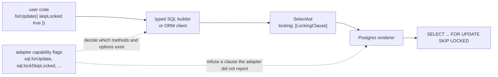

# Design: locking the rows a select reads

Status: proposed, 2026-09-30. Tracks [prisma/orm#30531](https://github.com/prisma/orm/issues/30531). Every path and line number refers to `main` at `64f6c3e3b7`.

## The problem, in one example

Two requests arrive at the same moment, each trying to claim the last unit of stock for product 42. Each one runs this inside its own transaction:

```ts
const product = await tx.orm.public.Product.where({ id: 42 }).first();
if (product.stock > 0) {
  await tx.orm.public.Product.where({ id: 42 }).update({ stock: product.stock - 1 });
}
```

At Postgres's default isolation level both transactions read `stock = 1`, both decide there is stock, and both write `stock = 0`. Two units are sold and one existed. The database did nothing wrong: nobody told it these two reads had to be serialised.

The fix every database offers is to lock the row when you read it, so the second transaction waits for the first to commit and then reads what the first left behind:

```sql
SELECT "id", "stock" FROM "product" WHERE "id" = $1 FOR UPDATE
```

Prisma 8 cannot write that statement today. Neither the ORM client nor the typed SQL builder has a method for it, and the select syntax tree they both produce has no field that could hold it. The only way is the raw SQL lane, which throws away the typed columns, the typed `where` and the table names the contract knows about. This design adds the missing piece so the example becomes:

```ts
const product = await tx.orm.public.Product.where({ id: 42 }).forUpdate().first();
```

and the same on the typed SQL builder:

```ts
await tx.sql.public.product
  .select('id', 'stock')
  .where((f, fns) => fns.eq(f.id, 42))
  .forUpdate()
  .build();
```

## The decision

- Four new methods on both the typed SQL builder and the ORM client, named after the SQL they render: `forUpdate()`, `forNoKeyUpdate()`, `forShare()` and `forKeyShare()`. Each takes an optional object with `of`, `nowait` and `skipLocked`.
- A method or option exists only when the connected database can render it. This is done with seven capability flags, one per method or option, following the way `distinctOn` and `returning` already work.
- One new node, `LockingClause`, on the shared select syntax tree. It describes what is locked and how to wait, in words every SQL dialect understands. Each database's renderer turns it into that database's syntax.
- The typed SQL builder ships first. The ORM client ships second with a deliberately narrow first version.

## How a call becomes SQL



The rest of this document walks that diagram from left to right: first what a row lock is, then what Prisma 8 has today, then each box in turn, then how the work is sliced and tested. Alternatives that were considered and rejected are at the end.

## Row locks in Postgres

A locking clause sits at the end of a SELECT. The rows the SELECT returns stay locked until the enclosing transaction commits or rolls back. Another transaction that tries to UPDATE, DELETE or lock the same rows waits until then. Postgres has four strengths.

| Clause | What it blocks |
|---|---|
| `FOR UPDATE` | every write and every other lock on the row |
| `FOR NO KEY UPDATE` | writes, but not `FOR KEY SHARE`, which is the lock a foreign key check takes on the row it references |
| `FOR SHARE` | writes only; other readers may share-lock at the same time |
| `FOR KEY SHARE` | only deletes and changes to key columns |

Two wait modes change what happens when a row is already locked. `NOWAIT` fails the statement at once. `SKIP LOCKED` leaves locked rows out of the result, which is what a work queue wants: each worker takes the next unclaimed job without waiting for the others. Without either, the statement waits.

`OF <table>` limits the lock to one table's rows when the query joins several. The name must be the table or alias as written in `FROM`, without a schema, because Postgres refuses a qualified name there.

Outside a transaction the lock is released the moment the statement ends, so a lock is only useful inside `db.transaction(...)`.

The second strength matters more than it looks. Every insert or update of a row that references product 42 through a foreign key takes `FOR KEY SHARE` on the product row to check the key still exists. `FOR UPDATE` conflicts with that lock; `FOR NO KEY UPDATE` does not. When two transactions each lock a parent and then write a child in opposite orders, `FOR UPDATE` deadlocks and `FOR NO KEY UPDATE` proceeds. The application in the tracking issue hit exactly this.

## Who asked

- [prisma/orm#30531](https://github.com/prisma/orm/issues/30531), filed while building the Asks application. Two transactions moving identities out of the same contact each counted the other's identity as still present, so neither absorbed the contact. The fix was `FOR NO KEY UPDATE` on the contact row, written through the raw lane.
- Emie (@dickb0r0) on X, 2026-09-29, [thread](https://x.com/dickb0r0/status/2104858419819597998): asked how to express `FOR UPDATE` through Prisma's query API, and whether its absence was a deliberate database-agnostic choice or simply unbuilt.
- prisma/prisma#5983, #8580 and #17136 ask the same of Prisma 6 and 7, open since 2021.

For Prisma 8 the answer is that it is unbuilt, not a choice. Prisma 8 is not database-agnostic in the Prisma 7 sense: the adapter reports what it supports, the contract records it, and the builders expose database-specific clauses when the capability is present. Row locking fits that model without any change to it.

## What Prisma 8 has today

- `packages/2-sql/4-lanes/sql-builder/STATUS.md:51` lists row locking under "What's missing".
- `SelectAstOptions`, the options of the shared select node, at `packages/2-sql/4-lanes/relational-core/src/ast/types.ts:1583-1596`, has no field that could hold a lock, so no renderer can print one.
- The Postgres renderer, `renderSelect` in `packages/3-targets/6-adapters/postgres/src/core/sql-renderer.ts:204-241`, stops at `OFFSET`. The SQLite renderer in `packages/3-targets/6-adapters/sqlite/src/core/adapter.ts:235-271` has the same list.
- `SelectQuery`, the typed builder's select type at `packages/2-sql/4-lanes/sql-builder/src/types/select-query.ts:18-81`, has no locking method. `CollectionState`, the ORM's query state at `packages/3-extensions/sql-orm-client/src/types.ts:89-110`, has no locking field.
- The Prisma 7 test "high concurrency with SET FOR UPDATE" was not ported because it needs raw SQL inside a transaction (`test/integration/test/ports/prisma/non-ported/functional/interactive-transactions/interactive-transactions.md:58`).

The precedent to copy is `DISTINCT ON`, another Postgres-only clause. In the builder it is a `GatedMethod`, a type that resolves to the method when the contract's capabilities include `postgres.distinctOn` and to `never` otherwise (`select-query.ts:66-80`, runtime `query-impl.ts:67-78`). In the ORM the parameter type is `never` without the flag and `assertDistinctOnCapability` throws `ORM.CAPABILITY_MISSING` at run time (`collection.ts:1090`, `collection-contract.ts:637-652`). The Postgres adapter declares the flag in `adapter.ts:20-39` and `descriptor-meta.ts:150-165`.

## What you write: the typed SQL builder

`SelectQuery` gains four methods. Each returns a `SelectQuery`, so `where`, `orderBy`, `limit`, `offset`, `as` and `build` may still follow in any order, like every other clause.

```ts
db.sql.public.contact.select('id').where((f, fns) => fns.eq(f.id, id)).forNoKeyUpdate()
db.sql.public.job.select('id').where(...).orderBy(...).limit(1).forUpdate({ skipLocked: true })
db.sql.public.contact.as('c').select('id').innerJoin(...).forUpdate({ of: ['c'], nowait: true })
```

The options object has three keys. `of` names the tables or aliases to lock, checked in the types against the names in scope, the way `distinctOn` checks its fields against the row. `nowait` and `skipLocked` are each `true` or absent, and they sit in a union so that passing both is a type error, because Postgres refuses both together.

Each method, and each option key, exists in the types only when the adapter reports its flag. This is the same `GatedMethod` mechanism `distinctOn` uses, applied to the option type as well:

```ts
forUpdate: GatedMethod<
  QC['capabilities'],
  { sql: { forUpdate: true } },
  (options?: LockOptions<QC, AvailableScope>) => SelectQuery<QC, AvailableScope, RowType>
>;

type LockOf<QC, S extends Scope> = QC['capabilities'] extends { sql: { lockOf: true } }
  ? { readonly of?: ReadonlyArray<keyof S['namespaces'] & string> }
  : { readonly of?: never };

type LockWaitOptions<QC> =
  | (QC['capabilities'] extends { sql: { lockNowait: true } } ? { readonly nowait?: true; readonly skipLocked?: never } : never)
  | (QC['capabilities'] extends { sql: { lockSkipLocked: true } } ? { readonly skipLocked?: true; readonly nowait?: never } : never)
  | { readonly nowait?: never; readonly skipLocked?: never };

type LockOptions<QC, S extends Scope> = LockOf<QC, S> & LockWaitOptions<QC>;
```

`forNoKeyUpdate` and `forKeyShare` are gated on `postgres.forNoKeyUpdate` and `postgres.forKeyShare`; `forShare` on `sql.forShare`.

At run time each method goes through the builder's existing `_gate(...)` (`query-impl.ts:67-78`), which throws when the flag is absent, then checks the option flags the same way, and appends a `LockingClause` to a new `locking` array on the builder state (`builder-base.ts:70-91`). Each call appends, so `forUpdate({ of: ['a'] }).forShare({ of: ['b'] })` produces two clauses, which Postgres allows. `buildSelectAst` (`builder-base.ts:155-173`) passes the array to the tree.

`groupBy()` already returns a different type, `GroupedQuery`, which does not get the four methods. That keeps the most common invalid combination out of the types entirely. The other invalid combinations are refused at `build()`; they are listed in one place under "What is refused, and where".

A locked select used as a subquery through `.as(...)` is legal Postgres but rare. The first version refuses it at `build()`.

## What you write: the ORM client

`Collection` gains the same four methods with the same names and the same flags.

```ts
await tx.orm.public.Contact.select('id').where({ id }).forNoKeyUpdate().first();
await tx.orm.public.Job.where({ state: 'queued' }).orderBy((j) => j.createdAt.asc()).limit(1).forUpdate({ skipLocked: true }).first();
```

Each parameter is typed `never` without the flag, as `distinctOn` is (`collection.ts:1090-1105`), and each method asserts the flag at run time with an `assertLockCapability(contract, flag, methodName)` beside `assertDistinctOnCapability`, throwing `ORM.CAPABILITY_MISSING` with the flag in `meta`.

The ORM's options offer `nowait` and `skipLocked` under their flags but do not offer `of`. The ORM always renders `OF "<the model's table or its alias>"` itself, so only the model's own rows are locked. The reason is `include`: it adds joins and subqueries for related rows, and without `OF` Postgres would try to lock every table in `FROM`, including rows the caller did not ask to lock, and it refuses to lock the nullable side of an outer join at all. Always naming the model's table keeps the behaviour identical whether or not an include is present.

`CollectionState` gains `locking: ReadonlyArray<LockingClause> | undefined`, set to `undefined` in `emptyState()`. `buildSelectAst` (`query-plan-select.ts:1379-1444`) applies it to the outermost select with `withLocking`. Only the read terminals `all` and `first` use it.

The first ORM version refuses a lock together with `include`. The include lowering wraps the base select in `json_agg` subqueries and sometimes an outer `DISTINCT` (`query-plan-select.ts:1044-1047`), and Postgres refuses a locking clause at a query level that has aggregates or `DISTINCT`. The lock would have to go on the inner base-table select with `OF` that table. That is doable, but it is the only part of this design with real risk, and the plain select is the read-then-write and work-queue case. Include support comes as its own slice if someone asks for it.

The ORM does not refuse a lock outside a transaction. The lock is released when the statement ends, which is legal and sometimes intended, for example `nowait` to test whether a row is free. The docs state the lifetime instead.

## Why a method may be missing: the capability flags

Capabilities in this repo follow one rule: one flag per builder method or option, in the `sql` group when more than one dialect has it and in a dialect group such as `postgres` when only one does. `insertOnConflictSkip` and `insertOnConflictWithoutTarget` are the existing example of an option and its sub-option as two flags. Row locking follows the rule with seven boolean flags.

| Flag | What it says the target can render |
|---|---|
| `sql.forUpdate` | `FOR UPDATE` |
| `sql.forShare` | `FOR SHARE` or its equivalent |
| `sql.lockOf` | a table list on a locking clause |
| `sql.lockNowait` | `NOWAIT` or its equivalent |
| `sql.lockSkipLocked` | `SKIP LOCKED` or its equivalent |
| `postgres.forNoKeyUpdate` | `FOR NO KEY UPDATE` |
| `postgres.forKeyShare` | `FOR KEY SHARE` |

The Postgres adapter reports all seven, in `adapter.ts:20-39` and `descriptor-meta.ts:150-165`. SQLite reports none. They are documented in `docs/reference/capabilities.md`.

Why seven and not one: the flags have to survive databases we do not ship yet. The table below is the survey behind the split. Every column varies independently of the others, so a coarser set of flags would have to be split the first time one of these adapters shipped.

| Database | FOR UPDATE | FOR SHARE | NO KEY UPDATE, KEY SHARE | OF table | NOWAIT | SKIP LOCKED | Source |
|---|---|---|---|---|---|---|---|
| Postgres, Neon, Supabase, PlanetScale Postgres | yes | yes | yes | yes | yes | yes | Postgres `SELECT` reference |
| CockroachDB, YugabyteDB | yes | accepted, weaker semantics | accepted | yes | yes | yes | Cockroach `SELECT FOR UPDATE` docs |
| Neki (PlanetScale sharded Postgres, preview) | yes, per shard | yes | yes | yes | yes | yes | PlanetScale Neki limitations page lists no locking restriction; cross-shard transactions have no atomic commit |
| MySQL 8 | yes | yes | no | yes | yes | yes | MySQL `SELECT` reference |
| MariaDB | yes | as `LOCK IN SHARE MODE` | no | no | yes | yes, 10.6+ | MariaDB `SELECT` reference |
| Vitess, PlanetScale MySQL | yes | yes, plus `LOCK IN SHARE MODE` | no | no | yes | yes | Vitess `go/vt/sqlparser/sql.y`, rule `locking_clause` |
| Oracle | yes | no | no | by column | yes | yes | Oracle `SELECT` reference |
| SQL Server | as the table hint `UPDLOCK, ROWLOCK` on the FROM item | as `HOLDLOCK` | no | hints are per table | `NOWAIT` hint | `READPAST` hint | SQL Server table hints reference |
| SQLite, Cloudflare D1 | no | no | no | no | no | no | a writer locks the whole database; `BEGIN IMMEDIATE` is the substitute |

What each future adapter would report:

| Adapter | Flags |
|---|---|
| MySQL | the five `sql` flags |
| Vitess, MariaDB | `sql.forUpdate`, `sql.forShare`, `sql.lockNowait`, `sql.lockSkipLocked` |
| Oracle | `sql.forUpdate`, `sql.lockNowait`, `sql.lockSkipLocked` |
| SQL Server | all five `sql` flags, rendered as hints |
| Cockroach, Yugabyte, Neki | all seven, because they report the `postgres` group |

Two things in the survey are semantics rather than syntax, and capabilities do not model them. On a sharded target (Vitess with more than one shard, Neki) a row lock holds only inside the shard the row lives on, and `SKIP LOCKED` with `LIMIT` fans out to every shard, so it can lock up to `LIMIT` rows per shard. Cockroach accepts `FOR SHARE` and treats it more weakly than Postgres unless a session setting is on. The syntax renders the same, so the adapter reports the same flags. Each such adapter's documentation must say so.

## What the tree holds: `LockingClause`

`SelectAst` is shared by every SQL target, so the node describes what is locked and how to wait, never how one dialect writes it. Its value names match the builder methods, so one name serves the AST, the builder and the ORM.

```ts
export type LockStrength = 'forUpdate' | 'forNoKeyUpdate' | 'forShare' | 'forKeyShare';
export type LockWait = 'nowait' | 'skipLocked';

export class LockingClause {
  readonly strength: LockStrength;
  readonly of: ReadonlyArray<string> | undefined;
  readonly wait: LockWait | undefined;
}
```

`of` holds table names or aliases as they appear in `FROM` and the joins, never schema-qualified. `wait` is a single field rather than two booleans so that the tree cannot hold both.

`SelectAstOptions` and `SelectAst` gain `locking: ReadonlyArray<LockingClause> | undefined`. It is an array because Postgres allows several clauses on one select, each naming different tables. The constructor freezes a copy as it does for `joins` and `orderBy`; `from()`, `noFrom()`, `toOptions()` and `rewrite()` carry it; `withLocking(clauses)` is added beside `withDistinctOn`. `rewrite()` leaves the clause unchanged, because it holds names, not expressions. `LockingClause` follows the frozen-class pattern the other nodes use: `freezeNode` in the constructor and a static `of(...)` factory.

The constructor refuses a tree that combines `locking` with `distinct`, `distinctOn`, `groupBy` or `having`, because Postgres refuses every such statement. A lock together with an aggregate or window function in the projection is refused by the builders at `build()` instead, because the constructor does not walk the projection today and the builders already know what they projected.

## What the renderer prints

The Postgres renderer appends one rendered clause per entry after `offsetClause`, in order: the strength keyword, then `OF "a", "b"` when `of` is set, then `NOWAIT` or `SKIP LOCKED` when `wait` is set. Names in `of` are quoted like every other identifier.

```sql
SELECT "id" AS "id" FROM "public"."contact" WHERE "id" = $1 FOR NO KEY UPDATE
SELECT "id" AS "id" FROM "public"."job" WHERE "state" = $1 ORDER BY "createdAt" ASC LIMIT $2 FOR UPDATE SKIP LOCKED
SELECT "c"."id" AS "id" FROM "public"."contact" AS "c" INNER JOIN "public"."identity" AS "i" ON ... FOR UPDATE OF "c" NOWAIT
```

Before rendering, the renderer checks each clause against the adapter's own capabilities and throws an adapter error naming the missing flag if the tree carries a strength or option the adapter did not report. The builders already checked this for their own output; this check is what protects a tree someone built by hand.

The SQLite renderer throws a structured error when `ast.locking` is set. Dropping the clause silently would turn a lock into no lock, which is the worst possible outcome.

Future renderers map the same node to their own syntax: MariaDB writes `LOCK IN SHARE MODE` for `forShare`; SQL Server turns each clause into `WITH (UPDLOCK, ROWLOCK)` or `WITH (HOLDLOCK)` on the FROM items named in `of`, or on every FROM item when `of` is unset, and turns `wait` into the `NOWAIT` or `READPAST` hint. None of this is built now. The point is that the node carries enough for it.

## What is refused, and where

| Situation | Where | Error |
|---|---|---|
| A method called without its flag, builder | `_gate` | the capability error the builder already throws for `distinctOn` |
| An option passed without its flag, builder | the method | the same error, naming the option's flag |
| A method called without its flag, ORM | the method | `ORM.CAPABILITY_MISSING`, `meta.capability` = the flag |
| A lock with `distinct`, `distinctOn`, `groupBy` or `having` | `SelectAst` constructor | a structured error, `AST.LOCK_INCOMPATIBLE` |
| A lock with an aggregate projection, or a locked subquery | builder `build()` | a structured error, `SQL_BUILDER.LOCK_INCOMPATIBLE` |
| A lock with `include`, `aggregate`, `distinct` or `distinctOn`, ORM | compile | a structured error, `ORM.LOCK_INCOMPATIBLE` |
| A mutation terminal (`update`, `updateAll`, `updateAndCount`, `delete`, `deleteAll`, `deleteAndCount`, `create`, `upsert`) on a locked collection | the terminal | `ORM.LOCK_INCOMPATIBLE`; a mutation already locks the rows it changes, and dropping the requested lock silently would hide a mistake |
| A strength or option the adapter did not report, in a tree | renderer | an adapter error naming the flag |
| Any lock, SQLite | renderer | a structured error |
| A row is locked and `nowait` was set | the database | SQLSTATE `55P03`, `lock_not_available`, surfaced as the driver error |

The exact code strings follow whatever the neighbouring errors in each package use. Mapping `55P03` to a structured code is a follow-up.

## What the documentation must say

- A lock lasts until the transaction ends, so use it inside `db.transaction(...)`.
- Prefer `forNoKeyUpdate` when other transactions insert or update rows that reference the locked row, for the foreign-key reason given under "Row locks in Postgres".
- `skipLocked` with `limit` is the work-queue pattern. On a sharded target it can lock up to `limit` rows per shard.
- Under `nowait` a locked row fails the statement with SQLSTATE `55P03`.

## Delivery

### Slices

1. Syntax tree, Postgres renderer, SQLite refusal, the seven flags, the four builder methods, `STATUS.md`, `capabilities.md`.
2. The four ORM methods with the refusals above, `query-patterns.md`, the `prisma-8` skill.
3. Only if asked: `include` together with a lock in the ORM, and locked subqueries in the builder.

Slice 1 is about the size of the `DISTINCT ON` work.

### Tests

Slice 1:

- `packages/2-sql/4-lanes/relational-core/test/ast/builders.test.ts`: `withLocking` keeps clauses through the other `with...` calls and `rewrite()`; the constructor refuses a lock with `distinct`, `distinctOn`, `groupBy` and `having`.
- `packages/3-targets/6-adapters/postgres/test/adapter.test.ts`: each of the four strengths renders; `nowait` and `skipLocked` render; `of` renders an unqualified quoted name; two clauses render in order; the clause follows `LIMIT` and `OFFSET`; a tree carrying a flag the adapter did not report is refused.
- `packages/3-targets/6-adapters/sqlite/test/adapter.test.ts`: a select carrying a lock is refused with a structured error.
- `packages/2-sql/4-lanes/sql-builder/test/runtime/builders.test.ts`: each method puts its clause on the built tree; two calls append; `build()` refuses a lock with an aggregate projection and a locked subquery.
- New `packages/2-sql/4-lanes/sql-builder/test/types/lock.types.test-d.ts`: the four methods exist on a Postgres `SelectQuery`, not on `GroupedQuery`, and not on a SQLite contract; `of` accepts only names in scope; `nowait` and `skipLocked` together is a type error; each option key is absent without its flag.
- New `test/integration/test/sql-builder/lock.test.ts`: each variant runs inside a transaction against the embedded Postgres and returns the expected row. PGlite serves one connection, so this checks that Postgres accepts the statements, not that a second transaction waits.

Slice 2:

- New `packages/3-extensions/sql-orm-client/test/lock-capability.test.ts` and `lock-capability.test-d.ts`, modelled on `distinct-on-capability.test.ts` and its type test: each method exists only with its flag and throws `ORM.CAPABILITY_MISSING` without it.
- `packages/3-extensions/sql-orm-client/test/query-plan-select.test.ts`: each method renders `OF` the model's table; every refusal in the table above holds.
- A test under `test/integration/test/sql-orm-client/`: the work-queue query returns a row inside a transaction.
- If the suite gains a real Postgres server, port the Prisma 7 test "high concurrency with SET FOR UPDATE" with `forUpdate()`, and mark it portable in `projects/port-all-tests/checklists/prisma-functional-0-l.md:991`.

Commands that must pass: `pnpm typecheck`, `pnpm lint`, `pnpm lint:deps`, `pnpm test:packages`, and the integration files above.

### Documents to update

- `packages/2-sql/4-lanes/sql-builder/STATUS.md:51`: move row locking to what is supported. `packages/2-sql/4-lanes/sql-builder/README.md`: the four methods.
- `docs/reference/capabilities.md`: the seven flags.
- `docs/reference/query-patterns.md`: a section on locking rows with the read-then-write and work-queue examples.
- `skills/prisma-8/references/queries-postgres.md`: in "Workflow — Transactions" (line 421) show the methods on both builders and say a lock lasts until the transaction ends; in "Common Pitfalls (Postgres)" (line 461) the `forNoKeyUpdate` advice.
- An upgrade note in `skills/prisma-8/upgrading/` for the release that adds it.

## Out of scope

- Table-level locks (`LOCK TABLE`) and advisory locks (`pg_advisory_xact_lock`).
- Locking clauses on `UPDATE` or `DELETE`, which lock the rows they change already.
- Isolation levels and `SET TRANSACTION`.
- Renderers for MySQL, MariaDB, Vitess, Oracle or SQL Server. The flags and the node leave room for them.
- A raw lane on the transaction context (`tx.raw`). The application in the issue worked around its absence, and this feature removes the need.
- Mapping SQLSTATE `55P03` to a structured error code.

## Alternatives considered

**One method, `lock(strength, options)`.** Rejected. The builder mirrors SQL words everywhere else (`distinctOn`, `groupBy`, `orderBy`, `limit`), and four methods let each strength carry its own capability flag, which one method with a string argument cannot do in the types.

**One flag, `postgres.rowLocking`.** Rejected. Vitess has `FOR UPDATE` with `NOWAIT` and `SKIP LOCKED` but no `OF`; MariaDB the same; Oracle has no `FOR SHARE`; MySQL has neither Postgres-only strength. One flag would have to be split the first time any of them shipped.

**Two flags, `rowLocking` and `keyLocking`.** Rejected for the same reason: the options vary independently of the strengths.

**A `wait: 'nowait' | 'skipLocked'` option instead of two booleans.** Rejected for the public API because `forUpdate({ skipLocked: true })` reads as the SQL. The union type gives the same exclusivity. The tree keeps a single `wait` field, because a tree should not be able to hold both.

**Postgres spelling in the tree, for example `strength: 'FOR NO KEY UPDATE'`.** Rejected. The tree is shared by every target, and a SQL Server renderer would have to parse Postgres words to place its hints. The values use the same camel-case names as the methods, which read as SQL without being one dialect's spelling.

**Refusing a lock outside a transaction in the ORM.** Rejected. It is legal Postgres, and `nowait` outside a transaction is a way to test whether a row is free. The docs state the lifetime instead.

**Supporting `include` with a lock in the first ORM slice.** Deferred. The plain select is the read-then-write and work-queue case and lowers to one SELECT. Include lowering wraps the base select in aggregates and sometimes `DISTINCT`, which Postgres refuses to lock at the same level, so the lock must go on the inner base-table select with `OF` that table. It is doable, but it is the only part with real risk, and nobody has asked for it.

**Rendering the ORM's lock without `OF`.** Rejected. Once include is supported the outer query joins tables the caller did not ask to lock, and Postgres refuses to lock the nullable side of an outer join. Always naming the model's table keeps the behaviour the same with and without include.
