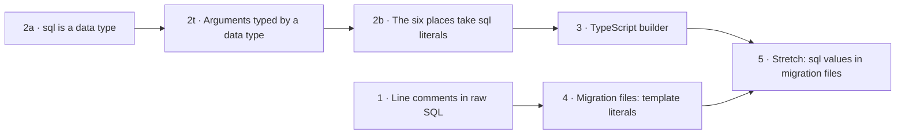

# SQL expression literals — plan

**Spec:** [spec.md](spec.md). **Design:** [design.md](design.md). **Decisions:** [design-notes.md](design-notes.md).

Six slices and one stretch slice, each one PR. Every slice follows `design.md` exactly; a slice that finds the code disagreeing with the design stops and raises it. PR #30349 (the binder) and PR #30381 (block specs) merged on 2026-09-25 and 2026-09-28. The design was written against `47d727b70d`, so each slice starts by re-checking its own design sections against `main` and correcting file and line references; a difference in behaviour is raised, not decided by the implementer.

## Order



- Slices 1 and 2a run in parallel: their source files are disjoint.
- Slice 2t needs 2a, which removes the lowering-entry kind from the code that 2t moves into the framework. The project "Data types own column types" is blocked on 2t, so 2a and 2t go first.
- Slice 2b needs 2t.
- Slice 3 needs 2b (the parity fixture covers all six places).
- Slice 4 needs slice 1 (it prints `OpaqueSql.text`).
- Slice 5 needs slices 3 and 4.

## Done conditions for every slice

- `pnpm build`, `pnpm typecheck`, `pnpm test:packages`, `pnpm lint`, `pnpm lint:deps`, `pnpm lint:casts`, `pnpm lint:throws`, `pnpm check:error-reference` pass locally. The integration test files the slice touches or depends on pass when run alone (`pnpm test <file>` in `test/integration`). Never run `pnpm test:integration`, `pnpm test:e2e` or `pnpm test:all` in full locally: they are too heavy for the machine and time out unrelated tests. CI runs them in full.
- `pnpm fixtures:check` passes and shows no `contract.json` change.
- `pnpm lint:framework-vocabulary`: the count equals the committed threshold; lower the threshold when the slice removes counted sites.
- `pnpm check:upgrade-coverage --mode pr --prev "$(git merge-base origin/main HEAD)" --head HEAD` passes after committing, and each new fragment has been validated by execution as `skills-contrib/record-upgrade-instructions/SKILL.md` requires.
- Slices that change user-facing diagnostics (2a, 2b, 3) add a script to `projects/sql-expression-literals/manual-qa.md` that reads each new message as a user would, and record a run.
- Slices 2a, 2b and 3: a grep over `docs/`, `skills/`, `skills-contrib/`, package READMEs and `src/` comments finds none of the forms the slice removes (`pg.sql`, `sqlite.sql` from 2a; `where: "`, `where: '`, `expression: "`, `expression: '`, `using = "`, `withCheck = "` from 2b, searched only in `.prisma` files and ` ```prisma ` blocks; string arguments to the TS raw-SQL fields from 3), excluding `CHANGELOG.md`, `docs/releases/` and `skills/prisma-8/upgrading/**/upgrades/`.
- Slices 1, 4 and 5 also run the e2e test files they touch, alone; CI runs `pnpm test:e2e` in full.

## Slice 1 — Line comments in raw SQL are safe

**Linear:** TML-3287. **Design:** 14, 19 (ADR 234, Migration System doc), 20 (slice 1 row).

**Outcome.** Every place the Postgres and SQLite planners put contract SQL inside a statement holds it as an `OpaqueSql` node and renders it through `renderOpaqueSql`, so a body whose last line ends in a `--` comment produces valid DDL. Wire names keep line breaks in bodies that contain `--`, so moving a line break around a comment changes the name. Output and names for every body without `--` are unchanged.

**Tests** (each fails if the behaviour it names is removed):

- `relational-core/test/ast/opaque-sql.test.ts`: `renderOpaqueSql` returns text without `--` unchanged; appends `\n` to text containing `--` anywhere, including inside a string constant; `OpaqueSql` is frozen.
- `6-adapters/postgres/test/migrations/opaque-sql-line-comment.integration.test.ts` (PGlite): with a body whose last line is `-- trailing comment`, each of these executes and has its effect: CREATE TABLE with a CHECK, `addCheckConstraint` on an existing table, CREATE POLICY with USING and WITH CHECK, CREATE INDEX with the element list `lower(email), id -- c` and with a WHERE predicate.
- `6-adapters/sqlite/test/lower-to-execute-request.test.ts`: `fn('1 -- c')` renders `DEFAULT (1 -- c\n)`.
- `schema-ir/test/naming.test.ts`: `normalizeSqlBody` for the rows E1–E12 of [research/review-followups.md](research/review-followups.md) F02 under rule A3 (E1 and E2 differ; one-line bodies and bodies without `--` are unchanged; CRLF and lone CR end a line; the function gives the same output on its own output); the pinned hash table is unchanged; check, index and policy hashes of E1 and E2 differ.
- The existing render and lowering tests in [research/ddl.md](research/ddl.md) §8 are updated for the new field types; every exact-SQL assertion stays byte-identical.
- `git status` shows no committed `ops.json` or `migration.json` changed.

## Slice 2a — The `sql` tag writes the data type `sql/expression`

**Linear:** TML-3296. **Design:** 2 (slice 2a), 3, 10, 11.1, 13 (`@default` rows), 18.2, 18.3 (2a items), 19 (2a rows), 20 (2a row).

**Outcome.** `sql/expression` is a data type the SQL family defines and registers; the lowering-entry kind, `pg.sql` and `sqlite.sql` are gone. `@default` stores a `sql/expression` value as a default expression and keeps its own checks. `@default` refusals that come from the cast rule use the general codes. `contract infer` prints raw defaults through the one tagged-literal printer. No `contract.json` changes.

**Tests:**

- `2-sql/1-core/contract/test/sql-expression.test.ts`: `sqlExpressionDataType` has the id `sql/expression`, declares no casts and no list cast; the entry's tag is `sql` and its `parse`/`print` round-trip; `sqlTextFromCanonical` throws for a non-string. (`sqlTextReadsBack` and its tests moved to slice 2b.)
- `framework-components/test/data-type-assembly.test.ts` (update): lowering keys are gone; an entry keyed by an unregistered id fails.
- `3-targets/3-targets/postgres/test/data-types.test.ts` and the SQLite twin (extend): no element of `postgresDataTypes` (`sqliteDataTypes`) names `sql/expression` in `casts` or `listCast.of`.
- Target `data-types.test.ts` and adapter `control-mutation-defaults.test.ts` (update): section 18.3.
- `contract-psl/test/interpreter.defaults.tagged-literal.test.ts` (update): `sql` stores a function default on scalar and list columns; `pg.sql` is `PSL_UNKNOWN_LITERAL_TAG` with `Known tags: sql, json.`; reserved and unsafe texts report `PSL_INVALID_DEFAULT_SQL` with the `sql` message; a `sql` element in a list literal is refused with `PSL_VALUE_TYPE_INCOMPATIBLE` and the exact message in design section 10.
- `contract-psl/test/interpreter.defaults.data-types.test.ts` (update): the `it.each` table splits by the code table in design 10.1, asserting each code and message.
- `framework-components/test/tagged-literal.test.ts` (update): `printTaggedLiteral` single-line, multi-line (text on its own lines) and double-quote forms; backslashes; round trip through `canonicalizeTaggedLiteralBody`, including after every continuation line was indented.
- `2-sql/9-family/test/psl-build/default-mapping.test.ts` (update): function defaults through `printSqlExpressionLiteral`; a `json` text holding a backtick in the double-quote form; a multi-line function default on its own lines.
- `language-server/test/completion-provider.test.ts` (update): `@default(` offers `sql` and `json` on Postgres and SQLite, in that order.
- Existing assertions of changed codes (update):
  - `PSL_VALUE_TYPE_INCOMPATIBLE` in `3-targets/3-targets/postgres/test/psl-pg-enum-column.test.ts:271`, `test/integration/test/number-defaults/psl-number-defaults.integration.test.ts:224, 238`, and `contract-psl/test/interpreter.defaults.tagged-literal.test.ts:248, 258`.
  - `PSL_INVALID_LITERAL` in `interpreter.defaults.tagged-literal.test.ts:241, 281`.
- `contract-psl/test/sql-attribute-specs.test.ts` (update, about lines 321-325): the `@default` tag arm has `tags: ['sql']` and the `sqlExpressionAuthoringEntry` documentation.

## Slice 2t — An argument declares the data type it receives

**Linear:** TML-3367. **Design:** 4–7, 18.3 (items for sections 4–7), 19 (ADR 231, 249 and 254 rows).

**Outcome.** The cast rule's read and cast functions are in the framework. `dataTypeValue(dataType, support)` is an argument type that admits a written value by the cast rule and returns its canonical value, type id and span. Attribute spec contexts carry the stack's data types, in the SQL interpreter, the Mongo interpreter and the language server. No place uses `dataTypeValue` yet, and no user-visible behaviour changes. The project "Data types own column types" reuses it for default-function arguments.

**Tests:**

- `framework-components/test/written-value.test.ts`: `readWrittenValue` for each written kind and refusal; `castTypedValue` same type, cast, no cast, throwing cast, and the returned `TypedValue`; `admittedTags` and `describeAdmittedForms` for `sql/expression`, a boolean type, a number type reached through a classifier's `types`, a type casting from a tag type.
- `psl-parser/test/written-literal.test.ts`: every row of the table in design section 5.
- `psl-parser/test/attribute-spec-combinators.data-type-value.test.ts`: label and metadata; every diagnostic in design section 6 with exact code, message and span, including each `found` word; success returns the typed value; construction does not throw for an unregistered type, and `parse` throws `InternalError` for it.
- The same combinator test file: `dataTypeValue` for `pg/int4`, a type without a tag; and as a parameter of a `funcCall` that is an arm of `oneOf`.
- The existing `@default` tests pass unchanged.

**Carried over from the slice 2a review** (do these in this slice):

- ADR 254: add "Only the scalar cast rule moves to the framework; list casts stay in the family's default reader."
- Rename `TaggedLiteralCanonicalization.body` to `text` (the body is what is written between the quotes; the text is the canonical value).
- `@default` reports its cast-rule refusals (`PSL_VALUE_TYPE_INCOMPATIBLE`, `PSL_INVALID_LITERAL`) at the written value, as `dataTypeValue` does, not at the whole attribute. Update ADR 254 and `error-reference.md` to match.
- The `unknown-tag` arm of `lowerDataTypeDefault` cannot be reached from PSL; the framework's `readWrittenValue` replaces it.
- `readTaggedLiteral` in `contract-psl/src/psl-column-resolution.ts` was named `lowerTaggedLiteral` until slice 2a. A tag no longer lowers its own body, so when the framework's reader replaces the function, no name about lowering a tag survives the move.
- The `@default` list arm offers `` sql`...` `` as a list element, which the cast rule always refuses. Remove `sql` from the list-element tags, so completion and "Expected one of" stop offering it.

## Slice 2b — The six places take `sql` literals

**Linear:** TML-3288. **Design:** 8, 9, 11.2, 12, 13, 18.1, 18.3 (2b items), 19 (2b rows, ADR 256), 20 (2b row).

**Outcome.** `@@index(where:)`, `@@index(expression:)`, `@@fullTextIndex(where:)`, `@@check(expression:)` and a policy's `using` and `withCheck` take `sql` literals and refuse every other literal through the cast rule, with messages that end in the exact rewrite. `contract infer` prints them as `sql` literals and skips a body that would not read back. The language server completes and colours them. The Supabase pack contract is regenerated. ADR 256 records the decision.

**Dispatches** (F30): (a) data types in the block spec context (section 9.1); (b) the six places, printers and every fixture and artefact change in section 18.1, in one dispatch; (c) language-server completion and colouring (section 12 only); (d) docs, ADRs, the codemod and upgrade fragments.

**Tests:**

- `3-targets/3-targets/postgres/test/sql-expression-places.test.ts`: the guard in design 8.3.
- `contract-psl/test/interpreter.sql-expression-places.test.ts`: for `@@index(where:)`, `@@index(expression:)` and `@@check(expression:)`: a `sql` literal (single-line and multi-line) lowers to the canonical text; a plain string (message ending in the rewrite), a number, `true`, an identifier and `pg.sql` are refused with exact code and message; `` @@check(expression: sql``) `` reports `PSL_CHECK_EXPRESSION_EMPTY`.
- `postgres/test/psl-full-text-index.test.ts` (update): `where` takes a `sql` literal; a plain string, a number and `true` are refused with exact messages.
- Policy tests (design 9.2): `using` and `withCheck` take `sql` literals whose canonical text reaches `PostgresRlsPolicy`; a plain string (message ending in the rewrite), `'x'`, a number, `true` and `pg.sql` are refused with exact code, message and span; `permissive = false` still works; a predicate the operation does not take is still an unknown key.
- Block spec context (design 9.1): a test binds a block spec that reads `ctx.dataTypes` and asserts it receives the stack's data types from each production path (provider, interpreter, language server).
- `3-targets/3-targets/postgres/test/sql-expression-wire-names.test.ts`: computes each kind of wire name (index, check, policy) from a non-canonical text (indented, blank first and last lines, CRLF) and from its canonical form, and asserts they are equal.
- `postgres/test/psl-infer/*` (update): index, check and policy texts print as `sql` literals; a text holding a backtick in the double-quote form; a CHECK whose reprint holds `E'a\r\nb'` is skipped with the note in design 11.2, and so is a policy.
- `language-server/test/completion-provider.test.ts` (update): `@@index(where: |` and `@@check(expression: |` offer `sql`; the `@@check(` snippet is ``check(expression: sql`${1:expression}`)``; a source with no data types still completes model and field attributes.
- `language-server/test/semantic-tokens.test.ts`: a `sql` literal gives a `keyword` token for `sql` and a `string` token per line of its literal.
- `test/integration/test/cli-journeys/sql-expression-literals.e2e.test.ts` (new): author a partial index, an expression index, a CHECK and a policy with `using` and `withCheck`; one text spans several lines, one ends in a `--` comment, one policy has an `EXISTS (SELECT … FROM … WHERE …)` predicate. Emit, plan, apply, verify clean. Infer, and assert every text prints as a `sql` literal. Emit the inferred schema and verify it clean against the same database. Infer again and assert the PSL equals the first inference.
- `test/integration/test/cli-journeys/infer-roundtrip-fidelity*.e2e.test.ts` and `sign-the-database.e2e.test.ts` (update): assertions expect `sql` literals and the round trips still verify clean.

**Carried over from the slice 2a review:**

- `sqlTextReadsBack` and its tests move here from slice 2a, next to their only caller (design section 11.2). Its test: true for canonical text (a single line, several lines, an empty text); false for indented text, a blank first or last line, a carriage return and a NUL character. Add `canonicalizeTaggedLiteralBody` to the framework's `authoring` export with it.
- Before writing ADR 256, check the ADR numbering: three files are already numbered 255.
- `docs/architecture docs/subsystems/6. Ecosystem Extensions & Packs.md`, section "Template-Tagged Literals": add an `` @@index(where: sql`...`) `` example.

## Slice 3 — The TypeScript builder takes `sql` values

**Linear:** TML-3289. **Design:** 2 (slice 3), 13 (CONTRACT rows), 15, 18.4, 19 (slice 3 rows), 20 (slice 3 row).

**Outcome.** The TypeScript `sql` tag returns a `SqlExpression`, whose constructor canonicalizes; other `sql` values may be interpolated. The raw-SQL builder fields accept only `SqlExpression`; a plain string does not compile. `.default()` takes a `SqlExpression` and runs the default checks. PSL and TypeScript emit byte-identical contracts for the same SQL, multi-line included.

**Tests:**

- `2-sql/1-core/contract/test/sql-expression.test.ts` (extend): the tag's canonicalization, escapes, empty text, interpolation of `sql` values (joined, then canonicalized), refusal of a string and a number inside `${…}` for untyped callers, constructor canonicalization and NUL refusal; `isSqlExpression`; `requireSqlExpression` success and failure message.
- `2-sql/1-core/contract/test/sql-expression.test-d.ts`: `sql` returns `SqlExpression` and is not `any` (`not.toBeAny()`); a string or number inside `${…}` is a type error; `{ text: 'x' }` is not assignable to `SqlExpression`.
- `contract-ts/test/raw-sql-fields.test-d.ts`: a string, a number and a boolean are type errors in `index` `where` and `expression`, `check` `expression`, and `IndexConstraint.where` in `.sql({ indexes })`; `sql` values compile; `.default('draft')`, `.default(now())` and `` .default(sql`x`) `` compile.
- `contract-ts/test/contract-dsl.default-sql-expression.test.ts`: `` .default(sql`now()`) `` and `` sql`autoincrement()` `` throw `CONTRACT.DEFAULT_INVALID` with the exact messages; unsafe SQL throws; `.default(now())` does not.
- Postgres extension `test/contract-builder/rls-handles.test-d.ts` and `full-text-index.test-d.ts` (update): strings are type errors.
- `test/integration/test/authoring/parity/sql-expressions/` (new parity fixture: `contract.ts`, `schema.prisma`, `packs.ts`, `expected.contract.json`): a partial index, an expression index, a `@@fullTextIndex` with `where`, a `@@check`, a policy with `using` and `withCheck`, and a raw default; at least two texts span several indented lines, one holds `"quoted"` identifiers, one a backslash, and one TS predicate is composed by interpolation.

## Slice 4 — Migration files write template literals

**Linear:** TML-3290. **Design:** 16, 19 (slice 4 row), 20 (slice 4 row).

**Outcome.** A newly generated `migration.ts` writes a single-line SQL text that holds both quote kinds as an untagged template literal, so no quote is escaped. No migration function, type or import changes; `ops.json` is unchanged.

**Tests:**

- `ts-render/test/ts-string-literal.test.ts`: `tsQuotedTextSource` for text with both quote kinds (template), one quote kind, no quote, a line break, U+2028 (string literal), and a backtick, a backslash and `${` inside a template.
- `ts-render/test/json-to-ts-source.test.ts` (update): `tsObjectSource` layout rules; `jsonToTsSource` output unchanged for objects.
- Postgres target `test/migrations/op-factory-call.test.ts` and `op-factory-call.lowering.test.ts` (update): exact output for `CreateTableCall`, `AddColumnCall`, `CreateIndexCall`, `AddCheckConstraintCall` and `CreatePostgresRlsPolicyCall` with a both-quote-kinds text.
- Postgres and SQLite adapter `render-typescript.roundtrip.test.ts` (update): include a both-quote-kinds CHECK, policy predicate and index `where`; the written `ops.json` equals `renderOps(calls)`.
- `pnpm migrations:regen:examples` produces no diff.

## Slice 5 (stretch) — Migration files write `sql` values

**Linear:** TML-3297. **Design:** 17, 19 (ADR 195, Migration System doc), 20 (slice 5 row).

**Outcome.** Generated migration files write SQL texts as `sql` template literals when they read back unchanged, including multi-line texts; migration functions accept a `sql` value or a string.

**Tests:**

- `framework-components/test/tagged-literal.test.ts` (extend): `renderTaggedTemplateSource` single-line, multi-line, backtick, backslash, `${`; fallback for leading whitespace, a blank first line, a carriage return, a line holding only a non-breaking space.
- Adapter `render-typescript.roundtrip.test.ts` (update): a multi-line CHECK, a policy predicate with `"userId"`, an index with `where`, and a fallback text; `ops.json` equals `renderOps(calls)`.
- Postgres target `test/postgres-migration-op-builders.test.ts`: each of `createIndex` (expression and `extras.where`), `addCheckConstraint`, `createRlsPolicy` (`using`, `withCheck`), `alterColumnType` (`using`), `fn` and `checkExpression`, called once with strings and once with `sql` values holding the same text, gives identical ops.
- The committed `examples/prisma-8-demo/migrations/app/20260422T0720_initial/migration.ts` and `20260922T1218_add_post_title_search/migration.ts` still produce their committed `ops.json` (`pnpm migrations:regen:examples` shows no diff).
- Postgres target `test/migrations/render-typescript.test.ts` (update): the facade exports `sql`; the `sql` import appears exactly when a template was printed.

## Other open work that touches the same files

Whichever PR merges second rebases. From [research/review-followups.md](research/review-followups.md) F14:

| PR | Overlaps slices | Files |
| --- | --- | --- |
| #30349 (binder) | 2a, 2b | `contract-psl` `interpreter.ts`, `psl-column-resolution.ts`, `psl-field-resolution.ts`, `sql-attribute-specs.ts`; `psl-parser` `attribute-spec/types.ts`, `exports/index.ts` |
| #30315 (`contract print`) | 2a, 2b | framework-components exports, `psl-printer`, `contract-psl` `interpreter.ts` and `exports/resolution.ts`, `9-family/src/exports/control.ts`, Postgres `authoring.ts`, `infer-index-attributes.ts`, `infer-policy-blocks.ts`, the `orm-family-sql` shell `package.json` |
| #30331 (rename a table) | 1, 4, 5 | Postgres `op-factory-call.ts`, `operations/constraints.ts`, `postgres-migration.ts`; SQLite `op-factory-call.ts`; `error-reference.md` |
| #30051 (nullable list elements) | 2a, 2b, 3 | `contract-psl` `interpreter.ts`, `psl-column-resolution.ts`, `sql-attribute-specs.ts`; `contract-ts` `contract-dsl.ts`, `contract-lowering.ts` |
| #30337 (checkSqlDefaultBody tests) | 2a | `2-sql/1-core/contract/test/default-sql-body.test.ts` |
| #30278, #30308, #30301, #30306, #30095 | 1, 2a, 2b | Postgres migration operations and `psl-infer` tests |
| #30396, #30392, #30362, #30333, #30202, #30152, #30133, #30101, #29953, #30277 | 2a, 2b | Docs, skills and single test files |

## Close-out

After the last delivered slice merges: final retro; map every decision in `design-notes.md` to its durable home (ADR 256, or an amended ADR) in the close-out PR; delete `projects/sql-expression-literals/`; mark the Linear project completed.
